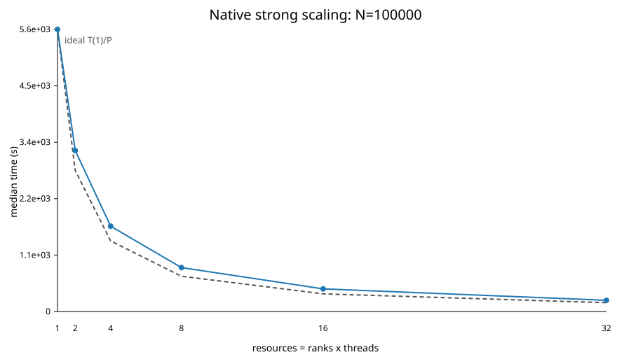
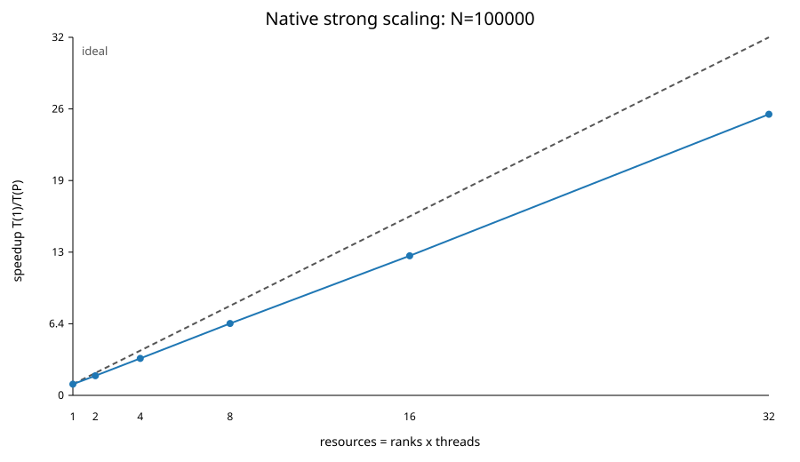
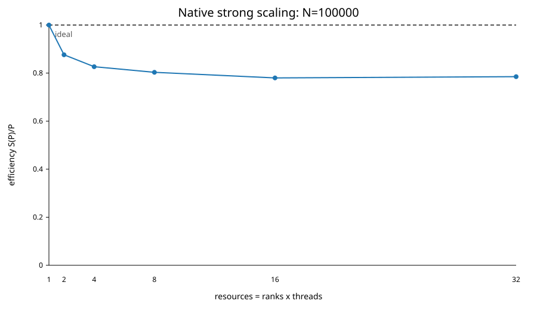
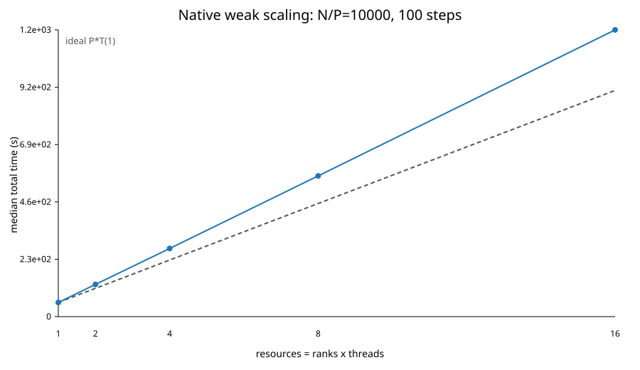
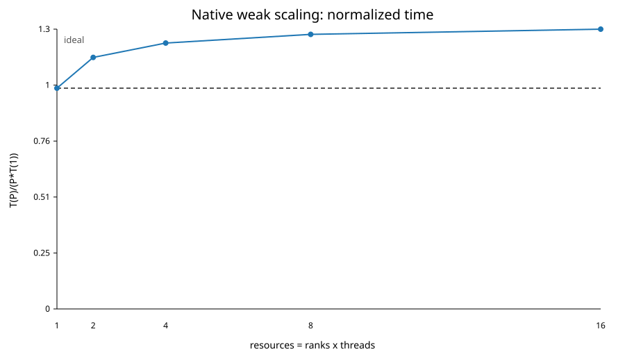
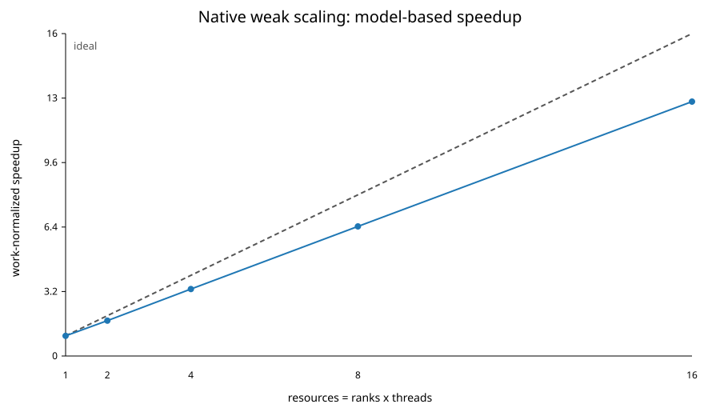
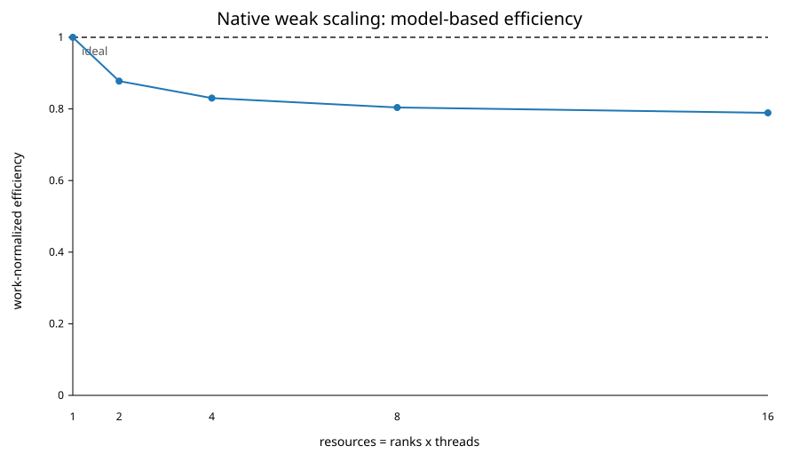
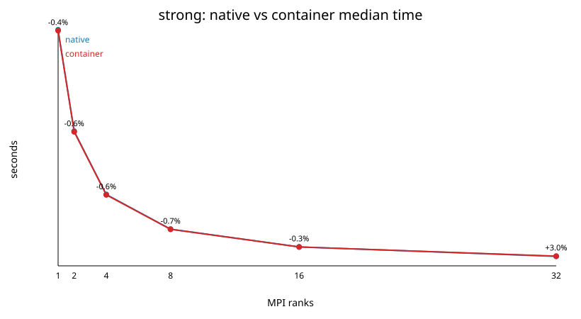
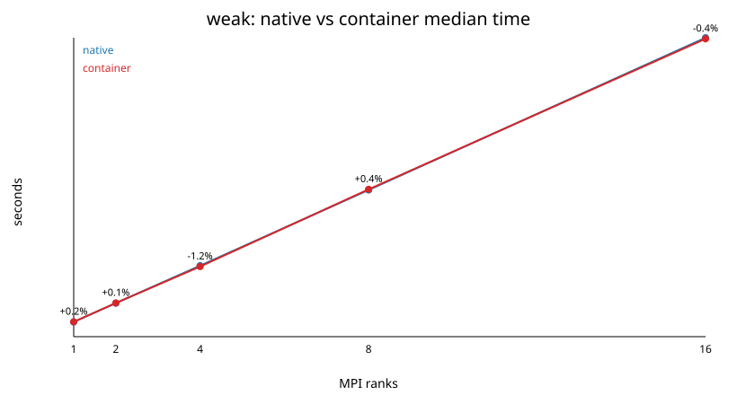

# Exercise 1 - Direct N-body gravitational simulation
High Performance Computing exam

Dariol Emma - SM3800118


## 1. Strong scaling at N=100000

The fixed problem has **N=100000, 100 steps, P=1,2,4,8,16,32 and T=1**. The benchmark uses KDK and the direct force kernel with blocking ring communication (`sendrecv`). These are the native runs of the required comparison campaign, not new measurements.

The solver uses direct all-pairs gravity, KDK leapfrog integration and an MPI ring to exchange source particles. Each rank keeps its home particles. N is the global particle count, P is the number of MPI ranks, and T is the number of OpenMP threads per rank; the core count is P*T.

For this test, dt=1e-4, epsilon=0.05, G=1 and particle mass=1. Forces, integration and energy use double precision; input coordinates and velocities are stored as floats. Core placement uses `OMP_PLACES=cores`, `OMP_PROC_BIND=spread` and `srun --cpu-bind=verbose,cores`. The native hybrid build command is:

```sh
mpicc -std=c11 -DNBODY_USE_DOUBLE -O3 -march=native -Wall -Wextra -Wpedantic -fopenmp -o nbody_direct_hybrid nbody_direct_hybrid.c -lm
```

The build uses the host MPI wrapper, OpenMP and libm. It does not use BLAS or profile-guided optimisation. `-march=native` targets the build machine.

Each scaling run uses one Orfeo GENOA node.

| Item | Value |
|---|---|
| Node | `genoa003.hpc.rd.areasciencepark.it`, `genoa001.hpc.rd.areasciencepark.it`, `genoa02.hpc.rd.areasciencepark.it` |
| CPU | AMD EPYC 9374F 32-Core Processor |
| Sockets | 2 |
| Cores per socket | 32 |
| Hardware threads | 1 per core |
| Total CPUs | 64 |
| NUMA nodes | 8 |
| Memory visible to the job | 503 GiB (`free -h`); 478 GiB available at measurement time; swap disabled |
| Kernel | Linux 6.13.12-200.fc41.x86_64 |
| Compiler | GCC 14.3.1 |
| MPI | Open MPI 4.1.6rc4 |
| Native OpenMP runtime | GNU libgomp, `libgomp.so.1`; package `libgomp-14.3.1-4.fc41.x86_64` |

In the MPI solver, `seconds()` calls `MPI_Wtime()`. Each rank measures elapsed wall-clock time in seconds. A timestamp is saved before a phase and subtracted after it:

```c
// Simplified excerpt: each rank has its own timers.
timing.total = seconds();          // save the start of the solver interval
t0 = seconds();
read_local_particles(...);
timing.io += seconds() - t0;       // add the input-reading time

// Force, kick, drift and energy calls use the same start/end pattern.
// += adds repeated calls over all integration steps.
// Optional output writing is also added to timing.io.
timing.total = seconds() - timing.total;  // convert start time to elapsed time
```

`total` covers input, initial energy and force, integration, diagnostics and optional output. It excludes MPI initialisation, process startup, final timing reductions and reporting. It is measured directly, not calculated by adding the phase timers.

After the run, `MPI_Reduce(..., MPI_MAX, ...)` selects the largest rank time for each metric. Phase maxima can come from different ranks, so their sum need not equal `total`. Also, `comm_wait` is already included in `force`: adding it again would count it twice. In overlap mode it measures time inside `MPI_Waitall`, not the full duration of data transfer.

For each configuration, the median is the middle of the sorted run values (or the average of the two middle values). Sample standard deviation is `s = sqrt(sum((x_i-mean(x))^2)/(n-1))`. It describes run-to-run spread, not uncertainty bounds for the median. Phase medians are calculated separately; a ratio of medians is not necessarily the median of per-run ratios.

Each point retains all five successful native runs in `required_table/required_container_scaling.csv`. No timing outliers are removed. The benchmark varies the Plummer seed between repetitions and uses the same five seeds at each P. The reported spread therefore includes both run-to-run variation and differences between these inputs. This campaign has no separate warm-up loop in the benchmark driver.

All 30 native strong-scaling runs have status OK. The largest recorded relative energy drift is **6.7152e-6**, below the 1e-4 tolerance. This value covers the sampled energy checks, not every instant of the trajectory.

Speedup is `S(P)=T(1)/T(P)` and efficiency is `E(P)=S(P)/P`, using median total time. The summary is `required_table/required_native_strong_summary.csv`.

| MPI ranks P | N/P | Native median total (s) | Sample s (s) | Speedup | Efficiency |
|---|---:|---:|---:|---:|---:|
| 1 | 100000 | 5602.089946 | 2.385251 | 1.00 | 100.00% |
| 2 | 50000 | 3196.789666 | 2.173859 | 1.75 | 87.62% |
| 4 | 25000 | 1694.323952 | 1.368110 | 3.31 | 82.66% |
| 8 | 12500 | 871.846346 | 0.129579 | 6.43 | 80.32% |
| 16 | 6250 | 448.971312 | 7.104450 | 12.48 | 77.99% |
| 32 | 3125 | 222.973794 | 0.433408 | 25.12 | 78.51% |



_Runtime falls from 5602.09 s at P=1 to 222.97 s at P=32. The dashed line is ideal T(1)/P._



_Speedup reaches 25.12 at P=32, compared with the ideal value of 32._



_Efficiency is 87.62% at P=2 and 78.51% at P=32. The small increase from P=16 to P=32 means it does not fall monotonically._

At P=32, ideal time is `5602.089946/32 = 175.065311 s`; the measured median is 222.973794 s. An Amdahl-style effective serial/overhead fraction is:

```text
f_eff = (1/S_32 - 1/32) / (1 - 1/32) = 0.00883
```

This combines serial work, communication and other scaling costs. It is not a direct measurement of the serial code fraction. The x-axis counts ranks/cores within one node, and this campaign has no P=64 point.

The available CSV records total time and energy drift, but not separate force or exposed-wait times. It therefore cannot supply Gpairs/s or a measured communication fraction. The old N=20000 phase timings are not used to explain these N=100000 results. The hybrid experiment later provides separate phase timings for its own N=100000, 20-step workload.

Two limits matter as P increases. First, each target and ring-source block shrinks to about N/P particles. Very short source loops leave fewer full SIMD groups and make setup, reductions and tail processing more costly relative to useful work. Too few target particles also leave less work for threads. SIMD width and accumulator count are different quantities, so there is no single universal N/P threshold. At P=32, each block still contains **3125 particles**. These timing data do not show a SIMD-utilisation collapse; vector counters or tests with much smaller blocks would be needed to locate it.

Second, blocking ring communication requires P-1 exchanges per force evaluation. A simple per-rank model is:

```text
T_compute ~ c*N^2/P
T_comm    ~ (P-1)*alpha + b*N*(1-1/P)/B
```

Here alpha is latency per exchange, b is bytes per source particle and B is effective bandwidth. At fixed N, the bandwidth term approaches a constant while the latency term grows with P. Computation falls with P, so communication can eventually set a scaling floor. A latency crossover would roughly satisfy `c*N^2/P ~ alpha*P`. Neither c nor alpha is measured independently here.

The P=1 to P=32 results show sublinear speedup, but total times alone do not establish that ring latency dominates. The test also cannot locate a multi-node network limit. Unlike the earlier overlap campaign, these runs use `sendrecv`; the separate communication experiment discusses overlap.

At fixed resources and similar time per pair, increasing N tenfold would give about 100 times the force work: `(10N)*(10N-1)/(N*(N-1))`. This is the O(N^2) model, not a matched experimental verification of that factor.

## 2. Weak scaling

The required native experiment fixes **N/P=10000 particles per MPI rank**, with **P=1,2,4,8,16, T=1 and 100 integration steps**. Global N is 10000, 20000, 40000, 80000 and 160000. Each point contains five successful independent executions on one GENOA node. These are the native measurements from the required native/Singularity comparison in Experiment 11, not an additional campaign. All five samples are retained; the table reports median and sample standard deviation.

Times are internal solver totals measured using `MPI_Wtime()`, reduced across ranks with `MPI_MAX`. They include input, force evaluation, integration and energy diagnostics, but exclude MPI initialisation and process/container launch. The available summary reports total time; it does not provide force or exposed-wait measurements for this campaign.

| MPI ranks P | Global N | Native median total (s) | Sample s (s) | T(P)/(P*T(1)) | Model-based speedup | Work-normalized efficiency |
|---|---:|---:|---:|---:|---:|---:|
| 1 | 10000 | 56.787664 | 0.153334 | 1.000 | 1.00 | 100.00% |
| 2 | 20000 | 129.411167 | 0.426024 | 1.139 | 1.76 | 87.77% |
| 4 | 40000 | 273.585721 | 1.137005 | 1.204 | 3.32 | 83.03% |
| 8 | 80000 | 565.052400 | 4.282051 | 1.244 | 6.43 | 80.41% |
| 16 | 160000 | 1151.460268 | 3.968119 | 1.267 | 12.63 | 78.92% |



_The dashed reference is P*T(1), with T(1)=56.787664 s. At P=16, the ideal reference is 908.602624 s and measured time is 1151.460268 s, 26.73% higher._



_Particles per rank remain constant; time per rank need not remain constant for direct all-pairs gravity._

Let n=N/P=10000. Each rank computes approximately n*N=n^2*P directed interactions per force evaluation. Total work across the job grows as N^2=n^2*P^2, while work per rank grows as P. In a full ring, each rank sends and receives approximately n*(P-1) source records per evaluation, in P-1 exchanges. Thus communication volume **per rank** grows linearly in P; volume summed over all ranks grows as P*(P-1). These two accounting levels must not be mixed.

A simple per-rank model is `T_compute ~ c*n^2*P` and `T_comm ~ (P-1)*(alpha + b*n/B)`, where alpha is message latency, b the bytes per source record and B effective bandwidth. The ratio approaches a constant for fixed n and constant c, alpha and B. This is an asymptotic model; at P=1 there is no ring exchange. It predicts approximately linear runtime growth, not flat runtime.

For the growing problem, the plotted speedup and efficiency are:

```text
R_W(P) = N_P*(N_P-1)/(N_1*(N_1-1))
S_W(P) = R_W(P)*T(1)/T(P)
E_W(P) = S_W(P)/P
```

Here N_1=10000. The serial runtime of each larger problem is estimated as R_W*T(1), not measured. This assumes constant serial cost per pair and dominant quadratic work. The resulting speedup and efficiency are work-normalized model comparisons, not measured fixed-N strong speedups.





_At P=16, model-based speedup is 12.63 and work-normalized efficiency is 78.92%. Conventional flat-time efficiency T(1)/T(P) is not the appropriate ideal for this growing all-pairs workload._

The deviation from the linear reference can reflect changing cache behaviour, CPU frequency, NUMA placement, shared-memory contention, MPI progress, synchronisation and operating-system jitter. Ring dependencies allow a delayed rank to delay others. In a multi-node run, finite network injection bandwidth per node and fabric contention can reduce B as more ranks share a network interface; fixed effective bandwidth is then no longer a valid assumption. Neither network injection nor jitter must inevitably dominate: the limiting term depends on placement, n, hardware and runtime behaviour.

Non-uniform Plummer positions do not by themselves cause unequal pair counts in this direct kernel. Each target visits every source without a distance cutoff or adaptive interaction list, and these N values divide evenly among ranks. Spatial density would be a stronger load-balancing issue for a tree, neighbour-list or adaptive method. Unequal CPU service, memory placement or progress can still produce imbalance here.

These single-node total timings establish a departure from the ideal model, but cannot identify which resource ultimately limits a multi-node run. Phase timers, affinity and hardware/network counters would be needed to distinguish the proposed causes. No network-saturation threshold is claimed from these measurements.

## 3. MPI/OpenMP mapping at fixed core count

This test changes the MPI/OpenMP split while keeping 64 cores and the same workload. It uses the native build of Experiment 1, dt=1e-4 and epsilon=0.05.

The mapping experiment compares three ways of distributing the same **64 physical cores** on one GENOA node. Binding is enforced with Slurm `srun --cpu-bind=verbose,cores`, together with `OMP_PLACES=cores` and `OMP_PROC_BIND=spread`. The reported CPU masks confirm disjoint physical CPUs with no rank overlap:

- NUMA mapping: P=8 MPI ranks, T=8 OpenMP threads per rank, one rank per NUMA domain;
- socket mapping: P=2, T=32, one rank per socket;
- core mapping: P=64, T=1, one rank per physical core.

This verifies actual rank affinity rather than only documenting a requested allocation. It does not independently trace every OpenMP worker or memory-page placement.

The fixed-N comparison uses **N=100000, 20 integration steps, direct kernel, exact reciprocal square root, four accumulator chains, overlap communication, double arithmetic**, with five measured executions after one warmup per configuration. Times are internal solver total seconds, not Slurm job elapsed. All five measured samples are retained.

| Mapping | N | Steps | MPI ranks P | Threads/rank T | Samples | Median total (s) | Mean total (s) | Sample s (s) | Median force (s) | Median exposed wait (s) | Median Gpairs/s |
|---|---:|---:|---:|---:|---:|---:|---:|---:|---:|---:|---:|
| One rank per NUMA domain | 100000 | 20 | 8 | 8 | 5 | 14.275566 | 14.283084 | 0.027015 | 12.909107 | 0.126690 | 16.267422 |
| One rank per socket | 100000 | 20 | 2 | 32 | 5 | 13.986056 | 13.988024 | 0.012181 | 12.905388 | 0.051432 | 16.272110 |
| One rank per physical core | 100000 | 20 | 64 | 1 | 5 | 14.025092 | 14.045257 | 0.054429 | 12.852373 | 0.101077 | 16.339232 |

The socket mapping reduces median total time by **2.03% versus NUMA** and **0.28% versus one rank/core**. The latter gap is small compared with observed variability and does not establish a robust winner. Force throughput stays around 16.3 Gpairs/s in all configurations. Socket mapping has the lowest exposed wait, but that phase alone does not explain the entire total-time difference. The force phase accounts for about 90–92% of total time. NUMA-local rank placement is therefore verified, but it is not automatically the fastest choice for this compute-heavy case. All strong samples have status OK; maximum recorded relative energy drift is 4.9355453e-7 across the three mappings.

Each internal total is measured with `MPI_Wtime()` across input, force evaluations, integration, diagnostics and optional output, excluding launch and MPI initialisation, then reduced with `MPI_MAX`. Force and wait are separately reduced maxima; wait is already included in force. Each column is summarized independently across the five runs. Gpairs/s is the median of `21*N*(N-1)/(force*1e9)`. A matching one-core baseline is needed for absolute parallel efficiency; per-file `speedup=1` entries are normalization artifacts and are not used here.

Only the fixed-`N` comparison above is used for the mapping conclusion. Runs with different global particle counts are excluded because they change the workload as well as the decomposition.

## 4. Energy correctness and diagnostic cost

This experiment compares the cost of checking energy at every step with checking only at the end. It uses the native solver and GENOA environment described in Experiment 1.

The physical model is a softened Newtonian gravitational system:

```text
a_i = sum_j G m_j (r_j - r_i) / (|r_j - r_i|^2 + eps^2)^(3/2)
```

The production runs use the KDK leapfrog form, which is second order and symplectic. The solver reports the maximum relative total-energy drift:

```text
max_relative_energy_drift = max_t |E(t) - E(0)| / max(|E(0)|, tiny)
```

The tolerance used by the benchmark scripts is `1e-4`, matching the stricter value suggested in the assignment for the Plummer validation.

The experiment uses epsilon=0.05, dt=1e-4, G=1 and particle mass=1, with double-precision integration. Softening limits the force during close encounters. A smaller epsilon approaches singular Newtonian gravity and may require a smaller timestep. A larger epsilon smooths the dynamics and removes small-scale detail. We use epsilon=0.05 and dt=1e-4 for the final Plummer inputs and keep them fixed across performance tests.

Plummer softening modifies the pair potential and acceleration:

```text
U_ij = -G m_i m_j / sqrt(r_ij^2 + epsilon^2)
a_ij = G m_j (r_j-r_i) / (r_ij^2 + epsilon^2)^(3/2)
```

For r much larger than epsilon, the force approaches Newtonian gravity. For r much smaller than epsilon, acceleration is about `G*m_j*r/epsilon^3` and tends to zero with distance. Softening therefore changes the physical model, not just numerical stability.

Typical particle spacing scales as `ell ~ (V/N)^(1/3)`, or locally as `(m/rho)^(1/3)`. In a Plummer model it varies with position. Increasing N tenfold at fixed volume reduces this spacing to about 0.464 of its previous value. Keeping epsilon fixed then increases epsilon/ell by about 2.154. Choosing epsilon requires balancing force bias against particle noise.

At fixed N and step count, changing epsilon does not change the O(N^2) pair count. A larger epsilon may allow a larger timestep for a chosen accuracy, reducing the number of steps needed to reach a fixed physical time. This solver does not adjust dt automatically.

These short tests check numerical stability for the chosen input and timestep. They do not show that epsilon=0.05 is physically optimal.

Energy drift is the largest relative energy change at the sampled diagnostic times. The tolerance is 1e-4. This correctness check is independent of runtime.

The energy-diagnostic experiment uses N=10000, five steps, P=1 MPI rank and T=8 OpenMP threads, with five executions per diagnostic frequency. Internal total time is measured with `MPI_Wtime()` from input through optional output; energy time covers initial and periodic total-energy evaluations. The energy fraction is median energy time divided by median total time. Overhead compares median total time with the sparse `energy_every=5` baseline. The measured energy drift remains small:

| N | steps | ranks | threads/rank | energy_every | median total (s) | energy fraction | overhead vs sparse | max relative drift |
|---|---|---|---|---|---|---|---|---|
| 10000 | 5 | 1 | 8 | 1 | 0.554580 | 44.64% | 40.83% | 9.62e-8 |
| 10000 | 5 | 1 | 8 | 5 | 0.393790 | 22.35% | baseline | 9.62e-8 |


_Figure comment: evaluating the total energy too frequently is expensive because the potential-energy diagnostic is also pair-based. The plot justifies using sparse energy checks during performance runs._

The conclusion is that frequent full energy evaluation is a useful correctness diagnostic but a significant extra O(N^2) cost. For production timing, energy checks must be sparse enough not to dominate the measured solver runtime.

## 5. Newton's third-law reuse

The measured comparison uses **N=10000, 5 steps, P=1, T=1, dt=1e-4, epsilon=0.05 and energy_every=100**. Each variant has five runs, with no separate warm-up or removed samples.

| Kernel | Median total (s) | Mean total (s) | Sample s (s) | Median force (s) |
|---|---:|---:|---:|---:|
| Direct | 2.601807 | 2.605978 | 0.007693 | 2.235868 |
| Newton | 1.767468 | 1.768040 | 0.003336 | 1.401407 |

Newton reduces total time by **32.07%**, giving **1.472x speedup**. Both variants pass the energy check, with maximum relative drift 1.2974058e-7. This establishes a benefit for one thread and one rank only.

In the direct OpenMP loop, a thread updates only its target particle i. Reusing `F_ij=-F_ji` also requires an update to particle j. Another thread may update j at the same time, causing lost updates unless the conflict is handled.

This implementation gives each thread a private acceleration buffer. Threads evaluate each unordered pair once, then sum their buffers in a final reduction. There are no atomic updates in the pair loop. Buffers are allocated once and cleared at each force evaluation. For T threads and N particles, clearing and reduction require O(T*N) work, and the three double-precision arrays need about `24*T*N` bytes. The saved pair work is O(N^2), so the ratio of these work counts grows as **N/T**, not N^2. Actual time also depends on memory bandwidth, vectorisation and load balance.

Reuse is more promising when N is large and each pair needs expensive sqrt/division operations. It may help less for small N, large thread counts, cheap force kernels, or buffers that put pressure on memory and caches. Per-pair atomics can add contention and cache-coherence traffic; their cost must be measured rather than assumed. The useful condition is:

```text
time saved by fewer pair evaluations
    > buffer clearing + reduction + synchronisation + other added costs
```

Across MPI ranks, the contribution to a remote particle must return to its owner. A distributed Newton method needs balanced work and aggregated messages; overlap may help. A half-ring is one possible distributed design, but **it is not needed for the P=1 OpenMP test**. The production solver does not implement distributed Newton reuse, so these results cannot show that return communication would always outweigh the saving. A multithread sweep is still needed to measure the shared-memory trade-off.

The native build and binding match Experiment 1. The current measurements use T=1, so they do not yet measure the cost of the thread-private reduction at larger thread counts. For Newton, the pair count per force evaluation is N*(N-1)/2; rates based on the direct pair count must be labelled direct-equivalent.

## 6. Exact and approximate reciprocal square root

The test uses the native build and GENOA environment of Experiment 1.

The updated hybrid executable exposes `--rsqrt exact`, `--rsqrt approx1` (one Newton–Raphson refinement) and `--rsqrt approx2` (two refinements). The legacy `approx` option remains an alias for `approx2`. The following three-way measurements use the complete campaign.

All variants use **N=10000, nsteps=5, P=1 MPI rank, T=1 OpenMP thread, dt=1e-4, epsilon=0.05, energy_every=100**, with five measured executions and no separate warmup. These are native internal solver timings. The job exports OMP_PLACES=cores and OMP_PROC_BIND=spread. All 55 rows across the 11 3lawnewton campaign variants are OK, and recomputed medians and sample standard deviations match every row of the supplied summary. No outliers are removed.

The square-root timings measure the full internal solver interval with `MPI_Wtime()`, from particle input through optional output, excluding launcher and MPI initialisation. The force column isolates acceleration evaluations. Neither measures the latency of a single square-root instruction; Newton–Raphson refinement and Newton's third-law pair reuse are separate tests.

| Method | N | P | T | Steps | Samples | Median total (s) | Mean total (s) | Sample s (s) | Median force (s) | Total speedup vs exact | Maximum energy drift |
|---|---:|---:|---:|---:|---:|---:|---:|---:|---:|---:|---:|
| exact | 10000 | 1 | 1 | 5 | 5 | 2.602213 | 2.603644 | 0.004365 | 2.235830 | 1.000 | 1.2974058018291037e-7 |
| approx1 | 10000 | 1 | 1 | 5 | 5 | 0.635762 | 0.637167 | 0.003193 | 0.270813 | 4.093 | 1.2974022806770565e-7 |
| approx2 | 10000 | 1 | 1 | 5 | 5 | 0.723951 | 0.722741 | 0.002251 | 0.354722 | 3.594 | 1.2974058018291037e-7 |

| Method (N=10000, P=1, T=1, steps=5) | Run 1 (s) | Run 2 (s) | Run 3 (s) | Run 4 (s) | Run 5 (s) |
|---|---:|---:|---:|---:|---:|
| exact | 2.608489 | 2.602213 | 2.598911 | 2.600601 | 2.608007 |
| approx1 | 0.639448 | 0.634745 | 0.641584 | 0.635762 | 0.634297 |
| approx2 | 0.720288 | 0.720345 | 0.723951 | 0.724101 | 0.725020 |

Approx1 reduces median total time by **75.57%**, approx2 by **72.18%**. Force-only speedups are about **8.26x** and **6.30x**. The roughly 0.37 s non-force remainder limits the whole-solver gain. The second refinement increases median force time from 0.270813 to 0.354722 s, consistent with the cost of additional dependent arithmetic. The approximate AVX-512 dispatch uses its own vector accumulators, whereas exact uses the compiler-assisted chain implementation: this is a comparison of complete implemented paths, not an isolated instruction-latency experiment. Timing alone cannot establish which machine instructions executed.

Approx1 differs from exact in the reported energy drift by about 3.52e-13; approx2 has the same printed drift as exact. This five-step check does not prove bitwise-equal forces, full double precision for approx1 or long-term stability. Refinement evaluates `y_next=0.5*y*(3-q*y*y)` for `q=dx*dx+dy*dy+dz*dz+epsilon^2`. Newton–Raphson refinement and Newton's third-law force reuse are different optimizations.

One refinement of a roughly 14-bit estimate does not restore full double precision. Two refinements improve accuracy but do not guarantee bitwise equality with the exact path. Portable builds may use a different seed and must be benchmarked separately.

The first precaution is to use energy diagnostics that are independent of the approximate force path. In the code, `total_energy_ring()` evaluates the potential using **double-precision sqrt**, not `invsqrt_force()` or the rsqrt flag. This avoids directly reusing the same approximation in the energy measurement; it does not prevent force error from changing the trajectory. Energy and force must also use the same epsilon, otherwise different Hamiltonians would be compared.

For **N=10000, P=1, T=1, 5 steps, dt=1e-4 and epsilon=0.05**, with five repetitions per method, the recorded values are:

| Force method | Maximum recorded energy drift |
|---|---:|
| exact | 1.2974058018291037e-7 |
| approx1 | 1.2974022806770565e-7 |
| approx2 | 1.2974058018291037e-7 |

The approx1–exact difference in this statistic is about 3.52e-13. This is reassuring, but **does not by itself guarantee that rsqrt error is negligible**: energy_every=100 with only five steps means initial and final checks, rather than an energy sample at every step. Five timing repetitions of the same simulation do not replace a numerical convergence study.

To check whether rsqrt error limits accuracy, compare exact, approx1 and approx2 at dt, dt/2 and dt/4, keeping the final physical time fixed. Sample energy at each step and compare forces or trajectories with a more accurate reference. In the second-order regime, halving dt should reduce integration error by about four. If the approximate path stops improving while exact still improves, approximation error may be limiting accuracy. Roundoff and reductions must also be checked. This convergence study is not in the current dataset.

## 7. Accumulator chains and FMA throughput

The test uses the native build and GENOA environment of Experiment 1.

Every row below uses **N=10000, steps=5, P=1, T=1, dt=1e-4, epsilon=0.05, energy_every=100**, the direct exact-math path and five measured executions without filtering or warmups.

| Chains | N | P | T | Steps | Samples | Median total (s) | Mean total (s) | Sample s (s) | Median force (s) | Speedup vs 1 chain |
|---|---:|---:|---:|---:|---:|---:|---:|---:|---:|---:|
| 1 | 10000 | 1 | 1 | 5 | 5 | 2.620428 | 2.626081 | 0.013853 | 2.256599 | 1.0000 |
| 2 | 10000 | 1 | 1 | 5 | 5 | 2.601374 | 2.601668 | 0.003138 | 2.233969 | 1.0073 |
| 4 | 10000 | 1 | 1 | 5 | 5 | 2.602371 | 2.602451 | 0.002038 | 2.235518 | 1.0069 |
| 8 | 10000 | 1 | 1 | 5 | 5 | 2.617220 | 2.616939 | 0.002793 | 2.248771 | 1.0012 |

Total seconds measure the internal solver interval from input through optional output with `MPI_Wtime()`; the force column measures acceleration evaluations. Speedup divides the one-chain median total by the selected chain's median total.

Two and four chains reduce median total time by about 0.73% and 0.69%; eight chains give only 0.12%. The two/four gap is just 0.000997 s, smaller than either sample standard deviation. This supports a practical plateau near two to four chains for this exact-math workload, not a demonstrated hardware FMA saturation point. No FMA issue-rate counters or assembly evidence accompany this run. All configurations have status OK and maximum energy drift 1.2974058e-7. The one-chain 2.650833 s observation is retained and explains the higher mean and variability.

Accumulator counts describe independent partial sums within a thread, not MPI ranks or OpenMP threads. Increasing their number can shorten dependency chains, but benefits depend on the generated instructions and register pressure. These measurements do not show a fourfold FMA-throughput increase.

The square-root option changes how `1/sqrt(r2)` is evaluated. The accumulator option changes how force contributions are summed. The code has two paths:

| Path | Reciprocal square root | Accumulation |
|---|---|---|
| Portable scalar-chain routine | exact or portable approximation | 1, 2, 4 or 8 independent partial sums |
| Explicit AVX-512 routine | `_mm512_rsqrt14_pd` plus one or two refinements | vector accumulators; ignores the scalar chain setting |

OpenMP distributes target particles among threads. Within each thread, manual unrolling (`j += 2`, 4 or 8) creates independent sums and reduces the long dependency through one accumulator. A tail loop handles remaining sources.

FMA combines multiplication and addition in one instruction. The AVX-512 path uses explicit FMA intrinsics; GCC may generate FMA for the portable code when flags allow it. Unrolling and FMA are separate choices.

The accumulator experiment uses the exact scalar-chain path. The exact/approximate comparison changes the full implementation path, including explicit SIMD, so its speedup cannot be assigned to the rsqrt instruction alone.

The hardware ceiling, obtained with independent FMAs, must be distinguished from the sustainable throughput of a kernel that also includes square roots, divisions, memory accesses and reductions. One FMA counts as two floating-point operations: one multiplication and one addition.

```text
Peak FP64 = cores/socket * frequency * FP64 FLOP per cycle per core
```

The reference processor is the AMD EPYC 9374F, with **32 cores per socket** and a nominal base frequency of **3.85 GHz**.

Zen 4 uses internal 256-bit datapaths even for AVX-512. For FP64, the FMA ceiling is 2 pipelines × 4 doubles × 2 operations = **16 FLOP/cycle/core**: this must not be doubled simply because an AVX-512 register holds eight doubles.

At the base frequency, the theoretical reference for one socket is therefore:

```text
32 * 3.85e9 * 16 = 1.9712e12 FLOP/s = 1.9712 TFLOP/s FP64
```

This is a nominal arithmetic limit, not a measurement of our program. The actual frequency depends on workload and power limits; SMT does not double the FMA units. The kernel achieves only a fraction of this ceiling, determined by vectorisation, square-root/division latency and throughput, dependency chains, available registers, caches, memory bandwidth, load balance and synchronisation. Independent accumulators reduce some dependencies but do not remove the other limits.

The mapping comparison uses **N=100000, 20 steps and 64 cores across two sockets**, with P/T=8/8, 2/32 and 64/1. Approximately 16.3 Gpairs/s is therefore a whole-node measurement, not a single-socket measurement, and **Gpairs/s does not mean GFLOP/s**. Conversion requires an explicit operation count per pair and a convention for sqrt/rsqrt; exact and approximate paths have different counts and costs. Gpairs/s alone cannot establish a reliable percentage of the FMA peak.

## 8. AoS and SoA particle layouts

The experiment uses the native GCC/OpenMP stack on GENOA. The layout executable is built with `-std=c11 -DNBODY_USE_DOUBLE -O3 -march=native -Wall -Wextra -Wpedantic -fopenmp` and linked with `-lm`.

This force-only test uses N=10000, one non-MPI process, T=1,2,4,8 and exact reciprocal square root. The local `layout.csv` records **one warm-up and three timed force evaluations per execution**, with five executions per layout/thread point. There are no integration steps. SoA speedup is median AoS time divided by median SoA time at the same N and T.

`run_one_layout()` uses `omp_get_wtime()` around the block of `inner_repeats` force evaluations after warmups. Input and final checksum calculation are excluded. The reported time covers the whole block; throughput is `inner_repeats*N*(N-1)/(elapsed*1e9)` Gpairs/s. Medians are taken over the five executions.

The assignment suggests measuring the effect of particle layout. The layout benchmark compares an array-of-structures layout with a structure-of-arrays layout using the same force law and validates the checksums.

| layout | N | threads | median force time (s) | median Gpairs/s | checksum difference vs AoS |
|---|---|---|---|---|---|
| AoS | 10000 | 1 | 1.010227 | 0.297 | baseline |
| SoA | 10000 | 1 | 1.129805 | 0.266 | 0.0 |
| AoS | 10000 | 2 | 0.509064 | 0.589 | baseline |
| SoA | 10000 | 2 | 0.565051 | 0.531 | 0.0 |
| AoS | 10000 | 4 | 0.254240 | 1.180 | baseline |
| SoA | 10000 | 4 | 0.282475 | 1.062 | 0.0 |
| AoS | 10000 | 8 | 0.130199 | 2.304 | baseline |
| SoA | 10000 | 8 | 0.143438 | 2.091 | 0.0 |


_Figure comment: SoA is not faster in this implementation, even though it is often expected to help vectorisation. The checksum column is essential: it shows that the layout comparison is numerically consistent._

SoA takes about **10.2–11.8% more time** than AoS in these tests. Equivalently, speedup `T_AoS/T_SoA` is about 0.894, 0.901, 0.900 and 0.908. The equal checksums support numerical consistency. Compiler output and loop structure may explain the result, but perf/PAPI counters are still missing, so the cause is not established.

`checksum_abs_diff_vs_aos` is the absolute difference from the AoS force checksum at matching N and T. A zero difference supports consistency, but does not prove equality of every force component. Hardware counters are still needed to explain the layout timing gap.

## 9. Blocking and overlapped MPI communication

The test uses the native build and GENOA environment of Experiment 1.

The complete campaign uses **N=10000, steps=5, P=1, T=1**, five samples per mode: sendrecv median/mean/s = **2.605806 / 2.607604 / 0.009303 s**, overlap = **2.600498 / 2.600679 / 0.001930 s**. Both have comm_wait=0, status OK, dt=1e-4, epsilon=0.05 and energy_every=100. With one rank there is no inter-rank ring transfer: the about 0.20% difference does **not** measure communication hiding.

These medians and standard deviations describe internal solver total times measured with `MPI_Wtime()`, including input, force and energy evaluation and integration, excluding process launch and MPI initialisation.

A quantitative conclusion about MPI overlap requires a matched sendrecv/overlap experiment with P>1; the current P=1 comparison cannot supply that evidence.

In a multi-rank run, `comm_wait` measures blocking exchange time or time in `MPI_Waitall`; overlap can hide part of a transfer before the wait starts. The communication-bandwidth proxy divides estimated ring bytes by exposed wait time, so it is not a direct measure of network or DRAM bandwidth. The current P=1 result has no transfer from which to estimate bandwidth.

The availability checks performed on Orfeo's login02 returned:

```text
command -v perf
perf --version
perf stat -e cycles,instructions,cache-misses -- sleep 1
# perf was not found; no counters were collected.

module avail papi 2>&1
# No module(s) or extension(s) found!
command -v papi_avail
command -v papi_native_avail
# Neither command returned a path.
```

This documents that perf was absent from PATH and no PAPI module or utility was found in the inspected login environment. It does not prove that counters are disabled or that these tools are unavailable on every compute node. Consequently, this report contains no measured IPC, cache-miss or branch-miss counts. Internal solver timers and Gpairs/s support the performance discussion but do not replace the assignment's requested perf/PAPI layout-counter evidence.

## 10. Native compilation targets

This native HPC experiment compares two build targets: `-march=native` and `-march=x86-64-v3`. Other build flags are those of Experiment 1. It uses dt=1e-4, epsilon=0.05 and the same core binding. The v3 target allows AVX2 and FMA, but does not enable AVX-512. Changing the target can affect instruction selection, scheduling and vector width together; it does not isolate SIMD width.

AVX2 holds four doubles per vector and AVX-512 holds eight. This width difference alone does not predict application speedup. The compiler must generate those vector instructions, and their execution cost and the kernel's limiting operations also matter. A hardware throughput model cannot replace measurements of the generated force kernel.

The architecture-target experiment uses N=10000, five integration steps, P=8 MPI ranks and T=1 thread per rank, with five executions per compilation target. Times are internal solver totals measured with `MPI_Wtime()` from input through optional output, excluding launch and MPI initialisation and reduced with `MPI_MAX` across ranks.

| Target | N | Steps | MPI ranks | Threads/rank | Repetitions | Median total (s) | Sample standard deviation (s) |
|---|---:|---:|---:|---:|---:|---:|---:|
| native | 10000 | 5 | 8 | 1 | 5 | 0.385524 | 0.002109 |
| x86-64-v3 | 10000 | 5 | 8 | 1 | 5 | 0.384304 | 0.006533 |

The portable target changes median runtime by **-0.316%**. The 0.001220 s difference is smaller than the sample standard deviations. The supported conclusion is narrow: this short, exact-math workload shows no clear difference in total runtime. It does not establish equal force throughput or a negligible AVX-512 benefit. The saved CSV contains total time, not force time or vector-instruction counts.

The benchmark explicitly selects `--rsqrt exact`. In the source, both targets therefore enter `accumulate_sources_scalar_chains()`; the explicit `_mm512_rsqrt14_pd` routine is selected only for approximate modes. Its absence from the portable binary does **not** explain this exact-mode timing result, because this test does not execute that routine in either build. The vector instructions generated inside the shared routine have not been established by this timing experiment.

For approximate modes, changing the target also changes the implementation: the native AVX-512 path uses `_mm512_rsqrt14_pd`, while the portable path uses a sqrtf-based seed and refinement. That comparison would measure the combined effects of instructions, algorithm and vectorisation. It could quantify the practical portability cost of approximate mode, but not the effect of SIMD width alone.

To complete this experiment, two separate measurements are needed:

1. **Build-target cost:** repeat native/v3 tests for exact, approx1 and approx2, with matching input, compiler, libraries, binding and numerical parameters. Record force time and Gpairs/s as well as total time. Use a warm-up and at least five measured runs per point. Report the approximate-mode gap as a full implementation-path difference.
2. **SIMD-width effect:** compare explicit AVX2 and AVX-512 force kernels using the same double-precision sqrt/division algorithm, FMA policy, layout and accumulator strategy. Run them on the same core with data already loaded, and verify the intended instructions in disassembly. Measure force-only time, pair throughput and force error against the same reference. A compiler vector-width preference alone is not proof that these conditions hold.

The current data do not provide either the approximate-mode target comparison or the controlled SIMD-width comparison. They therefore do not quantify the throughput gap expected in the assignment. A gap must be measured rather than assumed; the result on Orfeo also cannot establish the penalty on LEONARDO.

## 11. Native and Singularity solver comparison

The assignment names LEONARDO, but its DCGP allocation was not available for these runs. The container experiments were therefore carried out on Orfeo. This comparison uses Singularity CE 4.3.1 on GENOA, with host MPI mounted into the image.

The Docker image was built locally, pushed to Docker Hub and converted to a Singularity SIF on Orfeo. Ubuntu 24.04 provides a glibc recent enough for the host MPI libraries, which require GLIBC_2.38. A standard Ubuntu image keeps the build simple and avoids dependence on a vendor-specific image. It contains build-essential, OpenMPI development packages, OSU 7.5.2 and the project source in `/opt/nbody`.

| Component | Native | Container |
|---|---|---|
| Build environment | Orfeo | Ubuntu 24.04.5 LTS |
| Compiler | GCC 14.3.1, Red Hat 14.3.1-4 | GCC 13.3.0, Ubuntu 13.3.0-6ubuntu2~24.04.1 |
| Build MPI | Host Open MPI 4.1.6rc4 | Image OpenMPI packages 4.1.6-7ubuntu2 |
| Runtime MPI | Host Open MPI 4.1.6rc4 | Same host MPI, mounted into the image |
| OpenMP | GNU libgomp 14.3.1-4.fc41 | GNU libgomp1 14.2.0-4ubuntu2~24.04.1 |
| Other libraries | libm, host hwloc 2.12.0; no BLAS | Image glibc 2.39-0ubuntu8.9, libm, host hwloc 2.12.0; no BLAS |

The native stack was checked on login02 and genoa001. Inside the SIF, `ldd` resolves OpenMP to `/lib/x86_64-linux-gnu/libgomp.so.1`, MPI to `/opt/programs/openMPI/4.1.6/lib/libmpi.so.40`, and hwloc to `/opt/programs/hwloc/2.12.0/lib/libhwloc.so.15`. The checks are saved in `results_final/software_provenance/`.

OpenMPI is installed in the image to compile the program. At runtime, host MPI provides the cluster integration. Host directories are mounted with `SINGULARITY_BINDPATH`; `SINGULARITYENV_LD_LIBRARY_PATH` puts their libraries first in the container search path. The image keeps its own OpenMP runtime.

The Dockerfile runs `make clean && make`. With its default flags, the hybrid target expands to:

```sh
mpicc -std=c11 -DNBODY_USE_DOUBLE -O3 -march=x86-64-v3 -Wall -Wextra -Wpedantic -fopenmp -o nbody_direct_hybrid nbody_direct_hybrid.c -lm
```

This was checked with `make -nB` inside the SIF. It confirms the build recipe, not a historical build log. Neither build uses profile-guided optimisation. The portable target, compiler and OpenMP runtime differ from the native build, so timing differences cannot be assigned only to Singularity.

The ring algorithm needs no container-specific changes. Moving to another cluster does require checking the launcher, MPI compatibility, library mounts and network devices. Shared-memory mechanisms such as CMA/XPMEM may be restricted by namespaces or permissions. The same SIF can be reused only when its CPU and library requirements are met.

The container solver experiment uses:

```text
Strong:
  N = 100000
  NSTEPS = 100
  RANKS = 1, 2, 4, 8, 16, 32

Weak:
  N/rank = 10000
  NSTEPS = 100
  RANKS = 1, 2, 4, 8, 16

THREADS = 1
REPEATS = 5
```

Time is measured with `MPI_Wtime()` from before input reading to after the optional output write: input, initial force and energy, integration and diagnostics are included; MPI initialisation, process/container launch and final reporting are excluded. The reported total is the maximum across ranks (`MPI_MAX`), not Slurm job elapsed. Each mode/configuration has five independent executions; tables show median and sample standard deviation. Overhead is `100*(container_median/native_median-1)` at matching N, steps, P and T.

Strong scaling results:

| P | N | native median +/- s (s) | container median +/- s (s) | overhead |
|---:|---:|---:|---:|---:|
| 1 | 100000 | 5602.09 +/- 2.39 | 5579.93 +/- 2.05 | -0.40% |
| 2 | 100000 | 3196.79 +/- 2.17 | 3178.78 +/- 2.91 | -0.56% |
| 4 | 100000 | 1694.32 +/- 1.37 | 1683.38 +/- 2.55 | -0.65% |
| 8 | 100000 | 871.85 +/- 0.13 | 865.75 +/- 0.50 | -0.70% |
| 16 | 100000 | 448.97 +/- 7.10 | 447.78 +/- 7.60 | -0.27% |
| 32 | 100000 | 222.97 +/- 0.43 | 229.66 +/- 1.08 | +3.00% |

Weak scaling results:

| P | N | native median +/- s (s) | container median +/- s (s) | overhead |
|---:|---:|---:|---:|---:|
| 1 | 10000 | 56.79 +/- 0.15 | 56.89 +/- 0.01 | +0.18% |
| 2 | 20000 | 129.41 +/- 0.43 | 129.60 +/- 0.57 | +0.15% |
| 4 | 40000 | 273.59 +/- 1.14 | 270.22 +/- 2.89 | -1.23% |
| 8 | 80000 | 565.05 +/- 4.28 | 567.32 +/- 4.35 | +0.40% |
| 16 | 160000 | 1151.46 +/- 3.97 | 1147.27 +/- 4.25 | -0.36% |



_Native and container times are close. At P=32 the container is 3.00% slower; at P=8 it is 0.70% faster. These are differences between the tested software stacks, not isolated container-runtime costs._



_Weak-scaling timing differences range from -1.23% to +0.40%. The curves remain close for all tested sizes._

Across all points, the container/native difference ranges from **-1.23% to +3.00%**. These are small application-level differences, but they cannot all be dismissed as noise. At strong P=8, the gap is about 6.10 s, compared with sample standard deviations of 0.13 s and 0.50 s. At P=32, the positive gap is about 6.69 s, compared with 0.43 s and 1.08 s.

Different compiler versions, OpenMP runtimes, CPU targets and run conditions may contribute. The current data do not isolate their individual effects. Experiment 10 found no clear penalty for v3 in its smaller workload, so it does not explain the P=32 result on its own. Startup is excluded from these solver times and is measured below.

## 12. Singularity launch overhead

The test uses the SIF and Singularity CE 4.3.1 setup of Experiment 11 on Orfeo. It launches one process ten times.

The externally measured interval includes starting and exiting Singularity and the `true` command. It is distinct from the solver's internal `total` timer.

The launch overhead was measured with ten repeated `singularity exec nbody.sif true` launches:

| repeat | launch time (s) |
|---|---|
| 1 | 0.58 |
| 2 | 0.09 |
| 3 | 0.09 |
| 4 | 0.09 |
| 5 | 0.09 |
| 6 | 0.09 |
| 7 | 0.09 |
| 8 | 0.09 |
| 9 | 0.09 |
| 10 | 0.09 |

Across all ten launches, median ± sample standard deviation is **0.090 ± 0.155 s**. The first launch takes 0.58 s; the other nine give **0.090 ± 0.000 s** at the recorded 0.01 s precision. The first sample is retained in the main statistic and shown separately as a possible cold-start effect. Zero recorded spread for the later launches does not imply perfectly constant startup time.

A roughly 0.09 s startup cost is small for long runs but can dominate very short tests. Keeping it separate makes the solver and launch measurements easier to compare.

## 13. Native and container MPI micro-benchmarks

The test uses the SIF and host-MPI setup of Experiment 11, with OSU Micro-Benchmarks 7.5.2.

OSU Micro-Benchmarks are run with two MPI processes both natively and through the final Singularity image. The Slurm accounting evidence for the final job shows `AllocNodes=2`, `NNodes=2` and `NodeList=genoa[012-013]`, so the comparison uses two distinct GENOA nodes as requested by the assignment. Unlike the solver timing, OSU isolates the communication layer: `osu_latency` reports a one-way latency estimate from ping-pong exchanges, while `osu_bw` measures payload bandwidth using windows of messages and acknowledgements. These benchmarks do not compute N-body forces and are independent from the particle count.

Each message size has five reported measurements per mode and benchmark, summarized by median and sample standard deviation. OSU times communication internally: latency is round-trip elapsed time divided by twice the iteration count (microseconds), and bandwidth is delivered payload divided by elapsed time (MB/s). No particle N, integration steps or OpenMP force threads apply. Internal iteration and window settings are not preserved in the summary and cannot be inferred from solver parameters.

The final OSU tests use `OMPI_MCA_pml=ob1` and `OMPI_MCA_btl=self,tcp` in both environments. These select a matching TCP transport and avoid the incompatible UCX libraries found during earlier attempts. `OMPI_MCA_btl_vader_single_copy_mechanism=none` is inactive while vader is not selected. These measurements are TCP results, not peak InfiniBand results.

The final OSU run uses a matching transport. The native and container commands use the same host OSU binaries and the same host OpenMPI library:

```text
OK: native and container libmpi.so match exactly.
libmpi=/opt/programs/openMPI/4.1.6/lib/libmpi.so.40
```

The executable needs a compatible MPI binary interface and compatible dependencies. A matching library name alone is not enough. Earlier attempts failed because the image lacked GLIBC_2.38 and because a host UCX component loaded an older image UCX library. Updating the base image and selecting the same TCP transport resolved these problems.

Checks should include library paths and real transfers with small and large messages: some early tests passed small messages and failed on larger ones. The final OSU comparison uses the same host binaries and host MPI on two nodes.

Selected values are:

| benchmark | bytes | native median ± s | container median ± s | container delta |
|---|---:|---:|---:|---:|
| latency | 1 | 15.91 ± 0.556 us | 16.47 ± 0.493 us | +3.5% |
| latency | 1024 | 18.32 ± 0.591 us | 19.05 ± 0.500 us | +4.0% |
| latency | 1048576 | 356.32 ± 20.817 us | 365.52 ± 30.700 us | +2.6% |
| latency | 4194304 | 1109.62 ± 73.417 us | 1182.27 ± 44.455 us | +6.5% |
| bandwidth | 1 | 0.46 ± 0.011 MB/s | 0.46 ± 0.005 MB/s | +0.0% |
| bandwidth | 1024 | 369.16 ± 6.048 MB/s | 383.59 ± 1.683 MB/s | +3.9% |
| bandwidth | 1048576 | 3739.03 ± 82.883 MB/s | 3550.77 ± 183.128 MB/s | -5.0% |
| bandwidth | 4194304 | 3809.27 ± 213.087 MB/s | 3652.44 ± 162.964 MB/s | -4.1% |

The delta is `100*(container/native-1)`. Positive latency means slower communication; positive bandwidth means higher throughput. The ± value is sample standard deviation over five runs.


_The container latency is higher at the selected sizes. The table reports the spread so the timing gaps can be compared with run-to-run variation._


_At the largest selected messages, container bandwidth is about 4–5% lower. The cause is not isolated by these measurements._

OSU measures communication alone; the solver mostly spends time in force evaluation. A communication gap therefore need not cause an equal gap in total solver time. Both comparisons use the final working host-MPI setup.
