# Exercise 1 - Direct N-body gravitational simulation

High Performance Computing exam

Dariol Emma - SM3800118

---

# HPC PART

## Explanation of the experiment

This report is about a computer program that simulates how a group of bodies, N particles, move because of their gravity. The program runs in parallel on many processor cores at the same time. The goal of the work is not only to make the program fast. The goal is also to understand why it is fast or slow, and to check that it still gives correct physical results when it uses many cores and a test of the same program inside a software container. All the measurements were done on the Orfeo cluster of Area Science Park, on its GENOA nodes. The exercise mentions the LEONARDO supercomputer, but it was not available for these runs so the whole work was done on Orfeo with the same methods.

We have N particles in empty space, and each particle pulls every other particle with the force of gravity. If we know where the particles are and how fast they move at the beginning, we want to know where they will be later. With more than two bodies there is no simple formula for this, so the program moves forward in many small time steps. At every step it computes the total pull on each particle and then moves all the particles a little. The difficult part is that every particle interacts with every other particle. With N particles there are about N times N pairs to compute at each step, so if we double the number of particles, each step becomes about four times more expensive. This is called an O(N^2) cost. The acceleration of particle i is computed with this formula, where we use G = 1 and all masses equal to 1:

```text
a_i = sum over all j != i of  G m_j (r_j - r_i) / (|r_j - r_i|^2 + epsilon^2)^(3/2)
```

The small number epsilon in the formula is called the softening length. In pure Newtonian gravity the force between two particles becomes infinite when they get very close, and in a simulation this creates huge and unrealistic jumps. Adding epsilon to the distance keeps the force finite. When two particles are far apart compared with epsilon, the force is almost exactly Newton's force. When they are very close, the force becomes weak and goes to zero at zero distance, as if every particle were a small soft ball of size epsilon instead of a point.

- If epsilon is much smaller than this distance, close meetings between particles are very sharp and need very small time steps. 
- If epsilon is much larger, the small details of the system are smoothed away. 

Epsilon does not change the number of pairs to compute, but a larger epsilon makes the motion smoother and can allow a larger time step, so fewer steps are needed for the same physical time. Our program does not change the time step by itself. In all experiments we use epsilon = 0.05 and a time step dt = 1e-4, always the same, so that every run simulates the same physics. These values give a stable simulation for our inputs, but we do not claim that they are the best physical choice.

Every run starts from a Plummer sphere. This is a classic model of a spherical cluster: it is dense in the centre and thinner towards the edge, and the velocities are chosen so that the cluster neither collapses nor explodes. A separate program creates the starting positions and velocities from a random seed. 

To move the particles forward in time we use the leapfrog method in its Kick-Drift-Kick form. In each step the program first changes the velocities with half a step of the current acceleration (a "kick"), then moves the particles for a full step with these velocities (a "drift"), then computes the new accelerations at the new positions, which is the expensive part, and finally gives a second half kick with the new accelerations. This method is simple and needs only one force computation per step: in practice this means that the energy does not slowly drift up or down during a long simulation; it only oscillates a little around the correct value.

This property is the reason why we use energy to check correctness. A group of particles that only attract each other must keep its total energy E = T + U constant, where T is the energy of motion and U is the gravitational energy, computed with the same softening as the forces. So the program computes the total energy at the start and at regular times during the run, and it reports the largest relative change, |E(t) - E(0)| / |E(0)|, which we call the energy drift. A run is considered OK only if the drift stays below 1e-4, which is stricter than the 1e-3 suggested by the exercise. The energy is checked only at the sampled times and not at every moment, and computing the energy costs as much as computing the forces, so in performance runs it cannot be done very often.

One processor core needs about an hour to simulate 100 steps of 100,000 particles, so the work is split among many cores using MPI: it starts many independent copies of the program, called ranks or processes. Each rank has its own memory and cannot see the data of the others; if it needs something, it must receive it as a message. We divide the N particles into P equal groups, one for each rank, and each rank owns its group, its "home" particles, for the whole run. When N cannot be divided exactly by P, the first ranks get one extra particle. The problem is that to compute the forces on its home particles a rank needs the positions of all the particles. Instead of sending everything to everybody, the ranks are placed in a circle, a "ring". Each rank holds one travelling block of particles. At every ring step each rank computes the forces between its home particles and the block it holds, then passes the block to its neighbour on one side and receives a new block from the neighbour on the other side. After P steps every block has visited every rank, and every rank has the complete force on its home particles. Only the positions travel around the ring. The home particles never move to another rank, so nobody else ever writes their forces, and no final combination of results is needed.

The exchange of blocks can be done in two ways, and both are in the program. In the blocking version, called `sendrecv`, each rank computes with its current block, then stops and exchanges it with `MPI_Sendrecv`, so it stays idle while the message travels. In the overlapped version, called `overlap`, each rank first starts sending the current block and receiving the next one with `MPI_Isend` and `MPI_Irecv`, then computes, and only at the end waits for the exchange to finish with `MPI_Waitall`. In the best case the message travels while the rank is busy, and the waiting time disappears.

Also OpenMP is used: inside each rank, OpenMP starts several threads that share the same memory, and the force loop is divided so that each thread takes care of different home particles. Because each thread only writes the forces of its own particles, two threads never write to the same place, and no locks are needed. 
The two tools can be used together, with P ranks and T threads per rank, which gives P times T cores in total. 

- N is the total number of particles, 
- P the number of MPI ranks
- T the number of threads per rank. 

The particle data are stored as a structure of arrays: one array for all x positions, one for all y positions, and so on, instead of one record per particle. The force loop only needs the positions, so this layout lets it read just the data it uses, and it lets the ring send the positions as three plain arrays without any packing. The arrays are allocated with 64-byte alignment, the size of one AVX-512 register, so that vector instructions can load them efficiently. The input file is read with MPI's parallel file functions (`MPI_File_read_at_all`): every rank reads only its own block of particles directly from the shared file, so no single process ever has to hold the whole system in memory. The final state, when it is requested, is collected on rank 0 with `MPI_Gatherv`, which also handles blocks of unequal size.

The ring was chosen instead of the simpler alternative of sending every particle to every rank at each step (for example with `MPI_Allgather`). Both approaches move the same amount of data per rank, but with the ring each rank only needs memory for its own block and one travelling block, not for all N particles, and the exchange happens in P small steps that can be overlapped with computation. Only the three position arrays travel: velocities and accelerations always stay with their owner.

All physics is computed in double precision, while the input file stores single-precision numbers to keep it small. The energy check adds up its many small terms in `long double`, an extended precision, and always uses the exact square root, so that the correctness check is as accurate as possible and is never affected by the optimisations being tested. The partial sums of the ranks are combined with `MPI_Allreduce`.

The parallel parts of the code use the following MPI calls and OpenMP pragmas:

| Where | Construct | What it does |
|---|---|---|
| Start of the program | `MPI_Init_thread(..., MPI_THREAD_FUNNELED, ...)` | MPI is called only by the main thread, never inside an OpenMP parallel region |
| Reading the input | `MPI_File_read_at_all` | every rank reads only its own block from the shared file |
| Ring exchange, blocking | `MPI_Sendrecv` | send the current block to the right neighbour and receive the next one from the left |
| Ring exchange, overlapped | `MPI_Irecv`, `MPI_Isend`, then `MPI_Waitall` | start the exchange, compute, then wait for it |
| Force loop over home particles | `#pragma omp parallel for schedule(static)` | each thread gets an equal, contiguous block of target particles |
| Inner loop over the sources | `#pragma omp simd reduction(+ : ax0, ay0, az0) ...` | asks the compiler to vectorise the loop; the partial sums are reductions |
| Approximate square root | AVX-512 intrinsics (`_mm512_rsqrt14_pd`, `_mm512_fmadd_pd`) | hand-written vector loop, 8 source particles at a time |
| Kick and drift | `#pragma omp parallel for schedule(static)` | each particle is updated independently |
| Energy check | `#pragma omp parallel for reduction(+ : sum) schedule(static)` | each thread adds its part in `long double`, OpenMP combines the thread sums |
| Energy check, all ranks | `MPI_Allreduce` with `MPI_SUM` | sum of the kinetic and potential energy of all ranks |
| Newton kernel | `#pragma omp parallel`, then `#pragma omp for schedule(static)`, then a second `#pragma omp parallel for` | each thread writes into its own private copy of the forces; the copies are summed at the end |
| Timers | `MPI_Reduce` with `MPI_MAX` | for each phase, the time of the slowest rank |
| Final state | `MPI_Gatherv` | collect the particles of all ranks on rank 0 |

There are no `critical` or `atomic` sections and no locks: in every parallel loop each thread writes only its own data, and all sums between threads are OpenMP reductions. The only points where the ranks must wait for each other are the ring exchanges, the energy reduction and the final gather.

The benchmarks are organised as follows:

- All benchmarks are driven by the same small set of scripts. 
- A driver script runs every configuration the requested number of times, with optional warm-up runs, and appends one line per run to a CSV file with the configuration, the timers, the energy drift and the status. 
- A Slurm wrapper submits these drivers as jobs with the right account, partition, modules and binding settings. 
- A Python script then turns the raw CSV files into the medians, standard deviations, speedups and figures. Keeping every single run in the raw files, and computing the statistics afterwards, means that every number in the report can be checked and recomputed.

To understand where the time goes, the program measures itself with the MPI clock, `MPI_Wtime()`. Each rank records how long it spends reading the input (`io`), computing forces (`force`), waiting for ring messages (`comm_wait`, which is already part of `force`), moving the particles (`kick` and `drift`) and computing the energy (`energy`). The `total` time goes from reading the input to the end of the simulation, and it does not include the start of the program and of MPI. At the end, for each phase the largest value among all ranks is reported, because the slowest rank decides when the job ends. Different phases can be slowest on different ranks, so the phases do not have to add up exactly to the total. From the force time the program also computes a throughput, the number of particle pairs processed per second:

```text
Gpairs/s = (number of steps + 1) x N x (N - 1) / (T_force x 1e9)
```

The "+ 1" is the force computation before the first step. This is a useful "speedometer" for the main computation, but it is not the same thing as floating-point operations per second.

All runs used GENOA nodes of Orfeo. Each node has two processors, called sockets, with 32 cores each, so 64 cores in total. The memory of a node is divided into 8 regions called NUMA domains, with 8 cores each. The details in the two tables below come from the `lscpu` and `numactl -H` output collected on a compute node:

| Item | Value |
|---|---|
| Nodes used | GENOA nodes between `genoa001` and `genoa013` (one node per job; two nodes for the OSU test) |
| CPU | AMD EPYC 9374F 32-Core Processor (Zen 4) |
| Sockets | 2 |
| Cores per socket | 32 |
| Hardware threads | 1 per core (SMT off) |
| Total CPUs | 64 |
| NUMA domains | 8, with 8 cores each (CPUs 0-7, 8-15, ..., 56-63) |
| NUMA distances (`numactl -H`) | 10 inside a domain, 12 between domains of the same socket, 32 across sockets |
| Memory | 503 GiB (about 478 GiB available at measurement time), no swap |
| Vector instructions | AVX2 and AVX-512 supported |
| Operating system kernel | Linux 6.13.12-200.fc41 |

| Component | Version |
|---|---|
| C compiler | GCC 14.3.1 (Red Hat 14.3.1-4) |
| MPI | Open MPI 4.1.6rc4 (module `openMPI/4.1.6`) |
| OpenMP runtime | GNU libgomp, package `libgomp-14.3.1-4.fc41` |
| Other libraries | libm, hwloc 2.12.0; no BLAS or other numerical library |
| Container runtime | SingularityCE 4.3.1 |

The native program is compiled with:

```sh
mpicc -std=c11 -DNBODY_USE_DOUBLE -O3 -march=native -Wall -Wextra -Wpedantic -fopenmp -o nbody_direct_hybrid nbody_direct_hybrid.c -lm
```

This means:

- the C11 language standard, 
- calculations in double precision,
- strong optimisation by the compiler (`-O3`)
- instructions chosen for the exact processor of the machine that builds the program
- all compiler warnings turned on
- OpenMP turned on
- No profile-guided optimisation is used

The initial conditions are created by a small serial generator, and the memory-layout test uses a separate OpenMP program without MPI, so that communication cannot disturb the comparison between the two layouts. The vectorisation reports are produced by compiling the same sources with two extra GCC options that print which loops were turned into vector code and which were not. For the compilation-target test the main program is built twice, changing only the `-march` option. The commands are:

```sh
# initial-condition generator (Plummer sphere)
gcc -std=c11 -DNBODY_USE_DOUBLE -O3 -march=native -Wall -Wextra -Wpedantic -o generate_ic generate_ic.c -lm

# memory-layout test (AoS versus SoA), OpenMP only
gcc -std=c11 -DNBODY_USE_DOUBLE -O3 -march=native -Wall -Wextra -Wpedantic -fopenmp -o nbody_layout_benchmark nbody_layout_benchmark.c -lm

# vectorisation reports (compile only, the report goes to standard error)
gcc   -std=c11 -DNBODY_USE_DOUBLE -O3 -march=native -Wall -Wextra -Wpedantic -fopenmp -fopt-info-vec-optimized -fopt-info-vec-missed -c nbody_direct_serial.c -o /tmp/serial.o 2> vectorization_serial_report.txt
mpicc -std=c11 -DNBODY_USE_DOUBLE -O3 -march=native -Wall -Wextra -Wpedantic -fopenmp -fopt-info-vec-optimized -fopt-info-vec-missed -c nbody_direct_hybrid.c -o /tmp/hybrid.o 2> vectorization_report.txt

# compilation-target test: the same solver built for two targets
mpicc -std=c11 -DNBODY_USE_DOUBLE -O3 -Wall -Wextra -Wpedantic -march=native    -fopenmp -o nbody_direct_hybrid nbody_direct_hybrid.c -lm
mpicc -std=c11 -DNBODY_USE_DOUBLE -O3 -Wall -Wextra -Wpedantic -march=x86-64-v3 -fopenmp -o nbody_direct_hybrid nbody_direct_hybrid.c -lm

# OSU micro-benchmarks for the native MPI test, built in user space with the cluster MPI
./configure CC=mpicc --prefix=$HOME/osu && make -j && make install
```

The programs are started with Slurm (`srun`). Each rank is fixed to its own cores with `srun --cpu-bind=verbose,cores`, and inside each rank the threads are fixed with `OMP_PLACES=cores` and `OMP_PROC_BIND=spread`. Fixing processes and threads to cores stops the operating system from moving them around during the run, which would make the timings noisy and could move a thread away from its memory. The `verbose` option prints the real CPU mask of every rank, so we check the placement instead of only asking for it. This is our equivalent of the `MPI_BIND` setting mentioned in the exercise.

HPC centres use Singularity, which can run images made with Docker: it starts from a standard Ubuntu 24.04 image, installs the compiler, the OpenMPI development packages, the OSU micro-benchmarks (version 7.5.2) and our source code, and compiles the program inside the image. The image was sent to Docker Hub and converted on Orfeo into a Singularity image file. We chose Ubuntu 24.04 and not 22.04 because the Orfeo MPI libraries need a C library at least as new as glibc 2.38: Ubuntu 22.04 has glibc 2.35, and an early image without glibc 2.38 could not load the cluster MPI, while Ubuntu 24.04 has glibc 2.39 and works.

OpenMPI is installed inside the image because the `mpicc` compiler wrapper and the MPI header files are needed to build the program, but at run time the cluster's own MPI library replaces it. This is the key point for MPI programs in containers: MPI must talk to the cluster's launcher and network, which the container does not know, so the program is built with the container's MPI and run with the cluster's MPI, mounted inside the container. Finally, the container program is compiled with `-march=x86-64-v3` instead of `-march=native`, because the image should run on other machines too. With `native` it would only work on processors like the one that built it, while `x86-64-v3` (AVX2 without AVX-512) runs on almost every recent x86 server. The price is that AVX-512 is not used, and one experiment looks at this cost. The container build command, checked with `make -nB` inside the image, is:

```sh
mpicc -std=c11 -DNBODY_USE_DOUBLE -O3 -march=x86-64-v3 -Wall -Wextra -Wpedantic -fopenmp -o nbody_direct_hybrid nbody_direct_hybrid.c -lm
```

The image itself is built with Docker on a personal computer, sent to Docker Hub, and then converted into a Singularity image on Orfeo. The recipe uses `x86-64-v3` as its default target, and inside the image the OSU micro-benchmarks are compiled with the image's `mpicc`, in the same way as the native ones. The commands are:

```sh
# on a personal computer
docker build -t .../nbody-hpc:latest .
docker push .../nbody-hpc:latest

# on Orfeo
module load singularity/4.3.1
singularity pull --force nbody.sif docker://.../nbody-hpc:latest
```

So the native and the container environments are not identical, and it is honest to say it clearly:

| Component | Native | Container |
|---|---|---|
| Build environment | Orfeo (Fedora 41 based) | Ubuntu 24.04.5 LTS |
| Compiler | GCC 14.3.1 | GCC 13.3.0 |
| Compilation target | `-march=native` (AVX-512) | `-march=x86-64-v3` (AVX2) |
| MPI used to build | Orfeo Open MPI 4.1.6rc4 | Ubuntu OpenMPI 4.1.6-7ubuntu2 |
| MPI used to run | Orfeo Open MPI 4.1.6rc4 | the same Orfeo Open MPI, mounted into the image |
| OpenMP runtime | libgomp 14.3.1 (Orfeo) | libgomp 14.2.0 (Ubuntu) |
| Other libraries | libm, hwloc 2.12.0 | Ubuntu glibc 2.39 and libm, Orfeo hwloc 2.12.0 |

The cluster's MPI and hwloc folders are mounted inside the container with `SINGULARITY_BINDPATH`, and `SINGULARITYENV_LD_LIBRARY_PATH` tells the program to look for libraries there first:

```sh
export SINGULARITY_BINDPATH=/opt/programs/openMPI/4.1.6:/opt/programs/openMPI/4.1.6,/opt/programs/hwloc/2.12.0:/opt/programs/hwloc/2.12.0
export SINGULARITYENV_LD_LIBRARY_PATH=/opt/programs/openMPI/4.1.6/lib:/opt/programs/hwloc/2.12.0/lib
```

As the exercise asks, we checked the result with `ldd`, which lists the libraries a program really loads. Inside the container the program loads `libmpi.so.40`, `libopen-rte.so.40` and `libopen-pal.so.40` from `/opt/programs/openMPI/4.1.6/lib` and `libhwloc.so.15` from `/opt/programs/hwloc/2.12.0/lib`, which are exactly the same files used by the native program, while OpenMP (`libgomp.so.1`) comes from the image. If the container had silently used its own MPI, runs on several nodes could fail or use slow communication without any clear error. Getting to this point was not easy, and the problems teach something. The first images failed because they did not have glibc 2.38, and later a part of the cluster MPI loaded an incompatible version of the UCX communication library from the image. 

Every configuration is run five times, and we report the median, which is the middle value when the five runs are sorted; unlike the average, the median is not moved much by one unusually slow run. Next to the median we give the sample standard deviation, which we call the spread:

```text
s = sqrt( sum over the n runs of (x_i - mean)^2 / (n - 1) )
```

It says how much the runs differ from each other; it is not a formal error on the median. Every run also reports its energy drift and status.

For scaling experiments we use two standard numbers, with T(P) the median time on P ranks:

```text
speedup     S(P) = T(1) / T(P)
efficiency  E(P) = S(P) / P
```

The speedup says how many times faster P ranks are than one rank. The efficiency says which fraction of the ideal speedup we reach: 100% means that doubling the cores exactly halves the time.


---

## Energy conservation

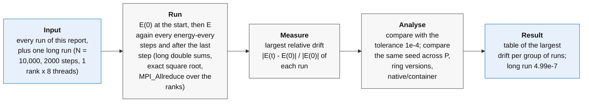

### Energy drift across all experiments

Before looking at speed, we want to be sure that the program computes the right thing, also when it runs in parallel. The energy drift is recorded in every run of this report.

The total energy is the energy of motion T plus the gravitational energy U. U uses the same softening as the force, and each pair is counted once:

```text
T = sum over i of  (1/2) m_i |v_i|^2
U = - sum over pairs i < j of  G m_i m_j / sqrt(|r_j - r_i|^2 + epsilon^2)
E = T + U
```

At the start the program stores E(0). Every time it computes the energy again, it measures the relative change and keeps the largest value found during the run:

```text
energy drift = max over the checks of  |E(t) - E(0)| / |E(0)|
```

The run is controlled by a few parameters of the program:

| Parameter | Meaning |
|---|---|
| `--nsteps` | number of time steps; each step is one kick-drift-kick cycle |
| `--dt` | length of one time step (1e-4 in all experiments); the simulated time is nsteps x dt |
| `--energy-every` | how often the energy is checked: after every `energy-every` steps, and always after the last step |
| `--energy-tol` | tolerance on the drift (1e-4); if the drift is larger, the run is marked FAIL instead of OK |

The forces are computed once before the first step and once in every step, so a run does nsteps + 1 force evaluations. The energy is computed once at the start, to get E(0), and then after the steps that are multiples of `energy-every`, plus the last step. So the number of energy evaluations is:

```text
energy evaluations = 1 + (number of steps s with s % energy_every == 0, or s == nsteps)
```

Some examples from this report:

| Runs | nsteps | energy-every | Energy evaluations |
|---|---:|---:|---:|
| Strong and weak scaling | 100 | 100 | 2 (start and end) |
| Cost of the energy check, sparse case | 5 | 5 | 2 (start and end) |
| Cost of the energy check, frequent case | 5 | 1 | 6 (start and every step) |
| Long validation run | 2000 | 10 | 201 |
| Time-step convergence | 100-400 | 1 | 101-401 (every step) |

The check sits at the end of each step of the time loop:

```c
energy0 = total_energy_ring(...);                     // E(0), before the first step
compute_accelerations_ring(...);                      // a(0)

for (size_t step = 1; step <= nsteps; ++step)
{
  kick(&local, 0.5 * dt);                             // v += a * dt/2
  drift(&local, dt);                                  // x += v * dt
  compute_accelerations_ring(...);                    // new a at the new positions
  kick(&local, 0.5 * dt);                             // v += a * dt/2

  if ((step % energy_every) == 0 || step == nsteps)   // energy check
  {
    energy = total_energy_ring(...);
    rel = fabs(energy - energy0) / fabs(energy0);     // relative drift
    if (rel > max_rel_drift)
      max_rel_drift = rel;                            // keep the largest value
  }
}
```

The energy itself is computed in three parts. The kinetic energy needs only the home particles of each rank, so it needs no communication. Each thread adds its part in `long double`, and OpenMP combines the thread sums:

```c
long double sum = 0.0L;
#pragma omp parallel for reduction(+ : sum) schedule(static)
for (i = 0; i < p->n; ++i)
  sum += vx[i]*vx[i] + vy[i]*vy[i] + vz[i]*vz[i];     // |v|^2
return 0.5L * mass * sum;                             // T = m/2 * sum |v|^2
```

The potential energy needs all pairs, so it uses the same ring as the force, with blocking exchanges. For each block that visits the rank, each pair is added only once, when the global index of the home particle is smaller than the global index of the source particle, and always with the exact square root:

```c
#pragma omp parallel for reduction(+ : sum) schedule(static)
for (i = 0; i < home->n; ++i)
{
  const size_t gi = home_start + i;                   // global index of the home particle
  for (j = 0; j < source_n; ++j)
    if (gi < source_start + j)                        // count each pair once
    {
      dx = sx[j] - xi;  dy = sy[j] - yi;  dz = sz[j] - zi;
      r2 = dx*dx + dy*dy + dz*dz + eps*eps;           // same softening as the force
      sum -= G * mass * mass * (1.0 / sqrt(r2));      // U_ij = -G m^2 / sqrt(r^2 + eps^2)
    }
}
```

Finally the kinetic and potential sums of all ranks are added together, and every rank gets the result:

```c
MPI_Allreduce(&kin_local, &kin_global, 1, MPI_LONG_DOUBLE, MPI_SUM, comm);
MPI_Allreduce(&pot_local, &pot_global, 1, MPI_LONG_DOUBLE, MPI_SUM, comm);
E = kin_global + pot_global;
```

The rule "i smaller than j" makes the work uneven between ranks: the rank with the first particles accepts almost all its pairs, the rank with the last ones almost none. The strong-scaling section measures the effect of this.

The largest values seen in each group of runs are:

| Runs | Particles N | Steps | Ranks x threads | Largest energy drift |
|---|---:|---:|---|---:|
| Strong scaling | 100000 | 100 | 1-32 x 1 | 2.1e-6 |
| Weak scaling | 10000-160000 | 100 | 1-16 x 1 | 4.7e-6 |
| Same runs inside the container | 10000-160000 | 100 | 1-32 x 1 | identical to native |
| MPI/OpenMP mapping | 100000 | 20 | 64 cores | 4.9e-7 |
| Blocking vs overlapped communication | 100000 | 20 | 2-32 x 1 | 4.9e-7 |
| Optimisation tests | 10000 | 5 | 1 x 1-16 | 1.3e-7 |
| Compilation targets | 100000 | 10 | 32 x 1 | 1.5e-7 |
| Time-step convergence | 10000 | 100-400 | 1 x 8 | 2.5e-7 |
| Long validation run | 10000 | 2000 | 1 x 8 | 5.0e-7 |

All values are far below the tolerance of 1e-4. Two more observations make the check stronger.

First, the drift does not depend on the number of ranks. In the strong-scaling runs the same five initial conditions were run with every number of ranks from 1 to 32, and each input gives the same drift at every rank count, to about nine significant digits. The same holds between the blocking and overlapped ring, and between the native and the container runs. Splitting the problem differently only changes the order in which the forces are added, which changes the last digits but not the physics. If a block of particles were lost or counted twice in the ring, the drift would jump by orders of magnitude.

Second, larger systems drift a little more: in the weak-scaling series, from 2.7e-7 for 10,000 particles to 4.7e-6 for 160,000. More particles mean more close encounters at the same softening and time step.

### A longer validation run

The runs above are short (5 to 100 steps). The exercise asks to check energy conservation "over the whole run" for a Plummer sphere of 10,000 particles, so we also ran one long simulation: N = 10,000, 2000 steps of dt = 1e-4 (twenty times longer than the scaling runs), one rank with 8 threads, exact square root, energy checked every 10 steps (201 checks). Only the energy matters here, so this job ran on a shared node with 8 cores, and its timings are not used as performance data.

| N | Steps | dt | Simulated time | Energy checks | Largest energy drift |
|---:|---:|---:|---:|---:|---:|
| 10000 | 2000 | 1e-4 | 0.2 | every 10 steps | 4.99e-7 |

Over the whole run the energy never moved by more than 5 parts in 10 million: about 200 times below our tolerance and 2000 times below the 1e-3 of the exercise. The same kind of input followed for 100 steps shows a drift of about 2.3e-7, so running twenty times longer only about doubles the largest drift. This is what we expect from the leapfrog method: the energy error oscillates in a bounded range instead of growing with time. The program records only the maximum drift, not the full history E(t), so this is an indication rather than a proof.

---

## Cost of the energy check

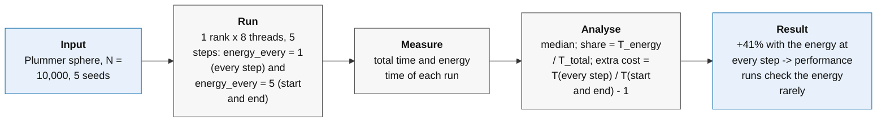

The potential energy needs every pair of particles, exactly like the force. Frequent energy checks are good for correctness but can distort the timing of a performance run, so we measured their cost. The test used N = 10,000, 5 steps, one rank with 8 threads and five repetitions. We compared computing the energy at every step (`energy_every=1`) with computing it only at the start and at the end (`energy_every=5`). With T_total the median total time and T_energy the median time of the energy phase, the two columns of the table are:

```text
share of time on energy = T_energy / T_total
extra cost              = T_total(every step) / T_total(start and end only) - 1
```

| N | Steps | Ranks | Threads | Energy computed | Median total (s) | Share of time on energy | Extra cost | Largest drift |
|---:|---:|---:|---:|---|---:|---:|---:|---:|
| 10000 | 5 | 1 | 8 | every step | 0.554580 | 44.64% | +40.83% | 9.62e-8 |
| 10000 | 5 | 1 | 8 | start and end only | 0.393790 | 22.35% | baseline | 9.62e-8 |


Frequent energy checks are a useful debugging tool but cost a lot. For this reason all performance runs compute the energy only rarely, for example once at the start and once at the end. Even so, the energy still takes a small part of the total time (about 1-2% in the 100-step scaling runs and 6-9% in the 20-step runs, growing with the number of ranks), and this time is included in all reported totals.

---

## Profiling: where the time goes and kernel throughput

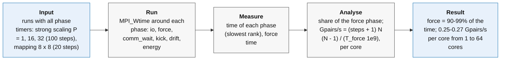

The exercise asks for evidence behind the claim about the bottleneck. Hardware counters were not available, so we use the program's own instrumentation: the phase timers described in the methods, and the throughput of the force kernel. The throughput is our "memory-bandwidth-style" measure of performance. A memory-bound code is naturally measured in bytes per second; for an O(N^2) kernel the natural unit of useful work is one particle pair, so we measure pairs per second:

```text
Gpairs/s = (number of steps + 1) x N x (N - 1) / (T_force x 1e9)
```

| Run | Cores | Force phase, share of total time | Gpairs/s (whole run) | Gpairs/s per core |
|---|---:|---:|---:|---:|
| N = 100,000, 100 steps, 1 rank x 1 thread | 1 | 99.1% | 0.267 | 0.267 |
| N = 100,000, 100 steps, 16 ranks x 1 thread | 16 | 98.3% | 4.27 | 0.267 |
| N = 100,000, 100 steps, 32 ranks x 1 thread | 32 | 98.3% | 8.32 | 0.260 |
| N = 100,000, 20 steps, 8 ranks x 8 threads | 64 | 90.4% | 16.27 | 0.254 |

The force phase takes 90-99% of the run in every configuration. The rest is almost only the energy check, which is also a pair computation; waiting for messages stays below 1% and moving the particles costs a fraction of a percent. The throughput per core stays between 0.25 and 0.27 billion pairs per second from 1 to 64 cores, so adding cores adds throughput almost linearly. This is what we expect when each core works on data held in its own caches, and not what we would see if the cores were competing for a shared resource such as main memory. One pair costs about 1 / 0.267e9 = 3.7 ns on one core, and most of this time goes into the square root and the division; this is why the square-root optimisation, which makes the force phase about eight times faster, had by far the largest effect. Hardware counters would be needed to confirm this with counted events, but the timers and the throughput point in the same direction: the program is limited by the arithmetic of each pair, not by memory or communication.

---

## Strong scaling

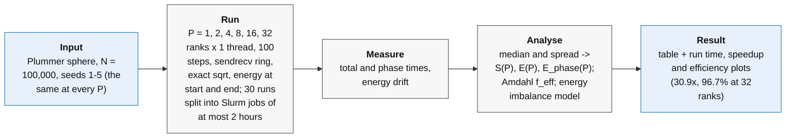

Strong scaling measures how much faster a problem of fixed size runs when we add cores. Ideally, 32 cores would be 32 times faster. In practice some parts do not speed up: communication between ranks, work that every rank repeats, and waiting for the slowest rank. The way the efficiency drops as cores are added shows where these limits are.

The set-up follows the configuration of the exercise:

- N = 100,000 particles, 100 time steps of dt = 1e-4;
- P = 1, 2, 4, 8, 16 and 32 ranks, one thread each, on GENOA nodes;
- blocking ring (`sendrecv`), direct kernel, exact square root, energy checked only at the start and at the end;
- five repetitions per point, with the same five initial conditions (seeds) at every P, no warm-up;
- the same executable for every P, with all phase timers recorded.

One run on one core takes about 64 minutes, and a job can last at most two hours, so the runs were split into several jobs: one job for each repetition at P = 1, and fewer jobs for the faster points. The points P = 8, 16 and 32 ran in one job on the same node. All 30 runs have status OK, with a largest energy drift of 2.1e-6.

Besides the speedup and efficiency of the total time, the table gives the efficiency of each phase, computed in the same way from the median time of that phase, and the waiting time as a share of the total:

```text
E_phase(P) = T_phase(1) / (P x T_phase(P))
waiting    = T_comm_wait(P) / T_total(P)
```

| MPI ranks P | N/P | Median total (s) | Spread s (s) | Speedup | Efficiency (total) | Efficiency (force) | Efficiency (energy check) | Waiting for messages | Gpairs/s per rank |
|---:|---:|---:|---:|---:|---:|---:|---:|---:|---:|
| 1 | 100000 | 3823.47 | 2.27 | 1.00 | 100.0% | 100.0% | 100.0% | 0.00% | 0.2667 |
| 2 | 50000 | 1920.50 | 0.63 | 1.99 | 99.5% | 100.0% | 69.6% | 0.27% | 0.2665 |
| 4 | 25000 | 960.53 | 0.86 | 3.98 | 99.5% | 100.1% | 60.6% | 0.27% | 0.2670 |
| 8 | 12500 | 480.42 | 1.01 | 7.96 | 99.5% | 100.2% | 56.9% | 0.19% | 0.2672 |
| 16 | 6250 | 240.56 | 1.67 | 15.89 | 99.3% | 100.1% | 55.1% | 0.26% | 0.2670 |
| 32 | 3125 | 123.59 | 0.02 | 30.94 | 96.7% | 97.5% | 52.9% | 0.24% | 0.2599 |

<p align="center">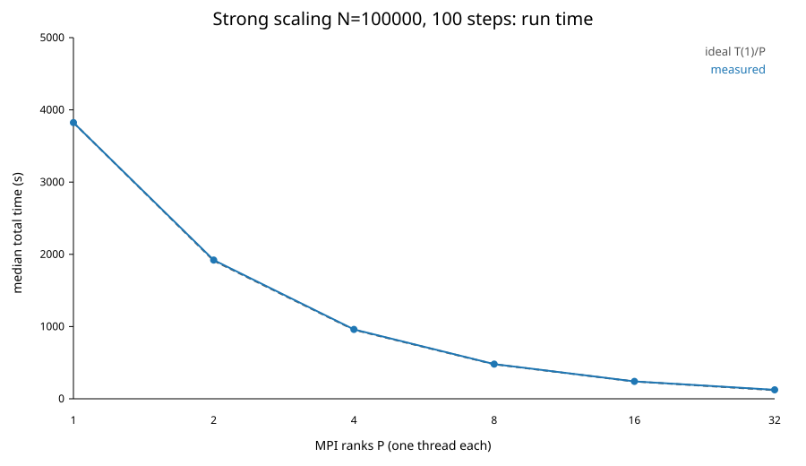</p>

_The run time falls from about 64 minutes on one core to about 2 minutes on 32 cores, following the ideal line T(1)/P._

<p align="center">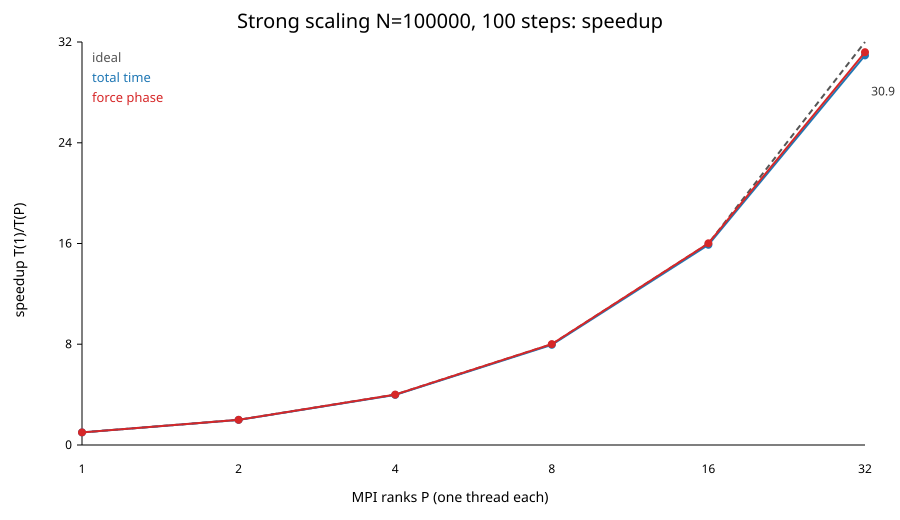 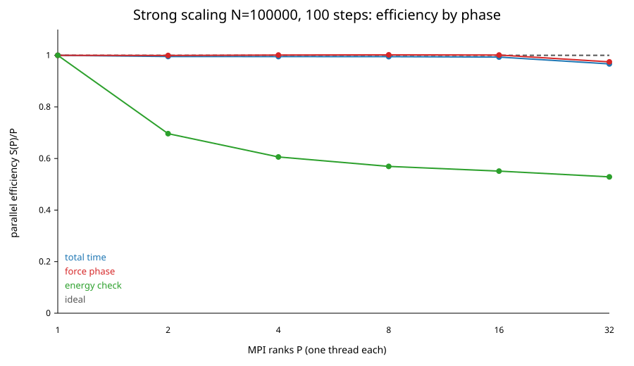</p>

_Left: the speedup reaches 30.9 at 32 ranks, against an ideal of 32. Right: the force computation keeps about 100% efficiency; the energy check falls to about 55%, but it takes only 1-2% of the run, so the total efficiency stays above 99% up to 16 ranks._

Up to 16 ranks the efficiency stays above 99%, and 32 ranks are 30.9 times faster than one, an efficiency of 96.7%. The force computation, the heart of the program, keeps about 100% efficiency: each rank processes 0.267 billion pairs per second whether it works alone or with 15 others. The waiting time for ring messages stays below 0.3% of the run at every P.

The only point clearly below 99% is P = 32. The waiting time there is still 0.24%, but the force computation of each rank is slower: 0.260 billion pairs per second, about 2.5% less than at all the other rank counts. This looks like a property of the node, not of the scaling. The runs with 8, 16 and 32 ranks ran in the same job on the same node (genoa004), and with 8 and 16 ranks the speed per rank is normal. So some of the extra cores used only at 32 ranks are probably slower, for example because they run at a lower clock. The timers cannot confirm the cause.

The phase timers show that the other loss comes from the energy check. Its efficiency drops to about 70% with 2 ranks and to about 55% from 8 ranks on. The reason is a load imbalance in how the energy is computed. To count each pair once, a rank adds the pair (i, j) only when the global index of i is smaller than that of j. The rank that owns the first particles accepts almost all its pairs, while the rank that owns the last particles accepts almost none. Everybody waits for the busiest rank, which has 2 - 1/P times the average work, so the expected efficiency is:

```text
E_energy(P) = 1 / (2 - 1/P)
```

This gives 67%, 57%, 53%, 52% and 51% at 2, 4, 8, 16 and 32 ranks, close to the measured 70%, 61%, 57%, 55% and 53%. It is Amdahl's law inside a single routine: a part of the work that does not divide evenly limits the whole. In these runs the energy is computed only twice, so it takes 0.9% of the time on one rank and 1.7% on 32 ranks, and its effect on the total is below one percentage point. With more frequent checks it would matter more. The fix is well known, for example letting each rank handle only half of the ring so that every rank gets the same number of unique pairs; it was not needed for correctness and was not applied.

Amdahl's law can also summarise the whole curve. If a fraction f of the work did not speed up at all, the speedup could never exceed 1/f. Solving Amdahl's formula for f with the measured speedups gives an effective serial fraction:

```text
f_eff = (1/S(P) - 1/P) / (1 - 1/P)
P = 16:  f_eff = 0.00044
P = 32:  f_eff = 0.00111
```

The losses behave as if about 0.05-0.1% of the work were serial: a mix of the unbalanced energy check and, at 32 ranks, of the slower cores. This is not a real measurement of serial code; it collects every source of loss into one number.

### Limits of strong scaling

The exercise asks where the scaling would break down. Two limits are expected as P grows with N fixed:

- Too little work per rank for vector instructions. Modern cores process several numbers at once (SIMD). When a rank has only a few hundred particles, loop start-up and leftover iterations become a large part of the work. At 32 ranks each rank still has 3,125 particles, so we do not expect this effect, and we do not see it: the force efficiency is about 100% up to 16 ranks, and the lower value at 32 ranks comes from the node, not from the size of the blocks.
- The ring becomes too long. With P ranks, each force evaluation does P message exchanges, one after each block. Only P - 1 are needed: the last one just brings every rank's own block back home, and the code does it anyway to keep the loop simple. The computation per rank shrinks like N^2/P, while the number of messages grows like P. A simple model is:

  ```text
  computation per rank   ~ c x N^2 / P
  communication per rank ~ P x (latency + (data per block) / bandwidth)
  ```

  At some P the two terms become comparable and more ranks stop helping. On one node, where at 32 ranks each message is only about 75 kB (3,125 particles x 3 coordinates x 8 bytes), this point is far beyond 32 ranks for N = 100,000, as the waiting time of at most 0.3% shows. On several nodes it would come earlier.

### Growth of the cost with N

The exercise asks by what factor the time per step should grow when N is multiplied by 10. For the direct method the number of pairs grows by

```text
(10N)(10N - 1) / (N (N - 1)) = 100.009   for N = 10,000
```

We check this with two sets of runs that differ only in N, with the same executable and settings: one rank, one thread, 100 steps, N = 10,000 (the first point of the weak-scaling series) and N = 100,000 (the first point of the strong-scaling series).

| N | Median total time (s) |
|---:|---:|
| 10,000 | 38.11 |
| 100,000 | 3823.47 |
| Ratio | 100.32 (expected 100.01) |

The measured ratio is within 0.3% of the prediction, well within what we expect from the different initial conditions and the different amount of data in the caches. This confirms that the program has the quadratic cost of the direct method.

---

## Weak scaling

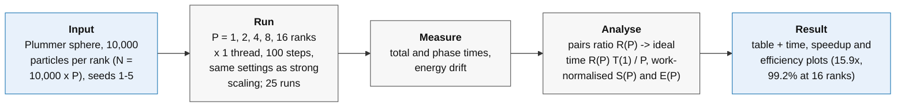

Weak scaling keeps the number of particles per rank fixed and adds ranks, so that the problem grows with the machine. For many applications the ideal is a constant time.

For the direct N-body method this ideal does not apply. Each rank owns a fixed number of particles, but each of them must interact with all N particles, and N grows with P. So the work per rank grows like P: with 16 ranks each rank has 16 times more pairs than with one. The right ideal is a time that grows linearly with P, not a constant time.

The set-up was:

- 10,000 particles per rank, so N = 10,000, 20,000, 40,000, 80,000 and 160,000;
- P = 1, 2, 4, 8 and 16 ranks, one thread each, 100 time steps, GENOA nodes;
- five repetitions per point, no warm-up; the same executable and settings as the strong-scaling runs (blocking ring, exact square root, energy checked only at the start and at the end).

All 25 runs have status OK. To compare each point with the ideal, we scale the one-rank time T(1) with the number of pairs:

```text
pairs ratio  R(P) = N_P (N_P - 1) / (N_1 (N_1 - 1))
ideal time   T_ideal(P) = R(P) x T(1) / P          (about P x T(1))
speedup      S(P) = R(P) x T(1) / T(P)
efficiency   E(P) = S(P) / P
```

This speedup is a model-based estimate: the large single-core runs were not done, because at N = 160,000 one would take several hours. It assumes the same cost per pair for all problem sizes, which the growth test of the previous section confirms within 0.3%.

| MPI ranks P | Total particles N | Median total time (s) | Spread s (s) | Ideal time (s) | Time relative to ideal | Work-normalised speedup | Work-normalised efficiency |
|---:|---:|---:|---:|---:|---:|---:|---:|
| 1 | 10000 | 38.11 | 0.004 | 38.1 | 1.000 | 1.00 | 100.0% |
| 2 | 20000 | 76.62 | 0.03 | 76.2 | 1.005 | 1.99 | 99.5% |
| 4 | 40000 | 153.42 | 0.07 | 152.5 | 1.006 | 3.97 | 99.4% |
| 8 | 80000 | 307.16 | 0.72 | 304.9 | 1.007 | 7.94 | 99.3% |
| 16 | 160000 | 614.90 | 1.53 | 609.8 | 1.008 | 15.87 | 99.2% |

<p align="center">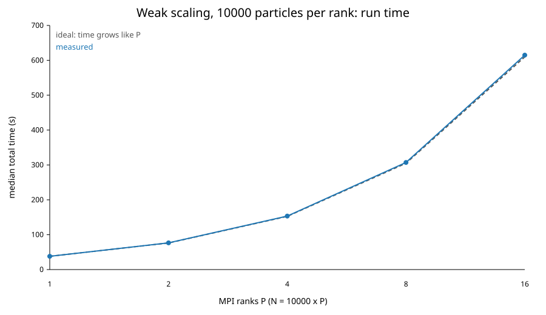</p>

_The time grows with P even though each rank keeps the same number of particles, as expected for an all-pairs method. The measured curve lies on the ideal one: at 16 ranks the ideal is 609.8 s and the measurement 614.9 s, 0.8% higher._

<p align="center"> 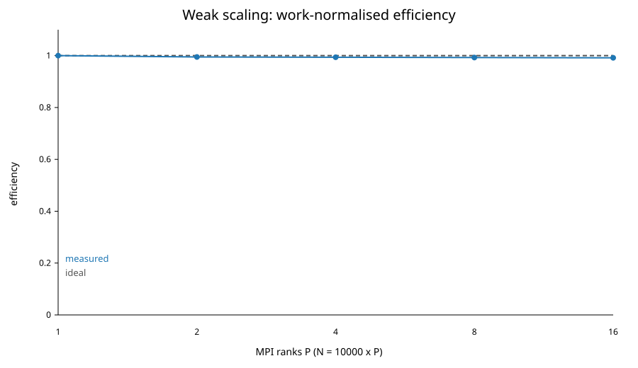</p>

_Left: the work-normalised speedup reaches 15.9 at 16 ranks, against an ideal of 16. Right: the work-normalised efficiency stays above 99% at every P._

The weak-scaling result agrees with the strong-scaling one: the time grows exactly like the number of pairs per rank, and at 16 ranks the extra cost is only 0.8%. Waiting for messages takes at most 0.25% of the run, and the energy check, whose imbalance also appears here, takes at most 1.7%.

Gustafson's law is the natural way to read this: when the problem grows with the machine, the parallel part dominates and good scaling is possible. For direct N-body, the balance between computation and communication stays constant in theory. Per force evaluation each rank computes about n x N = n^2 x P pairs (with n = N/P) and receives n x P particles (P blocks of n, the last one being its own block coming back), so both grow linearly with P. In practice other effects can appear:

- shared caches, memory bandwidth and frequency limits when more cores are busy;
- the lock-step ring, where one delayed rank delays all the others;
- operating-system noise ("jitter");
- on several nodes, the limited bandwidth of the network card, shared by all ranks of a node.

The exercise asks whether the uneven density of the Plummer sphere causes load imbalance. In the direct method it does not: every particle interacts with every other one wherever it is, so all ranks have exactly the same number of pairs. Density would matter for a tree code or for any method with a distance cutoff. Imbalance can still come from differences between cores, not from the particle positions.

These are single-node measurements. They show that on one node the effects listed above are small for this program, but they cannot predict the behaviour of a run over several nodes, where the network would matter.

---

## Mapping MPI ranks and OpenMP threads onto the node

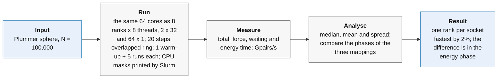

The same 64 cores can be used in many ways: 64 ranks with one thread, 8 ranks with 8 threads, 2 ranks with 32 threads, and so on. Fewer ranks mean fewer and shorter ring exchanges, but more threads sharing memory. The natural guess, suggested by the exercise, is one rank per NUMA domain, so that the threads of each rank use nearby memory. The exercise also asks to try one rank per socket and one rank per core, and to measure the difference. We compared three mappings of the same 64 cores:

- one rank per NUMA domain: P = 8 ranks x T = 8 threads;
- one rank per socket: P = 2 x T = 32;
- one rank per core: P = 64 x T = 1.

The CPU masks printed by Slurm confirm that each rank received its own, non-overlapping set of cores (for example, in the NUMA mapping each rank owns exactly one block of 8 cores). They also show that Slurm places consecutive ranks alternately on the two sockets.

Workload: N = 100,000, 20 steps, overlapped ring, exact square root, four partial sums, double precision; one warm-up and five measured runs per mapping.

| Mapping | Ranks P | Threads T | Median total (s) | Mean total (s) | Spread s (s) | Median force (s) | Median waiting for messages (s) | Median Gpairs/s |
|---|---:|---:|---:|---:|---:|---:|---:|---:|
| One rank per NUMA domain | 8 | 8 | 14.275566 | 14.283084 | 0.027015 | 12.909107 | 0.126690 | 16.267422 |
| One rank per socket | 2 | 32 | 13.986056 | 13.988024 | 0.012181 | 12.905388 | 0.051432 | 16.272110 |
| One rank per core | 64 | 1 | 14.025092 | 14.045257 | 0.054429 | 12.852373 | 0.101077 | 16.339232 |

The three mappings are very close. One rank per socket is the fastest: 2.0% faster than one rank per NUMA domain and 0.3% faster than one rank per core.

The force throughput is about 16.3 billion pairs per second in all three cases, and the force computation takes about 90-92% of the total time in each. So the way the cores are organised barely changes the speed of the main computation. What changes is mostly the communication: the socket mapping has only 2 ranks in the ring and the lowest waiting time. Even so, waiting is less than 1% of the time, so it cannot explain the 2% difference between the socket and the NUMA mapping. The phase timers show where most of it comes from: the energy check takes about 1.34 s with the NUMA mapping and 1.07 s with the socket mapping, while the force phase is practically the same (12.91 s in both). The one-rank-per-core mapping is in between, with 1.09 s. The uneven split of the energy work, seen in strong scaling, does not explain this difference: with the "i smaller than j" rule, the busiest thread of the node gets about twice the average work in all three mappings. The cause of the extra 0.3 s of the NUMA mapping in the energy phase cannot be found from these data.

The "obvious" NUMA-based choice is correct but not automatically the fastest. For a program that is limited by arithmetic and whose working data fit in the caches, memory locality matters less than one might expect, and the best mapping has to be measured for the actual problem. The largest energy drift of these runs is 4.94e-7.

---

## Newton's third law: computing each pair only once

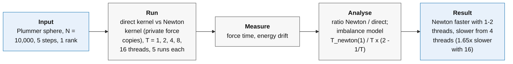

The force computation takes 90% or more of the run time, so it is the obvious place to look for speed. The exercise lists several classic ideas and asks to measure each one and explain the result, also when an idea does not pay off. The next sections test them one at a time.

For this section and the next two, unless stated otherwise, the tests use a small, quick configuration so that many variants can be compared under the same conditions: N = 10,000 particles, 5 steps, one rank, first with one thread and then with 2, 4, 8 and 16 threads, dt = 1e-4, epsilon = 0.05, energy computed only at the start and end, five repetitions per variant, no warm-up. Each thread count repeats the same 55 runs (11 variants x 5), and all 275 runs have status OK. A single rank keeps communication out of the picture, and starting from one thread shows the effect of each idea on the computation before thread effects come in.

Newton's third law says that the force of particle j on particle i is equal and opposite to the force of i on j. The direct loop computes both, so in principle we could compute each pair once and use the result twice, halving the arithmetic.

In the direct loop each thread writes only the forces of its own particles. With the third law, a thread that handles the pair (i, j) must also update particle j, which may belong to another thread. Two threads could then update the same particle at the same time, and one update would be lost. This must be prevented, and that has a cost.

In our implementation each thread has its own private copy of the force arrays. Inside one `#pragma omp parallel` region, the rows i are split among the threads with `#pragma omp for schedule(static)`; each thread computes the pairs (i, j) with j > i once and writes into its own copy. A second `#pragma omp parallel for` then adds all the copies together. There are no locks or atomic operations in the pair loop. The price is extra memory (three arrays per thread) and the work of clearing and summing the copies, which grows like T x N. The saving grows like N^2, so the trade-off is good when N is large compared with the number of threads, and worse with many threads and small N.

The first test uses 1 rank and 1 thread.

| Kernel | Median total (s) | Mean total (s) | Spread s (s) | Median force (s) |
|---|---:|---:|---:|---:|
| Direct (every pair twice) | 2.601807 | 2.605978 | 0.007693 | 2.235868 |
| Newton (every pair once) | 1.767468 | 1.768040 | 0.003336 | 1.401407 |

The third law reduces the total time by 32% (a speedup of 1.47x), and the force phase alone by 37% (1.60x). This is less than the ideal factor of 2 because only the arithmetic is halved: the loop still has to read the particles, and the extra bookkeeping adds some work. Both kernels give the same energy drift (1.2974058e-7).

With one thread there is no conflict between threads, so this test shows the benefit of the idea but not its full cost. The real trade-off appears with several threads, so the comparison was repeated with 2, 4, 8 and 16 threads (five runs each, all OK). The table uses the force time, where the two kernels differ. The last column is a simple model explained below the figures.

| Threads | Direct force (s) | Newton force (s) | Newton / direct | Newton, simple imbalance model (s) |
|---:|---:|---:|---:|---:|
| 1 | 2.2359 | 1.4014 | 0.63 | 1.4014 |
| 2 | 1.1174 | 1.0514 | 0.94 | 1.0511 |
| 4 | 0.5589 | 0.6144 | 1.10 | 0.6131 |
| 8 | 0.2801 | 0.3401 | 1.21 | 0.3285 |
| 16 | 0.1407 | 0.2326 | 1.65 | 0.1697 |

<p align="center">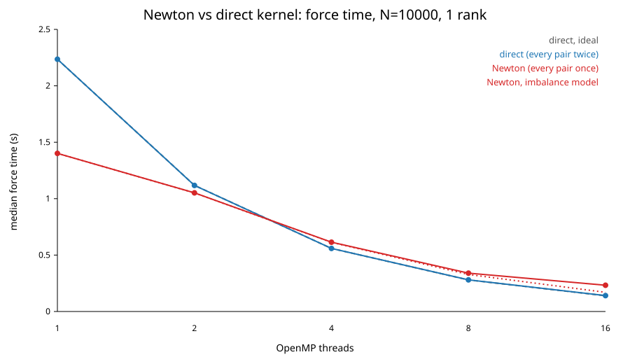 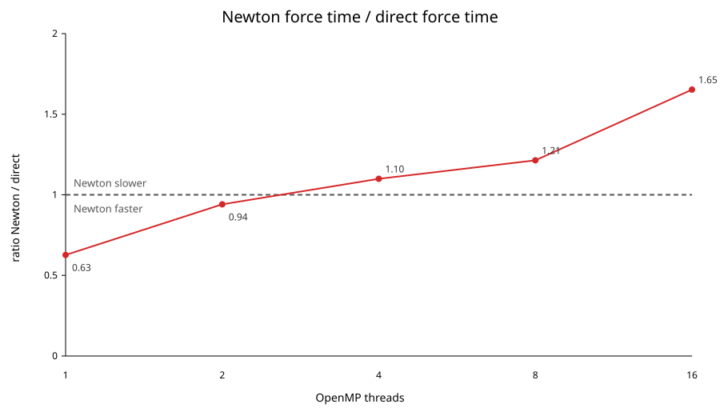</p>

_Left: the direct kernel follows the ideal line, halving its time at every doubling of threads, while Newton's kernel improves much less. Right: Newton is faster with 1 and 2 threads and slower from 4 threads on, 1.65 times slower with 16._

The trade-off asked about in the exercise is clearly visible. With one thread, computing each pair once saves 37% of the force time. With two threads the saving has almost disappeared (6%), and from four threads on Newton's kernel is slower than the direct one, by 10% with 4 threads and by 65% with 16. The direct kernel instead scales almost perfectly: with 16 threads it is 15.9 times faster than with one.

The main reason is not the private copies but how the work is divided. In Newton's kernel, row i contains only the pairs with j > i, so the first rows are long and the last rows almost empty. `schedule(static)` gives each thread an equal number of rows, so the thread with the first rows has much more work than the thread with the last rows, and everybody waits for it. The busiest thread has 2 - 1/T times the average work, which gives the model in the last column:

```text
T_model(T) = T_newton(1) / T x (2 - 1/T)
```

Using only this rule and the one-thread time, the model predicts the measured times within 0.5% for 2 and 4 threads and within 4% for 8 threads. At 16 threads the measured time is higher than the model, because the fixed cost of clearing and adding the 16 private copies is no longer small compared with the shrinking pair work. The energy check shows the same kind of imbalance between MPI ranks: whenever pairs are counted once with an "i smaller than j" rule and the work is split in equal blocks, the first worker gets too much.

So Newton's third law pays off only when few threads share the work. To make it useful with many threads, the imbalance must be removed, for example with `schedule(dynamic)` or an interleaved distribution of the rows, or by pairing a row from the start with one from the end, and the cost of combining the private copies must be kept small. For our production runs the direct kernel, which needs no synchronisation at all, is the better choice.

Using the idea across MPI ranks would be even harder: the force computed for a particle owned by another rank would have to be sent back to its owner, adding communication. Our production solver does not do this. Note also that the Newton kernel computes N(N-1)/2 pairs, while the Gpairs/s formula counts N(N-1), so its throughput is an effective value.

---

## A faster inverse square root

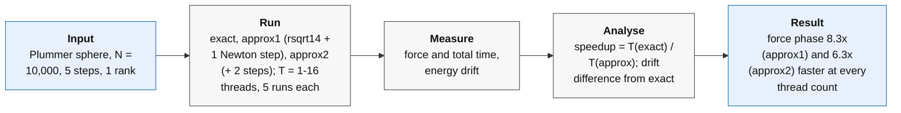

For every pair the force needs 1 / sqrt(r^2 + epsilon^2), and an exact square root followed by a division is one of the slowest operations in the loop. Modern processors have a special instruction that gives a rough approximation of 1/sqrt(x) very quickly. On our AVX-512 processor it is `_mm512_rsqrt14_pd`, accurate to about 14 bits (4 significant digits). The approximation can be improved with one or two cheap Newton-Raphson correction steps; each step roughly doubles the number of correct digits:

```text
y_new = y x (1.5 - 0.5 x q x y^2)      where y is the estimate of 1/sqrt(q)
```

The solver offers three options:

- `exact`: the standard square root and division;
- `approx1`: hardware approximation plus one correction step;
- `approx2`: hardware approximation plus two correction steps.

The approximate options are implemented in a separate hand-written loop that processes eight pairs at once with AVX-512 instructions (`_mm512_rsqrt14_pd` for the estimate, `_mm512_fmadd_pd` for the fused multiply-adds), while the exact option uses the ordinary loop. So the comparison is between two complete implementations, not only between two square-root instructions. The speedups in the tables are ratios of median times:

```text
speedup vs exact = T(exact) / T(approx)
```

| Method | Median total (s) | Mean total (s) | Spread s (s) | Median force (s) | Total speedup vs exact | Largest energy drift |
|---|---:|---:|---:|---:|---:|---:|
| exact | 2.602213 | 2.603644 | 0.004365 | 2.235830 | 1.000 | 1.2974058018291037e-7 |
| approx1 | 0.635762 | 0.637167 | 0.003193 | 0.270813 | 4.093 | 1.2974022806770565e-7 |
| approx2 | 0.723951 | 0.722741 | 0.002251 | 0.354722 | 3.594 | 1.2974058018291037e-7 |

The five single runs:

| Method | Run 1 (s) | Run 2 (s) | Run 3 (s) | Run 4 (s) | Run 5 (s) |
|---|---:|---:|---:|---:|---:|
| exact | 2.608489 | 2.602213 | 2.598911 | 2.600601 | 2.608007 |
| approx1 | 0.639448 | 0.634745 | 0.641584 | 0.635762 | 0.634297 |
| approx2 | 0.720288 | 0.720345 | 0.723951 | 0.724101 | 0.725020 |

The gain is large: the force phase becomes 8.3 times faster with one correction step and 6.3 times faster with two. The whole solver becomes about 4 times faster; it cannot gain as much as the force phase because the remaining 0.37 s (reading input, energy checks, moving particles) is not accelerated. The second correction step costs about 0.08 s more, as expected from the extra arithmetic.

This is much more than the "2-3 times" suggested by the exercise for the square root alone. Most of the gain comes from the fully vectorised loop, which handles eight pairs per instruction, while the exact path does one pair at a time. The timings do not allow us to split the gain between "faster square root" and "vector instructions".

The same comparison with 2, 4, 8 and 16 threads gives:

| Threads | Exact force (s) | approx1 force (s) | approx2 force (s) | approx1 force speedup | approx2 force speedup | approx1 total speedup |
|---:|---:|---:|---:|---:|---:|---:|
| 1 | 2.2358 | 0.2708 | 0.3547 | 8.26 | 6.30 | 4.09 |
| 2 | 1.1175 | 0.1356 | 0.1774 | 8.24 | 6.30 | 3.48 |
| 4 | 0.5590 | 0.0680 | 0.0888 | 8.22 | 6.29 | 3.23 |
| 8 | 0.2803 | 0.0345 | 0.0450 | 8.12 | 6.22 | 3.06 |
| 16 | 0.1413 | 0.0178 | 0.0231 | 7.94 | 6.13 | 2.94 |

The gain in the force computation stays at about 8 times (one correction) and 6 times (two corrections) at every thread count, so the fast version parallelises as well as the exact one. The gain on the total time, however, falls from 4.1 to 2.9 times as threads are added. This is Amdahl's law on a small scale: the force phase shrinks by a factor of 8, but the other parts of the run (reading the input and the energy check, which always uses the exact square root) are not accelerated, so they become a larger share of what remains.

One correction step brings the approximation to roughly 8 significant digits, not the 16 of full double precision; two steps come much closer but do not guarantee identical results. In our runs the energy drift of `approx1` differs from the exact one by only 3.5e-13, and `approx2` gives the same printed value as `exact`. The drift is a single number for the whole system, so equal drifts show that energy conservation is equally good, not that the particles follow identical trajectories. That would require comparing the positions directly, which the program does not output.

The exercise asks how to make sure that the energy check really tests the integrator and is not blind to the approximation error. We took two precautions:

- The energy is computed independently of the approximation: the energy routine always uses the exact double-precision square root, so the approximation cannot hide its own error in the check.
- The drift does not change when the approximation is refined: if the approximation error dominated, `approx1` would show a clearly larger drift than `approx2` and `exact`. It does not.

These runs are short (5 steps, energy checked only at the start and end), so on their own they are not a full proof. The stronger test is the convergence study below.

### Time-step convergence study

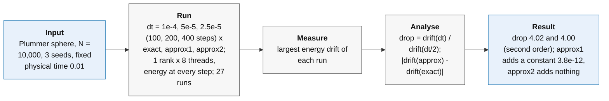

The leapfrog method is second order: if the time step is halved, its error should become about four times smaller. So we simulate the same stretch of physical time with smaller and smaller time steps and watch the energy drift fall. For each halving of dt we compute:

```text
drop = drift(dt) / drift(dt/2)          (ideal value 4 for a second-order method)
difference vs exact = | drift(approx) - drift(exact) |   (same initial condition)
```

With the exact square root the drift should keep falling by four at each halving. An approximate square root adds an extra error that does not shrink with the time step. As long as this extra error is small, all three methods fall together. If an approximate version stopped improving while the exact one kept going, we would have found the point where the approximation becomes the limiting error.

The study used N = 10,000 Plummer particles, one rank with 8 threads and a fixed physical time of 0.01, simulated with dt = 1e-4 (100 steps), dt/2 = 5e-5 (200 steps) and dt/4 = 2.5e-5 (400 steps). The energy was checked at every step, with three initial conditions (seeds) per point, for each of `exact`, `approx1` and `approx2`: 27 runs in total, all OK. As with the long run, these jobs used 8 cores of a shared node, and their timings are not used.

| dt | Steps | exact: largest drift | Drop vs previous dt | approx1: largest drift | approx2: largest drift | Largest difference approx1 vs exact |
|---:|---:|---:|---:|---:|---:|---:|
| 1e-4 | 100 | 2.5305e-7 | - | 2.5304e-7 | 2.5305e-7 | 3.7e-12 |
| 5e-5 | 200 | 6.2991e-8 | 4.02x | 6.2989e-8 | 6.2991e-8 | 3.8e-12 |
| 2.5e-5 | 400 | 1.5731e-8 | 4.00x | 1.5728e-8 | 1.5731e-8 | 3.8e-12 |


The results lead to three conclusions:

- The integrator behaves as theory says. Halving the time step reduces the drift by 4.02 and then 4.00 times, which confirms that the leapfrog is second order and that the energy check really measures the integration error.
- The energy check cannot tell `approx2` apart from `exact`. In every run its drift agrees with the exact one to all printed digits (about 16 significant figures), so for energy conservation two correction steps are as good as the standard square root. This does not prove that positions and velocities are identical, because the drift is a global number and small differences in single particles could cancel in it.
- `approx1` leaves a small, constant mark. Its drift differs from the exact one by about 3.8e-12 at every time step, an error that does not shrink with dt, as expected from a fixed approximation error. It is 60,000 times smaller than the integration error at dt = 1e-4 and still more than 4000 times smaller at dt/4. Following the factor-of-four trend, the two would only become comparable at a time step about 60 times smaller than our smallest one (around 4e-7).

At the time steps we tested, the energy check is limited by the integrator, not by the square-root approximation. `approx2` shows no measurable effect on energy conservation, and `approx1` only a very small one, far below the integration error. Before using them in production, a direct comparison of the final positions with the exact version would be the natural next check, because the energy drift alone cannot detect errors that cancel out.

---

## Independent partial sums and the limits of the processor

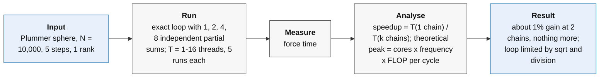

For each particle the force is a long sum: a_x = a_x + (contribution of source 1) + (contribution of source 2) + ... Each addition must wait for the previous one, forming a chain of dependent operations. A modern core could do several additions at the same time, but not if each one depends on the last. Splitting the sum into 2, 4 or 8 independent partial sums, for example one for the even and one for the odd sources, and adding them at the end removes this dependency. In the code the source loop is unrolled by hand into 1, 2, 4 or 8 independent sums (ax0, ax1, ...), and all of them are listed in the `reduction` clause of the `#pragma omp simd` of that loop.

The test uses the exact square-root loop with 1, 2, 4 and 8 partial sums ("chains"), 1 rank and 1 thread. The speedup is T(1 chain) / T(k chains).

| Chains | Median total (s) | Mean total (s) | Spread s (s) | Median force (s) | Speedup vs 1 chain |
|---:|---:|---:|---:|---:|---:|
| 1 | 2.620428 | 2.626081 | 0.013853 | 2.256599 | 1.0000 |
| 2 | 2.601374 | 2.601668 | 0.003138 | 2.233969 | 1.0073 |
| 4 | 2.602371 | 2.602451 | 0.002038 | 2.235518 | 1.0069 |
| 8 | 2.617220 | 2.616939 | 0.002793 | 2.248771 | 1.0012 |

The effect is tiny: two or four chains save about 0.7%, eight chains only 0.1%. The difference between two and four chains (0.001 s) is smaller than the run-to-run variation, so there is at best a plateau at two to four chains. All variants give the same energy drift.

The gain is small because the chain of additions matters only if the additions are the slowest part of each iteration. In the exact loop every pair also needs a square root and a division, which are much slower and must finish before the addition can start. As long as the square root dominates, independent additions cannot help much. The partial sums should matter more once the square root is cheap, but the fast AVX-512 loop uses its own vector accumulators and ignores this setting, so the combination could not be tested. With more chains, extra registers are needed and the final combination costs a little, which fits with eight chains being slightly worse than four.

To see if the picture changes with several cores, the test was repeated with 2, 4, 8 and 16 threads. The table shows the median force time for each number of chains:

| Threads | 1 chain (s) | 2 chains (s) | 4 chains (s) | 8 chains (s) | Best gain vs 1 chain |
|---:|---:|---:|---:|---:|---:|
| 1 | 2.2566 | 2.2340 | 2.2355 | 2.2488 | 1.0% (2 chains) |
| 2 | 1.1274 | 1.1165 | 1.1174 | 1.1240 | 1.0% (2 chains) |
| 4 | 0.5638 | 0.5581 | 0.5588 | 0.5621 | 1.0% (2 chains) |
| 8 | 0.2828 | 0.2799 | 0.2800 | 0.2819 | 1.0% (2 chains) |
| 16 | 0.1420 | 0.1406 | 0.1412 | 0.1416 | 1.0% (2 chains) |

The result is the same at every thread count: two chains give about 1% and more chains give nothing more, with eight chains always slightly worse than two or four. The gain saturates immediately, at two chains, because the loop is limited by the square root and the division, not by the chain of additions.

The exercise also asks what sets the peak floating-point speed of one socket. The fastest arithmetic instruction is the fused multiply-add (FMA), which computes a x b + c in one step and counts as two operations. On the Zen 4 cores of the EPYC 9374F each core can issue two FMA instructions per cycle, each working on 4 double-precision numbers (Zen 4 executes 512-bit AVX-512 instructions as two 256-bit halves, so the width must not be counted twice). That gives 2 x 4 x 2 = 16 operations per cycle per core. For one socket at the 3.85 GHz base frequency:

```text
peak FP64 = cores x frequency x operations per cycle
          = 32 x 3.85e9 x 16 = 1.97 TFLOP/s
```

This is a theoretical ceiling that only a program made entirely of independent FMAs could approach. Our force loop also contains square roots, divisions, loads and dependent sums, and its exact form is not vectorised, so it reaches only a fraction of this. We report pairs per second rather than FLOP/s, because converting one into the other requires deciding how many operations a square root "counts" for, and this differs between the exact and approximate versions. The 16.3 Gpairs/s of the mapping experiment refer to the whole node (two sockets), not to one socket.

---

## AoS versus SoA

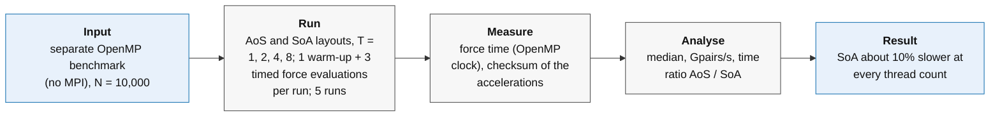

There are two natural ways to store particles. The array of structures (AoS) keeps all data of one particle together: {x, y, z, vx, vy, vz, m}, then the next particle, and so on. The structure of arrays (SoA) keeps one array for all x values, one for all y values, and so on. SoA is usually recommended for vector instructions, because consecutive x values are next to each other in memory and can be loaded into a vector register in one go. The exercise calls AoS a "vectorisation killer" and asks to measure the difference.

A separate small benchmark computes the same forces with both layouts. In both layouts the loop over the target particles uses `#pragma omp parallel for schedule(static)`. The SoA version also puts `#pragma omp simd reduction(+ : ax, ay, az)` on the loop over the sources; the AoS version has no `simd` pragma. N = 10,000; 1, 2, 4 and 8 threads; exact square root; each run does one warm-up and then three timed force evaluations; five runs per layout and thread count. Only the force computation is timed, with the OpenMP clock. It was built with the same compiler and flags as the solver. At the end the program prints a checksum, the sum of all acceleration components. This is only a weak check: by Newton's third law the forces between pairs cancel, so the total is close to zero (about 8.5e-10 here) whatever the single forces are. Equal checksums exclude gross errors, such as missing particles or invalid numbers, but do not prove that the two layouts compute identical forces; a sum of absolute values, or a direct element-by-element comparison, would be needed for that.

| Layout | N | Threads | Median force time (s) | Median Gpairs/s | Checksum difference vs AoS |
|---|---:|---:|---:|---:|---|
| AoS | 10000 | 1 | 1.010227 | 0.297 | baseline |
| SoA | 10000 | 1 | 1.129805 | 0.266 | 0.0 |
| AoS | 10000 | 2 | 0.509064 | 0.589 | baseline |
| SoA | 10000 | 2 | 0.565051 | 0.531 | 0.0 |
| AoS | 10000 | 4 | 0.254240 | 1.180 | baseline |
| SoA | 10000 | 4 | 0.282475 | 1.062 | 0.0 |
| AoS | 10000 | 8 | 0.130199 | 2.304 | baseline |
| SoA | 10000 | 8 | 0.143438 | 2.091 | 0.0 |

<p align="center"></p>

_Against the usual expectation, the SoA layout is about 10% slower than AoS at every thread count. The two layouts give the same checksum, which excludes gross errors but does not prove identical forces._

With the time ratio T(AoS) / T(SoA) = 0.89-0.91, SoA takes about 10-12% more time in this benchmark, and the gap is the same at every thread count. The textbook advantage of SoA appears only if the compiler really turns the loop into vector instructions. When it does not, and the loop processes one pair at a time, SoA has no special advantage. A likely reason why it is even a little slower is that reading x, y and z of one particle from three different arrays uses three separate memory streams instead of one block. With only 10,000 particles all data fit easily in the caches, so memory bandwidth is not a limit either.

The compiler can report which loops it vectorised (`-fopt-info-vec`). The reports show that several loops are vectorised, while at least one of the force loops is reported as not vectorised because of branches inside it ("unsupported control flow"). So the `#pragma omp simd` is only a request: the compiler can refuse it. This fits the layout result, and the large gain of the approximate square root once the loop is vectorised by hand. To prove the explanation, however, one would need hardware counters of the vector instructions actually executed (for example `fp_arith_inst_retired.512b_packed_double`), with `perf` or PAPI. We checked on the Orfeo login node: `perf` is not installed, and no PAPI module or command is available:

```text
command -v perf                      -> not found
module avail papi                    -> No module(s) or extension(s) found!
command -v papi_avail papi_native_avail -> not found
```

This shows that the tools are missing in the environment we checked: as a result this report has no measured instruction counts, cache misses or branch misses.

---

## Compiling for this exact processor or for any modern processor

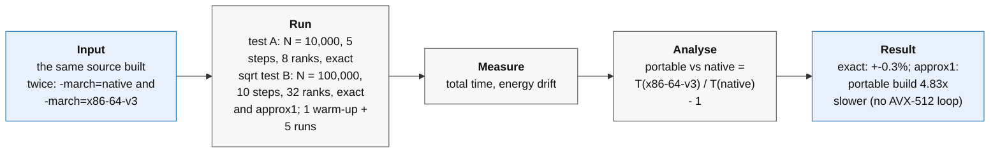

The option `-march=native` lets the compiler use every instruction of the build machine, including AVX-512 (8 doubles per vector). The option `-march=x86-64-v3` targets a common baseline supported by most processors of the last decade, with AVX2 (4 doubles per vector) but without AVX-512. The container uses the portable option, so we want to know how much performance it loses. The last column of the table is:

```text
portable vs native = T(x86-64-v3) / T(native) - 1
```

The same solver was built both ways and compared in two tests. A first short test used N = 10,000, 5 steps, 8 ranks with one thread each and the exact square root. Because it was very short and used only the exact square root, the comparison was repeated on a larger problem, N = 100,000, 10 steps, 32 ranks with one thread each, both with the exact square root and with the fast approximate one (one correction step). In the larger test each target has one warm-up and five measured runs; all runs of both tests have status OK.

| Test | Square root | native median ± s (s) | x86-64-v3 median ± s (s) | Portable vs native |
|---|---|---:|---:|---:|
| N = 10,000, 5 steps, 8 ranks | exact | 0.385524 ± 0.002109 | 0.384304 ± 0.006533 | -0.3% |
| N = 100,000, 10 steps, 32 ranks | exact | 15.010416 ± 0.106892 | 15.061305 ± 0.011998 | +0.3% |
| N = 100,000, 10 steps, 32 ranks | approximate (approx1) | 3.723728 ± 0.005836 | 17.980670 ± 0.006151 | +383% (4.83 times slower) |

The two results look contradictory at first, but they tell one story.

With the exact square root the two builds are equally fast, within 0.3% and within the spread, for both problem sizes. This is not a general statement about AVX-512: in the exact version both builds run the ordinary loop, which the compiler does not turn into vector code anyway, so the wider AVX-512 vectors have nothing to improve.

With the approximate square root the difference is huge: the portable build is 4.8 times slower. The portable build with the "fast" approximation is even 19% slower than the portable build with the exact square root (17.98 s against 15.06 s). The speed of the approximate option comes entirely from the hand-written AVX-512 loop, which processes eight pairs at once. This loop exists only when the compiler targets AVX-512, as in the native build. In the portable build it is replaced by a simple one-pair-at-a-time version that starts from a single-precision estimate and adds correction steps, and that version is more expensive than the exact square root.

In theory, going from 4 to 8 doubles per vector could at most double the speed of a perfectly vectorised loop, and on Zen 4, which executes AVX-512 as two 256-bit halves, the real gain would be smaller. We do not measure this factor of 2, because the portable build has no AVX2 vector version of the fast loop at all: the comparison is between a hand-vectorised loop and a scalar one. For the exact version the loss is zero; for the fast version it is almost a factor of 5. A portable build that wanted to keep the benefit would need its own AVX2 version of the vector loop, chosen at run time according to the processor. The energy drift is consistent with both builds computing the same physics: the exact runs agree to all printed digits, and the approximate runs differ by only about 3e-12, the same small approximation error seen in the time-step study.

---

## Hiding communication behind computation

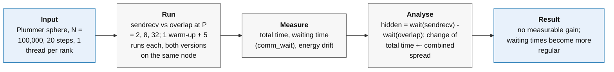

In the blocking ring, each rank computes, stops to exchange its block with `MPI_Sendrecv`, and then computes again. The time spent waiting for messages is lost. The overlapped version starts the exchange of the next block with `MPI_Irecv` and `MPI_Isend` before computing the current one, so that ideally the message travels in the background while the processor is busy, and the next block has already arrived when the computation ends. The rank then calls `MPI_Waitall`.

We want to measure how much of the communication is really hidden; it is rarely as much as a simple estimate predicts. The waiting time (`comm_wait`) is the time spent inside the exchange call: `MPI_Sendrecv` for the blocking version, `MPI_Waitall` for the overlapped one. We compare the waiting time of the two versions:

```text
hidden time        = waiting time (blocking) - waiting time (overlapped)
fraction hidden    = hidden time / waiting time (blocking)
```

The set-up was:

- N = 100,000 particles, 20 time steps, P = 2, 8 and 32 ranks, one thread each;
- direct kernel, exact square root, four partial sums, double precision; energy computed only at the start and at the end;
- one warm-up and five measured runs for each version and each P;
- the two versions at the same P ran one after the other on the same node (P = 2 on genoa001, P = 8 on genoa003, P = 32 on genoa004), with the same executable, so each pair is a like-for-like comparison.

All 30 runs have status OK, and for each initial condition the energy drift is identical in the two versions, consistent with the overlapped exchange not changing the results (both versions add the blocks in the same order).

| P | Blocking total (s) | Overlapped total (s) | Overlapped / blocking | Blocking wait (s) | Overlapped wait (s) | Hidden (s) | Fraction hidden | Blocking wait as % of total |
|---:|---:|---:|---:|---:|---:|---:|---:|---:|
| 2 | 418.119 ± 0.701 | 417.872 ± 0.402 | 0.9994 | 0.435 ± 0.422 | 0.534 ± 0.111 | -0.098 | -22.6% | 0.10% |
| 8 | 106.249 ± 0.478 | 105.798 ± 0.410 | 0.9958 | 0.235 ± 0.389 | 0.188 ± 0.040 | 0.048 | 20.2% | 0.22% |
| 32 | 28.063 ± 0.390 | 27.967 ± 0.484 | 0.9966 | 0.507 ± 0.218 | 0.506 ± 0.007 | 0.002 | 0.3% | 1.81% |

Values are median ± spread s over five runs.

There is no measurable speedup. The overlapped version changes the total time by -0.06%, -0.42% and -0.34%, always less than the normal variation between runs. The force phase is also unchanged.

The "fraction hidden" is mostly noise. At 2 and 8 ranks waiting is only 0.1-0.2% of the run, and the blocking waiting time varies between runs as much as its own median. The apparent -23% and +20% are random fluctuations, not real losses or gains. At 32 ranks, where waiting grows to 1.8% of the total, the median waiting time is the same in both versions (0.507 s and 0.506 s): practically nothing is hidden.

What overlap does change is the regularity of the waiting time. With the blocking exchange some runs show occasional spikes of waiting (1.31 s at P = 2, 1.06 s at P = 8, 0.99 s at P = 32). With the overlapped exchange these spikes disappear, and the spread of the waiting time drops from 0.42 to 0.11 s, from 0.39 to 0.04 s, and from 0.22 to 0.007 s. Starting the exchange early absorbs occasional delays of a neighbour, but does not reduce the typical waiting.

The simple estimate of the transfer time fails badly. At 32 ranks each rank exchanges blocks of 3,125 particles, about 75 kB. Inside one node such a message should take a few tens of microseconds. Yet the measured waiting is about 0.75 ms per ring step (0.507 s divided by 21 force evaluations x 32 exchanges), more than ten times what the transfer alone needs. That is about 2% of the roughly 38 ms each rank spends computing per ring step. Two mechanisms explain why this time cannot be hidden:

1. Ranks wait for each other, not for data. The ring moves in lock-step: a rank cannot receive its next block before its neighbour has finished with it. If some cores are a little slower than others (different clock speeds, shared caches and memory, ranks on two sockets), the faster ranks wait at every exchange. Overlap can hide the travel time of a message, but not the time spent waiting for a slower neighbour to send it.
2. MPI moves large messages only when it is called. Small messages are sent immediately ("eager" protocol). Messages of tens of kilobytes use a "rendezvous" protocol: sender and receiver first agree, then the data moves. Without a background progress thread, Open MPI moves the data only while the program is inside an MPI call. In our overlapped loop the next MPI call after starting the exchange is the final `MPI_Waitall`, so much of the transfer still happens there. Calling `MPI_Test` from time to time during the computation, or enabling asynchronous progress, would be the next thing to try.

Even a perfect overlap could save at most the waiting time itself, which here is only 0.1-1.8% of the run. On one node this program is dominated by computation, so a small benefit was expected. Overlap would matter more with many more ranks, fewer particles per rank, or communication between nodes.

Two more details are visible in the raw data. Reading the input file varies from 0.04 to 1.04 s at 32 ranks, more than the effect of overlap itself, so the force time or the total minus input time are more reliable for this comparison. The energy check takes 6-8% of the total time in these runs.

---

# CLOUD PART

---

## Native versus container

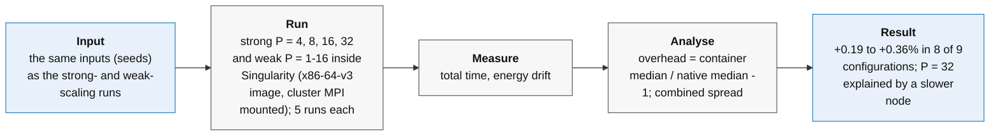

This is the main container test: does running the program inside Singularity make it slower? The N-body program is a good test case, because almost all its time is spent computing and communication is small. So a slowdown could not come from the network: it would have to come from the container itself, or from the different software inside it.

We ran the strong- and weak-scaling experiments inside Singularity with the same settings, the same inputs (the same seeds) and five repetitions per point:

- strong scaling: N = 100,000, 100 steps, P = 4, 8, 16, 32;
- weak scaling: 10,000 particles per rank, 100 steps, P = 1, 2, 4, 8, 16;
- one thread per rank.

The image was built from the same source code as the native executable, with the container's own compiler and the portable target x86-64-v3, and it uses the cluster's MPI library as described in the methods. The strong-scaling points with 1 and 2 ranks were not repeated in the container: each of their runs takes 30-64 minutes, and the overhead can be measured just as well on the shorter points, which all last more than half a minute. The native values are the runs of the strong- and weak-scaling experiments. All 45 container runs have status OK.

The times are the program's internal totals, so they do not include the start-up of the container, which is measured in the next section. The overhead is:

```text
overhead = 100 x (container median / native median - 1)      [%]
```

A positive value means the container is slower.

Strong scaling:

| P | N | Native median ± s (s) | Container median ± s (s) | Overhead |
|---:|---:|---:|---:|---:|
| 4 | 100000 | 960.53 ± 0.86 | 962.36 ± 1.31 | +0.19% |
| 8 | 100000 | 480.42 ± 1.01 | 481.46 ± 0.89 | +0.22% |
| 16 | 100000 | 240.56 ± 1.67 | 241.05 ± 1.17 | +0.20% |
| 32 | 100000 | 123.59 ± 0.02 | 120.94 ± 0.03 | -2.15% |

Weak scaling:

| P | N | Native median ± s (s) | Container median ± s (s) | Overhead |
|---:|---:|---:|---:|---:|
| 1 | 10000 | 38.11 ± 0.004 | 38.21 ± 0.01 | +0.27% |
| 2 | 20000 | 76.62 ± 0.03 | 76.84 ± 0.02 | +0.28% |
| 4 | 40000 | 153.42 ± 0.07 | 153.97 ± 0.07 | +0.36% |
| 8 | 80000 | 307.16 ± 0.72 | 308.26 ± 0.19 | +0.36% |
| 16 | 160000 | 614.90 ± 1.53 | 617.04 ± 1.61 | +0.35% |

In eight of the nine configurations the container is slower by 0.19-0.36%. The difference is small but systematic: in weak scaling it is larger than the run-to-run spread at every point. It is far below the 2-5% expected by the exercise for runs longer than about 30 seconds, so for this compute-bound program the container is essentially free. The container also computes the same results: for every initial condition the energy drift is identical in the native and in the container run.

The exercise asks to explain any non-zero overhead. The two environments differ in more than the container itself: the compiler (GCC 13.3 against 14.3), the OpenMP runtime and the compilation target (x86-64-v3 against native). The compilation-target experiment measured +0.3% between the two targets with the exact square root on 32 ranks, the same size as the difference measured here. So the small overhead is consistent with the different compilation, without any cost of Singularity itself; these measurements cannot separate the two effects.

The only exception is strong scaling at P = 32, where the container is 2.15% faster, about a hundred times the run-to-run spread. This is the node effect described in the strong-scaling section: the native 32-rank runs ran on genoa004, where the speed per rank at 32 ranks was about 2.5% lower, while the container runs ran on another node (genoa006). Measured against the native one-rank time, the container run at 32 ranks has an efficiency of 98.8%, in line with the other points. Running native and container alternately on the same node would remove this effect.

---

## Container start-up time

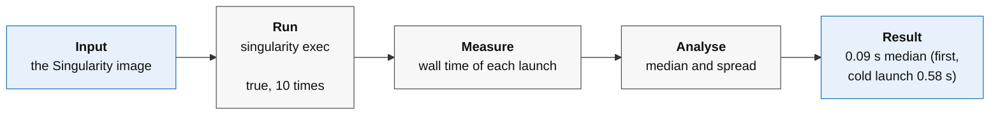

Before the program starts, Singularity has to open the image and set up the container. This is a fixed cost per launch: negligible for a long run, but it could dominate a very short test. We measured it by launching a container that does nothing (`singularity exec <image> true`) ten times.

| Repeat | Launch time (s) |
|---:|---:|
| 1 | 0.58 |
| 2 | 0.09 |
| 3 | 0.09 |
| 4 | 0.09 |
| 5 | 0.09 |
| 6 | 0.09 |
| 7 | 0.09 |
| 8 | 0.09 |
| 9 | 0.09 |
| 10 | 0.09 |

The median start-up time is 0.09 s (spread 0.155 s over all ten launches). The first launch took 0.58 s. We keep it in the statistics; it is probably a "cold start", when the image file is read from disk for the first time, after which it stays in memory and the other nine launches all take 0.09 s. The timer resolution was 0.01 s, so identical values do not mean that the start-up time is perfectly constant.

Compared with runs that last from tens of seconds to over an hour, 0.1 s is negligible, which is why it does not show up in the solver comparison.

---

## Communication inside the container

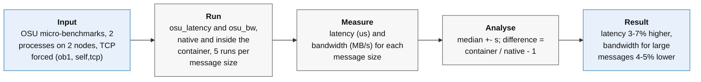

To look at communication alone, without computation, we used the OSU micro-benchmarks, a standard tool for measuring MPI performance between two processes:

- `osu_latency` measures the time for a message to go from one process to the other: the message is sent back and forth many times, and the latency is half of the average round-trip time;
- `osu_bw` measures how much data per second one process can stream to the other: bandwidth = bytes sent / time, in MB/s.

Both were run natively and inside the container, with two processes on two different nodes (`genoa012` and `genoa013`, confirmed by the Slurm accounting), five times for each message size. The same OSU executables and the same host MPI library were used in both cases (checked with `ldd`).

To make the two cases comparable, both used the same communication path, forced with `OMPI_MCA_pml=ob1` and `OMPI_MCA_btl=self,tcp`, that is ordinary TCP networking. This avoided the incompatible UCX library found in earlier attempts. These numbers are therefore TCP results, not the best that Orfeo's fastest network could give. The last column of the table is 100 x (container / native - 1).

| Benchmark | Message size (bytes) | Native median ± s | Container median ± s | Container difference |
|---|---:|---:|---:|---:|
| latency | 1 | 15.91 ± 0.556 us | 16.47 ± 0.493 us | +3.5% |
| latency | 1024 | 18.32 ± 0.591 us | 19.05 ± 0.500 us | +4.0% |
| latency | 1048576 | 356.32 ± 20.817 us | 365.52 ± 30.700 us | +2.6% |
| latency | 4194304 | 1109.62 ± 73.417 us | 1182.27 ± 44.455 us | +6.5% |
| bandwidth | 1 | 0.46 ± 0.011 MB/s | 0.46 ± 0.005 MB/s | +0.0% |
| bandwidth | 1024 | 369.16 ± 6.048 MB/s | 383.59 ± 1.683 MB/s | +3.9% |
| bandwidth | 1048576 | 3739.03 ± 82.883 MB/s | 3550.77 ± 183.128 MB/s | -5.0% |
| bandwidth | 4194304 | 3809.27 ± 213.087 MB/s | 3652.44 ± 162.964 MB/s | -4.1% |

For latency a positive difference means slower communication in the container; for bandwidth a negative difference means lower throughput.

<p align="center">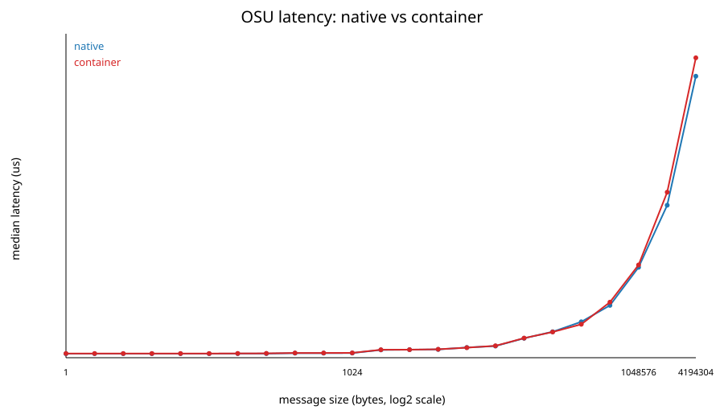 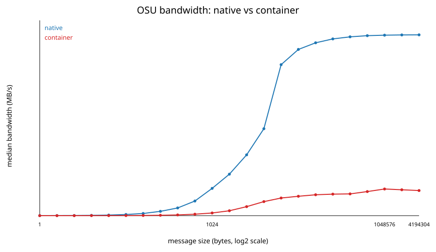</p>

_Left: latency inside the container is a few percent higher at all selected sizes. Right: for large messages the container reaches about 4-5% less bandwidth._

Communication through the container is a few percent slower: latency is 3-7% higher and the bandwidth for large messages 4-5% lower, differences similar to or a little larger than the run-to-run spread. The benchmark does not tell which layer is responsible. Because the N-body solver spends only a small fraction of its time communicating, a few percent slower communication gives a much smaller difference in total run time, consistent with the full-solver comparison.

---

## Limitations and conclusions

Conclusions on correctness and cost:

- The simulation is physically correct: the energy drift never exceeded about 5 parts in a million in the reported experiments, and a run of 2000 steps stayed below 1 part in a million.
- The drift is the same for the same input at every number of ranks, with both ring versions and inside the container.
- Halving the time step makes the energy error four times smaller, as expected for a second-order method.
- The cost grows with the square of the number of bodies: ten times more bodies took 100.3 times longer, against a theoretical 100.

Conclusions on performance and scaling:

- The program is limited by arithmetic, not by memory or communication: the force computation takes 90-99% of the time, and each core processes 0.25-0.27 billion pairs per second from 1 to 64 cores.
- Strong scaling on one node is almost ideal: 32 ranks are 30.9 times faster than one (97% efficiency, above 99% up to 16 ranks).
- Weak scaling is almost ideal too: the work-normalised efficiency stays above 99% up to 16 ranks.
- The small losses come from the energy check, which divides its work unevenly among the ranks, and at 32 ranks from slower cores on one node.
- The way the 64 cores are split between ranks and threads changes the run time by at most 2%.

Conclusions on the optimisations:

- Newton's third law saves about a third of the force time on one core, but it is slower than the direct kernel from four threads on (65% slower with sixteen), because computing each pair once gives some threads much more work than others.
- The approximate square root with hand-written AVX-512 code makes the force computation about eight times faster at every thread count, with a negligible effect on energy conservation: with two correction steps the drift is identical to the exact one, with one step the extra drift is thousands of times below the error of the method.
- In a portable build without AVX-512 the same option loses its vector loop and becomes almost five times slower, even slower than the exact square root.
- Independent partial sums give about 1%, and the structure-of-arrays layout gives no gain, because the loop is limited by the square root and the division and is not vectorised by the compiler.
- Overlapping communication with computation does not reduce the run time, because communication is only 0.1-2% of it, but it makes the waiting times more regular.

Conclusions on the container:

- The full simulation in Singularity is 0.2-0.4% slower than the native one in eight of nine configurations; the ninth is explained by a slower node.
- The small overhead has the same size as the difference between the two compilation targets, so it is consistent with the different compilation rather than with a cost of Singularity itself.
- Starting the container takes about 0.1 s, and pure communication is only a few percent slower, once the container uses the cluster's own MPI library.

Limitations:

- All solver runs used a single node, so the effect of a real network between nodes is not measured; only the OSU test crosses two nodes, and it uses TCP.
- No hardware counters (`perf`, PAPI) were available, so what we say about vector instructions and caches is based on timings, the phase timers and compiler reports, not on counted events.
- The energy drift is a single global number: it shows that energy conservation is equally good with the approximate square root, but it cannot prove that the trajectories are identical.
- The energy check and the Newton kernel have a load imbalance that was measured and explained but not fixed.
- Some runs of the same experiment ran on different nodes, and one node was a few percent slower at 32 ranks.

Next steps:

- Balance the work of the energy check and of the Newton kernel.
- Give the portable build its own AVX2 vector loop, chosen at run time.
- Compare the final positions of the exact and approximate runs directly.
- Check with hardware counters that the processor really executes the expected vector instructions.
- Repeat the scaling and container tests on several nodes.
