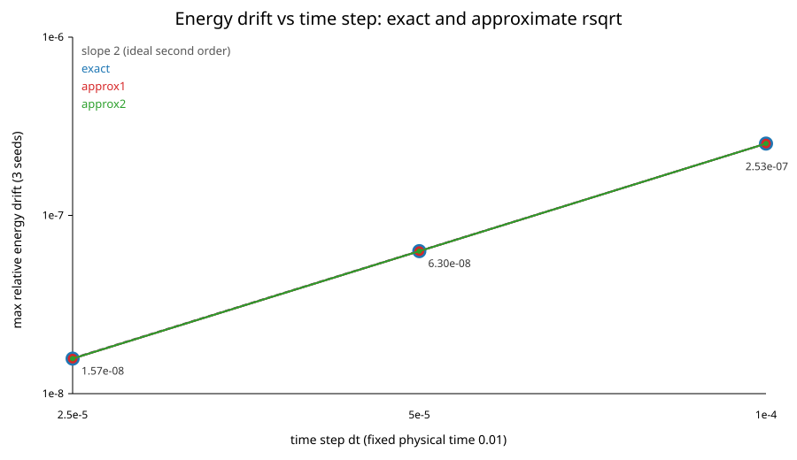
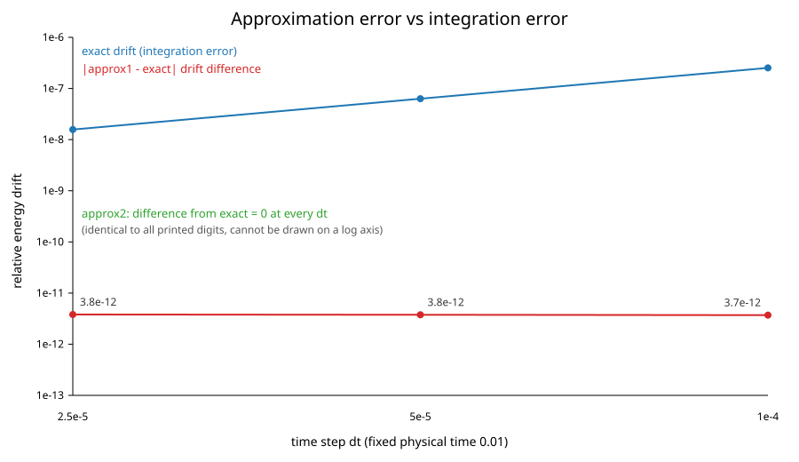
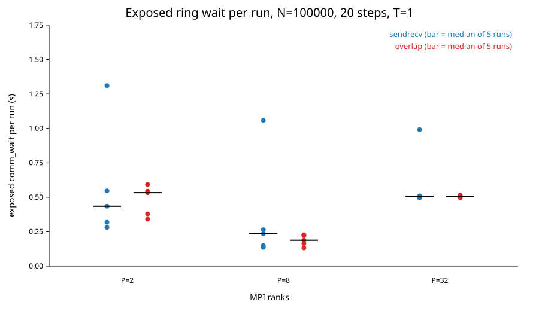
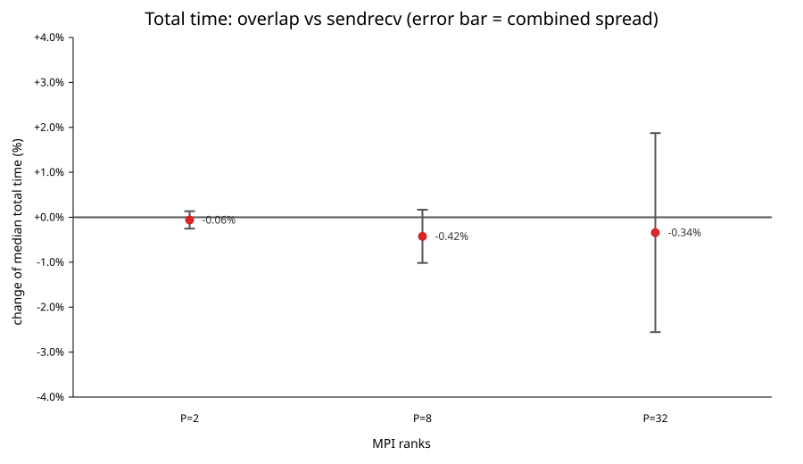
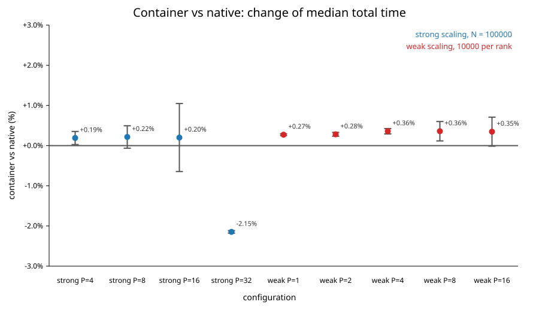

# Exercise 1 - Direct N-body gravitational simulation

High Performance Computing exam

Dariol Emma - SM3800118

---

This report is about a computer program that simulates how a group of bodies, for example the stars of a cluster, move because of their gravity. The program runs in parallel on many processor cores at the same time. The goal of the work is not only to make the program fast. The goal is also to understand why it is fast or slow, and to check that it still gives correct physical results when it uses many cores and a test of the same program inside a software container. All the measurements were done on the Orfeo cluster of Area Science Park, on its GENOA nodes. The exercise mentions the LEONARDO supercomputer, but it was not available for these runs, so the whole work was done on Orfeo with the same methods.

The physical problem is simple to describe. We have N particles in empty space, and each particle pulls every other particle with the force of gravity. If we know where the particles are and how fast they move at the beginning, we want to know where they will be later. With more than two bodies there is no simple formula for this, so the program moves forward in many small time steps. At every step it computes the total pull on each particle and then moves all the particles a little. The difficult part is that every particle interacts with every other particle. With N particles there are about N times N pairs to compute at each step, so if we double the number of particles, each step becomes about four times more expensive. This is called an O(N^2) cost. There are faster methods that use approximations, like tree codes, but the exercise asks for the direct method on purpose, because its simple and regular structure makes the effect of parallel programming and of low-level optimisations easy to see. The acceleration of particle i is computed with this formula, where we use G = 1 and all masses equal to 1:

```text
a_i = sum over all j != i of  G m_j (r_j - r_i) / (|r_j - r_i|^2 + epsilon^2)^(3/2)
```

The small number epsilon in the formula is called the softening length, and it needs a short explanation. In pure Newtonian gravity the force between two particles becomes infinite when they get very close, and in a simulation this creates huge and unrealistic jumps. Adding epsilon to the distance keeps the force finite. This is not a hidden trick: it really changes the physics. When two particles are far apart compared with epsilon, the force is almost exactly Newton's force. When they are very close, the force becomes weak and goes to zero at zero distance, as if every particle were a small soft ball of size epsilon instead of a point. A good value of epsilon is related to the typical distance between neighbouring particles, which is about (volume / N)^(1/3). If epsilon is much smaller than this distance, close meetings between particles are very sharp and need very small time steps. If epsilon is much larger, the small details of the system are smoothed away. For example, if we put ten times more particles in the same volume, the typical distance becomes about 0.46 times the old one, so the same epsilon becomes about 2.15 times larger compared with that distance. Epsilon does not change the number of pairs to compute, but a larger epsilon makes the motion smoother and can allow a larger time step, so fewer steps are needed for the same physical time. Our program does not change the time step by itself. In all experiments we use epsilon = 0.05 and a time step dt = 1e-4, always the same, so that every run simulates the same physics. These values give a stable simulation for our inputs, but we do not claim that they are the best physical choice.

Every run starts from a Plummer sphere. This is a classic model of a spherical star cluster in balance: it is dense in the centre and thinner towards the edge, and the velocities are chosen so that the cluster neither collapses nor explodes. A small separate program creates the starting positions and velocities from a random seed. The different repetitions of a benchmark use different seeds, so the spread of our timings also contains small differences between inputs.

To move the particles forward in time we use the leapfrog method in its Kick-Drift-Kick form. In each step the program first changes the velocities with half a step of the current acceleration (a "kick"), then moves the particles for a full step with these velocities (a "drift"), then computes the new accelerations at the new positions, which is the expensive part, and finally gives a second half kick with the new accelerations. This method is simple and needs only one force computation per step. It also has a very useful property: it is symplectic. In practice this means that the energy does not slowly drift up or down during a long simulation; it only oscillates a little around the correct value.

This property is the reason why we use energy to check correctness. A group of particles that only attract each other must keep its total energy E = T + U constant, where T is the energy of motion and U is the gravitational energy, computed with the same softening as the forces. If the program had a bug, for example a missing interaction or a wrong message between processes, the energy would usually change a lot. So the program computes the total energy at the start and at regular times during the run, and it reports the largest relative change, |E(t) - E(0)| / |E(0)|, which we call the energy drift. A run is marked OK only if the drift stays below 1e-4, which is stricter than the 1e-3 suggested by the exercise. This check does not depend on time measurements, so it tells us whether a faster version is still a correct version. We must remember two limits of this check: the energy is checked only at the sampled times and not at every moment, and computing the energy costs as much as computing the forces, so in performance runs it cannot be done very often.

One processor core needs about an hour to simulate 100 steps of 100,000 particles, so the work is split among many cores using two tools. The first tool is MPI. MPI starts several independent copies of the program, called ranks or processes. Each rank has its own memory and cannot see the data of the others; if it needs something, it must receive it as a message. We divide the N particles into P equal groups, one for each rank, and each rank owns its group, its "home" particles, for the whole run. When N cannot be divided exactly by P, the first ranks get one extra particle. The problem is that to compute the forces on its home particles a rank needs the positions of all the particles. Instead of sending everything to everybody, the ranks are placed in a circle, a "ring". Each rank holds one travelling block of particles. At every ring step each rank computes the forces between its home particles and the block it holds, then passes the block to its neighbour on one side and receives a new block from the neighbour on the other side. After P steps every block has visited every rank, and every rank has the complete force on its home particles. With four ranks, for example, rank 0 holds block 0 at the first step, then block 3, then block 2, then block 1, and all the other ranks do the same with shifted blocks. Only the positions travel around the ring. The home particles never move to another rank, so nobody else ever writes their forces, and no final combination of results is needed.

The exchange of blocks can be done in two ways, and both are in the program. In the blocking version, called `sendrecv`, each rank computes with its current block, then stops and exchanges it with `MPI_Sendrecv`, so it stays idle while the message travels. In the overlapped version, called `overlap`, each rank first starts sending the current block and receiving the next one with `MPI_Isend` and `MPI_Irecv`, then computes, and only at the end waits for the exchange to finish with `MPI_Waitall`. In the best case the message travels while the rank is busy, and the waiting time disappears. One of the experiments measures how much of this best case really happens.

The second tool is OpenMP. Inside each rank, OpenMP starts several threads that share the same memory, and the force loop is divided so that each thread takes care of different home particles. Because each thread only writes the forces of its own particles, two threads never write to the same place, and no locks are needed. This is the "accumulator pattern" mentioned in the exercise: each thread keeps its own sums. The two tools can be used together, with P ranks and T threads per rank, which gives P times T cores in total. In this report N is the total number of particles, P the number of MPI ranks and T the number of threads per rank. How to divide a given number of cores between ranks and threads is not obvious: ranks pay for communication, threads pay for sharing memory and caches. For this reason one experiment compares different choices on the same 64 cores.

Several smaller design choices sit behind this general scheme, and each of them has a reason. The particle data are stored as a *structure of arrays*: one array for all x positions, one for all y positions, and so on, instead of one record per particle. The force loop only needs the positions, so this layout lets it read just the data it uses, and it lets the ring send the positions as three plain arrays without any packing. The arrays are allocated with 64-byte alignment, the size of one AVX-512 register, so that vector instructions can load them efficiently. The input file is read with MPI's parallel file functions (`MPI_File_read_at_all`): every rank reads only its own block of particles directly from the shared file, so no single process ever has to hold the whole system in memory. The final state, when it is requested, is collected on rank 0 with `MPI_Gatherv`, which also handles blocks of unequal size.

The ring was chosen instead of the simpler alternative of sending every particle to every rank at each step (for example with `MPI_Allgather`). Both approaches move the same amount of data per rank, but with the ring each rank only needs memory for its own block and one travelling block, not for all N particles, and the exchange happens in P small steps that can be overlapped with computation. Only the three position arrays travel: velocities and accelerations always stay with their owner.

Inside the force loop, the interaction of a particle with itself does not need a special test. Because of the softening, the distance of a particle from itself becomes epsilon instead of zero, and the displacement is exactly zero, so its contribution to the force is exactly zero. Removing the self-interaction test keeps the loop simple and friendlier to the compiler. The loop is divided among the OpenMP threads in equal consecutive blocks (`schedule(static)`). This is the best choice here because every target particle costs exactly the same, since it always visits all the sources, so equal blocks mean equal work and no scheduling overhead. Two experiments show what happens when this is not true.

All physics is computed in double precision, while the input file stores single-precision numbers to keep it small. The energy check adds up its many small terms in `long double`, an extended precision, and always uses the exact square root, so that the correctness check is as accurate as possible and is never affected by the optimisations being tested. The partial sums of the ranks are combined with `MPI_Allreduce`.

Finally, the program has a few switches that select the variants studied in the experiments: the blocking or overlapped ring, the direct kernel or the one based on Newton's third law, the exact or approximate square root, and the number of independent partial sums (1, 2, 4 or 8). The production configuration is the direct kernel with the exact square root and four partial sums. It was chosen because it needs no synchronisation between threads, scales well, and gives results that do not depend on approximations; the other variants are there to be measured against it. The hand-written AVX-512 routine for the approximate square root is compiled only when the compiler targets a processor with AVX-512, and it is used only when an approximate option is selected.

All benchmarks are driven by the same small set of scripts. A driver script runs every configuration the requested number of times, with optional warm-up runs, and appends one line per run to a CSV file with the configuration, the timers, the energy drift and the status. A Slurm wrapper submits these drivers as jobs with the right account, partition, modules and binding settings. A Python script then turns the raw CSV files into the medians, standard deviations, speedups and figures shown in this report. Keeping every single run in the raw files, and computing the statistics afterwards, means that every number in the report can be checked and recomputed.

To understand where the time goes, the program measures itself with the MPI clock, `MPI_Wtime()`. Each rank records how long it spends reading the input (`io`), computing forces (`force`), waiting for ring messages (`comm_wait`, which is already part of `force`), moving the particles (`kick` and `drift`) and computing the energy (`energy`). The `total` time goes from reading the input to the end of the simulation, and it does not include the start of the program and of MPI. At the end, for each phase the largest value among all ranks is reported, because the slowest rank decides when the job ends. Different phases can be slowest on different ranks, so the phases do not have to add up exactly to the total. From the force time the program also computes a throughput: how many billions of particle pairs it processes per second (Gpairs/s). This is a useful "speedometer" for the main computation, but it is not the same thing as floating-point operations per second.

All runs used GENOA nodes of Orfeo. Each node has two processors, called sockets, with 32 cores each, so 64 cores in total. The memory of a node is divided into 8 regions called NUMA domains, with 8 cores each. A core reads the memory of its own region faster than the memory of the other regions, and the memory attached to the other socket is the slowest. This matters when we decide where to place ranks and threads. The details are in the two tables below; they come from the `lscpu` and `numactl -H` output collected on a compute node.

| Item | Value |
|---|---|
| Nodes used | GENOA nodes `genoa001` to `genoa007` (one node per job; two nodes for the OSU test) |
| CPU | AMD EPYC 9374F 32-Core Processor (Zen 4) |
| Sockets | 2 |
| Cores per socket | 32 |
| Hardware threads | 1 per core (SMT off) |
| Total CPUs | 64 |
| NUMA domains | 8, with 8 cores each (CPUs 0-7, 8-15, ..., 56-63) |
| NUMA distances (`numactl -H`) | 10 inside a domain, 12 between domains of the same socket, 32 across sockets |
| Memory | 503 GiB (about 478 GiB available at measurement time), no swap |
| Vector instructions | AVX2 and AVX-512 supported |
| Operating system kernel | Linux 6.13.12-200.fc41 |

| Component | Version |
|---|---|
| C compiler | GCC 14.3.1 (Red Hat 14.3.1-4) |
| MPI | Open MPI 4.1.6rc4 (module `openMPI/4.1.6`) |
| OpenMP runtime | GNU libgomp, package `libgomp-14.3.1-4.fc41` |
| Other libraries | libm, hwloc 2.12.0; no BLAS or other numerical library |
| Container runtime | SingularityCE 4.3.1 |

The normal (native) program is compiled with the command below. In simple words, this means: the C11 language standard, calculations in double precision, strong optimisation by the compiler (`-O3`), instructions chosen for the exact processor of the machine that builds the program (`-march=native`, which here includes AVX-512), all compiler warnings turned on, and OpenMP turned on. No profile-guided optimisation is used. Forces, movement and energy are computed in double precision, while the input file stores positions and velocities in single precision.

```sh
mpicc -std=c11 -DNBODY_USE_DOUBLE -O3 -march=native -Wall -Wextra -Wpedantic -fopenmp -o nbody_direct_hybrid nbody_direct_hybrid.c -lm
```

This main program is used for almost all the experiments: energy conservation, the cost of the energy check, strong and weak scaling, the rank/thread mapping, Newton's third law, the square-root and partial-sum tests, the time-step study, the overlap test and the native side of the container comparison. A few other small programs are needed for the other tests, and all of them are built on a GENOA compute node, after loading the cluster MPI with `module purge; module load openMPI/4.1.6`, so that `-march=native` sees the real processor of the compute nodes and not the one of the login node. The initial conditions are created by a small serial generator, and the memory-layout test uses a separate OpenMP program without MPI, so that communication cannot disturb the comparison between the two layouts. The vectorisation reports are produced by compiling the same sources with two extra GCC options that print which loops were turned into vector code and which were not. For the compilation-target test the main program is built twice, changing only the `-march` option. The memory-bandwidth test is a small STREAM-like OpenMP program, which must be compiled with `-fopenmp`, otherwise it would run on a single thread. The commands are:

```sh
# initial-condition generator (Plummer sphere)
gcc -std=c11 -DNBODY_USE_DOUBLE -O3 -march=native -Wall -Wextra -Wpedantic -o generate_ic generate_ic.c -lm

# memory-layout test (AoS versus SoA), OpenMP only
gcc -std=c11 -DNBODY_USE_DOUBLE -O3 -march=native -Wall -Wextra -Wpedantic -fopenmp -o nbody_layout_benchmark nbody_layout_benchmark.c -lm

# vectorisation reports (compile only, the report goes to standard error)
gcc   -std=c11 -DNBODY_USE_DOUBLE -O3 -march=native -Wall -Wextra -Wpedantic -fopenmp -fopt-info-vec-optimized -fopt-info-vec-missed -c nbody_direct_serial.c -o /tmp/serial.o 2> vectorization_serial_report.txt
mpicc -std=c11 -DNBODY_USE_DOUBLE -O3 -march=native -Wall -Wextra -Wpedantic -fopenmp -fopt-info-vec-optimized -fopt-info-vec-missed -c nbody_direct_hybrid.c -o /tmp/hybrid.o 2> vectorization_report.txt

# compilation-target test: the same solver built for two targets
mpicc -std=c11 -DNBODY_USE_DOUBLE -O3 -Wall -Wextra -Wpedantic -march=native    -fopenmp -o nbody_direct_hybrid nbody_direct_hybrid.c -lm
mpicc -std=c11 -DNBODY_USE_DOUBLE -O3 -Wall -Wextra -Wpedantic -march=x86-64-v3 -fopenmp -o nbody_direct_hybrid nbody_direct_hybrid.c -lm

# memory-bandwidth test (STREAM-like)
gcc -std=c11 -O3 -march=native -Wall -Wextra -Wpedantic -fopenmp -o memory_bandwidth memory_bandwidth.c -lm

# OSU micro-benchmarks for the native MPI test, built in user space with the cluster MPI
./configure CC=mpicc --prefix=$HOME/osu && make -j && make install
```

The code was compiled more than once during the work, and this matters when we compare numbers. A first build produced four smaller tests: the cost of the energy check, the memory-layout test, the memory-bandwidth test and the first, short compilation-target test. All the other experiments, including strong and weak scaling and the native-versus-container comparison, used the current build, the one described in this report. The two builds do not have the same speed, so absolute times and throughputs should only be compared inside the same experiment.

The programs are started with Slurm (`srun`). Each rank is fixed to its own cores with `srun --cpu-bind=verbose,cores`, and inside each rank the threads are fixed with `OMP_PLACES=cores` and `OMP_PROC_BIND=spread`. Fixing processes and threads to cores stops the operating system from moving them around during the run, which would make the timings noisy and could move a thread away from its memory. The `verbose` option prints the real CPU mask of every rank, so we check the placement instead of only asking for it. This is our equivalent of the `MPI_BIND` setting mentioned in the exercise.

The container version of the program needs some more explanation, because it is not just a copy of the native one. A container packs a program together with everything it needs, such as system libraries and the compiler runtime, so that the same package can run on another machine without installing anything. Docker is the most common tool, but it is usually not allowed on shared supercomputers, so HPC centres use Singularity, which can run images made with Docker. Our Docker recipe starts from a standard Ubuntu 24.04 image, installs the compiler, the OpenMPI development packages, the OSU micro-benchmarks (version 7.5.2) and our source code, and compiles the program inside the image. The image was sent to Docker Hub and converted on Orfeo into a Singularity image file. We chose Ubuntu 24.04 and not 22.04 because the Orfeo MPI libraries need a C library at least as new as glibc 2.38: Ubuntu 22.04 has glibc 2.35, and an early image without glibc 2.38 could not load the cluster MPI, while Ubuntu 24.04 has glibc 2.39 and works. We chose a plain Ubuntu image and not a vendor HPC image because a vendor image brings GPU libraries and a different MPI that this CPU-only program does not need, and it would make it less clear which MPI is really used. OpenMPI is installed inside the image because the `mpicc` compiler wrapper and the MPI header files are needed to build the program, but at run time the cluster's own MPI library replaces it. This is the key point for MPI programs in containers: MPI must talk to the cluster's launcher and network, which the container does not know, so the program is built with the container's MPI and run with the cluster's MPI, mounted inside the container. Finally, the container program is compiled with `-march=x86-64-v3` instead of `-march=native`, because the image should run on other machines too. With `native` it would only work on processors like the one that built it, while `x86-64-v3` (AVX2 without AVX-512) runs on almost every recent x86 server. The price is that AVX-512 is not used, and one experiment looks at this cost. The container build command, checked with `make -nB` inside the image, is:

```sh
mpicc -std=c11 -DNBODY_USE_DOUBLE -O3 -march=x86-64-v3 -Wall -Wextra -Wpedantic -fopenmp -o nbody_direct_hybrid nbody_direct_hybrid.c -lm
```

The image itself is built with Docker on a personal computer, sent to Docker Hub, and then converted into a Singularity image on Orfeo. The recipe uses `x86-64-v3` as its default target, and inside the image the OSU micro-benchmarks are compiled with the image's `mpicc`, in the same way as the native ones. The commands are:

```sh
# on a personal computer
docker build -t memid01/nbody-hpc:latest .
docker push memid01/nbody-hpc:latest

# on Orfeo
module load singularity/4.3.1
singularity pull --force nbody.sif docker://memid01/nbody-hpc:latest
```

So the native and the container environments are not identical, and it is honest to say it clearly. The table below lists the differences.

| Component | Native | Container |
|---|---|---|
| Build environment | Orfeo (Fedora 41 based) | Ubuntu 24.04.5 LTS |
| Compiler | GCC 14.3.1 | GCC 13.3.0 |
| Compilation target | `-march=native` (AVX-512) | `-march=x86-64-v3` (AVX2) |
| MPI used to build | Orfeo Open MPI 4.1.6rc4 | Ubuntu OpenMPI 4.1.6-7ubuntu2 |
| MPI used to run | Orfeo Open MPI 4.1.6rc4 | the same Orfeo Open MPI, mounted into the image |
| OpenMP runtime | libgomp 14.3.1 (Orfeo) | libgomp 14.2.0 (Ubuntu) |
| Other libraries | libm, hwloc 2.12.0 | Ubuntu glibc 2.39 and libm, Orfeo hwloc 2.12.0 |

The cluster's MPI and hwloc folders are mounted inside the container with `SINGULARITY_BINDPATH`, and `SINGULARITYENV_LD_LIBRARY_PATH` tells the program to look for libraries there first:

```sh
export SINGULARITY_BINDPATH=/opt/programs/openMPI/4.1.6:/opt/programs/openMPI/4.1.6,/opt/programs/hwloc/2.12.0:/opt/programs/hwloc/2.12.0
export SINGULARITYENV_LD_LIBRARY_PATH=/opt/programs/openMPI/4.1.6/lib:/opt/programs/hwloc/2.12.0/lib
```

As the exercise asks, we checked the result with `ldd`, which lists the libraries a program really loads. Inside the container the program loads `libmpi.so.40`, `libopen-rte.so.40` and `libopen-pal.so.40` from `/opt/programs/openMPI/4.1.6/lib` and `libhwloc.so.15` from `/opt/programs/hwloc/2.12.0/lib`, which are exactly the same files used by the native program, while OpenMP (`libgomp.so.1`) comes from the image. If the container had silently used its own MPI, runs on several nodes could fail or use slow communication without any clear error. Getting to this point was not easy, and the problems teach something. The first images failed because they did not have glibc 2.38, and later a part of the cluster MPI loaded an incompatible version of the UCX communication library from the image. Some early tests worked with small messages and failed with large ones, so a correct check must include real transfers of different sizes, not only a list of libraries. If we used the same image on another cluster, for example one with InfiniBand, the program and the image could stay the same, but the MPI library paths, the mounted folders and the network settings would have to be changed and checked again. The ring algorithm itself needs no change, but some shared-memory shortcuts that MPI uses inside a node can be limited in containers, which is one more reason to check instead of assuming.

The last thing to explain before the experiments is how we measure. On a shared cluster one single time measurement is never fully reliable, because other jobs, the operating system and the processor's own frequency changes add small random differences. So we follow the same rules everywhere. Unless an experiment says otherwise, every configuration is run five times, and we report the median, which is the middle value when the five runs are sorted; unlike the average, the median is not moved much by one unusually slow run. Next to the median we give the sample standard deviation, s = sqrt( sum (x_i - mean)^2 / (n - 1) ), which says how much the runs differ from each other; it describes the variation between runs, not a formal error on the median. We never remove a run as an outlier: when a run looks strange, we keep it and discuss it. Some campaigns run one extra unrecorded "warm-up" execution before the five measured ones, to avoid first-run effects like empty caches or slow file access, and each experiment says if it used one. Every run also reports its energy drift and status, and all runs in this report have status OK. For scaling experiments we use two standard numbers: the speedup S(P) = T(1) / T(P), which says how many times faster P ranks are than one rank, and the efficiency E(P) = S(P) / P, which says which fraction of the ideal speedup we reach, so that 100% means that doubling the cores exactly halves the time.


---

## Energy conservation

### Energy drift across all experiments

Before looking at speed, we want to be sure that the program computes the right thing, and that it keeps doing so when it runs in parallel. The energy drift is recorded in every single run of this report.

The total energy is the sum of the energy of motion T and of the gravitational energy U. The gravitational energy uses the same softening as the force, and each pair is counted only once:

```text
T = sum over i of  (1/2) m_i |v_i|^2
U = - sum over pairs i < j of  G m_i m_j / sqrt(|r_j - r_i|^2 + epsilon^2)
E = T + U
```

At the start the program stores E(0). Every time it computes the energy again, it measures the relative change and keeps the largest value found during the run:

```text
energy drift = max over the checks of  |E(t) - E(0)| / |E(0)|
```

The values seen in each campaig are the following

| Campaign | Particles N | Steps | Ranks x threads | Largest energy drift | 
|---|---:|---:|---|---:|
| Strong scaling | 100000 | 100 | 1-32 x 1 | 2.1e-6 | 
| Weak scaling | 10000-160000 | 100 | 1-16 x 1 | 4.7e-6 | 
| Same runs inside the container | 10000-160000 | 100 | 1-32 x 1 | identical to native | 
| MPI/OpenMP mapping | 100000 | 20 | 64 cores | 4.9e-7 | 
| Blocking vs overlapped communication | 100000 | 20 | 2-32 x 1 | 4.9e-7 | 
| Optimisation tests | 10000 | 5 | 1 x 1-16 | 1.3e-7 | 
| Compilation targets | 100000 | 10 | 32 x 1 | 1.5e-7 | 
| Time-step convergence | 10000 | 100-400 | 1 x 8 | 2.5e-7 | 
| Long validation run | 10000 | 2000 | 1 x 8 | 5.0e-7 | 

All values are far below the tolerance of 1e-4. 

First, **the drift does not depend on how many ranks are used.** In the strong-scaling runs the same five initial conditions were run with every number of ranks from 1 to 32, and each input gives the same drift at every rank count, to about nine significant digits. The same holds between the blocking and overlapped versions of the ring, and between the native and the container runs. Splitting the problem differently only changes the order in which the forces are added, which affects the last digits of the result but not the physics. If a block of particles were lost or counted twice in the ring, the drift would jump by orders of magnitude.

Second, larger systems drift slightly more (in the weak-scaling series, from 2.7e-7 for 10,000 particles to 4.7e-6 for 160,000); more particles mean more close encounters at the fixed softening and time step.

### A longer validation run

The runs above are fairly short (5 to 100 steps). The assignment asks to verify energy conservation "over the whole run" for a Plummer sphere of 10,000 particles, so we also ran one long simulation.

The run used N = 10,000 Plummer particles, **2000 steps** of dt = 1e-4 (twenty times longer than the scaling runs), one rank with 8 threads, exact square root, energy checked every 10 steps (201 checks in total). Since only the energy result matters here, this job ran on a shared node with 8 cores, and its timings are not used as performance measurements.

| N | Steps | dt | Simulated time | Energy checks | Largest energy drift | 
|---:|---:|---:|---:|---:|---:|---|
| 10000 | 2000 | 1e-4 | 0.2 | every 10 steps | 4.99e-7 |

Over the whole run the energy never moved by more than 5 parts in 10 million, about 200 times below our tolerance (1e-4) and 2000 times below the 1e-3 suggested by the assignment. The same kind of input followed for 100 steps shows a drift of about 2.3e-7. Running twenty times longer only about doubles the largest drift. This is the behaviour expected from the leapfrog method: the energy error oscillates within a bounded range instead of growing steadily with time. Since the program records only the maximum drift, not the full energy history E(t), this is an indication rather than a proof.

---

## Cost of the energy check

Computing the potential energy requires looking at every pair of particles, exactly like the force. Checking the energy often is therefore useful for correctness but can distort the timing of a performance run. We measured how much it costs.

The test used N = 10,000 particles, 5 steps, one rank with 8 threads and five repetitions. We compared computing the energy at every step (`energy_every=1`) with computing it only at the start and at the end (`energy_every=5`).

| N | Steps | Ranks | Threads | Energy computed | Median total (s) | Share of time spent on energy | Extra cost vs sparse | Largest drift |
|---:|---:|---:|---:|---|---:|---:|---:|---:|
| 10000 | 5 | 1 | 8 | every step | 0.554580 | 44.64% | +40.83% | 9.62e-8 |
| 10000 | 5 | 1 | 8 | start and end only | 0.393790 | 22.35% | baseline | 9.62e-8 |


_Computing the energy at every step makes the run about 41% slower, because each energy evaluation costs almost as much as a force evaluation._

Frequent energy checks are a valuable debugging tool but a significant extra cost. For this reason all performance runs compute the energy only rarely (for example once at the start and once at the end, or every 20 steps). In those runs the energy still takes a few percent of the total time (about 1-2% in the 100-step scaling runs and 6-9% in the 20-step runs, growing with the number of ranks), and this is included in all reported totals.

---

## Phase breakdown and memory bandwidth

The exercise asks for evidence behind the claim that the program is limited by computation and not by something else, such as memory or communication. Hardware counters were not available, so we use two other kinds of evidence. The first is the program's own timers, which split every run into its phases. The second is a direct measurement of how fast the node can move data to and from main memory. If the force computation takes almost all the time, and if it needs far less memory traffic than the node can deliver, then the program is limited by arithmetic.

For the phase breakdown we use runs of the current build, which records all timers: the long 2000-step validation run (N = 10,000, one rank with 8 threads), the mapping run with 8 ranks x 8 threads, and the strong-scaling runs with 1 and 32 ranks and one thread each (N = 100,000, 100 steps). For the memory speed we used a small STREAM-like program with four simple loops over three arrays of 67 million doubles each (512 MB per array, far too large for any cache): *copy* (a = b), *scale* (a = k b), *add* (a = b + c) and *triad* (a = b + k c). It ran with 8 OpenMP threads, one warm-up and five measured runs, and each run keeps the best of 10 repetitions of every loop.

The first table shows how the total time is divided among the phases.

| Run | Total (s) | Force | of which waiting for messages | Energy check | Reading input | Moving particles (kick + drift) |
|---|---:|---:|---:|---:|---:|---:|
| N = 10,000, 2000 steps, 1 rank x 8 threads | 101.75 | 92.1% | 0% | 7.7% | 0.01% | 0.13% |
| N = 100,000, 20 steps, 8 ranks x 8 threads | 14.28 | 90.4% | 0.9% | 9.4% | 0.1% | < 0.01% |
| N = 100,000, 100 steps, 1 rank x 1 thread | 3823.47 | 99.1% | 0% | 0.9% | < 0.01% | < 0.01% |
| N = 100,000, 100 steps, 32 ranks x 1 thread | 123.59 | 98.3% | 0.2% | 1.7% | 0.03% | < 0.01% |

Each value is the share of the total time (the largest value among the ranks, median over the runs where there were several). The waiting time is already included in the force time.

The second table shows the memory speed measured with 8 threads.

| Loop | Median bandwidth (GB/s) | Spread s (GB/s) |
|---|---:|---:|
| copy | 41.60 | 0.011 |
| scale | 41.52 | 0.006 |
| add | 46.72 | 0.007 |
| triad | 46.66 | 0.036 |

The force computation takes 90-99% of the time in every configuration, and the rest is almost entirely the energy check, which is also a pair computation. Moving the particles, which is the only part that touches every particle's full data once per step, costs a fraction of a percent. Waiting for messages stays below 1%. This is the profile of a program dominated by its all-pairs arithmetic.

The memory test shows what the node can deliver: with 8 threads about 42-47 GB/s. This is not the peak of the whole node (the EPYC 9374F has many more memory channels than 8 cores can keep busy), so it is a conservative reference. Now compare it with what the force loop would need. For each pair the loop reads the position of one source particle, 3 doubles or 24 bytes. At the 16.3 billion pairs per second measured on the full node, reading every source from main memory would require about 390 GB/s, and even the 2.1 billion pairs per second of 8 threads would need about 51 GB/s, more than we measured. The program nevertheless reaches these rates, which shows that the source particles are **not** read from main memory each time. They are read from the caches: a block of source particles is used again by every target particle of the rank, and a block of a few thousand particles (tens to a few hundred kilobytes) stays in the fast caches of each core for the whole sweep. The traffic to main memory per force evaluation is therefore only of the order of the particle data itself, a few megabytes, while the arithmetic grows like N^2.

Put simply, each byte brought from memory is used for thousands of pairs, so memory speed is not the limit. The limit is how fast each core can do the arithmetic of one pair, and especially the square root and division, which is why the optimisations on the square root had the largest effect. Hardware counters would be needed to confirm this with counted events, but the timers and the bandwidth numbers point clearly in the same direction.

---

##  Strong scaling

Strong scaling measures how much faster a problem of fixed size runs when more cores are added. Ideally, 32 cores would be 32 times faster. In practice there are always parts that do not speed up: communication between ranks, work that every rank repeats, and waiting for the slowest rank. The way efficiency drops as cores are added tells us where these limits are.

The set-up follows the configuration requested by the exercise:

- N = 100,000 particles, 100 time steps of dt = 1e-4;
- P = 1, 2, 4, 8, 16 and 32 ranks, one thread each, on GENOA nodes;
- blocking ring communication (`sendrecv`), direct kernel, exact square root, energy checked only at the start and at the end;
- five repetitions per point, with the same five initial conditions (seeds) at every P, no separate warm-up;
- the same executable for every P, with all phase timers recorded.

A single run on one core takes about 64 minutes, so with a limit of two hours per job the runs were split into several jobs: one job for each repetition at P = 1, and fewer jobs for the faster points. The points P = 8, 16 and 32 ran in one job on the same node. All 30 runs have status OK, with a largest energy drift of 2.1e-6.

| MPI ranks P | N/P | Median total (s) | Spread s (s) | Speedup | Efficiency (total) | Efficiency (force) | Efficiency (energy check) | Waiting for messages | Gpairs/s per rank |
|---:|---:|---:|---:|---:|---:|---:|---:|---:|---:|
| 1 | 100000 | 3823.47 | 2.27 | 1.00 | 100.0% | 100.0% | 100.0% | 0.00% | 0.2667 |
| 2 | 50000 | 1920.50 | 0.63 | 1.99 | 99.5% | 100.0% | 69.6% | 0.27% | 0.2665 |
| 4 | 25000 | 960.53 | 0.86 | 3.98 | 99.5% | 100.1% | 60.6% | 0.27% | 0.2670 |
| 8 | 12500 | 480.42 | 1.01 | 7.96 | 99.5% | 100.2% | 56.9% | 0.19% | 0.2672 |
| 16 | 6250 | 240.56 | 1.67 | 15.89 | 99.3% | 100.1% | 55.1% | 0.26% | 0.2670 |
| 32 | 3125 | 123.59 | 0.02 | 30.94 | 96.7% | 97.5% | 52.9% | 0.24% | 0.2599 |

The efficiency of each phase is computed like the total one, from the median time of that phase: E = T_phase(1) / (P x T_phase(P)). The waiting time is given as a share of the total time.


_The run time falls from about 64 minutes on one core to about 2 minutes on 32 cores, following the ideal line T(1)/P._


_The speedup reaches 30.9 at 32 ranks, against an ideal of 32._


_The force computation keeps about 100% efficiency. The energy check falls to about 55%, but it takes only 1-2% of the run, so the total efficiency stays above 99% up to 16 ranks._

### Where the time is lost

The program scales almost perfectly. Up to 16 ranks the efficiency stays above 99%, and with 32 ranks the run is 30.9 times faster than on one core, an efficiency of 96.7%. The force computation, which is the heart of the program, keeps about 100% efficiency: each rank processes 0.267 billion pairs per second whether it works alone or with 15 others. The waiting time for ring messages stays below 0.3% of the run at every P.

The only point clearly below 99% is P = 32. There the waiting time is still 0.24%, but the per-rank speed of the force computation (0.260 billion pairs per second) is about 2.5% lower than at all the other rank counts. This looks like a property of the node rather than of the scaling. The native runs with 8, 16 and 32 ranks ran on the same node (genoa004): with 8 and 16 ranks the speed per rank is normal, so some of the extra cores used only at 32 ranks are probably slower, for example because they run at a lower clock; the timers cannot confirm the cause. The same 32-rank runs inside the container, on a different node, took 120.94 s, which corresponds to an efficiency of 98.8% with respect to the native one-rank time. The 32-rank runs of the overlap experiment, which also ran on genoa004, were likewise about 4% slower per rank than elsewhere.

The phase timers show that the other loss comes from **the energy check**. Its efficiency drops to about 70% with 2 ranks and to about 55% from 8 ranks on. The reason is a load imbalance built into how the energy is computed. To count every pair only once, each rank adds the pair (i, j) only when the global index of i is smaller than that of j. The rank that owns the first particles therefore finds almost all its pairs accepted, while the rank that owns the last particles finds almost none. Everybody waits for the busiest rank, which has close to twice the average work: 2 - 1/P times, to be precise, which predicts efficiencies of 67%, 57%, 53%, 52% and 51% at 2, 4, 8, 16 and 32 ranks, close to the measured 70%, 61%, 57%, 55% and 53%. This is Amdahl's law in action inside a single routine: a part of the work that does not divide evenly limits the whole. In these runs the energy is computed only twice, so it takes 0.9% of the time on one rank and 1.7% on 32 ranks, and its effect on the total is below one percentage point; with more frequent checks it would matter more. The fix is simple and well known, for example letting each rank handle only half of the ring, so that every rank gets the same number of unique pairs; it was not needed for correctness and was not applied.

**Amdahl's law** can also summarise the whole curve. If a fraction f of the work did not speed up at all, the speedup could never exceed 1/f. Solving it for the measured speedups gives an "effective" non-parallel fraction:

```text
f_eff = (1/S(P) - 1/P) / (1 - 1/P)
P = 16:  f_eff = 0.00044
P = 32:  f_eff = 0.00111
```

The losses behave as if about 0.05-0.1% of the work were serial, a mix of the unbalanced energy check and, at 32 ranks, of the slower cores. This is not a literal measurement of serial code: it lumps together every source of loss.

### Limits of strong scaling

The assignment asks where the scaling would break down. Two limits are expected as P grows at fixed N:

- **Too little work per rank for vector instructions.** Modern cores process several numbers at once (SIMD). When each rank handles only a few hundred particles, loop start-up and leftover iterations become a large part of the work. At 32 ranks each rank still has 3,125 particles, so we do not expect, and do not see, this effect: the force efficiency is about 100% up to 16 ranks, and the lower value at 32 ranks comes from the node, not from the size of the blocks.
- **The ring becomes too long.** With P ranks, each force evaluation performs P message exchanges, one after each block. Only P - 1 of them are needed: the last one just brings every rank's own block back home, and the code does it anyway to keep the loop simple. The computation per rank shrinks like N^2/P, while the number of messages grows like P. A simple model is:

  ```text
  computation per rank   ~ c * N^2 / P
  communication per rank ~ P * (latency + (data per block) / bandwidth)
  ```

  At some P the two terms become comparable and adding ranks stops helping. On one node, where at 32 ranks each message is only about 75 kB (3,125 particles x 3 coordinates x 8 bytes), this point is far beyond 32 ranks for N = 100,000, as the waiting time of at most 0.3% confirms; on a multi-node run it would come earlier.

### Growth of the cost with N

The assignment asks by what factor the time per step should grow when N is increased by 10. For the direct method the number of pairs grows by

```text
(10N)(10N - 1) / (N (N - 1)) = 100.009   for N = 10,000
```

We can check this with two sets of runs that differ only in N, done with the same executable and settings: one rank, one thread, 100 steps, N = 10,000 (the first point of the weak-scaling series) and N = 100,000 (the first point of the strong-scaling series).

| N | Median total time (s) |
|---:|---:|
| 10,000 | 38.11 |
| 100,000 | 3823.47 |
| **Ratio** | **100.32** (expected 100.01) |

The measured ratio is within 0.3% of the prediction, a difference well within what one expects from the different initial conditions and from the different amount of data held in the caches. This confirms experimentally that the program has the quadratic cost of the direct method.

---

## Weak scaling = bigger problems on more cores

**Weak scaling** keeps the number of particles per rank fixed and adds ranks, so that the problem grows with the machine. For many applications the ideal is that the time stays constant.

For the direct N-body method this ideal does not apply, and it is important to understand why. Each rank owns a fixed number of particles, but each of those particles must interact with *all* N particles, and N grows with P. So the work per rank grows proportionally to P: with 16 ranks each rank has 16 times more pairs to compute than with one. The correct ideal is therefore a time that **grows linearly with P**, not a constant time.

The campaign used the following set-up:

- 10,000 particles per rank, so N = 10,000, 20,000, 40,000, 80,000 and 160,000.
- P = 1, 2, 4, 8 and 16 ranks, one thread each, 100 time steps, GENOA nodes.
- Five repetitions per point, no separate warm-up; the same executable and settings as the strong-scaling runs (blocking ring, exact square root, energy checked only at the start and at the end).

All 25 runs have status OK. To compare each point with the ideal, we scale the one-rank time with the number of pairs:

```text
pairs ratio  R(P) = N_P (N_P - 1) / (N_1 (N_1 - 1))
ideal time   T_ideal(P) = R(P) x T(1) / P          (about P x T(1))
speedup      S(P) = R(P) x T(1) / T(P)
efficiency   E(P) = S(P) / P
```

The speedup is a model-based estimate: the large single-core runs were not actually performed, since at N = 160,000 one would take several hours. It assumes the same cost per pair for all problem sizes, which the growth test in the strong-scaling section confirms within 0.3%.

| MPI ranks P | Total particles N | Median total time (s) | Spread s (s) | Ideal time (s) | Time relative to ideal | Work-normalised speedup | Work-normalised efficiency |
|---:|---:|---:|---:|---:|---:|---:|---:|
| 1 | 10000 | 38.11 | 0.004 | 38.1 | 1.000 | 1.00 | 100.0% |
| 2 | 20000 | 76.62 | 0.03 | 76.2 | 1.005 | 1.99 | 99.5% |
| 4 | 40000 | 153.42 | 0.07 | 152.5 | 1.006 | 3.97 | 99.4% |
| 8 | 80000 | 307.16 | 0.72 | 304.9 | 1.007 | 7.94 | 99.3% |
| 16 | 160000 | 614.90 | 1.53 | 609.8 | 1.008 | 15.87 | 99.2% |


_The time grows with P even though each rank keeps the same number of particles, as expected for an all-pairs method. The measured curve lies on the ideal one: at 16 ranks the ideal is 609.8 s and the measurement 614.9 s, 0.8% higher._


_The work-normalised efficiency stays above 99% at every P._

The weak-scaling result agrees with the strong-scaling one: the time grows exactly as the number of pairs per rank, and at 16 ranks the extra cost is only 0.8%. Waiting for messages takes at most 0.25% of the run, and the energy check, whose imbalance also appears here, takes at most 1.7%.

**Gustafson's law** is the natural lens here: when the problem grows with the machine, the parallel part dominates and good scaling is possible. For direct N-body, the balance between computation and communication indeed stays constant in theory: per force evaluation each rank computes about n x N = n^2 x P pairs (with n = N/P) and receives n x P particles (P blocks of n, the last one being its own block coming back), so both grow linearly with P. In practice other effects can appear:

- shared caches, memory bandwidth and frequency limits when more cores are busy;
- the lock-step ring, where one delayed rank delays all the others;
- operating-system noise ("jitter");
- on multiple nodes, the limited bandwidth of the network card, shared by all ranks of a node.

A question the assignment raises is whether the non-uniform density of the Plummer sphere causes load imbalance. In this direct method it does not: every particle interacts with every other one regardless of position, so all ranks have exactly the same number of pairs. Density would matter for a tree code or any method with a distance cutoff. Imbalance can still come from differences between cores, not from the particle positions.

These are single-node measurements: they show that on one node the effects listed above are small for this program, but they cannot predict the network-limited behaviour of a multi-node run.

---

##  Mapping MPI ranks and OpenMP threads onto the node

The same 64 cores can be used in many ways: 64 ranks with one thread, 8 ranks with 8 threads, 2 ranks with 32 threads, and so on. Fewer ranks mean fewer and shorter ring exchanges, but more threads sharing memory. The natural guess, suggested by the assignment, is one rank per NUMA domain, so that every rank's threads work on nearby memory. The assignment also asks to try one rank per socket and one rank per core, and to measure the difference.

We compared three mappings of the same 64 cores:

- one rank per NUMA domain: P = 8 ranks x T = 8 threads;
- one rank per socket: P = 2 x T = 32;
- one rank per core: P = 64 x T = 1.

The CPU masks printed by Slurm confirm that each rank received its intended, non-overlapping set of cores (for example, in the NUMA mapping each rank owns exactly one block of 8 cores). The masks also show that Slurm assigns consecutive ranks alternately to the two sockets.

Workload: N = 100,000, 20 steps, overlapped ring, exact square root, four accumulators, double precision; one warm-up and five measured runs per mapping; current build of the code.

| Mapping | Ranks P | Threads T | Median total (s) | Mean total (s) | Spread s (s) | Median force (s) | Median waiting for messages (s) | Median Gpairs/s |
|---|---:|---:|---:|---:|---:|---:|---:|---:|
| One rank per NUMA domain | 8 | 8 | 14.275566 | 14.283084 | 0.027015 | 12.909107 | 0.126690 | 16.267422 |
| One rank per socket | 2 | 32 | 13.986056 | 13.988024 | 0.012181 | 12.905388 | 0.051432 | 16.272110 |
| One rank per core | 64 | 1 | 14.025092 | 14.045257 | 0.054429 | 12.852373 | 0.101077 | 16.339232 |

The three mappings are very close. One rank per socket is the fastest, 2.0% faster than one rank per NUMA domain and 0.3% faster than one rank per core.

The force throughput is about 16.3 billion pairs per second in all three cases, and the force computation takes about 90-92% of the total time in each. In other words, the way the cores are organised barely changes the speed of the main computation. What changes is mostly the communication: the socket mapping has only 2 ranks in the ring and the lowest waiting time. Even so, waiting accounts for less than 1% of the time, so it cannot explain the 2% difference between the socket and NUMA mappings. The per-phase timers show where most of it comes from: the energy diagnostic takes about 1.34 s with the NUMA mapping and 1.07 s with the socket mapping, while the force phase is practically identical (12.91 s in both). The one-rank-per-core mapping is in between, with 1.09 s. The unequal division of the energy work, discussed in the strong-scaling results, does not explain this difference: with the "i smaller than j" rule, the busiest thread of the whole node gets about twice the average work in all three mappings. The cause of the extra 0.3 s of the NUMA mapping in the energy phase cannot be identified from these data.

the "obvious" NUMA-based choice is correct but not automatically the fastest. For a computation-heavy code like this one, whose working data fits in the caches, memory locality matters less than one might expect, and the best mapping has to be measured for the actual problem. All runs have largest energy drift of 4.94e-7.


---

## Newton's third law: computing each pair only once

Since computing forces takes about 90% or more of the run time, it is the obvious place to look for speed. The assignment lists several classic ideas and asks to measure each one and explain the result, including when an idea does *not* pay off. The next experiments go through them one at a time.

For this experiment and the next two, unless stated otherwise, the tests use a small, quick configuration so that many variants can be compared under identical conditions: **N = 10,000 particles, 5 steps, one rank**, first with one thread and then with 2, 4, 8 and 16 threads, dt = 1e-4, epsilon = 0.05, energy computed only at the start and end, five repetitions per variant, no warm-up, current build of the code. Each thread count repeats the same 55 runs (11 variants x 5), and all 275 runs have status OK. Using a single rank keeps communication out of the picture, and starting from a single thread isolates the effect of each idea on the computation itself before thread effects come in.

Newton's third law says that the force of particle j on particle i is equal and opposite to the force of i on j. The direct loop computes both separately, so in principle we could compute each pair once and use the result twice, halving the arithmetic.

In the direct loop each thread writes only the forces of its own particles. With the third law, when a thread handles the pair (i, j), it must also update particle j, which may belong to another thread. Two threads could then update the same particle at the same moment and one of the updates would be lost. This must be prevented, and prevention has a cost.

In our implementation each thread gets its own private copy of the force arrays. Threads compute each pair once, write into their private copy, and at the end all copies are added together. There are no locks or atomic operations inside the pair loop. The price is extra memory (three arrays per thread) and the work of clearing and summing the copies, which grows like T x N. The saving grows like N^2, so the trade-off is favourable when N is large compared with the number of threads, and less favourable with many threads and small N.

The first test uses 1 rank and 1 thread.

| Kernel | Median total (s) | Mean total (s) | Spread s (s) | Median force (s) |
|---|---:|---:|---:|---:|
| Direct (every pair twice) | 2.601807 | 2.605978 | 0.007693 | 2.235868 |
| Newton (every pair once) | 1.767468 | 1.768040 | 0.003336 | 1.401407 |

The third law reduces the total time by **32%** (a speedup of **1.47x**), and the force phase alone by 37% (1.60x). This is less than the ideal factor of 2 because only the arithmetic is halved: the loop still has to read the particles, and the extra bookkeeping adds some work. Both kernels give the same energy drift (1.2974058e-7).

With a single thread there is no conflict between threads, so the first test shows the *benefit* of the idea but not its full *cost*. The real trade-off appears with several threads, so the same comparison was repeated with 2, 4, 8 and 16 threads (five runs each, all OK). The table uses the force time, which is where the two kernels differ.

| Threads | Direct force (s) | Newton force (s) | Newton / direct | Newton, simple imbalance model (s) |
|---:|---:|---:|---:|---:|
| 1 | 2.2359 | 1.4014 | 0.63 | 1.4014 |
| 2 | 1.1174 | 1.0514 | 0.94 | 1.0511 |
| 4 | 0.5589 | 0.6144 | 1.10 | 0.6131 |
| 8 | 0.2801 | 0.3401 | 1.21 | 0.3285 |
| 16 | 0.1407 | 0.2326 | 1.65 | 0.1697 |


_First figure: the direct kernel follows the ideal line, halving its time at every doubling of threads, while Newton's kernel slows down much less. Second figure: Newton is faster with 1 and 2 threads and slower from 4 threads on, 1.65 times slower with 16._

The trade-off asked about in the exercise is clearly visible. With one thread, computing each pair once saves 37% of the force time. With two threads the saving has almost disappeared (6%), and from four threads on Newton's kernel is *slower* than the simple direct one, by 10% with 4 threads and by 65% with 16. The direct kernel, instead, scales almost perfectly: with 16 threads it is 15.9 times faster than with one.

The main reason is not the private copies but how the work is divided. In Newton's kernel, particle i is paired only with the particles j after it, so the first particles have many partners and the last ones almost none. The loop is split among the threads in equal blocks of particles, so the thread that gets the first block does much more work than the one that gets the last block, and everybody waits for it. The busiest thread has 2 - 1/T times the average work. Using only this rule and the one-thread time, the model in the last column predicts the measured times within 0.5% for 2 and 4 threads and within 4% for 8 threads. At 16 threads the measured time is higher than the model, because the fixed cost of clearing and adding up the 16 private copies of the forces is no longer small compared with the shrinking pair work. Interestingly, the energy check shows the same kind of imbalance between MPI ranks, as the strong-scaling runs showed: whenever pairs are counted only once with an "i smaller than j" rule and the work is split in equal blocks, the first worker gets too much.

So Newton's third law pays off only when few threads share the work. To make it worthwhile with many threads, the imbalance must be removed, for example with a dynamic or interleaved distribution of the rows, or by pairing a row from the start with one from the end, and the cost of combining the private copies must be kept small. For our production runs the direct kernel, which needs no synchronisation at all, is the better choice.

Extending the idea across MPI ranks would be harder still: the force contribution computed for a particle owned by another rank would have to be sent back to its owner, adding communication. Our production solver does not do this; with one rank the question does not arise. For rates such as Gpairs/s, the Newton kernel processes N(N-1)/2 pairs rather than N(N-1), so rates must be labelled accordingly.

---

## A faster inverse square root

For every pair, the force needs 1 / sqrt(r^2 + epsilon^2). Computing an exact square root and a division is one of the slowest operations in the loop. Modern processors offer a special instruction that gives a rough approximation of 1/sqrt(x) very quickly (on our AVX-512 processor, `_mm512_rsqrt14_pd`, accurate to about 14 bits, i.e. 4 significant digits). The approximation can then be improved with one or two cheap correction steps (Newton-Raphson iterations), each of which roughly doubles the number of correct digits.

The solver offers three options:

- `exact`: the standard square root and division;
- `approx1`: hardware approximation plus one correction step;
- `approx2`: hardware approximation plus two correction steps.

An important detail: the approximate options are implemented in a separate, hand-written vectorised routine that processes eight pairs at once with AVX-512 instructions, while the exact option uses the ordinary scalar loop. The comparison is therefore between two complete implementations, not just between two square-root instructions.

| Method | Median total (s) | Mean total (s) | Spread s (s) | Median force (s) | Total speedup vs exact | Largest energy drift |
|---|---:|---:|---:|---:|---:|---:|
| exact | 2.602213 | 2.603644 | 0.004365 | 2.235830 | 1.000 | 1.2974058018291037e-7 |
| approx1 | 0.635762 | 0.637167 | 0.003193 | 0.270813 | 4.093 | 1.2974022806770565e-7 |
| approx2 | 0.723951 | 0.722741 | 0.002251 | 0.354722 | 3.594 | 1.2974058018291037e-7 |

The five individual runs, for completeness:

| Method | Run 1 (s) | Run 2 (s) | Run 3 (s) | Run 4 (s) | Run 5 (s) |
|---|---:|---:|---:|---:|---:|
| exact | 2.608489 | 2.602213 | 2.598911 | 2.600601 | 2.608007 |
| approx1 | 0.639448 | 0.634745 | 0.641584 | 0.635762 | 0.634297 |
| approx2 | 0.720288 | 0.720345 | 0.723951 | 0.724101 | 0.725020 |

The gain is large: the force phase becomes **8.3 times faster** with one correction step and **6.3 times faster** with two. The whole solver becomes about 4 times faster; it cannot gain as much as the force phase because the remaining 0.37 s (reading input, energy checks, moving particles) is not accelerated. The second correction step costs about 0.08 s more, as expected from the extra arithmetic.

This is much more than the "2-3 times" suggested by the assignment for the square root alone. The reason is the detail above: most of the gain comes from switching to a fully vectorised loop that handles eight pairs per instruction, while the exact path does one pair at a time. The timing does not allow us to split the gain between "faster square root" and "vector instructions".

The same comparison repeated with 2, 4, 8 and 16 threads gives:

| Threads | Exact force (s) | approx1 force (s) | approx2 force (s) | approx1 force speedup | approx2 force speedup | approx1 total speedup |
|---:|---:|---:|---:|---:|---:|---:|
| 1 | 2.2358 | 0.2708 | 0.3547 | 8.26 | 6.30 | 4.09 |
| 2 | 1.1175 | 0.1356 | 0.1774 | 8.24 | 6.30 | 3.48 |
| 4 | 0.5590 | 0.0680 | 0.0888 | 8.22 | 6.29 | 3.23 |
| 8 | 0.2803 | 0.0345 | 0.0450 | 8.12 | 6.22 | 3.06 |
| 16 | 0.1413 | 0.0178 | 0.0231 | 7.94 | 6.13 | 2.94 |

The gain in the force computation stays at about 8 times (one correction) and 6 times (two corrections) for every number of threads, so the fast version parallelises just as well as the exact one. The gain on the *total* time, however, falls from 4.1 to 2.9 times as threads are added. This is Amdahl's law on a small scale: the force phase shrinks by a factor of 8, but the other parts of the run (reading the input, the energy check, which always uses the exact square root) are not accelerated, so they become a larger and larger share of what remains.

One correction step brings the approximation to roughly 8 significant digits, not the 16 of full double precision; two steps come much closer but do not guarantee identical results. In our runs the energy drift of `approx1` differs from the exact one by only 3.5e-13, and `approx2` gives the same printed value as `exact`. The drift is a single number that summarises the whole system, so equal drifts show that energy conservation is equally good, not that the particles follow identical trajectories; that would require comparing the positions directly, which the program does not output.

The assignment asks how to make sure that the energy check really tests the integrator and is not blind to the approximation error. Two precautions are taken:

- **The energy is computed independently of the approximation.** The energy routine always uses the exact, double-precision square root, never the approximate one, so the approximation cannot hide its own error in the check.
- **The drift does not change when the approximation is refined.** If the approximation error dominated, `approx1` would show a clearly larger drift than `approx2` and `exact`. It does not.

However, these runs are short (5 steps, energy checked only at the start and end), so on their own they are not a full proof. The rigorous test is a **convergence study**, described next.

### Time-step convergence study

The leapfrog method is "second order": if the time step is halved, its error should become about four times smaller. So we simulate the same stretch of physical time with smaller and smaller time steps and watch the energy drift fall. With the exact square root it should keep falling by four at each halving. An approximate square root adds an extra error that does *not* shrink with the time step. As long as this extra error is small, all three methods fall together. If an approximate version stopped improving while the exact one kept going, we would have found the point where the approximation becomes the limiting error.

The study used N = 10,000 Plummer particles, one rank with 8 threads and a fixed physical time of 0.01, simulated with dt = 1e-4 (100 steps), dt/2 = 5e-5 (200 steps) and dt/4 = 2.5e-5 (400 steps). The energy was checked at **every step**, three initial conditions (seeds) per point, for each of `exact`, `approx1` and `approx2`: 27 runs in total, all with status OK. As with the long run, these jobs used 8 cores of a shared node, and their timings are not used.

| dt | Steps | exact: largest drift | Drop vs previous dt | approx1: largest drift | approx2: largest drift | Largest difference approx1 vs exact |
|---:|---:|---:|---:|---:|---:|---:|
| 1e-4 | 100 | 2.5305e-7 | - | 2.5304e-7 | 2.5305e-7 | 3.7e-12 |
| 5e-5 | 200 | 6.2991e-8 | 4.02x | 6.2989e-8 | 6.2991e-8 | 3.8e-12 |
| 2.5e-5 | 400 | 1.5731e-8 | 4.00x | 1.5728e-8 | 1.5731e-8 | 3.8e-12 |





_First figure: the drift of all three methods falls by a factor of four at each halving of the time step, and the three curves lie on top of each other. Second figure: the extra error introduced by `approx1` (red) is constant at about 4e-12, more than 4000 times smaller than the integration error even at the smallest time step. `approx2` gives exactly the same drift as `exact` in every run._

The results lead to three conclusions.

- **The integrator behaves as theory says.** Halving the time step reduces the drift by 4.02 and then 4.00 times, a textbook confirmation that the leapfrog is second order and that the energy check is really measuring the integration error.
- **`approx2` cannot be told apart from `exact` by the energy check.** In every run its drift agrees with the exact one to all printed digits (about 16 significant figures). For energy conservation, two correction steps are as good as the standard square root. This does not prove that positions and velocities are identical, since the drift is a global quantity and small differences in single particles could cancel in it.
- **`approx1` leaves a small, constant fingerprint.** Its drift differs from the exact one by about 3.8e-12 at every time step: an error that does not shrink with dt, exactly the signature expected from a fixed approximation error. It is 60,000 times smaller than the integration error at dt = 1e-4 and still more than 4000 times smaller at dt/4. Extrapolating the factor-of-four trend, the two would only become comparable at a time step about 60 times smaller than our smallest one (around 4e-7).

In our set-up the energy diagnostic is limited by the integrator, not by the square-root approximation, at the time steps we tested. `approx2` shows no measurable effect on energy conservation, and `approx1` only a very small one, far below the integration error. Before using them for production runs, a direct comparison of the final positions with the exact version would be the natural next check, because the energy drift alone cannot detect errors that cancel out.

---

## Independent partial sums and the limits of the processor

For each particle, the force is a long sum: a_x = a_x + (contribution of source 1) + (contribution of source 2) + ... Each addition must wait for the previous one to finish, forming a chain of dependent operations. A modern core could execute several additions at the same time, but not if each one depends on the last. Splitting the sum into 2, 4 or 8 independent partial sums (for example even and odd sources) and adding them up at the end removes this dependency, and in principle lets the processor work on several additions in parallel.

The test uses the exact-arithmetic scalar loop with 1, 2, 4 and 8 partial sums ("chains"), 1 rank and 1 thread.

| Chains | Median total (s) | Mean total (s) | Spread s (s) | Median force (s) | Speedup vs 1 chain |
|---:|---:|---:|---:|---:|---:|
| 1 | 2.620428 | 2.626081 | 0.013853 | 2.256599 | 1.0000 |
| 2 | 2.601374 | 2.601668 | 0.003138 | 2.233969 | 1.0073 |
| 4 | 2.602371 | 2.602451 | 0.002038 | 2.235518 | 1.0069 |
| 8 | 2.617220 | 2.616939 | 0.002793 | 2.248771 | 1.0012 |

The effect is tiny: two or four chains save about 0.7%, eight chains only 0.1%. The difference between two and four chains (0.001 s) is smaller than the run-to-run variation, so there is at best a plateau at two to four chains. All variants give the same energy drift.

The gain is small because the dependency chain matters only if the additions are the slowest part of each iteration. In the exact loop, every pair also needs a square root and a division, which are much slower and have to finish before the addition can even start. As long as the square root dominates, making the additions independent cannot help much. We would expect the partial sums to matter more once the square root is cheap, but the fast vectorised routine for the approximate square root uses its own vector accumulators and ignores this setting, so the combination could not be tested with the current code. With more chains, extra registers are needed and the final combination costs a little, which is consistent with eight chains being slightly worse than four.

To see if the picture changes when several cores work together, the test was repeated with 2, 4, 8 and 16 threads. The table shows the median force time for each number of chains:

| Threads | 1 chain (s) | 2 chains (s) | 4 chains (s) | 8 chains (s) | Best gain vs 1 chain |
|---:|---:|---:|---:|---:|---:|
| 1 | 2.2566 | 2.2340 | 2.2355 | 2.2488 | 1.0% (2 chains) |
| 2 | 1.1274 | 1.1165 | 1.1174 | 1.1240 | 1.0% (2 chains) |
| 4 | 0.5638 | 0.5581 | 0.5588 | 0.5621 | 1.0% (2 chains) |
| 8 | 0.2828 | 0.2799 | 0.2800 | 0.2819 | 1.0% (2 chains) |
| 16 | 0.1420 | 0.1406 | 0.1412 | 0.1416 | 1.0% (2 chains) |

The result is the same at every thread count: two chains give about 1% and more chains give nothing more, with eight chains always slightly worse than two or four. The gain therefore saturates immediately, at two chains, because the loop is limited by the square root and the division and not by the chain of additions.

The assignment also asks what determines the peak floating-point speed of one socket. The fastest arithmetic instruction is the *fused multiply-add* (FMA), which computes a x b + c in one step and counts as two operations. On the Zen 4 cores of the EPYC 9374F, each core can issue two FMA instructions per cycle, each working on 4 double-precision numbers (Zen 4 executes 512-bit AVX-512 instructions as two 256-bit halves, so the width must not be counted twice). That gives 2 x 4 x 2 = 16 operations per cycle per core. For one socket at the 3.85 GHz base frequency:

```text
peak FP64 = 32 cores x 3.85e9 cycles/s x 16 operations/cycle = 1.97 TFLOP/s
```

This is a theoretical ceiling that only a program made entirely of independent FMAs could approach. Our force loop also contains square roots, divisions, loads and dependent sums, and in its exact form is not vectorised, so it achieves only a fraction of this. We report throughput in pairs per second rather than FLOP/s because converting one into the other requires choosing how many operations a square root "counts" for, which differs between the exact and approximate versions. The 16.3 Gpairs/s measured in the mapping experiment refers to the whole node (two sockets), not to one socket.

---

## AoS versus SoA

There are two natural ways to store particles. The first, *array of structures* (AoS), keeps all data of one particle together: {x, y, z, vx, vy, vz, m}, then the next particle, and so on. The second, *structure of arrays* (SoA), keeps one array for all x values, one for all y values, and so on. SoA is usually recommended for vector instructions, because consecutive x values sit next to each other in memory and can be loaded into a vector register in one go. The assignment calls AoS a "vectorisation killer" and asks to measure the difference.

A separate small benchmark program computes the same forces with both layouts. N = 10,000; 1, 2, 4 and 8 threads; exact square root; each run does one warm-up and then three timed force evaluations; five runs per layout and thread count. Only the force computation is timed, with the OpenMP clock. At the end the program prints a checksum, the sum of all acceleration components. This is only a weak check: by Newton's third law the forces between pairs cancel, so the total is close to zero (about 8.5e-10 here) whatever the individual forces are. Equal checksums exclude gross errors, such as missing particles or invalid numbers, but do not prove that the two layouts compute identical forces; a sum of absolute values, or a direct element-by-element comparison, would be needed for that. It was built with the same compiler and flags as the solver.

| Layout | N | Threads | Median force time (s) | Median Gpairs/s | Checksum difference vs AoS |
|---|---:|---:|---:|---:|---|
| AoS | 10000 | 1 | 1.010227 | 0.297 | baseline |
| SoA | 10000 | 1 | 1.129805 | 0.266 | 0.0 |
| AoS | 10000 | 2 | 0.509064 | 0.589 | baseline |
| SoA | 10000 | 2 | 0.565051 | 0.531 | 0.0 |
| AoS | 10000 | 4 | 0.254240 | 1.180 | baseline |
| SoA | 10000 | 4 | 0.282475 | 1.062 | 0.0 |
| AoS | 10000 | 8 | 0.130199 | 2.304 | baseline |
| SoA | 10000 | 8 | 0.143438 | 2.091 | 0.0 |


_Contrary to the usual expectation, the SoA layout is about 10% slower than AoS at every thread count. The two layouts give the same checksum, which excludes gross errors but, as explained above, does not prove identical forces._

SoA takes about 10-12% more time in this benchmark (AoS/SoA time ratio 0.89-0.91), and the gap is the same at every thread count. The textbook advantage of SoA only appears if the compiler actually turns the loop into vector instructions. When it does not, and the loop processes one pair at a time, SoA has no particular advantage. A plausible reason why it is even slightly slower is that loading x, y and z of one particle from three different arrays touches three separate memory streams instead of one contiguous block. For only 10,000 particles all data fits comfortably in the caches, so memory bandwidth is not a limit either.

The compiler can report which loops it vectorised (`-fopt-info-vec`). These reports show that several loops are vectorised, while at least one of the force loops is reported as not vectorised because of branches inside it ("unsupported control flow"). This is consistent with the layout result, and with the large gain of the approximate square root once the loop is explicitly vectorised by hand. However, the reports were produced for the first build, and to *prove* the explanation one would need hardware counters that count the vector instructions actually executed (for example `fp_arith_inst_retired.512b_packed_double`), using `perf` or PAPI. We checked on the Orfeo login node: `perf` is not installed, and no PAPI module or command is available:

```text
command -v perf                      -> not found
module avail papi                    -> No module(s) or extension(s) found!
command -v papi_avail papi_native_avail -> not found
```

This shows that the tools are missing in the environment we inspected, not that counters are impossible on every compute node. As a result this report contains no measured instruction counts, cache misses or branch misses, and the explanation above remains well-founded but unproven.

---

## Compiling for this exact processor or for any modern processor

The option `-march=native` lets the compiler use every instruction the build machine supports, including AVX-512 (8 doubles per vector). The option `-march=x86-64-v3` targets a common baseline supported by most processors of the last decade, with AVX2 (4 doubles per vector) but without AVX-512. The container uses the portable option, so we want to know how much performance it leaves on the table.

The same solver was built both ways and compared in two tests. A first short test used N = 10,000, 5 steps, 8 ranks with one thread each and the exact square root (first build of the code). Because it was very short and only used the exact square root, the comparison was repeated with the current build on a larger problem, N = 100,000, 10 steps, 32 ranks with one thread each, both with the exact square root and with the fast approximate one (one correction step). In the larger test each target has one warm-up and five measured runs; all runs of both tests have status OK.

| Test | Square root | native median (s) | x86-64-v3 median (s) | Portable build vs native |
|---|---|---:|---:|---:|
| N = 10,000, 5 steps, 8 ranks | exact | 0.385524 ± 0.002109 | 0.384304 ± 0.006533 | -0.3% |
| N = 100,000, 10 steps, 32 ranks | exact | 15.010416 ± 0.106892 | 15.061305 ± 0.011998 | +0.3% |
| N = 100,000, 10 steps, 32 ranks | approximate (approx1) | 3.723728 ± 0.005836 | 17.980670 ± 0.006151 | +383% (4.83 times slower) |

The two results look contradictory at first, but they tell a consistent story.

With the **exact square root** the two builds are equally fast, within 0.3% and within the spread, for both problem sizes. This is not a general statement about AVX-512. In the exact version both builds run the ordinary loop, which the compiler does not turn into vector code anyway, so there is nothing for the wider AVX-512 vectors to improve.

With the **approximate square root** the difference is enormous: the portable build is 4.8 times slower. Even more striking, the portable build with the "fast" approximation is 19% *slower* than the portable build with the exact square root (17.98 s against 15.06 s). The reason is that the speed of the approximate option comes entirely from a hand-written routine that uses AVX-512 instructions to process eight pairs at once. This routine only exists in the native build. In the portable build it is replaced by a simple one-pair-at-a-time version that starts from a single-precision estimate and adds correction steps, and that version is more expensive than simply computing the exact square root.

In theory, going from 4 to 8 doubles per vector could at most double the speed of a perfectly vectorised loop, and on Zen 4, which executes AVX-512 instructions as two 256-bit halves, the real gain would be smaller still. What we measure is not this factor of 2, because the portable build does not contain an AVX2 vector version of the fast routine at all: the comparison is between a hand-vectorised loop and a scalar one. For the exact version the loss is zero; for the fast version it is almost a factor of 5. A portable build that wanted to keep the benefit would need its own AVX2 version of the vectorised routine, chosen at run time according to the processor. The energy drift is consistent with both builds computing the same physics: the exact runs agree to all printed digits, and the approximate runs differ by only about 3e-12, the same tiny approximation error measured in the time-step study.

---

## Hiding communication behind computation

In the blocking ring, each rank computes, then stops to exchange its block, then computes again. The time spent waiting for messages is lost. The overlapped version starts the exchange of the next block before computing the current one, so that, ideally, the message travels "in the background" while the processor is busy, and by the time the computation ends the next block has already arrived.
We want to measure how much of the communication is really hidden, and warns that it is rarely as much as a simple estimate predicts. To quantify it we compare the waiting time of the two versions:

```text
hidden time        = waiting time (blocking) - waiting time (overlapped)
fraction hidden    = hidden time / waiting time (blocking)
```

The "waiting time" (`comm_wait`) is the time spent inside the exchange call: `MPI_Sendrecv` for the blocking version, `MPI_Waitall` for the overlapped one.

The set-up was the following:

- N = 100,000 particles, 20 time steps, P = 2, 8 and 32 ranks, one thread each.
- Direct kernel, exact square root, four partial sums, double precision; energy computed only at the start and at the end.
- One warm-up and five measured runs for each version and each P.
- **The two versions at the same P ran one after the other on the same node** (P = 2 on genoa001, P = 8 on genoa003, P = 32 on genoa004), with the same executable, so each pair is a like-for-like comparison.

All 30 runs have status OK, and for each initial condition the energy drift is identical in the two versions, consistent with the overlapped exchange not changing the results (both versions add the blocks in the same order).

| P | Blocking total (s) | Overlapped total (s) | Overlapped / blocking | Blocking wait (s) | Overlapped wait (s) | Hidden (s) | Fraction hidden | Blocking wait as % of total |
|---:|---:|---:|---:|---:|---:|---:|---:|---:|
| 2 | 418.119 ± 0.701 | 417.872 ± 0.402 | 0.9994 | 0.435 ± 0.422 | 0.534 ± 0.111 | -0.098 | -22.6% | 0.10% |
| 8 | 106.249 ± 0.478 | 105.798 ± 0.410 | 0.9958 | 0.235 ± 0.389 | 0.188 ± 0.040 | 0.048 | 20.2% | 0.22% |
| 32 | 28.063 ± 0.390 | 27.967 ± 0.484 | 0.9966 | 0.507 ± 0.218 | 0.506 ± 0.007 | 0.002 | 0.3% | 1.81% |

Values are median ± sample standard deviation over five runs.





_First figure: the waiting time of every single run (the bar is the median). Second figure: the change in total time when switching to the overlapped version, with the combined run-to-run spread as error bar. No change is larger than the spread._

There is no measurable speedup. Switching to the overlapped version changes the total time by -0.06%, -0.42% and -0.34%, always less than the normal variation between runs. The force phase is equally unchanged.

The "fraction hidden" is mostly noise. At 2 and 8 ranks, waiting is only 0.1-0.2% of the run, and the blocking waiting time varies between runs as much as its own median. The apparent -23% and +20% are therefore random fluctuations, not real losses or gains. At 32 ranks, where waiting grows to 1.8% of the total, the median waiting time is the same in both versions (0.507 s and 0.506 s): practically nothing is hidden.

What overlap does change is the regularity of the waiting time. With the blocking exchange, some runs show occasional spikes of waiting (1.31 s at P = 2, 1.06 s at P = 8, 0.99 s at P = 32). With the overlapped exchange these spikes disappear, and the variation of the waiting time drops from 0.42 to 0.11 s, from 0.39 to 0.04 s, and from 0.22 to 0.007 s. Starting the exchange early absorbs occasional delays of a neighbour, but does not reduce the typical waiting.

The simple estimate of the transfer time fails badly. At 32 ranks each rank exchanges blocks of 3,125 particles, about 75 kB. Within one node such a message should take a few tens of microseconds. Yet the measured waiting corresponds to about 0.75 ms per ring step (0.507 s spread over 21 force evaluations x 32 exchanges), more than ten times what the transfer alone would need. That is about 2% of the roughly 38 ms each rank spends computing per ring step. Two mechanisms explain why this time cannot be hidden:

1. **Ranks waiting for each other, not for data.** The ring moves in lock-step: a rank cannot receive its next block before its neighbour has finished with it. If some cores are slightly slower than others (different clock speeds, shared caches and memory, ranks spread over two sockets), the faster ranks wait at every exchange. Overlap can hide the *travel time* of a message, but not the time spent waiting for a slower neighbour to send it.
2. **MPI only moves large messages when it is called.** Small messages are sent immediately ("eager" protocol). Messages of tens of kilobytes use a "rendezvous" protocol: sender and receiver first agree, then the data moves. Without a dedicated background thread, Open MPI makes progress on this only while the program is inside an MPI call. In our overlapped loop the next MPI call after starting the exchange is the final `MPI_Waitall`, so much of the transfer still happens there. Calling `MPI_Test` from time to time during the computation, or enabling asynchronous progress, would be the next thing to try.

Even perfect overlap could save at most the waiting time itself, which here is only 0.1-1.8% of the run. On a single node this code is dominated by computation, so a small benefit was to be expected. Overlap would matter more with many more ranks, fewer particles per rank, or communication across a network between nodes.

Two further details are visible in the raw data. Reading the input file varies from 0.04 to 1.04 s at 32 ranks, which is larger than the effect of overlap itself, so comparing the force time or the total minus input time is more reliable. The energy diagnostic takes 6-8% of the total time in these runs.

---

## Native versus container

This is the main container test: it measures whether running the program inside Singularity makes it slower. The N-body program is a good test case, because almost all its time is spent computing and communication is small. So if we saw a slowdown, we could not blame the network: it would have to come from the container itself, or from the different software inside it.

We ran the strong- and weak-scaling experiments described above inside Singularity, with the same settings, the same inputs (the same seeds) and five repetitions per point:

- strong scaling: N = 100,000, 100 steps, P = 4, 8, 16, 32;
- weak scaling: 10,000 particles per rank, 100 steps, P = 1, 2, 4, 8, 16;
- one thread per rank.

The image was built from the same source code as the native executable, with the container's own compiler and the portable target x86-64-v3, and it uses the cluster's MPI library as described in the methods. The strong-scaling points with 1 and 2 ranks were not repeated in the container: each of their runs takes 30-64 minutes, and the overhead can be measured just as well on the shorter points, which all last more than half a minute. The native values are the runs of the strong- and weak-scaling experiments. All 45 container runs have status OK.

The times are the program's internal totals, so they exclude the start-up of the container, which is measured separately in the next experiment. The overhead is:

```text
overhead = 100 x (container median / native median - 1)      [%]
```

A positive value means the container is slower.

**Strong scaling:**

| P | N | Native median ± s (s) | Container median ± s (s) | Overhead |
|---:|---:|---:|---:|---:|
| 4 | 100000 | 960.53 ± 0.86 | 962.36 ± 1.31 | +0.19% |
| 8 | 100000 | 480.42 ± 1.01 | 481.46 ± 0.89 | +0.22% |
| 16 | 100000 | 240.56 ± 1.67 | 241.05 ± 1.17 | +0.20% |
| 32 | 100000 | 123.59 ± 0.02 | 120.94 ± 0.03 | -2.15% |

**Weak scaling:**

| P | N | Native median ± s (s) | Container median ± s (s) | Overhead |
|---:|---:|---:|---:|---:|
| 1 | 10000 | 38.11 ± 0.004 | 38.21 ± 0.01 | +0.27% |
| 2 | 20000 | 76.62 ± 0.03 | 76.84 ± 0.02 | +0.28% |
| 4 | 40000 | 153.42 ± 0.07 | 153.97 ± 0.07 | +0.36% |
| 8 | 80000 | 307.16 ± 0.72 | 308.26 ± 0.19 | +0.36% |
| 16 | 160000 | 614.90 ± 1.53 | 617.04 ± 1.61 | +0.35% |



_Change of the median total time in the container, with the combined run-to-run spread as error bar. Eight of the nine points lie between +0.2% and +0.4%; the only exception is the strong-scaling point at 32 ranks._

In eight of the nine configurations the container is slower by 0.19-0.36%. The difference is small but systematic: in weak scaling it is larger than the run-to-run spread at every point. It is far below the assignment's expectation of less than 2-5% for runs longer than about 30 seconds, so for this compute-bound program the container is essentially free. The container also computes the same results: for every initial condition the energy drift is identical in the native and in the container run.

The assignment asks to explain non-zero overhead. The two environments differ in more than the container itself: the compiler (GCC 13.3 against 14.3), the OpenMP runtime and the compilation target (x86-64-v3 against native). The compilation-target experiment measured a difference of +0.3% between the two targets with the exact square root on 32 ranks, the same size as the difference measured here. The small overhead is therefore consistent with the different compilation, without any cost of Singularity itself; these measurements cannot separate the two effects.

The only exception is strong scaling at P = 32, where the container is 2.15% *faster*, about a hundred times the run-to-run spread. This is the node effect described in the strong-scaling section: the native 32-rank runs ran on genoa004, where the speed per rank at 32 ranks was about 2.5% lower, while the container runs ran on another node (genoa006). Measured against the native one-rank time, the container run at 32 ranks has an efficiency of 98.8%, in line with the other points. Running native and container alternately on the same node would remove this effect.

---

## Container start-up time

Before the program even begins, Singularity has to open the image and set up the container. This is a fixed cost per launch: negligible for a long run, but it could dominate a very short test. We measured it by launching a container that does nothing (`singularity exec <image> true`) ten times.

| Repeat | Launch time (s) |
|---:|---:|
| 1 | 0.58 |
| 2 | 0.09 |
| 3 | 0.09 |
| 4 | 0.09 |
| 5 | 0.09 |
| 6 | 0.09 |
| 7 | 0.09 |
| 8 | 0.09 |
| 9 | 0.09 |
| 10 | 0.09 |

The median start-up time is **0.09 s** (sample standard deviation 0.155 s over all ten launches). The first launch took 0.58 s: this is kept in the statistics and is probably a "cold start", when the image file is read from disk for the first time; afterwards it stays in memory and the other nine launches all take 0.09 s. The timer resolution was 0.01 s, so the identical values do not mean the start-up time is perfectly constant.

Compared with runs lasting from tens of seconds to over an hour, 0.1 s is negligible, which is why it does not show up in the solver comparison above.

---

## Communication inside the container

To look at communication alone, without any computation, we used the OSU micro-benchmarks, a standard tool for measuring MPI performance between two processes:

- `osu_latency` measures the time for a message to go from one process to another (sent back and forth many times, then halved);
- `osu_bw` measures how many megabytes per second can be streamed from one process to another.

Both were run natively and inside the container, with two processes on two different nodes (`genoa012` and `genoa013`, confirmed by the Slurm accounting), five times for each message size. The same OSU executables and the same host MPI library were used in both cases (verified with `ldd`).

To make the two cases comparable, both used the same communication path, forced with `OMPI_MCA_pml=ob1` and `OMPI_MCA_btl=self,tcp`, i.e. ordinary TCP networking. This avoided the incompatible UCX library found in earlier attempts. These numbers are therefore TCP results, not the best that Orfeo's fastest network could deliver.

| Benchmark | Message size (bytes) | Native median ± s | Container median ± s | Container difference |
|---|---:|---:|---:|---:|
| latency | 1 | 15.91 ± 0.556 us | 16.47 ± 0.493 us | +3.5% |
| latency | 1024 | 18.32 ± 0.591 us | 19.05 ± 0.500 us | +4.0% |
| latency | 1048576 | 356.32 ± 20.817 us | 365.52 ± 30.700 us | +2.6% |
| latency | 4194304 | 1109.62 ± 73.417 us | 1182.27 ± 44.455 us | +6.5% |
| bandwidth | 1 | 0.46 ± 0.011 MB/s | 0.46 ± 0.005 MB/s | +0.0% |
| bandwidth | 1024 | 369.16 ± 6.048 MB/s | 383.59 ± 1.683 MB/s | +3.9% |
| bandwidth | 1048576 | 3739.03 ± 82.883 MB/s | 3550.77 ± 183.128 MB/s | -5.0% |
| bandwidth | 4194304 | 3809.27 ± 213.087 MB/s | 3652.44 ± 162.964 MB/s | -4.1% |

For latency a positive difference means slower communication in the container; for bandwidth a negative difference means lower throughput.


_Latency inside the container is a few percent higher at all selected sizes._


_For large messages the container reaches about 4-5% less bandwidth._

Communication through the container is a few percent slower: latency is 3-7% higher and the bandwidth for large messages 4-5% lower, differences comparable to or somewhat larger than the run-to-run spread. The benchmark does not tell us which layer is responsible. Because the N-body solver spends only a small fraction of its time communicating, a few percent slower communication translates into a much smaller difference in total run time, consistent with the full-solver comparison.

---

## Limitations and conclusions

Newton's third law saved about a third of the force time on one core, but already with four threads it became slower than the simple direct kernel, and 65% slower with sixteen, because computing each pair once gives some threads much more work than others. A fast approximate square root, together with hand-written AVX-512 vector code, made the force computation about eight times faster at every thread count, and the time-step study showed that its effect on energy conservation is negligible: with two correction steps the energy drift is identical to the exact one, and with one step the extra drift stays thousands of times below the error of the method itself. The energy check alone cannot show that the trajectories are identical, so a direct comparison of positions would be the next check. The same comparison also showed the hidden cost of portability: in a build for generic processors, without AVX-512, the fast option loses its vector routine and becomes almost five times slower, even slower than the exact square root. Splitting the sums into independent parts gave about 1% at every thread count, and storing the data as separate arrays gave no benefit, because the loop was limited by the square root and the compiler did not turn it into vector code. Letting messages travel during the computation did not reduce the run time, because communication was only 0.1 to 2 percent of it, but it made the waiting times more regular. Containers turned out to be almost free for this kind of program: the full simulation was 0.2-0.4% slower than the native version in eight of nine configurations (the ninth was affected by a slower node), starting the container took about a tenth of a second, and pure communication was only a few percent slower, once the container was carefully set up to use the cluster's own MPI library. The most promising next steps would be to balance the work of the energy check and of the Newton kernel, to give the portable build its own AVX2 vector routine, and to check with hardware counters that the processor really executes the vector instructions we expect.


The simulation is physically correct: the total energy, which must stay constant, never changed by more than about 5 parts in a million in the reported experiments, and a long run of 2000 steps stayed below 1 part in a million. When the time step is halved, the energy error becomes four times smaller, as the theory of the method predicts. The cost of the simulation grows with the square of the number of bodies: ten times more bodies took 100.3 times longer, against a theoretical value of 100. The program is limited by arithmetic, not by memory or communication: the force computation takes 90 to 99 percent of the time. On one node the program scales almost perfectly: 32 ranks are 30.9 times faster than one (97% efficiency, above 99% up to 16 ranks), and the weak-scaling efficiency stays above 99% up to 16 ranks. The small losses come from the energy check, which divides its work unevenly among the processes, and at 32 ranks from slower cores on one node. Some optimisations help a lot and others do not help at all. Computing each pair of bodies only once saved about one third of the time on one core, but became slower than the simple method from four threads on, because some threads get much more work than others. A fast approximate square root, used together with hand-written vector instructions, made the force computation about eight times faster with no measurable effect on energy conservation, but only on this processor: in the portable build without AVX-512 the same option is almost five times slower. Splitting the sums into independent parts and changing how the data is stored in memory gave no useful gain. Letting messages travel while the program computes did not save time, because on one node communication is only 0.1 to 2 percent of the run time. Finally, running the program inside a Singularity container costs almost nothing: the difference from the normal run is 0.2-0.4%, and starting the container takes about 0.1 seconds.
