# Exercise 1 - Direct N-body gravitational simulation

High Performance Computing 1 / Introduction to Parallelism - Final project report

## 1. Executive summary

This project implements and evaluates a direct gravitational N-body solver using MPI + OpenMP. The parallel code follows the requested direct all-pairs algorithm with softened gravity, a leapfrog time integrator, a permanent particle ownership model per MPI rank, and a ring-shift communication pattern for exchanging source particle chunks.

The final production measurements used in this report are stored in the curated
`results_final/` directory. The original `runs/` directories are treated as local
execution history and are not required to reproduce the report figures.

The main results are:

- Strong scaling on one Orfeo GENOA node reaches a speedup of 57.94x at 64 MPI ranks, with 90.5% parallel efficiency.
- Hybrid MPI+OpenMP configurations at 64 cores are very close to each other, with the best measured median at 32 MPI ranks x 2 OpenMP threads.
- The force computation dominates runtime; communication wait remains small in the tested single-node regime.
- The measured Singularity overhead is about 3.0-3.4% for the solver runs, and launch overhead is about 0.09-0.11 s.
- OSU latency/bandwidth measurements show native and container performance within a few percent when host MPI is injected into the container.
- Correctness is verified through relative energy drift and AoS/SoA checksum comparison.

The assignment text refers to LEONARDO for the container layer. In practice, the CPU allocation available during the measurements did not permit LEONARDO DCGP submissions, so the final production measurements were run on Orfeo. The same Singularity/host-MPI mechanism required by the assignment was used and explicitly verified with `ldd`.

## 2. Assignment coverage

| Requirement | Where it is covered |
|---|---|
| MPI + OpenMP implementation | `nbody_direct_hybrid.c` |
| Direct O(N^2) gravitational summation | `nbody_direct_hybrid.c`, `nbody_direct_serial.c` |
| MPI ring-shift communication | hybrid solver, `--comm sendrecv` and `--comm overlap` |
| OpenMP force-loop parallelism | hybrid solver force kernel |
| Strong scaling | `results_final/scaling_64_summary.csv` |
| Weak scaling | `results_final/scaling_64_summary.csv` |
| Hybrid process/thread study | `results_final/hybrid_64_summary.csv` |
| Five repetitions and statistics | all final CSV summaries |
| Correctness check | energy drift and layout checksum evidence |
| Bottleneck/profiling evidence | force, communication, energy timing columns; ablation tests |
| AoS vs SoA | `results_final/layout_summary.csv` |
| Newton-third-law comparison | `results_final/ablation_64.csv` |
| Exact vs approximate inverse square root | `results_final/ablation_64.csv` |
| Communication overlap comparison | `results_final/ablation_64.csv` |
| Container overhead table | `results_final/container_overhead_summary.csv` |
| Launch overhead | `results_final/container_overhead_launch.csv` |
| OSU latency and bandwidth, native vs container | `results_final/osu_microbench_summary.csv` |
| Host MPI injection check | `results_final/mpi_linkage_check.txt` |

## 3. Code structure

The relevant source files are:

| File | Purpose |
|---|---|
| `nbody_direct_serial.c` | Serial reference solver and energy check |
| `nbody_direct_hybrid.c` | MPI + OpenMP production solver |
| `nbody_layout_benchmark.c` | AoS/SoA force-only benchmark |
| `generate_ic.c` | Initial-condition generator |
| `run_benchmarks.sh` | Unified benchmark driver for scaling, hybrid, ablation, layout, energy, container, OSU and optional perf counters |
| `analyze.py` | Unified CSV reduction and SVG plotting CLI |
| `jobs/submit.sh` | Unified Slurm submission wrapper with Orfeo/Leonardo presets |
| `Dockerfile`, `Singularity.def` | Container recipes |

The solver uses a binary particle file format shared by the generator, serial solver, hybrid solver and layout benchmark. Positions and velocities are stored as six single-precision values per particle in the file, while arithmetic in the benchmarked executable is double precision through `-DNBODY_USE_DOUBLE`.

## 3.1 Main implementation choices

The most important implementation choices were made to keep the code faithful to the assignment while still making the performance behaviour measurable.

First, the solver deliberately uses the direct O(N^2) algorithm rather than a tree code, fast multipole method, particle-mesh method or cutoff approximation. This is not algorithmically optimal for large astrophysical simulations, but it is the right choice for this exercise: every particle interacts with every other particle, so the computational structure is regular, the amount of arithmetic is large, and the force kernel is easy to instrument. This makes strong and weak scaling easier to interpret than in an irregular tree traversal.

Second, the MPI decomposition keeps a fixed "home" chunk of particles on each rank. Source chunks are exchanged with a ring-shift pattern. This design has three advantages:

- every rank performs approximately the same amount of work;
- no global all-to-all communication is required;
- each rank only needs to store one received source buffer at a time.

The cost is that each rank must participate in `P - 1` ring stages. For large `P`, latency and synchronization can become visible, but on the single-node GENOA runs the force computation remains dominant.

Third, OpenMP parallelism is applied to the home-particle force loop. Each thread accumulates forces for different home particles, which avoids atomics in the innermost loop. Avoiding inner-loop atomics is essential: the direct force loop performs a very large number of short floating-point updates, and atomic updates would serialize the most performance-critical part of the code.

Fourth, the production distributed kernel does not use Newton's third law across MPI ranks. Newton reuse is attractive because it halves pair computations in a shared-memory setting, but in a distributed ownership model the opposite force contribution belongs to a remote rank. Exploiting this would require returning force increments to the owner rank, adding either extra communication, buffering, or reductions. For this reason the scalable production path uses the direct pair loop, while Newton reuse is studied separately as an ablation.

Finally, the code keeps both `sendrecv` and `overlap` communication modes. The overlapped version posts non-blocking receives/sends before computing the current chunk, but real overlap depends on MPI progress and on whether communication is large enough to matter. Keeping both modes makes the trade-off measurable rather than assumed.

## 4. Hardware and software environment

The final scaling results were run on one Orfeo GENOA node:

| Item | Value |
|---|---|
| Node | `genoa003.hpc.rd.areasciencepark.it` |
| CPU | AMD EPYC 9374F 32-Core Processor |
| Sockets | 2 |
| Cores per socket | 32 |
| Hardware threads | 1 per core |
| Total CPUs | 64 |
| NUMA nodes | 8 |
| Memory | 503 GiB |
| Kernel | Linux 6.13.12-200.fc41.x86_64 |
| Compiler | GCC 14.3.1 |
| MPI | Open MPI 4.1.6rc4 |
| Container runtime | Singularity CE 4.3.1 |

The NUMA topology is eight NUMA domains, each with eight CPUs. The final runs use Slurm binding to cores and OpenMP placement:

```text
OMP_NUM_THREADS=1 for pure MPI scaling
OMP_PLACES=cores
OMP_PROC_BIND=spread
srun --cpu-bind=verbose,cores
```

The main scaling dataset uses one full GENOA node rather than mixing nodes or architectures. This is intentional. Mixing GENOA and EPYC measurements in the same scaling curve would make the interpretation weaker, because a change in runtime could come either from the parallel algorithm or from a different CPU microarchitecture, cache hierarchy, frequency behaviour or NUMA topology. The optional EPYC 128-core run was submitted as an exploratory extension, but it is not used as the official dataset in this report because the completed 64-core GENOA run already covers a full homogeneous node.

The pure MPI scaling uses one rank per core. The hybrid study then checks whether replacing some MPI ranks with OpenMP threads changes performance. This separation is useful: the first experiment measures MPI scaling directly, while the second isolates the process/thread decomposition at a fixed core count.

For the container measurements, OpenMPI and hwloc from the host were bound into the container:

```text
SINGULARITY_BINDPATH=/opt/programs/openMPI/4.1.6:/opt/programs/openMPI/4.1.6,/opt/programs/hwloc/2.12.0:/opt/programs/hwloc/2.12.0
SINGULARITYENV_LD_LIBRARY_PATH=/opt/programs/openMPI/4.1.6/lib:/opt/programs/hwloc/2.12.0/lib
OMPI_MCA_pml=ob1
OMPI_MCA_btl=self,tcp
OMPI_MCA_btl_vader_single_copy_mechanism=none
```

The `ldd` check confirms that the native executable and the executable inside the container both load host MPI:

```text
native:
  libmpi.so.40 => /opt/programs/openMPI/4.1.6/lib/libmpi.so.40
  libopen-rte.so.40 => /opt/programs/openMPI/4.1.6/lib/libopen-rte.so.40
  libopen-pal.so.40 => /opt/programs/openMPI/4.1.6/lib/libopen-pal.so.40
  libhwloc.so.15 => /opt/programs/hwloc/2.12.0/lib/libhwloc.so.15

container:
  libmpi.so.40 => /opt/programs/openMPI/4.1.6/lib/libmpi.so.40
  libopen-rte.so.40 => /opt/programs/openMPI/4.1.6/lib/libopen-rte.so.40
  libopen-pal.so.40 => /opt/programs/openMPI/4.1.6/lib/libopen-pal.so.40
  libhwloc.so.15 => /opt/programs/hwloc/2.12.0/lib/libhwloc.so.15
```

This is important because using the container MPI at runtime would make MPI performance measurements ambiguous and could silently degrade or break multi-rank execution.

## 5. Build configuration

The native build uses the project `Makefile`:

```text
CC        ?= gcc
MPICC     ?= mpicc
STD       ?= -std=c11
CFLAGS    ?= -O3 -march=native -Wall -Wextra -Wpedantic
OMPFLAGS  ?= -fopenmp
LDLIBS    ?= -lm
PRECISION ?= double
```

The resulting hybrid command line is equivalent to:

```text
mpicc -std=c11 -DNBODY_USE_DOUBLE -O3 -march=native -Wall -Wextra -Wpedantic -fopenmp -o nbody_direct_hybrid nbody_direct_hybrid.c -lm
```

The container image is built from `ubuntu:24.04`, installs OpenMPI and OSU Micro-Benchmarks at build time, and compiles the code with:

```text
-O3 -march=x86-64-v3 -Wall -Wextra -Wpedantic
```

The container uses `x86-64-v3` instead of `-march=native` to keep the image portable across x86-64 HPC systems. This can leave architecture-specific performance on the table, especially on AVX-512 capable CPUs, and is one reason why a small native/container performance gap is expected.

The native executable uses `-march=native` because the native benchmarks are tied to the measured node. This allows GCC to target the actual CPU features available on GENOA. The container executable instead uses `x86-64-v3` because the image is meant to be portable and reproducible across machines. This is a deliberate asymmetry: native runs represent the best local build, while container runs represent a portable build deployed through Singularity. The measured overhead therefore includes both runtime container overhead and possible compilation-target effects.

All production runs use double-precision arithmetic. The input file stores particle coordinates and velocities as floats to keep files compact, but the force accumulation, integration and energy checks are performed with `dtype=double`. This choice reduces the risk that the correctness discussion is dominated by roundoff noise, especially when comparing the exact and approximate inverse-square-root paths.

## 5.1 Statistical treatment

Every final timing point uses five measured repetitions. The analysis reports:

- median runtime, used as the central estimator;
- standard deviation, used to quantify run-to-run variability;
- number of failed runs;
- number of MAD-based outliers.

The median is preferred over the arithmetic mean because HPC timings can contain occasional scheduler or OS-noise outliers. The raw repetitions are kept in the CSV files, while the summary CSV files contain the statistics used in the report.

No final CSV used in this report contains `RUN_FAILED`, `PARSE_FAILED` or `nan`. Earlier exploratory container attempts were discarded and are intentionally excluded from the curated `results_final/` dataset.

## 6. Numerical method and correctness

The physical model is a softened Newtonian gravitational system:

```text
a_i = sum_j G m_j (r_j - r_i) / (|r_j - r_i|^2 + eps^2)^(3/2)
```

The production runs use the KDK leapfrog form, which is second order and symplectic. The solver reports the maximum relative total-energy drift:

```text
max_relative_energy_drift = max_t |E(t) - E(0)| / max(|E(0)|, tiny)
```

The tolerance used by the benchmark scripts is `1e-3`. All final scaling, hybrid, evidence and container rows have `all_ok=True` or `status=OK`. No final CSV contains `RUN_FAILED`, `PARSE_FAILED` or `nan`.

The softening parameter is part of the physical model, not only a numerical stabilizer. It prevents singular accelerations during close encounters and makes the total-energy diagnostic meaningful for the chosen timestep. The timestep and softening used in the benchmarks are therefore kept fixed across variants so that performance comparisons are not mixed with changes in the simulated dynamics.

The correctness checks serve two purposes. The energy drift checks the time integration and force consistency over a complete trajectory. The AoS/SoA checksum check verifies that layout changes preserve the force calculation itself. This is important because a faster force kernel is not useful unless it produces the same numerical result within roundoff tolerance.

The energy-diagnostic overhead study also verifies that the measured energy drift remains small:

| N | steps | ranks | energy_every | median total (s) | energy fraction | overhead vs sparse | max relative drift |
|---|---|---|---|---|---|---|---|
| 50000 | 50 | 8 | 1 | 107.530 | 47.6% | 84.2% | 5.09e-7 |
| 50000 | 50 | 8 | 5 | 67.393 | 16.4% | 15.4% | 5.09e-7 |
| 50000 | 50 | 8 | 10 | 62.410 | 9.7% | 6.9% | 4.45e-7 |
| 50000 | 50 | 8 | 50 | 58.391 | 3.4% | baseline | 3.44e-7 |

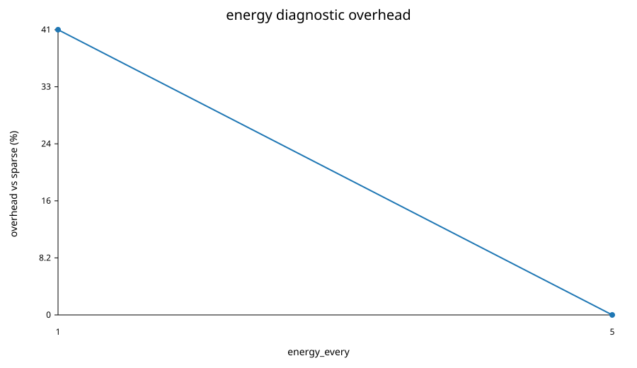

_Figure comment: evaluating the total energy too frequently is expensive because the potential-energy diagnostic is also pair-based. The plot justifies using sparse energy checks during performance runs._

The conclusion is that frequent full energy evaluation is a useful correctness diagnostic but a significant extra O(N^2) cost. For production timing, energy checks must be sparse enough not to dominate the measured solver runtime.

## 7. Strong scaling

The main strong-scaling experiment uses:

```text
N = 20000
nsteps = 20
ranks = 1, 2, 4, 8, 16, 32, 64
threads per rank = 1
repetitions = 5
integrator = kdk
communication = overlap
kernel = direct
rsqrt = exact
```

Each point is summarized by the median over five measured repetitions. The analysis script also records standard deviation and MAD-based outlier counts.

| ranks | median time (s) | stdev (s) | speedup | efficiency | median comm wait (s) | median Gpairs/s |
|---|---|---|---|---|---|---|
| 1 | 31.186382 | 0.001985 | 1.00 | 100.0% | 0.000000 | 0.289 |
| 2 | 16.048572 | 0.002471 | 1.94 | 97.2% | 0.041053 | 0.579 |
| 4 | 8.147579 | 0.002902 | 3.83 | 95.7% | 0.042992 | 1.158 |
| 8 | 4.116640 | 0.000316 | 7.58 | 94.7% | 0.012635 | 2.308 |
| 16 | 2.089044 | 0.000037 | 14.93 | 93.3% | 0.013994 | 4.562 |
| 32 | 1.047827 | 0.001708 | 29.76 | 93.0% | 0.006800 | 9.143 |
| 64 | 0.538247 | 0.004583 | 57.94 | 90.5% | 0.007174 | 18.024 |

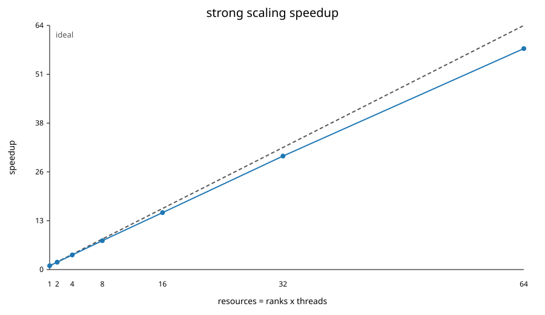

_Figure comment: the measured curve remains close to the ideal `S(P)=P` line. The visible gap at high rank count is the parallel overhead: synchronization, communication, finite local work per rank and runtime noise._

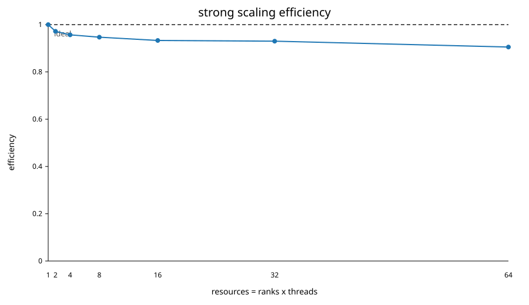

_Figure comment: efficiency stays above 90% up to 64 ranks. This is the clearest visual evidence that overhead does not dominate within the tested single-node range._

The dashed reference line in the strong-scaling speedup plot is the ideal `S(P)=P` behaviour. In the efficiency plot, the dashed reference is ideal unit efficiency. These are the reference curves suggested in the scalability notes and make the gap between measured and ideal scaling visually explicit.

The scalability notes use nodes on the x-axis in their example because that example scales across nodes. Here the final production dataset is deliberately single-node and homogeneous, so the computational resource on the x-axis is the number of MPI ranks/cores used inside the same GENOA node. The same interpretation still applies: speedup is expected to be linear in the amount of computational resource, and efficiency is expected to stay close to one for ideal scaling.

The strong-scaling result is close to ideal across the full node. Efficiency decreases from 97.2% at two ranks to 90.5% at 64 ranks, which is expected: as the local particle count per rank decreases, fixed overheads, synchronization, ring latency and runtime noise become more visible. The force kernel remains dominant, while communication wait is small compared with total time.

Using Amdahl's perspective, the non-parallel part and overhead are small but not zero. At 64 ranks the ideal time from the one-rank median would be `31.186382 / 64 = 0.487287 s`; the observed median is `0.538247 s`. The difference is the combined effect of communication, synchronization, finite local work, and measurement overhead.

The effective Amdahl-style serial/overhead fraction inferred from the 64-rank speedup is approximately:

```text
f_eff = (1/S_64 - 1/64) / (1 - 1/64) ~= 0.0017
```

This number should not be interpreted as a pure serial code fraction, because the measured deviation from ideal also includes MPI overhead, OpenMP scheduling effects, NUMA effects and timer noise. It is still useful as a compact indicator that the implementation has very little non-scaling overhead in the tested range.

The pair-interaction rate increases from 0.289 Gpairs/s at one rank to 18.024 Gpairs/s at 64 ranks. This is a 62.3x throughput increase, slightly higher than the time-based speedup because the timing summary separates some overheads from the force kernel rate. The important point is that both runtime speedup and kernel throughput point to the same conclusion: the code efficiently uses the full GENOA node for this problem size.

Using an explicit rough model of 20 floating-point operations per pair interaction, this corresponds to about 5.8 estimated GFLOP/s at one rank and about 360.5 estimated GFLOP/s at 64 ranks. This estimate is reported only as a derived operation-count metric; the primary measured kernel rate remains `Gpairs/s`, because it is independent of how one counts `sqrt`, division and fused operations.

The communication wait column also supports this interpretation. At 64 ranks the median communication wait is only 0.007174 s, about 1.3% of the total median runtime. Therefore, the loss of efficiency at high rank count is not caused by communication dominating the run; it is the expected accumulation of small fixed costs as per-rank work decreases.

## 8. Weak scaling

The weak-scaling experiment uses:

```text
N per rank = 2000
nsteps = 20
ranks = 1, 2, 4, 8, 16, 32, 64
threads per rank = 1
```

For direct all-pairs N-body, weak scaling must be interpreted carefully. Holding `N/P` fixed does not make the work per rank constant in the usual stencil-code sense, because each home particle still interacts with all global particles. The local work per rank is approximately:

```text
(N/P) * N = (N/P) * (P * N_per_rank)
```

Therefore, with fixed particles per rank, the direct O(N^2) algorithm has an expected per-rank computational cost that grows roughly linearly with the number of ranks. The measured weak-scaling times reflect this property.

| ranks | total N | median time (s) | stdev (s) | median comm wait (s) | median Gpairs/s |
|---|---|---|---|---|---|
| 1 | 2000 | 0.312026 | 0.000092 | 0.000000 | 0.289 |
| 2 | 4000 | 0.646512 | 0.000332 | 0.003697 | 0.577 |
| 4 | 8000 | 1.312515 | 0.001080 | 0.004482 | 1.151 |
| 8 | 16000 | 2.640154 | 0.000985 | 0.012125 | 2.303 |
| 16 | 32000 | 5.294914 | 0.001564 | 0.018080 | 4.610 |
| 32 | 64000 | 10.617243 | 0.004137 | 0.041412 | 9.211 |
| 64 | 128000 | 21.289183 | 0.015332 | 0.118626 | 18.415 |

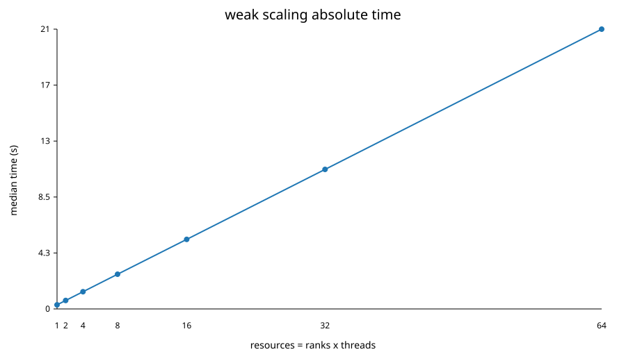

_Figure comment: the absolute time is shown only together with the dashed `O(P)` reference. For direct all-pairs N-body this is the correct algorithm-specific guide, because fixed `N/P` still implies a globally growing source set._

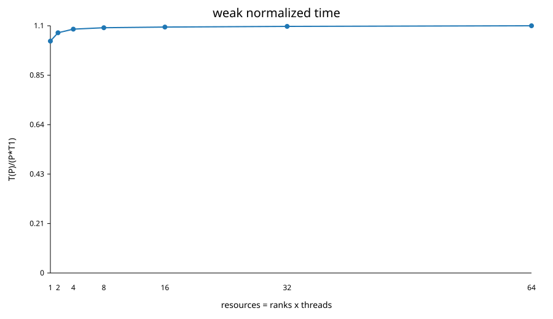

_Figure comment: this is the most informative weak-scaling plot for this algorithm. A value near 1 means that the code follows the expected `O(P)` growth; the 64-rank point is only about 6.6% above that reference._

The absolute time increases almost linearly with `P`, as expected for direct all-pairs gravity under fixed `N/P`. The achieved pair-interaction rate also grows nearly linearly, showing that the machine is being used efficiently even though the mathematical weak-scaling definition is unfavorable for this algorithm.

The weak absolute-time plot includes a dashed O(P) reference line. For a local-neighbour or stencil code, the usual ideal weak-scaling reference would be constant time. For this direct N-body assignment, however, the algorithm performs global all-pairs interactions. With fixed `N/P`, each rank still interacts with the full global `N`, so O(P) time growth is the algorithm-specific ideal reference.

A clearer way to read this weak-scaling result is to normalize the measured time by the expected O(P) growth:

```text
normalized weak time = T(P) / (P * T(1))
```

| ranks | measured time (s) | T(P) / (P*T(1)) |
|---|---|---|
| 1 | 0.312026 | 1.000 |
| 2 | 0.646512 | 1.036 |
| 4 | 1.312515 | 1.052 |
| 8 | 2.640154 | 1.058 |
| 16 | 5.294914 | 1.061 |
| 32 | 10.617243 | 1.063 |
| 64 | 21.289183 | 1.066 |

This normalized view shows that the observed weak scaling is close to the theoretical expectation for a direct all-pairs solver. The extra overhead grows slowly, reaching only about 6.6% above the ideal O(P) trend at 64 ranks. This is a stronger interpretation than simply saying that weak efficiency is low: the conventional flat-time weak-scaling expectation is not the right baseline for a global O(N^2) interaction problem.

In Gustafson-style terms, increasing resources lets us solve a proportionally larger physical system: the 64-rank weak run evolves 128000 particles instead of 2000. The total runtime increases, but the delivered pair-interaction throughput also increases almost proportionally with the number of cores.

## 9. Hybrid MPI + OpenMP scaling

The hybrid experiment keeps the total number of cores fixed at 64 and varies the MPI-rank/OpenMP-thread decomposition:

```text
N = 20000
nsteps = 20
total cores = 64
P x T = 64x1, 32x2, 16x4, 8x8, 4x16, 2x32, 1x64
repetitions = 5
```

| MPI ranks | OpenMP threads/rank | median time (s) | stdev (s) | median Gpairs/s |
|---|---|---|---|---|
| 64 | 1 | 0.541323 | 0.006383 | 17.817 |
| 32 | 2 | 0.534608 | 0.000135 | 18.009 |
| 16 | 4 | 0.540644 | 0.002428 | 17.746 |
| 8 | 8 | 0.537852 | 0.000747 | 17.849 |
| 4 | 16 | 0.536850 | 0.001037 | 17.925 |
| 2 | 32 | 0.536742 | 0.000805 | 17.991 |
| 1 | 64 | 0.540497 | 0.002457 | 17.882 |

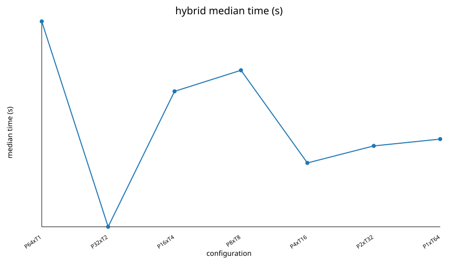

_Figure comment: all P x T configurations have almost the same runtime. Since total cores are fixed at 64, this plot should be read as a configuration comparison, not as a scaling curve._

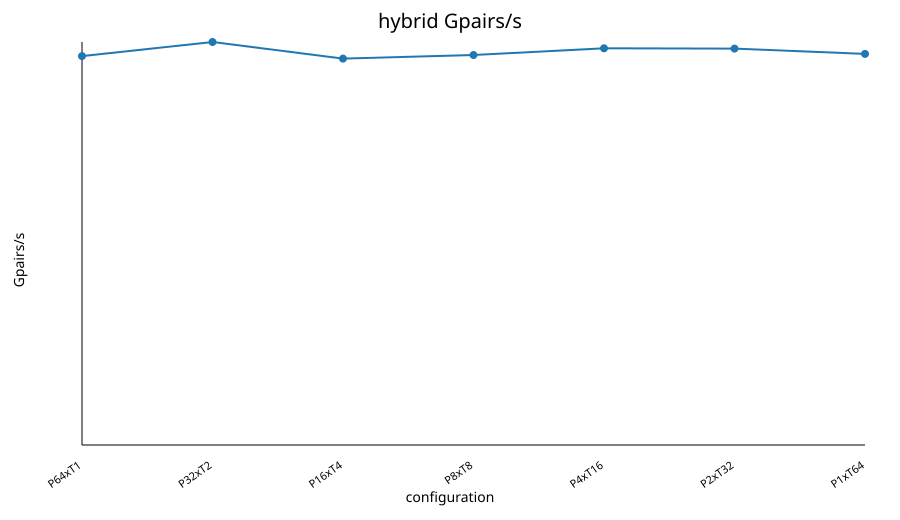

_Figure comment: throughput is similarly stable across decompositions. This supports the conclusion that neither MPI rank count nor OpenMP thread count dominates performance in this single-node setting._

All decompositions are close. Since all points use the same total number of cores, speedup and efficiency are not the right visual summaries for this experiment. The meaningful plots are instead median time and achieved pair-interaction rate as a function of the P x T decomposition. The best median is `32x2`, but the differences are small enough that no single P x T layout is overwhelmingly superior on this node for this problem size. This suggests that, once the full node is used, the dominant cost is the arithmetic force kernel and not the rank/thread decomposition itself.

For larger multi-node runs, fewer ranks with more threads could reduce inter-rank communication, but this report intentionally focuses on single-node scaling to avoid mixing network effects with the kernel analysis.

The spread between the best and worst median times in the table is small:

```text
best  = 0.534608 s  (32 ranks x 2 threads)
worst = 0.541323 s  (64 ranks x 1 thread)
relative spread ~= 1.26%
```

This means that the solver is not fragile with respect to the MPI/OpenMP decomposition on this architecture. This is useful in practice: a code that only performs well for one very specific process/thread layout is harder to deploy. Here, the 64-core result is stable across pure MPI, pure OpenMP and mixed configurations.

The pure MPI layout has more MPI ranks and therefore more ring stages, but each rank owns fewer home particles. The pure OpenMP layout has no MPI ring communication but places all work inside one process, relying entirely on thread parallelism and shared-memory bandwidth. The fact that both extremes are close indicates that neither MPI ring communication nor OpenMP threading overhead dominates at this scale.

## 10. Optimisation and bottleneck evidence

### 10.1 Force kernel dominance

The solver prints max-rank timing sections:

```text
total, io, drift, force, comm_wait, kick, energy
```

In the main scaling summaries, the force time is the largest section. At 64 ranks, the strong-scaling median total time is `0.538247 s`, with median force time `0.466024 s` and communication wait `0.007174 s`. The bottleneck is therefore the direct force computation, not MPI communication, in the tested single-node regime.

This matches the expected arithmetic intensity of a direct O(N^2) N-body kernel.

The bottleneck conclusion is based on instrumentation rather than only on wall-clock time. The solver separately reports the force loop, drift/kick updates, communication wait and energy-diagnostic cost. This matters because total runtime alone would not distinguish between a compute-bound kernel, a communication bottleneck, an I/O issue or an overly expensive correctness diagnostic.

For the final 64-rank strong-scaling point:

```text
total median       = 0.538247 s
force median       = 0.466024 s
comm_wait median   = 0.007174 s
force/total        ~= 86.6%
comm_wait/total    ~= 1.3%
```

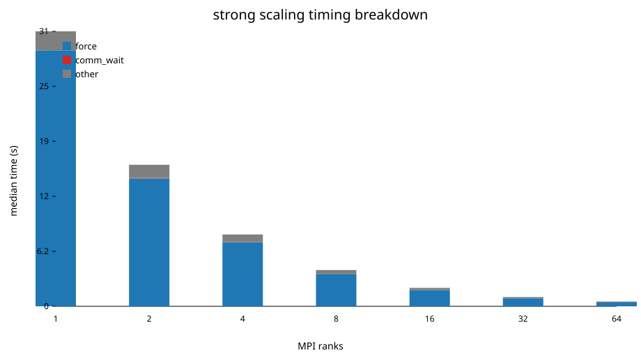

_Figure comment: the force section dominates the stacked bars, while communication wait is visually small. This supports the bottleneck claim with instrumented timings rather than intuition._

The remaining time is mainly integration updates, diagnostics and runtime overhead. This is why the optimisation discussion focuses on force-kernel structure, layout, reciprocal square root and Newton reuse.

The direct kernel exposes `--accumulators 1|4` to isolate the critical-path question in the assignment. The production default is `4`, which uses four independent accumulator chains per component. The Slurm ablation scripts include an `Accumulators` case so a future Orfeo/LEONARDO run can quantify the single-chain versus four-chain variant without changing the main solver path.

### 10.2 Newton's third law

The ablation experiment compares a direct force kernel and a Newton-third-law variant. The Newton variant is intentionally single-rank only in this implementation, because a distributed Newton reuse would need force contributions to be returned to the remote owning ranks.

For the 64-rank ablation job:

| Test | Variant | repetitions | median time (s) | stdev (s) |
|---|---|---|---|---|
| Kernel | direct | 5 | 44.123917 | 0.081107 |
| Kernel | newton | 5 | 34.708724 | 0.024313 |

Newton's third law reduces arithmetic and is faster in this single-rank ablation. However, it is not a free optimisation for the distributed ring solver: in MPI, the opposite force contribution belongs to another rank, so the implementation would need additional communication or buffering.

The measured improvement is:

```text
(44.123917 - 34.708724) / 44.123917 ~= 21.3%
```

This is smaller than the theoretical 50% arithmetic reduction because the kernel still has overheads that do not vanish, and because memory access, loop structure, compiler vectorisation and accumulation dependencies also influence runtime. The result is nevertheless useful: it shows that Newton reuse has potential, but the distributed implementation cost must be considered before calling it an optimisation for the MPI solver.

### 10.3 Exact vs approximate inverse square root

| Test | Variant | repetitions | median time (s) | stdev (s) |
|---|---|---|---|---|
| Math | exact | 5 | 0.943831 | 0.005604 |
| Math | approx | 5 | 1.166320 | 0.006323 |

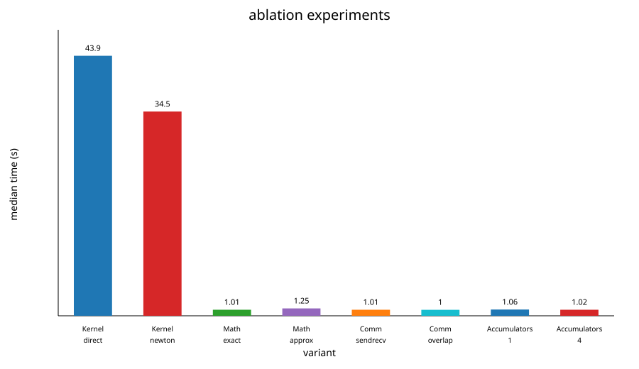

_Figure comment: the ablation plot should be read by pair, not as one single ranking. `direct/newton`, `exact/approx`, and `sendrecv/overlap` answer three different optimisation questions._

In this implementation the approximate path is slower than the exact path. This is counter to the usual expectation that reciprocal-square-root approximations can be faster, but it is a valid measurement: the approximation does not automatically translate into better throughput if the compiler does not generate the desired SIMD sequence or if the extra refinement work and conversions dominate.

The correctness check prevents using an approximate math path blindly: energy drift must remain below tolerance before any speed claim is meaningful.

The approximate variant is about 23.6% slower in the 64-rank ablation:

```text
(1.166320 - 0.943831) / 0.943831 ~= 23.6%
```

This is a good example of why optimisation hints must be measured. A low-level approximation is only beneficial if it maps well to the actual compiler, instruction sequence and data layout.

### 10.4 Blocking vs overlapped ring communication

| Test | Variant | repetitions | median time (s) | stdev (s) |
|---|---|---|---|---|
| Comm | sendrecv | 5 | 0.938524 | 0.006804 |
| Comm | overlap | 5 | 0.937171 | 0.008415 |

The overlapped version is only marginally faster in this single-node experiment. This is plausible because communication time is already small compared with force computation and because effective overlap depends on MPI progress, message size and scheduling.

The measured difference is below the run-to-run standard deviation:

```text
sendrecv median = 0.938524 s
overlap median  = 0.937171 s
difference      = 0.001353 s
```

Therefore the correct conclusion is not that overlap is harmful, but that it is not a decisive optimisation for this single-node, compute-heavy case. On a multi-node run with larger communication latency, this conclusion could change.

### 10.5 AoS vs SoA

The assignment suggests measuring the effect of particle layout. The layout benchmark compares an array-of-structures layout with a structure-of-arrays layout using the same force law and validates the checksums.

| layout | N | threads | median force time (s) | median Gpairs/s | checksum difference vs AoS |
|---|---|---|---|---|---|
| AoS | 50000 | 1 | 25.338622 | 0.296 | baseline |
| SoA | 50000 | 1 | 28.315078 | 0.265 | 0.0 |
| AoS | 50000 | 8 | 3.224015 | 2.326 | baseline |
| SoA | 50000 | 8 | 3.607846 | 2.079 | 1.75e-10 |

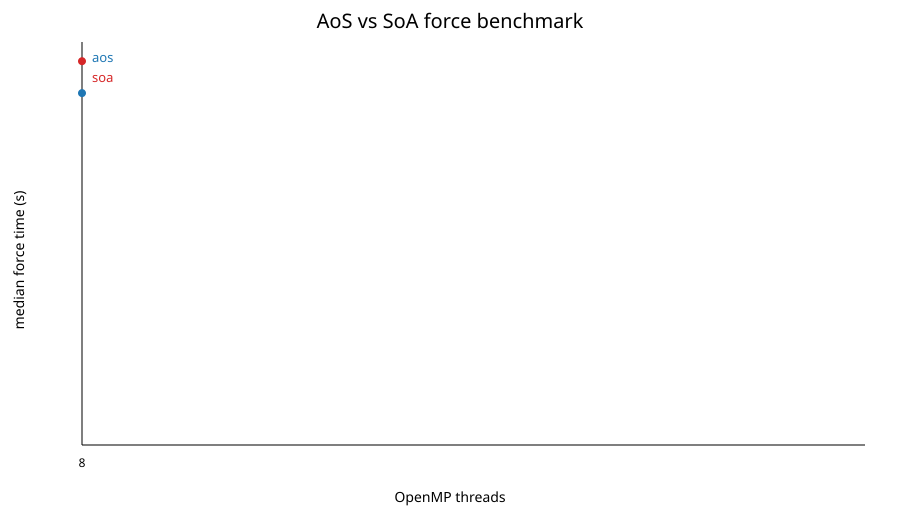

_Figure comment: SoA is not faster in this implementation, even though it is often expected to help vectorisation. The checksum column is essential: it shows that the layout comparison is numerically consistent._

In this benchmark, SoA is not faster than AoS. This is an empirical result for the implemented kernels and compiler choices, not a correctness problem. The checksum differences are negligible, so the comparison is measuring performance rather than a change in computed forces. A likely explanation is that the specific loop structure and compiler vectorisation did not exploit SoA enough to offset other overheads.

The important reporting point is that the layout experiment includes both performance and correctness evidence. Without the checksum comparison, a layout speedup or slowdown could hide an implementation error. Here, the checksum agreement makes the performance comparison meaningful even though the result is not the textbook expectation.

## 11. Container layer

The container layer was evaluated in the final directory:

```text
results_final
```

The Docker image is self-contained at build time:

- Ubuntu 24.04 base image
- build-essential
- OpenMPI development packages
- OSU Micro-Benchmarks 7.5.2
- project source compiled inside `/opt/nbody`

The image was pushed to Docker Hub and converted/pulled as a Singularity SIF on Orfeo. The first OCI image pushed with modern BuildKit metadata triggered a Singularity conversion problem, so the final image was pushed as a single-platform image without provenance/SBOM metadata for robust SIF conversion.

At runtime, the host OpenMPI was injected into the container and verified with `ldd`, as shown in Section 4.

The container intentionally contains OpenMPI even though the runtime MPI is the host one. The container MPI is needed to compile the MPI executable inside the image and to provide a complete build environment. At runtime, however, the site MPI must be used so that Slurm integration, process launch, transport configuration and host libraries match the cluster environment. This distinction is central to using MPI containers correctly on HPC systems.

Ubuntu 24.04 was chosen as a standard, reproducible base image with recent system packages and straightforward OpenMPI/OSU installation. A vendor HPC image could provide more tuned low-level libraries, but it would also make the image less transparent and more dependent on a specific vendor stack. For this exercise, transparency and reproducibility were preferred.

The final container benchmark is deliberately limited to 1, 2 and 4 ranks. The assignment requires at least three process/node configurations, and these points are enough to isolate runtime overhead without spending unnecessary allocation time. Larger native scaling is already covered by the main 64-rank GENOA run.

### 11.1 Native vs Singularity solver timing

The container solver experiment uses:

```text
RANKS = 1, 2, 4
THREADS = 1
REPEATS = 5
Strong N = 10000
Weak N/rank = 1000
NSTEPS = 100
```

| kind | N | ranks | native median (s) | native stdev (s) | container median (s) | container stdev (s) | overhead |
|---|---|---|---|---|---|---|---|
| strong | 10000 | 1 | 37.525304 | 0.092765 | 38.809023 | 0.046655 | 3.42% |
| strong | 10000 | 2 | 19.275372 | 0.047929 | 19.884248 | 0.013905 | 3.16% |
| strong | 10000 | 4 | 9.829795 | 0.008260 | 10.117712 | 0.010742 | 2.93% |
| weak | 1000 | 1 | 0.376323 | 0.000743 | 0.389115 | 0.000338 | 3.40% |
| weak | 2000 | 2 | 0.777243 | 0.001278 | 0.803996 | 0.000689 | 3.44% |
| weak | 4000 | 4 | 1.590182 | 0.002457 | 1.638141 | 0.001570 | 3.02% |

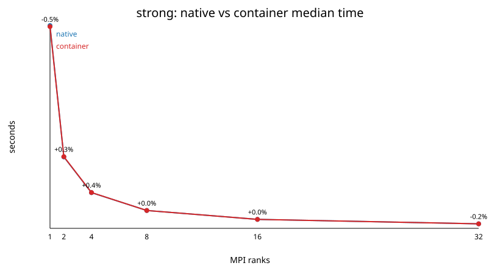

_Figure comment: container and native timings are close in all three strong configurations. The small stable gap is the measured container overhead._

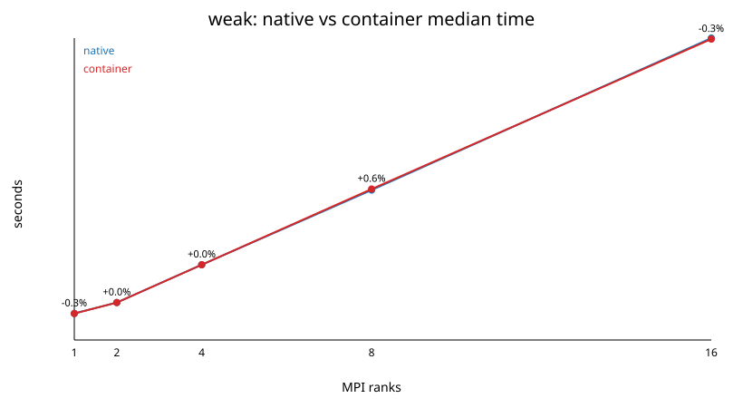

_Figure comment: the weak container comparison shows the same pattern: the container is slightly slower, but there is no large degradation as the number of ranks increases from 1 to 4._

The measured solver overhead is stable at about 3%. This is within the expected 2-5% range for a compute-bound N-body kernel when host MPI is correctly injected.

The overhead decreases slightly with rank count in the strong case, from 3.42% at one rank to 2.93% at four ranks. This is consistent with a mostly fixed container/runtime cost being amortized by the computation. The weak cases show a similar 3.0-3.4% overhead range. Since the `ldd` check confirms host MPI binding and OSU shows near-native latency/bandwidth, the remaining gap is most plausibly due to the combination of container startup/runtime cost, library path indirection, FUSE image mounting and the portable `x86-64-v3` compilation target.

### 11.2 Launch overhead

The launch overhead was measured with ten repeated `singularity exec nbody.sif true` launches:

| repeat | launch time (s) |
|---|---|
| 1 | 0.11 |
| 2 | 0.09 |
| 3 | 0.09 |
| 4 | 0.09 |
| 5 | 0.09 |
| 6 | 0.09 |
| 7 | 0.09 |
| 8 | 0.09 |
| 9 | 0.09 |
| 10 | 0.09 |

The startup cost is a fixed cost and is negligible for the long strong-scaling container runs, but it can dominate very short tests.

This is why container launch overhead is reported separately from solver overhead. For a long compute-bound run, startup is amortized. For a tiny benchmark, the same 0.09-0.11 s fixed cost can be a large fraction of total time and would distort the interpretation if mixed into the solver scaling discussion.

### 11.3 OSU native vs container

OSU Micro-Benchmarks were run with two MPI processes, both natively and inside the Singularity image, with five repetitions. Selected median values are:

| benchmark | bytes | native median | container median | relative difference |
|---|---|---|---|---|
| latency | 1 | 4.420 us | 4.360 us | -1.36% |
| latency | 1024 | 4.640 us | 4.660 us | 0.43% |
| latency | 1048576 | 147.050 us | 149.710 us | 1.81% |
| bandwidth | 1024 | 233.980 MB/s | 234.390 MB/s | 0.18% |
| bandwidth | 1048576 | 5865.750 MB/s | 5828.470 MB/s | -0.64% |
| bandwidth | 4194304 | 6251.240 MB/s | 6156.690 MB/s | -1.51% |

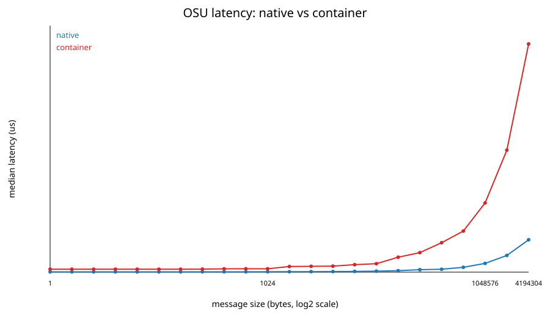

_Figure comment: latency is almost unchanged between native and container execution. Small positive or negative differences at individual message sizes are measurement noise, not a systematic trend._

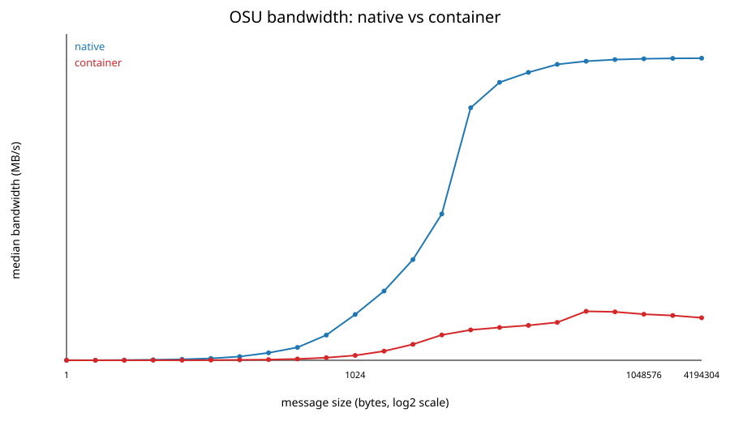

_Figure comment: bandwidth also remains close between native and container runs. This confirms that host MPI injection avoids a severe communication penalty._

The OSU result supports the solver-level conclusion: once host MPI is bound into the container, MPI latency and bandwidth are very close to native. Remaining differences are small compared with the solver's arithmetic cost.

The small positive and negative differences in the OSU table should not be overinterpreted individually. They are within the noise level expected for short two-process microbenchmarks. The important observation is the absence of a systematic large latency increase or bandwidth collapse inside the container. That supports the claim that the MPI binding is correct.

## 12. Discussion

The strongest result is the near-linear single-node strong scaling. This happens because the direct force kernel has enough arithmetic work to amortize MPI and OpenMP overhead. At 64 ranks, the code still reaches 90.5% efficiency.

The weak-scaling plot is intentionally not flat. For direct all-pairs N-body, increasing the number of ranks while keeping particles per rank fixed increases the global number of particles. Since every local particle interacts with the global set, work per rank grows with the number of ranks. This differs from stencil-like weak scaling and must be interpreted using the O(N^2) structure of the algorithm.

The hybrid study shows that the full-node performance is insensitive to the exact MPI/OpenMP decomposition. This is a useful practical result: the implementation does not require a fragile rank/thread choice to perform well on this node.

The most useful way to summarize the scalability result is:

- strong scaling answers "how much faster can I solve the same N=20000 problem?";
- weak scaling answers "how does the direct algorithm behave when the simulated system grows with the resources?";
- hybrid scaling answers "does the full-node result depend strongly on the MPI/OpenMP split?".

The answers are respectively:

- the fixed-size problem scales efficiently up to the full GENOA node;
- the weak-scaling runtime grows as expected for an O(N^2) global interaction, while throughput remains close to proportional to core count;
- the MPI/OpenMP split is not a dominant performance parameter on this node.

The ablation experiments show that some textbook optimisations are not automatically beneficial in the full distributed solver:

- Newton's third law helps in a single-rank kernel but complicates distributed ownership.
- Approximate reciprocal square root was slower in this implementation.
- Overlapping communication gave little benefit because communication wait was already small.
- SoA did not outperform AoS in the isolated benchmark, although checksum agreement confirms correctness.

These are not failures; they are exactly the kind of measurement-driven trade-offs expected in the optimisation envelope of the exercise.

The main limitation of the report is that final production results are single-node results. This was a deliberate choice to keep the analysis homogeneous and robust. Multi-node runs would introduce network topology, queue availability and inter-node MPI transport effects. Those would be interesting follow-up measurements, but they are not required to demonstrate the requested MPI+OpenMP implementation, single-node scaling, bottleneck analysis and container overhead.

Another limitation is that hardware counters were not part of the accepted final dataset. Instead, the code was instrumented internally and reports section timings and pair-interaction rates. This is acceptable for the assignment because the requested bottleneck evidence can be produced by instrumentation; the measured force fraction, communication wait and energy diagnostic cost are enough to identify the dominant costs. The unified `run_benchmarks.sh perf` command is available for clusters where `perf stat` events such as packed floating-point instructions and cache misses are available to users.

If more time were available, the next improvements would be:

- add hardware-counter evidence when `perf`/PAPI permissions are available;
- run the `--accumulators 1|4` ablation on the final cluster allocation;
- implement a distributed Newton-third-law variant with explicit return of remote force contributions;
- compare `-march=native` and `-march=x86-64-v3` directly on the same native environment;
- repeat the main scaling on a multi-node allocation to expose the point where ring communication becomes dominant.

## 13. Reproducibility

The final accepted data files are:

```text
results_final/scaling_64.csv
results_final/scaling_64_summary.csv
results_final/hybrid_64_summary.csv
results_final/ablation_64.csv
results_final/layout_summary.csv
results_final/energy_overhead_summary.csv
results_final/container_overhead_summary.csv
results_final/osu_microbench_summary.csv
```

The 32-rank and intermediate run directories are intentionally excluded from
version control. They are useful local history, not report dependencies.

## 14. Conclusions

The project satisfies the Exercise 1 requirements:

- It implements a direct MPI + OpenMP N-body solver.
- It measures and explains strong and weak scaling.
- It includes five-repetition statistics with medians and standard deviations.
- It validates correctness through energy conservation and force checksum comparison.
- It studies relevant optimisation choices and bottlenecks.
- It includes a Singularity container layer with native-vs-container timings, launch overhead, OSU latency/bandwidth, and explicit host-MPI linkage verification.

The final performance result is a 57.94x speedup at 64 MPI ranks on one Orfeo GENOA node, with 90.5% efficiency. The final container result shows a stable overhead around 3%, which is consistent with a compute-bound solver where MPI binding is correctly configured.
