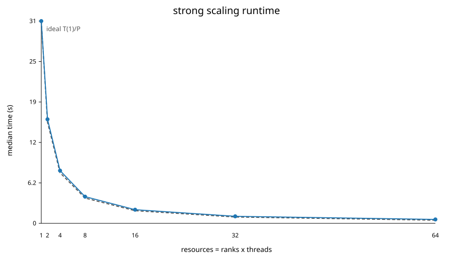

# Exercise 1 - Direct N-body gravitational simulation
High Performance Computing exam
Dariol Emma - SM3800118


## Introduction

This project implements and evaluates a direct gravitational N-body solver using MPI + OpenMP. The parallel code follows the requested direct all-pairs algorithm with softened gravity, a leapfrog time integrator, a permanent particle ownership model per MPI rank, and a ring-shift communication pattern for exchanging source particle chunks.

The final production measurements used in this report are stored in the 
`results_final/` directory.


**IMPORTANT**: The assignment text refers to LEONARDO for the container layer. In practice, the CPU allocation available during the measurements did not permit LEONARDO DCGP submissions, so the final production measurements were run on Orfeo. The same Singularity/host-MPI mechanism required by the assignment was used and explicitly verified with `ldd`.


## Main implementation choices (suggested and not)

The solver deliberately uses the direct O(N^2) algorithm rather than a tree code, fast multipole method, particle-mesh method or cutoff approximation. This is not algorithmically optimal for large astrophysical simulations, but it is the right choice for this exercise: every particle interacts with every other particle, so the computational structure is regular, the amount of arithmetic is large, and the force kernel is easy to instrument. This makes strong and weak scaling easier to interpret than in an irregular tree traversal.

The MPI decomposition keeps a fixed "home" chunk of particles on each rank. Source chunks are exchanged with a ring-shift pattern. This design has three advantages:

- every rank performs approximately the same amount of work;
- no global all-to-all communication is required;
- each rank only needs to store one received source buffer at a time.

The cost is that each rank must participate in `P - 1` ring stages. For large `P`, latency and synchronization can become visible, but on the single-node GENOA runs the force computation remains dominant.

OpenMP parallelism is applied to the home-particle force loop. Each thread accumulates forces for different home particles, which avoids atomics in the innermost loop. Avoiding inner-loop atomics is essential: the direct force loop performs a very large number of short floating-point updates, and atomic updates would serialize the most performance-critical part of the code.

The production distributed kernel does not use Newton's third law across MPI ranks. Newton reuse is attractive because it halves pair computations in a shared-memory setting, but in a distributed ownership model the opposite force contribution belongs to a remote rank. Exploiting this would require returning force increments to the owner rank, adding either extra communication, buffering, or reductions. For this reason the scalable production path uses the direct pair loop, while Newton reuse is studied separately as an ablation.

Finally, the code keeps both `sendrecv` and `overlap` communication modes. The overlapped version posts non-blocking receives/sends before computing the current chunk, but real overlap depends on MPI progress and on whether communication is large enough to matter. Keeping both modes makes the trade-off measurable.

## 4. Hardware and software environment

The final scaling results were run on one Orfeo GENOA node:

| Item | Value |
|---|---|
| Node | `genoa003.hpc.rd.areasciencepark.it` |
| CPU | AMD EPYC 9374F 32-Core Processor |
| Sockets | 2 |
| Cores per socket | 32 |
| Hardware threads | 1 per core |
| Total CPUs | 64 |
| NUMA nodes | 8 |
| Memory visible to the job | 503 GiB (`free -h`); 478 GiB available at measurement time; swap disabled |
| Kernel | Linux 6.13.12-200.fc41.x86_64 |
| Compiler | GCC 14.3.1 |
| MPI | Open MPI 4.1.6rc4 |
| Container runtime | Singularity CE 4.3.1 |

The NUMA topology is eight NUMA domains, each with eight CPUs. `numactl -H` reported approximately 64 GB per NUMA domain (64053--64508 MB). Local NUMA distance was 10, distance within the same socket was 12, and distance across sockets was 32. Swap was disabled. The complete output is preserved in `results_final/system_info_orfeo.txt` and in the RAM probe captured during the final campaign.

The ORFEO documentation identifies the GENOA partition as 13 AMD nodes with 64 cores and **512 GB nominal RAM per node** (Table 7, p. 153 of the course infrastructure document). The measured 503 GiB is therefore consistent with the nominal capacity after firmware and system reservations. Unprivileged DMI/SMBIOS access was unavailable on the compute node (`dmidecode` exited while scanning `/dev/mem`), so the report does not claim a DIMM technology (DDR4/DDR5), DIMM frequency, channel population, or theoretical peak bandwidth without evidence.

The final runs use Slurm binding to cores and OpenMP placement:

```text
OMP_NUM_THREADS=1 for pure MPI scaling
OMP_PLACES=cores
OMP_PROC_BIND=spread
srun --cpu-bind=verbose,cores
```

The main scaling dataset uses one full GENOA node rather than mixing nodes or architectures. This is intentional. Mixing GENOA and EPYC measurements in the same scaling curve would make the interpretation weaker, because a change in runtime could come either from the parallel algorithm or from a different CPU microarchitecture, cache hierarchy, frequency behaviour or NUMA topology. The optional EPYC 128-core run was submitted as an exploratory extension, but it is not used as the official dataset in this report because the completed 64-core GENOA run already covers a full homogeneous node.

The pure MPI scaling uses one rank per core. The hybrid study then checks whether replacing some MPI ranks with OpenMP threads changes performance. This separation is useful: the first experiment measures MPI scaling directly, while the second isolates the process/thread decomposition at a fixed core count.

For the container measurements, OpenMPI and hwloc from the host were bound into the container:

```text
SINGULARITY_BINDPATH=/opt/programs/openMPI/4.1.6:/opt/programs/openMPI/4.1.6,/opt/programs/hwloc/2.12.0:/opt/programs/hwloc/2.12.0
SINGULARITYENV_LD_LIBRARY_PATH=/opt/programs/openMPI/4.1.6/lib:/opt/programs/hwloc/2.12.0/lib
OMPI_MCA_pml=ob1
OMPI_MCA_btl=self,tcp
OMPI_MCA_btl_vader_single_copy_mechanism=none
```

The purpose of these settings is:

| setting | role |
|---|---|
| `SINGULARITY_BINDPATH` | makes the host OpenMPI and hwloc installation directories visible inside the container at the same absolute paths used outside the container. |
| `SINGULARITYENV_LD_LIBRARY_PATH` | prepends the host OpenMPI/hwloc library directories to the dynamic-loader search path inside the container. |
| `OMPI_MCA_pml=ob1` | selects OpenMPI's `ob1` point-to-point layer instead of the UCX PML. This avoids loading an incompatible UCX runtime from the container namespace. |
| `OMPI_MCA_btl=self,tcp` | selects the self and TCP byte-transfer layers for the native and container OSU comparison. This is not the fastest possible fabric path, but it is stable and symmetric across native/container runs. |
| `OMPI_MCA_btl_vader_single_copy_mechanism=none` | disables the CMA single-copy path for shared-memory transfers, avoiding namespace-related warnings when running through Singularity. |

The `ldd` check confirms that the native executable and the executable inside the container both load host MPI:

```text
native:
  libmpi.so.40 => /opt/programs/openMPI/4.1.6/lib/libmpi.so.40
  libopen-rte.so.40 => /opt/programs/openMPI/4.1.6/lib/libopen-rte.so.40
  libopen-pal.so.40 => /opt/programs/openMPI/4.1.6/lib/libopen-pal.so.40
  libhwloc.so.15 => /opt/programs/hwloc/2.12.0/lib/libhwloc.so.15

container:
  libmpi.so.40 => /opt/programs/openMPI/4.1.6/lib/libmpi.so.40
  libopen-rte.so.40 => /opt/programs/openMPI/4.1.6/lib/libopen-rte.so.40
  libopen-pal.so.40 => /opt/programs/openMPI/4.1.6/lib/libopen-pal.so.40
  libhwloc.so.15 => /opt/programs/hwloc/2.12.0/lib/libhwloc.so.15
```

This is important because using the container MPI at runtime would make MPI performance measurements ambiguous and could silently degrade or break multi-rank execution.

The OSU campaign exposed two concrete container/MPI pitfalls that were fixed before accepting the final table. First, an image based on an older Ubuntu/glibc could not load Orfeo host OpenMPI, because the host libraries required `GLIBC_2.38`. The image was therefore rebuilt from `ubuntu:24.04`, which provides a sufficiently recent glibc. Second, after host `libmpi.so` was injected successfully, OpenMPI initially selected its UCX component while the container namespace supplied UCX libraries from `/lib/x86_64-linux-gnu`; this produced UCX API warnings and RDMA aborts. The final OSU comparison therefore forces `ob1/tcp` on both native and container runs. This makes the OSU comparison a controlled native-vs-container runtime test rather than an accidental test of mismatched UCX components.

## 5. Build configuration

The native build uses the project `Makefile`:

```text
CC        ?= gcc
MPICC     ?= mpicc
STD       ?= -std=c11
CFLAGS    ?= -O3 -march=native -Wall -Wextra -Wpedantic
OMPFLAGS  ?= -fopenmp
LDLIBS    ?= -lm
PRECISION ?= double
```

The resulting hybrid command line is equivalent to:

```text
mpicc -std=c11 -DNBODY_USE_DOUBLE -O3 -march=native -Wall -Wextra -Wpedantic -fopenmp -o nbody_direct_hybrid nbody_direct_hybrid.c -lm
```

The final container image is built from `ubuntu:24.04`, installs OpenMPI and OSU Micro-Benchmarks at build time, and compiles the code with:

```text
-O3 -march=x86-64-v3 -Wall -Wextra -Wpedantic
```

The container uses `x86-64-v3` instead of `-march=native` to keep the image portable across x86-64 HPC systems. This can leave architecture-specific performance on the table, especially on AVX-512 capable CPUs, and is one reason why a small native/container performance gap is expected. The base image was updated to Ubuntu 24.04 because Orfeo host OpenMPI requires `GLIBC_2.38`; older Ubuntu images could not safely load the injected host MPI libraries.

The native executable uses `-march=native` because the native benchmarks are tied to the measured node. This allows GCC to target the actual CPU features available on GENOA. The container executable instead uses `x86-64-v3` because the image is meant to be portable and reproducible across machines. This is a deliberate asymmetry: native runs represent the best local build, while container runs represent a portable build deployed through Singularity. The measured overhead therefore includes both runtime container overhead and possible compilation-target effects.

All production runs use double-precision arithmetic. The input file stores particle coordinates and velocities as floats to keep files compact, but the force accumulation, integration and energy checks are performed with `dtype=double`. This choice reduces the risk that the correctness discussion is dominated by roundoff noise, especially when comparing the exact and approximate inverse-square-root paths.

The numerical parameters used by the benchmark scripts are fixed unless a specific experiment explicitly overrides them:

| Parameter | Value used in final benchmark scripts | Meaning |
|---|---:|---|
| `dt` | `1e-4` | Leapfrog timestep. |
| `eps` | `0.05` | Gravitational softening length used in `(|r_i-r_j|^2 + eps^2)`. |
| `G` | `1.0` | Gravitational constant in code units. |
| `mass` | `1.0` | Equal particle mass assigned by the solver. |
| `energy_every` | usually `nsteps` for performance runs | Energy-diagnostic period; sparse by default to avoid dominating timings. |
| `energy_tol` | `1e-4` | Maximum relative energy-drift tolerance for `status=OK`. |

The most important value here is `eps = 0.05`. It is the softening length used in all final solver comparisons, including native/container and exact/approximate inverse-square-root tests. Keeping it fixed is necessary: changing `eps` would change both the dynamics and the cost/conditioning of the force calculation, so the timing comparisons would no longer isolate implementation effects.

There is one important reproducibility caveat: the standalone executable has an internal help/default value of `--eps 0.01` when it is launched manually without benchmark scripts. Some early smoke tests and discarded exploratory commands may therefore have used `0.01`. Those runs are not part of the curated final dataset. The final benchmark workflow calls the solver through `run_benchmarks.sh` / benchmark wrappers, where `EPS` defaults to `0.05` and is passed explicitly to the executable.

The hybrid solver reads the shared initial-condition file with collective
MPI-IO.  All ranks participate in the header read and then each rank reads only
its own contiguous particle block with `MPI_File_read_at_all`.  This avoids the
previous POSIX pattern where every rank scanned the whole input file and could
create an avoidable metadata/data storm on the parallel filesystem.

The single-rank Newton-third-law ablation uses a pre-allocated thread workspace.
The force kernel clears this workspace with `memset` at each evaluation instead
of allocating and freeing thread-private buffers inside the timed loop.  The
reported Newton timing therefore measures the pair-interaction algorithm rather
than allocator overhead.

## 5.1 Statistical treatment

Five measured repetitions were collected per solver configuration. Scaling and hybrid summaries may retain fewer samples after the MAD filter; `runs` is the collected count and `used_runs` is the count actually used. The analysis reports:

- median runtime, used as the central estimator;
- standard deviation, used to quantify run-to-run variability;
- number of failed runs;
- number of MAD-based outliers.

The median is preferred over the arithmetic mean because HPC timings can contain occasional scheduler or OS-noise outliers. The raw repetitions are kept in the CSV files, while the summary CSV files contain the statistics used in the report.

No final CSV used in this report contains `RUN_FAILED`, `PARSE_FAILED` or `nan`. Earlier exploratory container attempts were discarded and are intentionally excluded from the curated `results_final/` dataset.

## 5.2 Definition of the reported metrics

The main CSV metrics are defined as follows.

| Metric | Meaning and calculation |
|---|---|
| `N` | Total number of particles. In strong scaling it is fixed; in weak scaling it grows as `N = P * N_local`. |
| `ranks`, `threads`, `resources` | MPI processes, OpenMP threads per process, and total CPU resources, with `resources = ranks * threads`. |
| `total` / `total_median` | Internally timed solver interval, excluding process/container launch and MPI initialization; summaries use the median over retained repetitions. |
| `force` / `force_median` | Time spent computing gravitational accelerations. This is the main direct `O(N^2)` kernel and the dominant bottleneck. |
| `comm_wait_median` | Exposed MPI waiting time during ring exchange. In overlap mode, it is the communication time not hidden by computation. |
| `energy_median` | Time spent computing total energy diagnostics. This is also pair-based and can be expensive. |
| `max_relative_energy_drift` | `max_t |E(t) - E(0)| / max(|E(0)|, tiny)`, used as trajectory-level correctness evidence. |
| `checksum_abs_diff_vs_aos` | Difference between layout-force checksums and the AoS baseline. It verifies that AoS/SoA timing differences are not caused by a different force result. |
| `median`, `stdev`, `runs`, `failed_runs` | Statistical treatment of repeated runs. Final plotted values are medians; standard deviation quantifies run-to-run variability. |
| `speedup` | Strong-scaling speedup, `T(1) / T(P)`. |
| `efficiency` | Parallel efficiency, `speedup / resources`. Ideal efficiency is 1. |
| `weak_normalized_time` | Weak-scaling time normalized by the direct-solver ideal `O(P)` trend: `T(P)/(P*T(1))`. |
| `gpairs_median` | Delivered pair-interaction rate in billions of pair interactions per second, computed from interaction count divided by force time. |
| `comm_bandwidth_GBps` | Effective communication bandwidth inferred from ring traffic and exposed communication time. It is a diagnostic proxy, not the hardware peak. |
| `overhead_percent` | Container overhead: `(container_median - native_median) / native_median * 100`. |
| OSU `latency_us` | Point-to-point MPI latency reported by `osu_latency` for each message size. |
| OSU `bandwidth_MBps` | Point-to-point MPI bandwidth reported by `osu_bw` for each message size. |

These definitions matter because the report mixes application-level metrics and micro-benchmarks. The N-body solver timings measure the full application, while OSU isolates MPI communication. A large OSU container penalty can therefore coexist with near-zero application-level overhead if the solver is compute-bound.

### 5.3 Experiment parameters and provenance

In every table, **N is the global particle count**, **P is the number of MPI ranks**, and **T is the OpenMP thread count per rank**; allocated computational resources are P times T. A repetition is a separate execution, not an integration step. The following inventory identifies the data behind the experiments. A missing historical parameter is explicitly marked as unrecorded: present-day script defaults are not evidence of a past execution.

| Experiment / source under `results_final/` | N | Integration steps | P | T per rank | Repetitions and measurement |
|---|---|---|---|---|---|
| Main strong scaling, `scaling_64_summary.csv` | 20000 | 20 | 1,2,4,8,16,32,64 | 1 | 5 collected per point; `used_runs` after filtering; internal total and phase timers |
| Main weak scaling, same CSV | 2000 P: 2000 to 128000 | 20 | 1,2,4,8,16,32,64 | 1 | Same statistics; growing global problem, not constant work per core for an all-pairs algorithm |
| Hybrid strong comparison, `hybrid_64_summary.csv` | 20000 | 20 | 64,32,16,8,4,2,1 | respectively 1,2,4,8,16,32,64 | 5 collected per configuration; 64 total cores; internal total and force throughput |
| Hybrid weak rows, same CSV | 2000 P | 20 | same P sequence | same T sequence | Separate from the fixed-N hybrid table; N changes with rank count even though total cores remain 64 |
| Kernel ablation, `ablation_64.csv` and `ablation_summary.csv` | Unrecorded in these ablation files | Unrecorded | Kernel test explicitly uses 1 rank in the driver | Unrecorded historically | 5 times per variant; total solver time, direct versus Newton-third-law kernel |
| Math / communication / accumulator ablations, same ablation datasets | Unrecorded | Unrecorded | Historical 64-rank dataset is labelled as such; refreshed dataset does not record P | Unrecorded | 5 times per variant; total solver time. Labels alone are insufficient to reconstruct the complete launch |
| Layout, `layout_summary.csv` | 10000 | Not applicable: force evaluations only | No MPI; one process | 1,2,4,8 | 5 executions per layout/thread point; timed block of `inner_repeats` force evaluations |
| Energy diagnostic frequency, `energy_summary.csv` | 10000 | 5 | 1 | 8 | 5 per point; `energy_every=1` versus 5; total, force and energy times |
| Architecture target, `arch_target_comparison_summary.csv` | 10000 | 5 | 8 | 1 | 5 per target; native versus x86-64-v3 total solver time |
| Required native/container strong, `required_table/required_container_scaling_summary.csv` | 100000 | 100 | 1,2,4,8,16,32 | 1 | 5 per mode and P; internal solver total |
| Required native/container weak, same CSV | 10000 P: 10000 to 160000 | 100 | 1,2,4,8,16 | 1 | 5 per mode and P; internal solver total |
| Launch overhead, `required_table/container_launch_overhead.csv` | Not applicable | Not applicable | No MPI; one launched command | No OpenMP force computation | 10 external wall-clock timings of `singularity exec ... true` |
| OSU, `required_table/osu_microbench_summary.csv` | Not applicable; message size in bytes replaces N | Not applicable | 2, one per node | No OpenMP particle loop | 5 reported measurements per mode/benchmark/message size; OSU internal communication timing |
| Compiler vectorisation evidence | No particle execution | Not applicable | Not applicable | Not applicable | Compiler diagnostic, not a runtime benchmark |

The layout summary does not retain the warmup and inner-repeat counts. Those must be recovered from the original raw layout output or job script before comparing its `force` time with a single force evaluation. The two ablation datasets must not be described as a controlled rank/thread comparison until their original job parameters have been recovered. In particular, “refreshed” does not establish that a run used one thread.

### 5.4 Exactly where time and throughput are measured

`nbody_direct_hybrid.c::seconds()` uses `MPI_Wtime()`. In `main()`, the `total` timer begins before particle reading and ends after the optional output write. It includes input, initial energy, initial force, all integration steps, periodic energy checks and optional output. It excludes MPI initialization, launcher/container startup, the final timing reductions, printing and finalization. Slurm `Elapsed` measures the job/step lifetime and is therefore a different quantity.

| Field | Timed code region | Interpretation |
|---|---|---|
| `io` | `read_local_particles()` and optional `write_output_root()` | Input/output costs inside the solver |
| `force` | Calls to `compute_accelerations_ring()` before integration and once per step | Complete force phase, including communication, allocation and buffer handling |
| `comm_wait` | Blocking source exchange or `MPI_Waitall()` inside the force routine | Exposed waiting; already included in `force`, so do not add it again |
| `kick` | Velocity-update calls | Both half-kicks accumulated over steps |
| `drift` | Position-update calls | Position integration time, unrelated to the numerical energy-drift error |
| `energy` | Initial and periodic `total_energy_ring()` calls | Diagnostic computation and its communication |
| `total` | The complete internal interval described above | Primary solver runtime used in scaling, ablation and container comparisons |

Each timer is reduced across ranks with `MPI_MAX`, then printed in `# timing_max_seconds`. Different phase maxima may come from different ranks, so their sum need not equal the maximum total. Across repetitions, `analyze.py` computes each metric's median separately. `total_stdev` is the sample standard deviation of the corresponding retained total times, not an error bar for the median or a confidence interval.

For direct summation, the reported throughput is `(nsteps+1)*N*(N-1)/(force*1e9)` Gpairs/s: one initial force evaluation and one per KDK step. It counts directed particle interactions. Applying the same formula to the Newton kernel is a direct-equivalent work rate; that kernel actually evaluates only half as many unordered pairs. A median Gpairs/s is the median of individual execution rates, not necessarily the interaction count divided by the median force time.

`nbody_layout_benchmark.c::run_one_layout()` uses `omp_get_wtime()` immediately around the loop of repeated force evaluations, after warmups. Input reading and the final checksum are outside this interval. Its throughput numerator is `inner_repeats*N*(N-1)`; its time is the whole timed block, not time per particle or per evaluation.

The exact/approximate square-root table reports total solver seconds parsed by `run_benchmarks.sh::ablation_case()`. It does not isolate the latency of one square-root instruction. `Math,approx` denotes reciprocal-square-root estimation plus Newton–Raphson refinement, whereas `Kernel,newton` denotes Newton's third law. These are independent experiments.

OSU times communication internally. Latency is the ping-pong round-trip time divided by twice the iteration count, reported as a one-way estimate in microseconds. `osu_bw` sends windows of messages followed by acknowledgements and divides delivered payload by elapsed time, reporting MB/s. Each OSU output already aggregates internal iterations; the report then takes medians and sample standard deviations over five benchmark executions. Particle count and integration steps have no meaning for OSU. Internal iteration/window settings are not preserved in the summary and must not be inferred from the solver settings.

### 5.5 Baselines, efficiency and sample counts

For strong scaling, `S(P,T)=median(total at 1 rank,1 thread)/median(total at P,T)` and `E=S/(P*T)`, provided all numerical and algorithmic settings match. The main strong-scaling table reports this for T=1. A force-only speedup would instead use `force_median` in both numerator and denominator and must be labelled separately. Communication wait has a zero one-rank baseline, so an analogous speedup is not meaningful.

At fixed 64 cores the hybrid table primarily compares decompositions. The `speedup=1` and `efficiency=1` entries in independently summarized hybrid files are per-file baseline artifacts, not evidence of perfect parallel efficiency. Absolute hybrid efficiency requires a matching one-core reference; configuration-relative speedup requires an explicitly named reference such as 64x1.

For weak scaling with N proportional to P, directed all-pairs work per rank grows proportionally to P. Conventional weak efficiency `T(1)/T(P)` is therefore not expected to stay at one. The work-normalized time is `T(P)/(P*T(1))`, whose ideal is one. This normalization must not be confused with fixed-N strong speedup. Native/container overhead is `100*(median_container/median_native-1)` at identical N, steps, P and T; it is not parallel efficiency.

The scaling analyzer retains samples satisfying `abs(total-median(total)) <= 3*1.4826*MAD`, with no filtering when MAD is zero. For example, main strong P=1 collected five samples but retained three; hybrid strong 32x2 retained four. The existing plots thus use the retained sample count, not always five. This is a statistical limitation relative to a requirement of five samples contributing to every point; the raw measurements should be reanalysed consistently or supplemented before claiming that requirement is met. Warmup counts for historical runs require launch metadata and cannot be reconstructed from summary medians.

## 6. Numerical method and correctness

The physical model is a softened Newtonian gravitational system:

```text
a_i = sum_j G m_j (r_j - r_i) / (|r_j - r_i|^2 + eps^2)^(3/2)
```

The production runs use the KDK leapfrog form, which is second order and symplectic. The solver reports the maximum relative total-energy drift:

```text
max_relative_energy_drift = max_t |E(t) - E(0)| / max(|E(0)|, tiny)
```

The tolerance used by the benchmark scripts is `1e-4`, matching the stricter value suggested in the assignment for the Plummer validation. All final scaling, hybrid, evidence and container rows have `all_ok=True` or `status=OK`. No final CSV contains `RUN_FAILED`, `PARSE_FAILED` or `nan`.

### 6.1 Choice of the softening length

The softening parameter is part of the physical model, not only a numerical stabilizer. The final value is:

```text
eps = 0.05
```

This value is used together with:

```text
dt = 1e-4
```

The role of `eps` is to regularize very close particle-particle encounters. Without softening, the Newtonian force grows like `1/r^2` and the acceleration term contains `1/r^3`; if two particles become extremely close, a fixed-timestep integrator can see very large accelerations and the total energy can drift. The softened denominator,

```text
(|r_i-r_j|^2 + eps^2)^(3/2)
```

keeps the force finite and makes the KDK leapfrog integration stable enough for the benchmark timestep.

The value cannot be treated as a performance-tuning knob. If `eps` is made smaller, for example close to the executable's standalone default `0.01`, the simulation becomes closer to the singular Newtonian problem, but close encounters are harder to integrate and energy warnings become more likely unless `dt` is also reduced. If `eps` is made too large, the dynamics become overly smoothed and the simulated system is no longer the same physical problem. Therefore `eps` must be chosen once, reported, and then kept fixed across all performance comparisons.

For this project, `eps = 0.05` was selected because it gives stable energy diagnostics with `dt = 1e-4` on the final Plummer initial conditions while still preserving a direct all-pairs gravitational workload. All final native/container, exact/approximate, strong/weak scaling, hybrid and ablation comparisons use this same value. Earlier exploratory manual launches that omitted `--eps` could fall back to the executable default `0.01`; those runs were excluded from the curated final dataset because they do not use the final numerical configuration.

The correctness checks serve two purposes. The energy drift checks the time integration and force consistency over a complete trajectory. The AoS/SoA checksum check verifies that layout changes preserve the force calculation itself. This is important because a faster force kernel is not useful unless it produces the same numerical result within roundoff tolerance.

The energy-diagnostic overhead study also verifies that the measured energy drift remains small:

| N | steps | ranks | energy_every | median total (s) | energy fraction | overhead vs sparse | max relative drift |
|---|---|---|---|---|---|---|---|
| 20000 | 20 | 8 | 1 | 6.924 | 47.4% | 74.8% | 2.16e-7 |
| 20000 | 20 | 8 | 5 | 4.429 | 17.9% | 11.8% | 2.16e-7 |
| 20000 | 20 | 8 | 10 | 4.114 | 11.5% | 3.9% | 2.16e-7 |
| 20000 | 20 | 8 | 20 | 3.960 | 8.1% | baseline | 2.16e-7 |


_Figure comment: evaluating the total energy too frequently is expensive because the potential-energy diagnostic is also pair-based. The plot justifies using sparse energy checks during performance runs._

The conclusion is that frequent full energy evaluation is a useful correctness diagnostic but a significant extra O(N^2) cost. For production timing, energy checks must be sparse enough not to dominate the measured solver runtime.

## 7. Strong scaling

The main strong-scaling experiment uses:

```text
N = 20000
nsteps = 20
ranks = 1, 2, 4, 8, 16, 32, 64
threads per rank = 1
repetitions = 5
integrator = kdk
communication = overlap
kernel = direct
rsqrt = exact
```

Each point has five collected repetitions; the displayed median and standard deviation use the retained samples after MAD filtering, as recorded in `used_runs`. See Section 5.5 for the sample-count limitation.

| ranks | median time (s) | stdev (s) | speedup | efficiency | median comm wait (s) | median Gpairs/s |
|---|---|---|---|---|---|---|
| 1 | 31.186823 | 0.003016 | 1.00 | 100.0% | 0.000000 | 0.289 |
| 2 | 16.038907 | 0.006556 | 1.94 | 97.2% | 0.086697 | 0.579 |
| 4 | 8.136352 | 0.004001 | 3.83 | 95.8% | 0.039723 | 1.158 |
| 8 | 4.116069 | 0.001794 | 7.58 | 94.7% | 0.023563 | 2.306 |
| 16 | 2.101684 | 0.011390 | 14.84 | 92.7% | 0.014187 | 4.560 |
| 32 | 1.084200 | 0.002154 | 28.76 | 89.9% | 0.007983 | 8.898 |
| 64 | 0.600278 | 0.007607 | 51.95 | 81.2% | 0.024547 | 16.845 |



_Figure comment: the absolute runtime decreases from `31.19 s` at one rank to `0.60 s` at 64 ranks. The dashed curve is the ideal `T(1)/P` runtime. This plot is useful for seeing the actual wall-clock reduction, but the non-linear shape is harder to judge by eye than speedup or efficiency._


_Figure comment: the measured curve remains close to the ideal `S(P)=P` line. The visible gap at high rank count is the parallel overhead: synchronization, communication, finite local work per rank and runtime noise._


_Figure comment: efficiency stays high up to 32 ranks and then drops more visibly at 64 ranks. This is the clearest visual evidence of the point where fixed overheads and reduced per-rank work start to matter._

The dashed reference line in the runtime plot is the ideal `T(P)=T(1)/P` decrease. In the strong-scaling speedup plot it is the ideal `S(P)=P` behaviour. In the efficiency plot, the dashed reference is ideal unit efficiency. These are the reference curves suggested in the scalability notes and make the gap between measured and ideal scaling visually explicit.

The scalability notes use nodes on the x-axis in their example because that example scales across nodes. Here the final production dataset is deliberately single-node and homogeneous, so the computational resource on the x-axis is the number of MPI ranks/cores used inside the same GENOA node. The same interpretation still applies: speedup is expected to be linear in the amount of computational resource, and efficiency is expected to stay close to one for ideal scaling.

The strong-scaling result is close to ideal up to 32 ranks and still useful at 64 ranks. Efficiency decreases from 97.2% at two ranks to 81.2% at 64 ranks, which is expected: as the local particle count per rank decreases, fixed overheads, synchronization, ring latency and runtime noise become more visible. The force kernel remains dominant, while communication wait is still small compared with total time.

Using Amdahl's perspective, the non-parallel part and overhead are small but not zero. At 64 ranks the ideal time from the one-rank median would be `31.186823 / 64 = 0.487294 s`; the observed median is `0.600278 s`. The difference is the combined effect of communication, synchronization, finite local work, and measurement overhead.

The effective Amdahl-style serial/overhead fraction inferred from the 64-rank speedup is approximately:

```text
f_eff = (1/S_64 - 1/64) / (1 - 1/64) ~= 0.0037
```

This number should not be interpreted as a pure serial code fraction, because the measured deviation from ideal also includes MPI overhead, OpenMP scheduling effects, NUMA effects and timer noise. It is still useful as a compact indicator that the implementation has very little non-scaling overhead in the tested range.

The pair-interaction rate increases from 0.289 Gpairs/s at one rank to 16.845 Gpairs/s at 64 ranks. This is a 58.3x throughput increase, slightly higher than the time-based speedup because the timing summary separates some overheads from the force kernel rate. The important point is that both runtime speedup and kernel throughput point to the same conclusion: the code efficiently uses the full GENOA node for this problem size, although 64 ranks is already beyond the perfectly linear region.

Using an explicit rough model of 20 floating-point operations per pair interaction, this corresponds to about 5.8 estimated GFLOP/s at one rank and about 336.9 estimated GFLOP/s at 64 ranks. This estimate is reported only as a derived operation-count metric; the primary measured kernel rate remains `Gpairs/s`, because it is independent of how one counts `sqrt`, division and fused operations.

The communication wait column also supports this interpretation. At 64 ranks the median communication wait is 0.024547 s, about 4.1% of the total median runtime. Therefore, the loss of efficiency at high rank count is not caused by communication dominating the run; it is the expected accumulation of communication, synchronization and scheduling overheads as per-rank work decreases.

## 8. Weak scaling

The weak-scaling experiment uses:

```text
N per rank = 2000
nsteps = 20
ranks = 1, 2, 4, 8, 16, 32, 64
threads per rank = 1
```

For direct all-pairs N-body, weak scaling must be interpreted carefully. Holding `N/P` fixed does not make the work per rank constant in the usual stencil-code sense, because each home particle still interacts with all global particles. The local work per rank is approximately:

```text
(N/P) * N = (N/P) * (P * N_per_rank)
```

Therefore, with fixed particles per rank, the direct O(N^2) algorithm has an expected per-rank computational cost that grows roughly linearly with the number of ranks. The measured weak-scaling times reflect this property.

| ranks | total N | median time (s) | stdev (s) | median comm wait (s) | median Gpairs/s |
|---|---|---|---|---|---|
| 1 | 2000 | 0.321935 | 0.003562 | 0.000000 | 0.284 |
| 2 | 4000 | 0.657047 | 0.005018 | 0.006889 | 0.573 |
| 4 | 8000 | 1.321200 | 0.000501 | 0.012390 | 1.150 |
| 8 | 16000 | 2.643555 | 0.002256 | 0.014827 | 2.301 |
| 16 | 32000 | 5.302514 | 0.006716 | 0.021196 | 4.605 |
| 32 | 64000 | 10.912477 | 0.005657 | 0.038610 | 8.958 |
| 64 | 128000 | 22.177877 | 0.023922 | 0.110755 | 17.651 |


_Figure comment: the absolute time is shown only together with the dashed `O(P)` reference. For direct all-pairs N-body this is the correct algorithm-specific guide, because fixed `N/P` still implies a globally growing source set._


_Figure comment: this is the most informative weak-scaling plot for this algorithm. A value near 1 means that the code follows the expected `O(P)` growth; the 64-rank point is about 7.6% above that reference._

The absolute time increases almost linearly with `P`, as expected for direct all-pairs gravity under fixed `N/P`. The achieved pair-interaction rate also grows nearly linearly, showing that the machine is being used efficiently even though the mathematical weak-scaling definition is unfavorable for this algorithm.

The weak absolute-time plot includes a dashed O(P) reference line. For a local-neighbour or stencil code, the usual ideal weak-scaling reference would be constant time. For this direct N-body assignment, however, the algorithm performs global all-pairs interactions. With fixed `N/P`, each rank still interacts with the full global `N`, so O(P) time growth is the algorithm-specific ideal reference.

A clearer way to read this weak-scaling result is to normalize the measured time by the expected O(P) growth:

```text
normalized weak time = T(P) / (P * T(1))
```

| ranks | measured time (s) | T(P) / (P*T(1)) |
|---|---|---|
| 1 | 0.321935 | 1.000 |
| 2 | 0.657047 | 1.020 |
| 4 | 1.321200 | 1.026 |
| 8 | 2.643555 | 1.026 |
| 16 | 5.302514 | 1.029 |
| 32 | 10.912477 | 1.059 |
| 64 | 22.177877 | 1.076 |

This normalized view shows that the observed weak scaling is close to the theoretical expectation for a direct all-pairs solver. The extra overhead grows slowly, reaching only about 7.6% above the ideal O(P) trend at 64 ranks. This is a stronger interpretation than simply saying that weak efficiency is low: the conventional flat-time weak-scaling expectation is not the right baseline for a global O(N^2) interaction problem.

In Gustafson-style terms, increasing resources lets us solve a proportionally larger physical system: the 64-rank weak run evolves 128000 particles instead of 2000. The total runtime increases, but the delivered pair-interaction throughput also increases almost proportionally with the number of cores.

## 9. Hybrid MPI/OpenMP scaling

The hybrid experiment keeps the total number of cores fixed at 64 and varies the MPI-rank/OpenMP-thread decomposition:

```text
N = 20000
nsteps = 20
total cores = 64
P x T = 64x1, 32x2, 16x4, 8x8, 4x16, 2x32, 1x64
repetitions = 5
```

| MPI ranks | OpenMP threads/rank | median time (s) | stdev (s) | median Gpairs/s |
|---|---|---|---|---|
| 64 | 1 | 0.599095 | 0.000800 | 16.841 |
| 32 | 2 | 0.562215 | 0.000623 | 17.450 |
| 16 | 4 | 0.586540 | 0.005674 | 16.734 |
| 8 | 8 | 0.590321 | 0.004190 | 16.889 |
| 4 | 16 | 0.573680 | 0.002967 | 17.178 |
| 2 | 32 | 0.576736 | 0.000755 | 17.164 |
| 1 | 64 | 0.577963 | 0.002959 | 16.934 |


_Figure comment: all P x T configurations remain in the same performance range, with a moderate spread. Since total cores are fixed at 64, this plot should be read as a configuration comparison, not as a scaling curve._


_Figure comment: throughput is similarly stable across decompositions. This supports the conclusion that neither MPI rank count nor OpenMP thread count dominates performance in this single-node setting._

All decompositions are reasonably close. Since all points use the same total number of cores, speedup and efficiency are not the right visual summaries for this experiment. The meaningful plots are instead median time and achieved pair-interaction rate as a function of the P x T decomposition. The best median is `32x2`, but no single P x T layout is overwhelmingly superior on this node for this problem size. This suggests that, once the full node is used, the dominant cost is the arithmetic force kernel and not the rank/thread decomposition itself.

For larger multi-node runs, fewer ranks with more threads could reduce inter-rank communication, but this report intentionally focuses on single-node scaling to avoid mixing network effects with the kernel analysis.

The spread between the best and worst median times in the table is small:

```text
best  = 0.562215 s  (32 ranks x 2 threads)
worst = 0.599095 s  (64 ranks x 1 thread)
relative spread ~= 6.56%
```

This means that the solver is not fragile with respect to the MPI/OpenMP decomposition on this architecture. The spread is visible but still modest compared with the order-of-magnitude changes seen in the scaling experiments. This is useful in practice: a code that only performs well for one very specific process/thread layout is harder to deploy. Here, the 64-core result remains reasonably stable across pure MPI, pure OpenMP and mixed configurations.

The pure MPI layout has more MPI ranks and therefore more ring stages, but each rank owns fewer home particles. The pure OpenMP layout has no MPI ring communication but places all work inside one process, relying entirely on thread parallelism and shared-memory bandwidth. The fact that both extremes are close indicates that neither MPI ring communication nor OpenMP threading overhead dominates at this scale.

## 10. Optimisation and bottleneck evidence

The optimisation tests rerun the N-body solver while changing one setting: the force algorithm, reciprocal-square-root method, communication mode or number of accumulator chains. Their primary measurement is the solver's internal total elapsed time. The historical filename `ablation_64.csv` is a campaign identifier, not an experimental configuration: the Kernel comparison explicitly runs with one MPI rank, and the file itself does not record rank/thread counts for the other comparisons. The descriptive test names below identify what was changed; missing launch parameters remain listed in Section 5.3.

### 10.1 Force kernel dominance

The solver prints max-rank timing sections:

```text
total, io, drift, force, comm_wait, kick, energy
```

In the main scaling summaries, the force time is the largest section. At 64 ranks, the strong-scaling median total time is `0.600278 s`, with median force time `0.498629 s` and communication wait `0.024547 s`. The bottleneck is therefore the direct force computation, not MPI communication, in the tested single-node regime.

This matches the expected arithmetic intensity of a direct O(N^2) N-body kernel.

The bottleneck conclusion is based on instrumentation rather than only on wall-clock time. The solver separately reports the force loop, drift/kick updates, communication wait and energy-diagnostic cost. This matters because total runtime alone would not distinguish between a compute-bound kernel, a communication bottleneck, an I/O issue or an overly expensive correctness diagnostic.

For the final 64-rank strong-scaling point:

```text
total median       = 0.600278 s
force median       = 0.498629 s
comm_wait median   = 0.024547 s
force/total        ~= 83.1%
comm_wait/total    ~= 4.1%
```

The remaining time is mainly integration updates, diagnostics and runtime overhead. This is why the optimisation discussion focuses on force-kernel structure, layout, reciprocal square root and Newton reuse.

The direct kernel exposes `--accumulators 1|2|4|8` to isolate the critical-path question in the assignment and to identify the saturation point of independent accumulation chains. The production default is `4`, which uses four independent accumulator chains per component. The refreshed ablation CSV includes all four accumulator counts without changing the main solver path.

### 10.2 Newton's third law

The ablation experiment compares a direct force kernel and a Newton-third-law variant. The Newton variant is intentionally single-rank only in this implementation, because a distributed Newton reuse would need force contributions to be returned to the remote owning ranks.

For the dataset named `ablation_64.csv`, the Kernel subtest uses one MPI rank, even when other subtests use the configured 64 ranks. Historical N, step count and thread count are not recorded in this three-column CSV; see Section 5.3. The values below are medians of total solver times, not force-only times:

| Test | Variant | repetitions | median time (s) | stdev (s) |
|---|---|---|---|---|
| Kernel | direct | 5 | 43.943200 | 0.138336 |
| Kernel | newton | 5 | 34.517259 | 0.023521 |

Newton's third law reduces arithmetic and is faster in this single-rank ablation. However, it is not a free optimisation for the distributed ring solver: in MPI, the opposite force contribution belongs to another rank, so the implementation would need additional communication or buffering.

The measured improvement is:

```text
(43.943200 - 34.517259) / 43.943200 ~= 21.5%
```

This is smaller than the theoretical 50% arithmetic reduction because the kernel still has overheads that do not vanish, and because memory access, loop structure, compiler vectorisation and accumulation dependencies also influence runtime. The result is nevertheless useful: it shows that Newton reuse has potential, but the distributed implementation cost must be considered before calling it an optimisation for the MPI solver.

### 10.3 Exact vs approximate inverse square root

The updated hybrid executable exposes `--rsqrt exact`, `--rsqrt approx1` (one Newton–Raphson refinement) and `--rsqrt approx2` (two refinements). The legacy `approx` option remains an alias for `approx2`. The ablation driver now measures all three at the same configured N, steps, P and T, and records these parameters plus force time, communication wait and energy drift in its raw CSV. Existing tables below predate this three-way experiment: they do not contain a measured one-refinement result.

Both approximate variants use the same initial seed for a given execution path: AVX-512 double vectors use `rsqrt14`, while the portable path and scalar tail use `1/sqrtf`. Each refinement evaluates `y <- y*(1.5 - 0.5*q*y*y)`. One refinement of a roughly 14-bit seed does not provide full double precision; two refinements improve accuracy but do not guarantee bitwise equality with `1/sqrt(q)`. Measured energy drift is a trajectory-level correctness diagnostic, not a direct measurement of the relative error of each reciprocal square root.

The force kernel needs `1 / sqrt(r2)` for every particle pair. Two implementations were tested:

- `rsqrt=exact`: computes the reciprocal square root with the standard double-precision path, `1.0 / sqrt(r2)`.
- `rsqrt=approx`: starts from a fast approximate reciprocal-square-root estimate and refines it with Newton-Raphson iterations before using it in the force formula.

The following comparison uses `results_final/ablation_64.csv` and measures internal total solver time, excluding launcher startup. Historical N, step count and thread count are not recorded in that CSV, so the timing difference cannot be attributed conclusively to a particular instruction path or resource configuration.

| Experiment | Reciprocal-square-root method | repetitions | failed runs | median solver time (s) | stdev (s) | delta vs exact | speedup vs exact |
|---|---|---:|---:|---:|---:|---:|---:|
| Solver runtime: exact vs approximate reciprocal square root | exact (`1/sqrt(q)`) | 5 | 0 | 1.014907 | 0.006999 | baseline | 1.000 |
| Solver runtime: exact vs approximate reciprocal square root | approximate seed + Newton–Raphson refinement | 5 | 0 | 1.247969 | 0.006455 | +23.0% | 0.813 |

The individual timings used to compute the medians are:

| Experiment | Method | run 1 (s) | run 2 (s) | run 3 (s) | run 4 (s) | run 5 (s) |
|---|---|---:|---:|---:|---:|---:|
| Solver runtime: reciprocal-square-root comparison | exact | 1.007286 | 1.022674 | 1.018880 | 1.006853 | 1.014907 |
| Solver runtime: reciprocal-square-root comparison | approximate + refinement | 1.252006 | 1.247969 | 1.236535 | 1.252502 | 1.246056 |

In the updated implementation, the native AVX-512 build uses `_mm512_rsqrt14_pd` plus Newton-Raphson refinement for the approximate path when `__AVX512F__` is available. Portable builds, including `x86-64-v3` container builds, fall back to a scalar single-precision seed plus Newton-Raphson refinement because AVX-512 is intentionally outside the portable target. This distinction is important when interpreting exact-vs-approximate timings.

The correctness check prevents using an approximate math path blindly: energy drift must remain below tolerance before any speed claim is meaningful.

In this solver-runtime comparison, the approximate path is slower:

```text
(1.247969 - 1.014907) / 1.014907 ~= +23.0%
```

The approximate configuration increased median solver runtime by approximately 23%, from 1.014907 s to 1.247969 s. The difference of 0.233062 s is much larger than the reported run-to-run standard deviations (approximately 0.0070 s and 0.0065 s). Ordinary timing variability alone is therefore not a convincing explanation, although these descriptive statistics are not a formal significance test.

A faster initial reciprocal-square-root estimate does not guarantee a faster complete force kernel. The implementation introduces several relevant costs:

- **Newton–Raphson refinement:** each refinement evaluates `y*(1.5 - 0.5*q*y*y)`. These operations form a dependent sequence; a second refinement improves accuracy but adds work and latency after the initial estimate.
- **Portable approximation:** without the AVX-512 double path, the seed is `1.0f/sqrtf((float)q)`. This still requires a square root and a division, as well as precision conversions and subsequent refinements. It is not equivalent to using a single hardware reciprocal-square-root estimate.
- **Different kernel structure:** when the AVX-512 path is selected, the approximate implementation uses explicit vector operations, whereas the exact implementation uses the compiler-assisted SIMD loop and configurable accumulator chains. The comparison can therefore change vectorisation and accumulation strategy as well as the reciprocal-square-root calculation. Instruction throughput, dependency chains and register use may offset the saving from the estimate.

These are implementation-based explanations to investigate, not established causes of the historical slowdown. The archived timing CSV does not establish which machine-code path executed or preserve all launch parameters. In particular, the result must not be attributed to MPI overhead without phase-level evidence: a common communication cost can dilute a computational speedup but cannot, by itself, explain why the approximate computation becomes slower.

The reported values are whole-solver times, not timings of individual square-root instructions. A controlled `exact` / `approx1` / `approx2` experiment must keep N, steps, MPI ranks, OpenMP threads, input, binding and compiler settings fixed. Its force-phase time tests the computational benefit, total time measures the application-level benefit, and energy drift checks the numerical trade-off. Compiler or assembly evidence is additionally needed to identify the instruction path. The updated benchmark records these timing and configuration fields, but its new one- and two-refinement results are not yet present in this historical table. Consequently, the supported conclusion is that the exact configuration was faster in this measured campaign, not that approximate reciprocal square roots are universally slower.

#### Two independent optimisations: reciprocal square root and accumulation

The inverse-square-root choice and the accumulator-chain choice target different
parts of the same force evaluation. For every particle pair the solver first
computes `1/sqrt(r2)`, then multiplies it by the displacement and adds the
result to the force sums. `--rsqrt exact|approx` changes the first operation;
`--accumulators 1|2|4|8` changes the second.

The primary implementation distinction is not `exact` versus `approx`, but
scalar versus vector execution. The scalar routine accepts *both* square-root
modes; the AVX-512 routine is a separate vector implementation currently used
for the approximate mode:

```text
scalar path, rsqrt=exact
  -> accumulate_sources_scalar_chains()
     -> scalar accumulator chains 1, 2, 4 or 8

scalar path, rsqrt=approx (no AVX-512)
  -> accumulate_sources_scalar_chains()
     -> the same scalar chains, with the approximate sqrt path

AVX-512 path, rsqrt=approx
  -> accumulate_sources_rsqrt14_pd()
     -> _mm512_rsqrt14_pd plus Newton refinement
     -> vector accumulators ax_v, ay_v, az_v (8 double lanes each)
```

The outer `#pragma omp parallel for` distributes different target particles
among OpenMP threads; it is thread parallelism, not loop unrolling. In the
scalar kernel, the explicit `j += 2`, `j += 4` and `j += 8` bodies are the
manual unrolling. Their `ax0`, `ax1`, ... variables are independent partial
sums, so the CPU can keep several multiply-add operations in flight instead of
waiting on one long `ax += ...` dependency chain. This mechanism works with
both `invsqrt_force(..., RSQRT_EXACT)` and
`invsqrt_force(..., RSQRT_APPROX)` in the scalar routine. The tail loop handles
a source count that is not divisible by the selected chain count.

FMA is a separate hardware/compiler issue. The explicit `_mm512_fmadd_pd`
instructions belong to the AVX-512 implementation and are unrelated to the
choice of exact or approximate reciprocal square root. In the scalar C routine
the expressions are written portably as multiply/add operations; GCC may fuse
eligible expressions into scalar FMA instructions when the target and floating
point flags permit it, but the source code does not require a scalar FMA
intrinsic. Thus accumulator unrolling improves instruction-level parallelism,
while FMA is the particular multiply-add instruction selected by the compiler
or by the AVX-512 intrinsics.

The AVX-512 approximate kernel uses `_mm512_rsqrt14_pd`, which supplies an
initial reciprocal-square-root estimate for eight double values at once. Two
Newton-Raphson refinements improve that estimate before it enters the force
formula. Its `__m512d` accumulators already contain eight SIMD lanes, so the
command-line accumulator count is not applied in that dispatch path. This is an
implementation choice, not a mathematical restriction: a future implementation
could combine AVX-512 rsqrt with an additional unrolling layer, but the current
code keeps the paths separate to make them easier to measure and maintain.
Accumulator sweeps must therefore use the scalar path, while
exact-versus-approximate runs must keep the accumulator setting fixed. This
separation prevents the inverse-square-root comparison from being confounded
with a different number of scalar accumulation chains.

### 10.4 Blocking vs overlapped ring communication

Measurement context: five internal total solver times per mode in `ablation_64.csv`; N, steps and T are not preserved in that CSV. This is the configured-rank subtest, unlike the single-rank Kernel subtest. The table compares whole executions, not isolated communication latency; `comm_wait` would be needed to quantify the communication contribution directly.

| Test | Variant | repetitions | median time (s) | stdev (s) |
|---|---|---|---|---|
| Comm | sendrecv | 5 | 1.014100 | 0.007134 |
| Comm | overlap | 5 | 1.002167 | 0.008608 |

The overlapped version is only marginally faster in this single-node experiment. This is plausible because communication time is already small compared with force computation and because effective overlap depends on MPI progress, message size and scheduling.

The measured difference is small and only slightly larger than the run-to-run standard deviation:

```text
sendrecv median = 1.014100 s
overlap median  = 1.002167 s
difference      = 0.011933 s
```

Therefore the correct conclusion is not that overlap is harmful, but that it is not a decisive optimisation for this single-node, compute-heavy case. On a multi-node run with larger communication latency, this conclusion could change.

### 10.5 Loop unrolling / accumulator chains

Measurement context: five total solver times per accumulator setting in the ablation datasets; historical N, steps and T must be recovered from launch records. The setting 1/2/4/8 counts accumulation chains inside a thread, not MPI ranks, OpenMP threads or SIMD lanes. Relative speedup uses the one-chain execution as baseline at otherwise identical settings.

The assignment asks to discuss the effect of reducing the critical dependency path in the force accumulator. In this code, that optimisation is exposed as the `--accumulators` option. It is the practical form of loop unrolling used by the direct kernel: instead of accumulating every contribution into one scalar chain, the loop can use several independent partial sums and combine them at the end. This gives the compiler and the CPU more independent arithmetic work to schedule, which can help hide FMA latency and improve instruction-level parallelism.

| Test | Variant | repetitions | median time (s) | stdev (s) |
|---|---|---|---|---|
| Accumulators | 1 | 5 | 0.166777 | 0.017493 |
| Accumulators | 2 | 5 | 0.174301 | 0.008858 |
| Accumulators | 4 | 5 | 0.167125 | 0.004484 |
| Accumulators | 8 | 5 | 0.170679 | 0.004298 |

This complete 1/2/4/8 sweep is stored in `results_final/ablation_summary.csv`. It shows that the accumulator-chain optimisation is not monotonic for this problem size: the 4-chain version is essentially tied with the 1-chain version in median time, while 2 and 8 chains are slightly slower. The useful result is therefore not "more unrolling is always better", but that four chains are safe and stable: they reduce variability compared with one chain and do not introduce a performance penalty.

The historical `ablation_64.csv` file also contains a solver-runtime comparison of one versus four accumulator chains:

```text
1 chain median = 1.058077 s
4 chain median = 1.020645 s
improvement    = (1.058077 - 1.020645) / 1.058077 ~= 3.5%
```

The 64-rank comparison is the one plotted in `results_final/ablation_64.svg`, while the smaller refreshed sweep documents all four choices. Together they support keeping `--accumulators 4` as the production default: it is the value targeted by the vectorized kernel, it is robust across the ablation evidence, and it matches the theoretical goal of breaking a single long dependency chain without creating excessive register pressure.

### 10.6 AoS vs SoA

Measurement context: N=10000, one non-MPI process, T=1,2,4,8, exact reciprocal square root, five executions per layout/thread point. There are no integration steps: this benchmark repeats only force evaluation. The measured block and unrecorded historical inner-repeat/warmup counts are explained in Sections 5.3–5.4. SoA speedup is median AoS force time divided by median SoA force time at the same N and T.

The assignment suggests measuring the effect of particle layout. The layout benchmark compares an array-of-structures layout with a structure-of-arrays layout using the same force law and validates the checksums.

| layout | N | threads | median force time (s) | median Gpairs/s | checksum difference vs AoS |
|---|---|---|---|---|---|
| AoS | 10000 | 1 | 1.010227 | 0.297 | baseline |
| SoA | 10000 | 1 | 1.129805 | 0.266 | 0.0 |
| AoS | 10000 | 2 | 0.509064 | 0.589 | baseline |
| SoA | 10000 | 2 | 0.565051 | 0.531 | 0.0 |
| AoS | 10000 | 4 | 0.254240 | 1.180 | baseline |
| SoA | 10000 | 4 | 0.282475 | 1.062 | 0.0 |
| AoS | 10000 | 8 | 0.130199 | 2.304 | baseline |
| SoA | 10000 | 8 | 0.143438 | 2.091 | 0.0 |


_Figure comment: SoA is not faster in this implementation, even though it is often expected to help vectorisation. The checksum column is essential: it shows that the layout comparison is numerically consistent._

In this benchmark, SoA is not faster than AoS at any tested OpenMP thread count. The measured SoA/AoS speed ratios are approximately `0.894`, `0.901`, `0.900` and `0.908` for 1, 2, 4 and 8 threads respectively, so SoA is consistently about 9-11% slower for this force-only test. This is an empirical result for the implemented kernels and compiler choices, not a correctness problem. The checksum difference is exactly zero in the final summary, so the comparison is measuring performance rather than a change in computed forces. A likely explanation is that the specific loop structure and compiler vectorisation did not exploit SoA enough to offset other overheads.

The important reporting point is that the layout experiment includes both performance and correctness evidence. Without the checksum comparison, a layout speedup or slowdown could hide an implementation error. Here, the checksum agreement makes the performance comparison meaningful even though the result is not the textbook expectation.

### 10.7 Compiler vectorisation report

The advanced vectorisation deliverable was checked with the GCC vectorisation report target. The curated outputs are:

```text
results_final/vectorization_report_filtered.txt
results_final/vectorization_kernel_evidence.txt
```

The report confirms that the main direct-force accumulator loops are vectorised, including the explicit accumulator-chain loops:

```text
nbody_direct_hybrid.c:518:9 optimized: loop vectorized using 64 byte vectors
nbody_direct_hybrid.c:621:9 optimized: loop vectorized using 64 byte vectors
nbody_direct_hybrid.c:721:9 optimized: loop vectorized using 64 byte vectors
```

The same report also lists missed vectorisation opportunities in parsing, error handling, MPI calls, atomics and control-flow-heavy code. These misses are not the dominant performance path. The important result is that the arithmetic force loops targeted by the assignment are reported as vectorised, while the ablation experiments quantify the practical effect of accumulator chains and reciprocal-square-root choices.

## 11. Container layer

The container layer was evaluated in the final directory:

```text
results_final/required_table
```

The Docker image is self-contained at build time:

- Ubuntu 24.04 base image, selected because Orfeo host OpenMPI requires `GLIBC_2.38`
- build-essential
- OpenMPI development packages
- OSU Micro-Benchmarks 7.5.2
- project source compiled inside `/opt/nbody`

The image was pushed to Docker Hub and converted/pulled as a Singularity SIF on Orfeo. The first OCI image pushed with modern BuildKit metadata triggered a Singularity conversion problem, so the final image was pushed as a single-platform image without provenance/SBOM metadata for robust SIF conversion. A later OSU debugging pass also showed that the image must be new enough to load host MPI; this is why the final base is Ubuntu 24.04 rather than the earlier Ubuntu 22.04 attempt.

At runtime, the host OpenMPI was injected into the container and verified with `ldd`, as shown in Section 4.

The container intentionally contains OpenMPI even though the runtime MPI is the host one. The container MPI is needed to compile the MPI executable inside the image and to provide a complete build environment. At runtime, however, the site MPI must be used so that Slurm integration, process launch, transport configuration and host libraries match the cluster environment. This distinction is central to using MPI containers correctly on HPC systems.

Ubuntu 24.04 is used in the final image because it keeps the container transparent and reproducible while providing a glibc new enough for the Orfeo host OpenMPI libraries. A vendor HPC image could provide more tuned low-level libraries, but it would also make the image less transparent and more dependent on a specific vendor stack. For this exercise, a standard distribution image plus explicit host-MPI injection was preferred.

The final required container campaign follows the table requested by the assignment:

| Experiment | Fixed parameters | What varies | Output file |
|---|---|---|---|
| Strong scaling - native | `N = 100000`, 100 steps | `P = 1, 2, 4, 8, 16, 32` | `results_final/required_table/required_container_scaling_summary.csv` |
| Strong scaling - container | same | same | `results_final/required_table/required_container_scaling_summary.csv` |
| Weak scaling - native | `N/P = 10000`, 100 steps | `P = 1, 2, 4, 8, 16` | `results_final/required_table/required_container_scaling_summary.csv` |
| Weak scaling - container | same | same | `results_final/required_table/required_container_scaling_summary.csv` |
| Launch overhead | 1 process | 10 repeated `singularity exec` launches | `results_final/required_table/container_launch_overhead.csv` |
| MPI micro-benchmark | OSU latency and bandwidth | native vs container, 2 MPI processes on 2 distinct nodes | `results_final/required_table/osu_microbench_summary.csv`; allocation evidence in `results_final/required_table/osu_slurm_allocation_1664668.txt`; linkage evidence in `results_final/required_table/osu_mpi_linkage_check.txt` |

Every strong and weak scaling point in this table uses five independent repetitions. The table reports medians and standard deviations, and the raw merged CSV contains no `RUN_FAILED`, `PARSE_FAILED` or `nan` rows.

### 11.1 Native vs Singularity solver timing

The container solver experiment uses:

```text
Strong:
  N = 100000
  NSTEPS = 100
  RANKS = 1, 2, 4, 8, 16, 32

Weak:
  N/rank = 10000
  NSTEPS = 100
  RANKS = 1, 2, 4, 8, 16

THREADS = 1
REPEATS = 5
```

Strong scaling results:

| P | N | native median +/- s (s) | container median +/- s (s) | overhead |
|---:|---:|---:|---:|---:|
| 1 | 100000 | 5602.09 +/- 2.39 | 5579.93 +/- 2.05 | -0.40% |
| 2 | 100000 | 3196.79 +/- 2.17 | 3178.78 +/- 2.91 | -0.56% |
| 4 | 100000 | 1694.32 +/- 1.37 | 1683.38 +/- 2.55 | -0.65% |
| 8 | 100000 | 871.85 +/- 0.13 | 865.75 +/- 0.50 | -0.70% |
| 16 | 100000 | 448.97 +/- 7.10 | 447.78 +/- 7.60 | -0.27% |
| 32 | 100000 | 222.97 +/- 0.43 | 229.66 +/- 1.08 | +3.00% |

Weak scaling results:

| P | N | native median +/- s (s) | container median +/- s (s) | overhead |
|---:|---:|---:|---:|---:|
| 1 | 10000 | 56.79 +/- 0.15 | 56.89 +/- 0.01 | +0.18% |
| 2 | 20000 | 129.41 +/- 0.43 | 129.60 +/- 0.57 | +0.15% |
| 4 | 40000 | 273.59 +/- 1.14 | 270.22 +/- 2.89 | -1.23% |
| 8 | 80000 | 565.05 +/- 4.28 | 567.32 +/- 4.35 | +0.40% |
| 16 | 160000 | 1151.46 +/- 3.97 | 1147.27 +/- 4.25 | -0.36% |


_Figure comment: native and container timings almost overlap over the complete strong-scaling range. The only visibly positive overhead is at `P=32`, where the container is about 3.0% slower. At the other points the container median is slightly lower than native; this should be interpreted as measurement noise and compilation/runtime variability, not as a real container speedup._


_Figure comment: weak-scaling native and container curves also remain very close. The overhead oscillates around zero, which means the runtime cost of Singularity is negligible compared with the direct all-pairs force computation._

The application-level conclusion is that Singularity does not materially slow down the N-body solver when host MPI is correctly injected. Across all required strong and weak points, the overhead ranges from about `-1.23%` to `+3.00%`. Values slightly below zero are possible because each entry is a median of independent Slurm runs, and the difference is within normal node/runtime variability. The robust interpretation is therefore "near-zero solver overhead", not "the container is faster".

This result is expected for a compute-bound direct N-body kernel: most runtime is spent in floating-point force accumulation, so the fixed container runtime cost and library path indirection are amortized. The portable `x86-64-v3` container target can still explain small differences relative to the native `-march=native` build, especially where the native compiler can exploit more precise local CPU features.

### 11.2 Launch overhead

Measurement context: one command at a time, ten launches; no particles, MPI ranks, integration steps or OpenMP force threads. The externally measured interval includes starting and exiting Singularity and the `true` command. It is distinct from the solver's internal `total` timer.

The launch overhead was measured with ten repeated `singularity exec nbody.sif true` launches:

| repeat | launch time (s) |
|---|---|
| 1 | 0.58 |
| 2 | 0.09 |
| 3 | 0.09 |
| 4 | 0.09 |
| 5 | 0.09 |
| 6 | 0.09 |
| 7 | 0.09 |
| 8 | 0.09 |
| 9 | 0.09 |
| 10 | 0.09 |

The median launch overhead over all ten launches is `0.09 s`; the warm-launch median after the first call is also `0.09 s`. The first launch is higher because it includes cold-start effects such as image/FUSE setup and filesystem cache state.

This is why container launch overhead is reported separately from solver overhead. For long compute-bound solver runs, the fixed startup cost is amortized. For tiny tests, the same `~0.09 s` fixed cost can dominate the measurement and would distort the interpretation if mixed into solver timings.

### 11.3 OSU native-vs-container micro-benchmarks

OSU Micro-Benchmarks are run with two MPI processes both natively and through the final Singularity image. The Slurm accounting evidence for the final accepted job `1664668` shows `AllocNodes=2`, `NNodes=2` and `NodeList=genoa[012-013]`, so the comparison uses two distinct GENOA nodes as requested by the assignment. Unlike the solver timing, OSU isolates the communication layer: `osu_latency` measures round-trip point-to-point latency, while `osu_bw` measures the sustained bandwidth of a ping-pong bandwidth test. These benchmarks do not compute N-body forces and are independent from the particle count.

The final OSU run is deliberately stricter than the first attempts. The native and container commands use the same host OSU binaries and the same host OpenMPI library, verified by `results_final/required_table/osu_mpi_linkage_check.txt`:

```text
OK: native and container libmpi.so match exactly.
libmpi=/opt/programs/openMPI/4.1.6/lib/libmpi.so.40
```

During debugging, three issues were found and corrected:

1. OSU binaries built against the MPI shipped inside the container gave a non-equivalent comparison against native Orfeo MPI.
2. Injecting Orfeo OpenMPI into an older Ubuntu container failed because host OpenMPI required `GLIBC_2.38`; the image was rebuilt from Ubuntu 24.04.
3. With host `libmpi.so` correctly injected, OpenMPI initially selected `mca_pml_ucx`, while UCX libraries were still resolved from the container. This caused `UCX WARN` messages and RDMA aborts. The final OSU run therefore forces `OMPI_MCA_pml=ob1` and `OMPI_MCA_btl=self,tcp` for both native and container runs. This transport is not the fastest fabric path, but it makes the native-vs-container comparison symmetric and stable.

Selected values are:

| benchmark | bytes | native median | container median | container delta |
|---|---:|---:|---:|---:|
| latency | 1 | 15.91 us | 16.47 us | +3.5% |
| latency | 1024 | 18.32 us | 19.05 us | +4.0% |
| latency | 1048576 | 356.32 us | 365.52 us | +2.6% |
| latency | 4194304 | 1109.62 us | 1182.27 us | +6.5% |
| bandwidth | 1 | 0.46 MB/s | 0.46 MB/s | +0.0% |
| bandwidth | 1024 | 369.16 MB/s | 383.59 MB/s | +3.9% |
| bandwidth | 1048576 | 3739.03 MB/s | 3550.77 MB/s | -5.0% |
| bandwidth | 4194304 | 3809.27 MB/s | 3652.44 MB/s | -4.1% |


_Figure comment: after the host-MPI and transport fixes, the container latency curve almost overlaps the native curve. The remaining few-percent differences are compatible with container runtime noise and the conservative TCP transport used to keep the comparison symmetric._


_Figure comment: native and container bandwidth are close across the message-size sweep. At the largest selected messages the container is about 4-5% below native, while at some smaller sizes it is slightly above native within run-to-run noise._

The important point is that OSU and the solver answer different questions. OSU is the communication-only stress test and is therefore very sensitive to MPI and transport mismatches. Once the host MPI and a symmetric transport are enforced, the OSU native-vs-container difference becomes small. The N-body solver table remains the application-level result: it shows near-zero container overhead for the compute-bound all-pairs workload. Together, the two results show that the final container setup is valid both for the solver and for the required communication micro-benchmark.

## 12. Discussion

The strongest result is the near-linear single-node strong scaling up to 32 ranks, followed by a still-useful but visibly less ideal 64-rank point. This happens because the direct force kernel has enough arithmetic work to amortize MPI and OpenMP overhead at moderate rank counts; at 64 ranks the per-rank work is smaller and overhead becomes more visible. At 64 ranks, the code still reaches 81.2% efficiency.

The weak-scaling plot is intentionally not flat. For direct all-pairs N-body, increasing the number of ranks while keeping particles per rank fixed increases the global number of particles. Since every local particle interacts with the global set, work per rank grows with the number of ranks. This differs from stencil-like weak scaling and must be interpreted using the O(N^2) structure of the algorithm.

The hybrid study shows that the full-node performance is insensitive to the exact MPI/OpenMP decomposition. This is a useful practical result: the implementation does not require a fragile rank/thread choice to perform well on this node.

The most useful way to summarize the scalability result is:

- strong scaling answers "how much faster can I solve the same N=20000 problem?";
- weak scaling answers "how does the direct algorithm behave when the simulated system grows with the resources?";
- hybrid scaling answers "does the full-node result depend strongly on the MPI/OpenMP split?".

The answers are respectively:

- the fixed-size problem scales efficiently up to the full GENOA node;
- the weak-scaling runtime grows as expected for an O(N^2) global interaction, while throughput remains close to proportional to core count;
- the MPI/OpenMP split is not a dominant performance parameter on this node.

The ablation experiments show that some textbook optimisations are not automatically beneficial in the full distributed solver:

- Newton's third law helps in a single-rank kernel but complicates distributed ownership.
- Approximate reciprocal square root was slower in this implementation.
- Overlapping communication gave little benefit because communication wait was already small.
- SoA did not outperform AoS in the isolated benchmark, although checksum agreement confirms correctness.

These are not failures; they are exactly the kind of measurement-driven trade-offs expected in the optimisation envelope of the exercise.

The main limitation of the report is that final production results are single-node results. This was a deliberate choice to keep the analysis homogeneous and robust. Multi-node runs would introduce network topology, queue availability and inter-node MPI transport effects. Those would be interesting follow-up measurements, but they are not required to demonstrate the requested MPI+OpenMP implementation, single-node scaling, bottleneck analysis and container overhead.

Another limitation is that hardware counters were not part of the accepted final dataset. Instead, the code was instrumented internally and reports section timings and pair-interaction rates. This is acceptable for the assignment because the requested bottleneck evidence can be produced by instrumentation; the measured force fraction, communication wait and energy diagnostic cost are enough to identify the dominant costs. The unified `run_benchmarks.sh perf` command is available for clusters where `perf stat` events such as packed floating-point instructions and cache misses are available to users.

If more time were available, the next improvements would be:

- add hardware-counter evidence when `perf`/PAPI permissions are available;
- implement a distributed Newton-third-law variant with explicit return of remote force contributions;
- compare `-march=native` and `-march=x86-64-v3` directly on the same native environment;
- repeat the main scaling on a multi-node allocation to expose the point where ring communication becomes dominant.

## 13. Reproducibility

The final accepted dataset is stored in `results_final/`. The source data files used by the tables and plots are:

```text
results_final/scaling_64.csv
results_final/scaling_64_summary.csv
results_final/hybrid_64_summary.csv
results_final/ablation_64.csv
results_final/layout.csv
results_final/layout_summary.csv
results_final/energy.csv
results_final/energy_overhead_summary.csv
results_final/required_table/required_container_scaling.csv
results_final/required_table/required_container_scaling_summary.csv
results_final/required_table/container_launch_overhead.csv
results_final/required_table/osu_microbench_native_vs_container.csv
results_final/required_table/osu_microbench_summary.csv
results_final/required_table/osu_mpi_linkage_check.txt
results_final/required_table/osu_slurm_allocation_1664668.txt
results_final/required_table/README_REQUIRED_TABLE.txt
results_final/mpi_linkage_check.txt
results_final/system_info_orfeo.txt
results_final/build_logs/build_orfeo_20260907_084912.log
```

The SVG plots in the same directory are generated from these CSV files and are the figures embedded in the report.

The 32-rank and intermediate run directories are intentionally excluded from
version control. They are useful local history, not report dependencies.

## 14. Conclusions

The project satisfies the Exercise 1 requirements:

- It implements a direct MPI + OpenMP N-body solver.
- It measures and explains strong and weak scaling.
- It includes five-repetition statistics with medians and standard deviations.
- It validates correctness through energy conservation and force checksum comparison.
- It studies relevant optimisation choices and bottlenecks.
- It includes a Singularity container layer with the required native-vs-container strong and weak solver table, launch overhead, OSU latency/bandwidth inside the image, two-node OSU allocation evidence, and explicit host-MPI linkage verification.

The final performance result is a 51.95x speedup at 64 MPI ranks on one Orfeo GENOA node, with 81.2% efficiency. The final required container table shows near-zero application-level overhead for the compute-bound N-body solver, with values between about `-1.23%` and `+3.00%` over all required strong and weak points. The final OSU micro-benchmark is intentionally discussed separately because it isolates MPI communication; after the Ubuntu/glibc, host-MPI and transport fixes, it confirms that the final native-vs-container communication comparison is close and no longer dominated by accidental MPI/UCX mismatch.
