# Exercise 1 - Direct N-body gravitational simulation

High Performance Computing exam

Dariol Emma - SM3800118

---

# HPC PART

## Explanation of the experiment

This report is about a computer program that simulates how a group of bodies moves because of their gravity. The program runs in parallel on many processor cores at the same time. The goal of the work is not only to make the program fast. The goal is also to understand why it is fast or slow, and to check that it still gives correct physical results when it uses many cores and a test of the same program inside a software container. All the measurements were done on the Orfeo cluster of Area Science Park, on its GENOA nodes. All runs were done on Orfeo; the LEONARDO supercomputer was not available.

We have N particles in empty space, and each particle pulls every other particle with the force of gravity. If we know where the particles are and how fast they move at the beginning, we want to know where they will be later. With more than two bodies there is no simple formula for this, so the program moves forward in many small time steps. At every step it computes the total pull on each particle and then moves all the particles a little. The difficult part is that every particle interacts with every other particle. With N particles there are about N times N pairs to compute at each step, so if we double the number of particles, each step becomes about four times more expensive. This is called an O(N^2) cost. The acceleration of particle i is computed with this formula, where we use G = 1 and all masses equal to 1:

```text
a_i = sum over all j != i of  G m_j (r_j - r_i) / (|r_j - r_i|^2 + epsilon^2)^(3/2)
```

The epsilon in the formula is the softening length: in pure Newtonian gravity the force between two particles becomes infinite when they get very close, and in a simulation this creates huge and unrealistic jumps. Adding epsilon to the distance keeps the force finite. When two particles are far apart compared with epsilon, the force is almost exactly Newton's force. When they are very close, the force becomes weak and goes to zero at zero distance, as if every particle were a small soft ball of size epsilon instead of a point.

Epsilon has to be compared with the typical distance between neighbouring particles, d = n^(-1/3), where n is the number of particles per unit volume. For a Plummer sphere of scale radius a (a = 1 in our runs) the density is largest in the centre, n = 3N / (4 pi a^3), so there:

```text
d_centre = (4 pi / (3 N))^(1/3) x a        (0.075 for N = 10,000; 0.035 for N = 100,000)
```

- epsilon much smaller than d: particles behave like points, close meetings produce very large forces for a very short time and need very small time steps;
- epsilon of the same order as d: the pull of the nearest neighbours is smoothed, while the pull of the rest of the cluster stays Newtonian. This is our case (epsilon = 0.05);
- epsilon much larger than d: structure smaller than epsilon is lost, for example the dense centre is flattened.

Every run starts from a Plummer sphere. This is a classic model of a spherical cluster: it is dense in the centre and thinner towards the edge, and the velocities are chosen so that the cluster neither collapses nor explodes. A separate program creates the starting positions and velocities from a random seed. 

To move the particles forward in time we use the leapfrog method in its Kick-Drift-Kick form. Each step does:

1. kick: v += a x dt/2, with the current accelerations;
2. drift: x += v x dt;
3. new accelerations at the new positions (the expensive part);
4. kick: v += a x dt/2, with the new accelerations.

Kick and drift update every particle independently, so they are split among the threads with `#pragma omp parallel for schedule(static)`. The method needs only one force computation per step, and the energy does not slowly drift up or down during a long simulation: it only oscillates a little around the correct value.

This property is the reason why we use energy to check correctness. A group of particles that only attract each other must keep its total energy E = T + U constant, where T is the energy of motion and U is the gravitational energy, computed with the same softening as the forces. So the program computes the total energy at the start and at regular times during the run, and it reports the largest relative change, |E(t) - E(0)| / |E(0)|, which we call the energy drift. A run is considered OK only if the drift stays below 1e-4, a stricter limit than 1e-3. The energy is checked only at the sampled times and not at every moment, and computing the energy costs as much as computing the forces, so in performance runs it cannot be done very often.

One processor core needs about an hour to simulate 100 steps of 100,000 particles, so the work is split among many cores using MPI: it starts many independent copies of the program, called ranks or processes. Each rank has its own memory and cannot see the data of the others; if it needs something, it must receive it as a message. The work is divided like this:

- the N particles are split into P equal groups, one per rank; each rank owns its "home" particles for the whole run (when N is not a multiple of P, the first ranks get one extra particle);
- the ranks form a ring, and each rank holds one travelling block of particles;
- at every ring step each rank computes the forces between its home particles and the block it holds, then passes the block to one neighbour and receives a new block from the other;
- after P steps every block has visited every rank, and every rank has the complete force on its home particles;
- only the positions travel; the home particles never leave their rank, so nobody else writes their forces and no final combination of results is needed.

Inside each rank, OpenMP starts several threads that share the same memory and split the home particles among them. The two tools can be used together, with P ranks and T threads per rank, which gives P times T cores in total. 

- N is the total number of particles, 
- P the number of MPI ranks
- T the number of threads per rank. 

Data and input/output:

- structure of arrays: one array for all x positions, one for all y, and so on; the force loop reads only the positions, and the ring sends them as three plain arrays without packing;
- arrays aligned to 64 bytes, the size of one AVX-512 register, so that vector instructions load them efficiently;
- input read with `MPI_File_read_at_all`: each rank reads only its own block from the shared file, so no process holds the whole system;
- final state, when requested, collected on rank 0 with `MPI_Gatherv`, which also handles blocks of unequal size.

The ring was chosen instead of the simpler alternative of sending every particle to every rank at each step (for example with `MPI_Allgather`). Both approaches move the same amount of data per rank, but with the ring each rank only needs memory for its own block and one travelling block, not for all N particles, and the exchange happens in P small steps that can be overlapped with computation. Only the three position arrays travel: velocities and accelerations always stay with their owner.

To understand where the time goes, the program measures itself with the MPI clock, `MPI_Wtime()`. Each rank records:

- `io`: reading the input;
- `force`: computing the forces, including `comm_wait`, the time spent waiting for ring messages;
- `kick` and `drift`: moving the particles;
- `energy`: computing the energy;
- `total`: from reading the input to the end of the simulation (without the start of the program and of MPI).

For each phase the largest value among the ranks is collected on rank 0 with `MPI_Reduce` and `MPI_MAX`, because the slowest rank decides when the job ends. Different phases can be slowest on different ranks, so the phases do not add up exactly to the total. From the force time the program also computes a throughput, the number of particle pairs processed per second:

```text
Gpairs/s = (number of steps + 1) x N x (N - 1) / (T_force x 1e9)
```

The "+ 1" is the force computation before the first step. This is a useful "speedometer" for the main computation, but it is not the same thing as floating-point operations per second.

All runs used GENOA nodes of Orfeo. Each node has two processors, called sockets, with 32 cores each, so 64 cores in total. The memory of a node is divided into 8 regions called NUMA domains, with 8 cores each. The details in the two tables below come from the `lscpu` and `numactl -H` output collected on a compute node:

| Item | Value |
|---|---|
| Nodes used | GENOA nodes between `genoa001` and `genoa013` (one node per job; two nodes for the OSU test) |
| CPU | AMD EPYC 9374F 32-Core Processor (Zen 4) |
| Sockets | 2 |
| Cores per socket | 32 |
| Hardware threads | 1 per core (SMT off) |
| Total CPUs | 64 |
| NUMA domains | 8, with 8 cores each (CPUs 0-7, 8-15, ..., 56-63) |
| NUMA distances (`numactl -H`) | 10 inside a domain, 12 between domains of the same socket, 32 across sockets |
| Memory | 503 GiB (about 478 GiB available at measurement time), no swap |
| Vector instructions | AVX2 and AVX-512 supported |
| Operating system kernel | Linux 6.13.12-200.fc41 |

| Component | Version |
|---|---|
| C compiler | GCC 14.3.1 (Red Hat 14.3.1-4) |
| MPI | Open MPI 4.1.6rc4 (module `openMPI/4.1.6`) |
| OpenMP runtime | GNU libgomp, package `libgomp-14.3.1-4.fc41` |
| Other libraries | libm, hwloc 2.12.0; no BLAS or other numerical library |
| Container runtime | SingularityCE 4.3.1 |

The native program is compiled with:

```sh
mpicc -std=c11 -DNBODY_USE_DOUBLE -O3 -march=native -Wall -Wextra -Wpedantic -fopenmp -o nbody_direct_hybrid nbody_direct_hybrid.c -lm
```

This means:

- the C11 language standard, 
- calculations in double precision,
- strong optimisation by the compiler (`-O3`)
- instructions chosen for the exact processor of the machine that builds the program
- all compiler warnings turned on
- OpenMP turned on
- No profile-guided optimisation is used

Other programs and builds:

- initial conditions: a small serial generator;
- memory-layout test: a separate OpenMP program without MPI, so that communication cannot disturb the comparison;
- vectorisation reports: the same sources compiled with two extra GCC options that print which loops were vectorised;
- compilation-target test: the main program built twice, changing only `-march`.

The commands are:

```sh
# initial-condition generator (Plummer sphere)
gcc -std=c11 -DNBODY_USE_DOUBLE -O3 -march=native -Wall -Wextra -Wpedantic -o generate_ic generate_ic.c -lm

# memory-layout test (AoS versus SoA), OpenMP only
gcc -std=c11 -DNBODY_USE_DOUBLE -O3 -march=native -Wall -Wextra -Wpedantic -fopenmp -o nbody_layout_benchmark nbody_layout_benchmark.c -lm

# vectorisation reports (compile only, the report goes to standard error)
gcc   -std=c11 -DNBODY_USE_DOUBLE -O3 -march=native -Wall -Wextra -Wpedantic -fopenmp -fopt-info-vec-optimized -fopt-info-vec-missed -c nbody_direct_serial.c -o /tmp/serial.o 2> vectorization_serial_report.txt
mpicc -std=c11 -DNBODY_USE_DOUBLE -O3 -march=native -Wall -Wextra -Wpedantic -fopenmp -fopt-info-vec-optimized -fopt-info-vec-missed -c nbody_direct_hybrid.c -o /tmp/hybrid.o 2> vectorization_report.txt

# compilation-target test: the same solver built for two targets
mpicc -std=c11 -DNBODY_USE_DOUBLE -O3 -Wall -Wextra -Wpedantic -march=native    -fopenmp -o nbody_direct_hybrid nbody_direct_hybrid.c -lm
mpicc -std=c11 -DNBODY_USE_DOUBLE -O3 -Wall -Wextra -Wpedantic -march=x86-64-v3 -fopenmp -o nbody_direct_hybrid nbody_direct_hybrid.c -lm

# OSU micro-benchmarks for the native MPI test, built in user space with the cluster MPI
./configure CC=mpicc --prefix=$HOME/osu && make -j && make install
```

Run configuration. Every solver run is started in the same way, with P processes (MPI ranks) and T threads per process:

```sh
export OMP_NUM_THREADS=T
export OMP_PLACES=cores
export OMP_PROC_BIND=spread
srun --ntasks=P --cpus-per-task=T --cpu-bind=verbose,cores ./nbody_direct_hybrid ...
```

- number of processes: `srun --ntasks=P`, one MPI rank per process;
- threads per process: `OMP_NUM_THREADS=T`, and `srun --cpus-per-task=T` gives each rank T cores of its own, so that P x T is never larger than the cores reserved for the job;
- `OMP_PLACES=cores`: each OpenMP thread is placed on one physical core (not on a hardware thread);
- `OMP_PROC_BIND=spread`: the T threads of a rank are spread evenly over the T cores of that rank and cannot move to other cores;
- `MPI_BIND` equivalent: `srun --cpu-bind=cores` binds every rank to its own set of cores. We use Slurm's binding and not `mpirun --bind-to`, because on Orfeo the ranks are started by Slurm. The option `verbose` prints the real CPU mask of every rank, so the placement is checked, not only requested;
- each job runs on one GENOA node (two nodes only for the OSU test, with one process per node) and reserves at least P x T cores through Slurm, so no other job shares the cores we use.

With T = 1 the two OpenMP variables have no effect, because each rank has only one thread and one core; they matter in the experiments with several threads per rank.

Fixing processes and threads to cores stops the operating system from moving them during the run, which would make the timings noisy and could move a thread away from its memory.

Statistics:

- every configuration is run five times;
- we report the median, the middle value of the five sorted runs, which is not moved much by one unusually slow run;
- next to it we give the sample standard deviation, which we call the spread:

```text
s = sqrt( sum over the n runs of (x_i - mean)^2 / (n - 1) )
```

It says how much the runs differ from each other; it is not a formal error on the median. Every run also reports its energy drift and status.

For scaling experiments we use two standard numbers, with T(P) the median time on P ranks:

```text
speedup     S(P) = T(1) / T(P)
efficiency  E(P) = S(P) / P
```

The speedup says how many times faster P ranks are than one rank. The efficiency says which fraction of the ideal speedup we reach: 100% means that doubling the cores exactly halves the time.


---

## Energy conservation

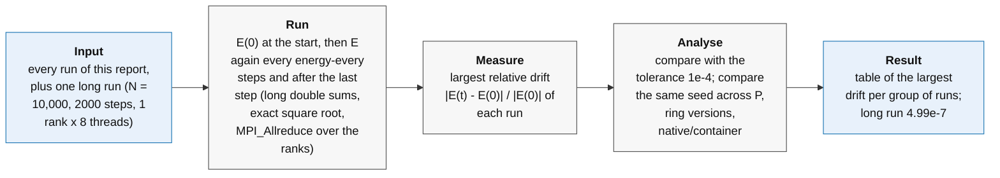
```mermaid
flowchart LR
  A["<b>Input</b><br/>every run of this report,<br/>plus one long run (N =<br/>10,000, 2000 steps, 1<br/>rank x 8 threads)"]
  B["<b>Run</b><br/>E(0) at the start, then E<br/>again every energy-every<br/>steps and after the last<br/>step (long double sums,<br/>exact square root,<br/>MPI_Allreduce over the<br/>ranks)"]
  C["<b>Measure</b><br/>largest relative drift<br/>|E(t) - E(0)| / |E(0)| of<br/>each run"]
  D["<b>Analyse</b><br/>compare with the<br/>tolerance 1e-4; compare<br/>the same seed across P,<br/>ring versions,<br/>native/container"]
  E["<b>Result</b><br/>table of the largest<br/>drift per group of runs;<br/>long run 4.99e-7"]
  A --> B --> C --> D --> E
  classDef io fill:#e8f1fb,stroke:#1f77b4,color:#111;
  classDef step fill:#f7f7f7,stroke:#555,color:#111;
  class A,E io;
  class B,C,D step;
```

### Energy drift across all experiments

Before looking at speed, we want to be sure that the program computes the right thing, also when it runs in parallel. The energy drift is recorded in every run of this report.

The total energy is the energy of motion T plus the gravitational energy U. U uses the same softening as the force, and each pair is counted once:

```text
T = sum over i of  (1/2) m_i |v_i|^2
U = - sum over pairs i < j of  G m_i m_j / sqrt(|r_j - r_i|^2 + epsilon^2)
E = T + U
```

At the start the program stores E(0). Every time it computes the energy again, it measures the relative change and keeps the largest value found during the run:

```text
energy drift = max over the checks of  |E(t) - E(0)| / |E(0)|
```

The run is controlled by a few parameters of the program:

| Parameter | Meaning |
|---|---|
| `--nsteps` | number of time steps; each step is one kick-drift-kick cycle |
| `--dt` | length of one time step (1e-4 in all experiments); the simulated time is nsteps x dt |
| `--energy-every` | how often the energy is checked: after every `energy-every` steps, and always after the last step |
| `--energy-tol` | tolerance on the drift (1e-4); if the drift is larger, the run is marked FAIL instead of OK |

The forces are computed once before the first step and once in every step, so a run does nsteps + 1 force evaluations. The energy is computed once at the start, to get E(0), and then after the steps that are multiples of `energy-every`, plus the last step. So the number of energy evaluations is:

```text
energy evaluations = 1 + (number of steps s with s % energy_every == 0, or s == nsteps)
```

Some examples from this report:

| Runs | nsteps | energy-every | Energy evaluations |
|---|---:|---:|---:|
| Strong and weak scaling | 100 | 100 | 2 (start and end) |
| Cost of the energy check, sparse case | 5 | 5 | 2 (start and end) |
| Cost of the energy check, frequent case | 5 | 1 | 6 (start and every step) |
| Long validation run | 2000 | 10 | 201 |
| Time-step convergence | 100-400 | 1 | 101-401 (every step) |

The check works like this:

- E(0) is computed once before the first step; after every step that is a multiple of `energy-every`, and after the last step, the program computes E again and keeps the largest relative drift;
- kinetic energy: each rank sums |v|^2 over its own particles, so no communication is needed. The threads split the particles with `#pragma omp parallel for reduction(+ : sum) schedule(static)`, and the sum is kept in `long double`;
- potential energy: it needs all pairs, so it uses the same ring as the force, with blocking `MPI_Sendrecv` exchanges. Each pair is counted once, only when the global index of the home particle is smaller than that of the source particle ("i smaller than j"), always with the exact square root, and with the same OpenMP directive;
- total: `MPI_Allreduce` with `MPI_SUM` (in `MPI_LONG_DOUBLE`) adds the kinetic and potential sums of all ranks, and every rank gets E.

The rule "i smaller than j" makes the work uneven between ranks: the rank with the first particles accepts almost all its pairs, the rank with the last ones almost none. The strong-scaling section measures the effect of this.

The largest values seen in each group of runs are:

| Runs | Particles N | Steps | Ranks x threads | Largest energy drift |
|---|---:|---:|---|---:|
| Strong scaling | 100000 | 100 | 1-32 x 1 | 2.1e-6 |
| Weak scaling | 10000-160000 | 100 | 1-16 x 1 | 4.7e-6 |
| Same runs inside the container | 10000-160000 | 100 | 1-32 x 1 | identical to native |
| MPI/OpenMP mapping | 100000 | 20 | 64 cores | 4.9e-7 |
| Blocking vs overlapped communication | 100000 | 20 | 2-32 x 1 | 4.9e-7 |
| Optimisation tests | 10000 | 5 | 1 x 1-16 | 1.3e-7 |
| Compilation targets | 100000 | 10 | 32 x 1 | 1.5e-7 |
| Time-step convergence | 10000 | 100-400 | 1 x 8 | 2.5e-7 |
| Long validation run | 10000 | 2000 | 1 x 8 | 5.0e-7 |

All values are below the tolerance of 1e-4: the largest one, 4.7e-6, is about 20 times smaller.

The drift also does not depend on how the work is divided. In the strong-scaling runs the same five initial conditions were run with every number of ranks from 1 to 32. For each input the drift is the same at every rank count to about nine significant digits:

| Input | P = 1 | P = 2 | P = 4 | P = 8 | P = 16 | P = 32 |
|---:|---:|---:|---:|---:|---:|---:|
| 1 | 1.7159563851e-6 | 1.7159563855e-6 | 1.7159563845e-6 | 1.7159563851e-6 | 1.7159563848e-6 | 1.7159563848e-6 |
| 2 | 1.4472776047e-6 | 1.4472776086e-6 | 1.4472776063e-6 | 1.4472776070e-6 | 1.4472776070e-6 | 1.4472776070e-6 |
| 3 | 2.1184062564e-6 | 2.1184062617e-6 | 2.1184062643e-6 | 2.1184062633e-6 | 2.1184062633e-6 | 2.1184062633e-6 |
| 4 | 1.6823944506e-6 | 1.6823944516e-6 | 1.6823944512e-6 | 1.6823944509e-6 | 1.6823944512e-6 | 1.6823944509e-6 |
| 5 | 1.3408127421e-6 | 1.3408127438e-6 | 1.3408127428e-6 | 1.3408127428e-6 | 1.3408127428e-6 | 1.3408127428e-6 |

Only the last digits change, because a different number of ranks adds the forces in a different order. The drift is also identical between the blocking and the overlapped ring (section on hiding communication) and between the native and the container runs (cloud part).

### A longer validation run

The runs above are short (5 to 100 steps). To check energy conservation over a longer run for a Plummer sphere of 10,000 particles, we also ran one long simulation:

- N = 10,000, 2000 steps of dt = 1e-4 (twenty times longer than the scaling runs);
- one rank with 8 threads, exact square root;
- energy checked every 10 steps (201 checks);
- only the energy matters here, so the job ran on a shared node with 8 cores and its timings are not used.

| N | Steps | dt | Simulated time | Energy checks | Largest energy drift |
|---:|---:|---:|---:|---:|---:|
| 10000 | 2000 | 1e-4 | 0.2 | every 10 steps | 4.99e-7 |

Over the whole run the largest drift is 4.99e-7: about 200 times below our tolerance of 1e-4 and 2000 times below 1e-3. The time-step convergence runs, with the same N, dt and threads but only 100 steps, reach at most 2.5e-7 (table above). Running twenty times longer therefore only doubles the largest drift, instead of multiplying it by twenty. This agrees with the leapfrog method, whose energy error oscillates in a bounded range instead of growing with time. The program records only the largest drift, not the full history E(t), so this is an indication rather than a proof.

---

## Cost of the energy check

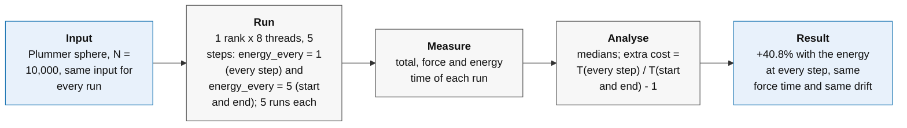
```mermaid
flowchart LR
  A["<b>Input</b><br/>Plummer sphere, N =<br/>10,000, same input for<br/>every run"]
  B["<b>Run</b><br/>1 rank x 8 threads, 5<br/>steps: energy_every = 1<br/>(every step) and<br/>energy_every = 5 (start<br/>and end); 5 runs each"]
  C["<b>Measure</b><br/>total, force and energy<br/>time of each run"]
  D["<b>Analyse</b><br/>medians; extra cost =<br/>T(every step) / T(start<br/>and end) - 1"]
  E["<b>Result</b><br/>+40.8% with the energy<br/>at every step, same<br/>force time and same drift"]
  A --> B --> C --> D --> E
  classDef io fill:#e8f1fb,stroke:#1f77b4,color:#111;
  classDef step fill:#f7f7f7,stroke:#555,color:#111;
  class A,E io;
  class B,C,D step;
```

The potential energy needs every pair of particles, like the force, so checking it often can change the timing of a performance run. We measured how much:

- N = 10,000, 5 steps, one rank with 8 threads, the same input for every run, five runs per setting;
- energy at every step (`energy_every = 1`, 6 energy evaluations: the start and steps 1-5) against energy only at the start and at the end (`energy_every = 5`, 2 evaluations).

With medians over the five runs:

```text
extra cost              = T_total(every step) / T_total(start and end only) - 1
time per evaluation     = T_energy / number of energy evaluations
```

| Energy computed | Energy evaluations | Median total (s) | Median force (s) | Median energy (s) | Time per evaluation (s) | Extra cost | Largest drift |
|---|---:|---:|---:|---:|---:|---:|---:|
| every step | 6 | 0.5546 | 0.3012 | 0.2476 | 0.0413 | +40.8% | 9.62e-8 |
| start and end only | 2 | 0.3938 | 0.3019 | 0.0880 | 0.0440 | baseline | 9.62e-8 |

The table shows:

- the force time is the same in both settings (0.3012 s and 0.3019 s), so the whole difference in total time comes from the energy phase;
- one energy evaluation costs about the same in both settings (0.041-0.044 s), so the energy time grows with the number of evaluations: 6 instead of 2 evaluations take 0.2476 s instead of 0.0880 s;
- computing the energy at every step makes the run 40.8% slower;
- the largest drift is the same, 9.62e-8, in both settings: in this run, checking at every step finds no larger deviation than checking only at the start and at the end.

For this reason all performance runs compute the energy only at the start and at the end.

---

## Profiling: where the time goes and kernel throughput

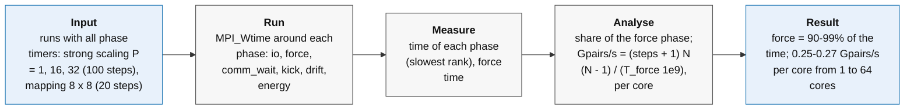
```mermaid
flowchart LR
  A["<b>Input</b><br/>runs with all phase<br/>timers: strong scaling P<br/>= 1, 16, 32 (100 steps),<br/>mapping 8 x 8 (20 steps)"]
  B["<b>Run</b><br/>MPI_Wtime around each<br/>phase: io, force,<br/>comm_wait, kick, drift,<br/>energy"]
  C["<b>Measure</b><br/>time of each phase<br/>(slowest rank), force<br/>time"]
  D["<b>Analyse</b><br/>share of the force phase;<br/>Gpairs/s = (steps + 1) N<br/>(N - 1) / (T_force 1e9),<br/>per core"]
  E["<b>Result</b><br/>force = 90-99% of the<br/>time; 0.25-0.27 Gpairs/s<br/>per core from 1 to 64<br/>cores"]
  A --> B --> C --> D --> E
  classDef io fill:#e8f1fb,stroke:#1f77b4,color:#111;
  classDef step fill:#f7f7f7,stroke:#555,color:#111;
  class A,E io;
  class B,C,D step;
```

To identify the bottleneck we need measurements. Hardware counters were not available, so we use the program's own instrumentation: the phase timers described in the methods, and the throughput of the force kernel. The throughput is our "memory-bandwidth-style" measure of performance. A memory-bound code is naturally measured in bytes per second; for an O(N^2) kernel the natural unit of useful work is one particle pair, so we measure pairs per second:

```text
Gpairs/s = (number of steps + 1) x N x (N - 1) / (T_force x 1e9)
```

| Run | Cores | Force phase, share of total time | Gpairs/s (whole run) | Gpairs/s per core |
|---|---:|---:|---:|---:|
| N = 100,000, 100 steps, 1 rank x 1 thread | 1 | 99.1% | 0.267 | 0.267 |
| N = 100,000, 100 steps, 16 ranks x 1 thread | 16 | 98.3% | 4.27 | 0.267 |
| N = 100,000, 100 steps, 32 ranks x 1 thread | 32 | 98.3% | 8.32 | 0.260 |
| N = 100,000, 20 steps, 8 ranks x 8 threads | 64 | 90.4% | 16.27 | 0.254 |

The force phase takes 90-99% of the run in every configuration. The rest is almost only the energy check, which is also a pair computation; waiting for messages stays below 1% and moving the particles costs a fraction of a percent. The throughput per core stays between 0.25 and 0.27 billion pairs per second from 1 to 64 cores, so adding cores adds throughput almost linearly. This is what we expect when each core works on data held in its own caches, and not what we would see if the cores were competing for a shared resource such as main memory. One pair costs about 1 / 0.267e9 = 3.7 ns on one core, and most of this time goes into the square root and the division; this is why the square-root optimisation, which makes the force phase about eight times faster, had by far the largest effect. Hardware counters would be needed to confirm this with counted events, but the timers and the throughput point in the same direction: the program is limited by the arithmetic of each pair, not by memory or communication.

---

## Strong scaling

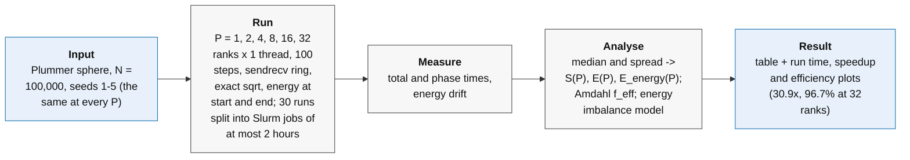
```mermaid
flowchart LR
  A["<b>Input</b><br/>Plummer sphere, N =<br/>100,000, seeds 1-5 (the<br/>same at every P)"]
  B["<b>Run</b><br/>P = 1, 2, 4, 8, 16, 32<br/>ranks x 1 thread, 100<br/>steps, sendrecv ring,<br/>exact sqrt, energy at<br/>start and end; 30 runs<br/>split into Slurm jobs of<br/>at most 2 hours"]
  C["<b>Measure</b><br/>total and phase times,<br/>energy drift"]
  D["<b>Analyse</b><br/>median and spread -><br/>S(P), E(P), E_energy(P);<br/>Amdahl f_eff; energy<br/>imbalance model"]
  E["<b>Result</b><br/>table + run time, speedup<br/>and efficiency plots<br/>(30.9x, 96.7% at 32<br/>ranks)"]
  A --> B --> C --> D --> E
  classDef io fill:#e8f1fb,stroke:#1f77b4,color:#111;
  classDef step fill:#f7f7f7,stroke:#555,color:#111;
  class A,E io;
  class B,C,D step;
```

Strong scaling measures how much faster a problem of fixed size runs when we add cores. Ideally, 32 cores would be 32 times faster. In practice some parts do not speed up: communication between ranks, work that every rank repeats, and waiting for the slowest rank. The way the efficiency drops as cores are added shows where these limits are.

Set-up:

- N = 100,000 particles, 100 time steps of dt = 1e-4;
- P = 1, 2, 4, 8, 16 and 32 ranks, one thread each, on GENOA nodes;
- blocking ring (`sendrecv`), direct kernel, exact square root, energy checked only at the start and at the end;
- the ranks wait for each other only in the ring exchanges (`MPI_Sendrecv`), in the energy reduction (`MPI_Allreduce`) and in the final gather of the particles;
- five repetitions per point, with the same five initial conditions (seeds) at every P, no warm-up;
- the same executable for every P, with all phase timers recorded;
- 30 runs split into Slurm jobs of at most two hours (one run on one core takes about 64 minutes): one job per repetition at P = 1, fewer jobs for the faster points; P = 8, 16 and 32 in one job on the same node;
- largest energy drift 2.1e-6.

Besides the speedup and efficiency of the total time, the table gives the efficiency of the energy check, computed in the same way from the median time of that phase, the waiting time as a share of the total, and the speed of the force computation of each rank:

```text
E_energy(P)        = T_energy(1) / (P x T_energy(P))
waiting            = T_comm_wait(P) / T_total(P)
Gpairs/s per rank  = (number of steps + 1) x N x (N - 1) / (T_force(P) x 1e9 x P)
```

The force computation needs no separate efficiency: the number of pairs is fixed, so if the Gpairs/s per rank stay the same as with one rank, the force computation has an efficiency of 100%.

| MPI ranks P | N/P | Median total (s) | Spread s (s) | Speedup | Efficiency (total) | Efficiency (energy check) | Waiting for messages | Gpairs/s per rank |
|---:|---:|---:|---:|---:|---:|---:|---:|---:|
| 1 | 100000 | 3823.47 | 2.27 | 1.00 | 100.0% | 100.0% | 0.00% | 0.2667 |
| 2 | 50000 | 1920.50 | 0.63 | 1.99 | 99.5% | 69.6% | 0.27% | 0.2665 |
| 4 | 25000 | 960.53 | 0.86 | 3.98 | 99.5% | 60.6% | 0.27% | 0.2670 |
| 8 | 12500 | 480.42 | 1.01 | 7.96 | 99.5% | 56.9% | 0.19% | 0.2672 |
| 16 | 6250 | 240.56 | 1.67 | 15.89 | 99.3% | 55.1% | 0.26% | 0.2670 |
| 32 | 3125 | 123.59 | 0.02 | 30.94 | 96.7% | 52.9% | 0.24% | 0.2599 |

<p align="center"></p>

_The run time falls from about 64 minutes on one core to about 2 minutes on 32 cores, following the ideal line T(1)/P._

<p align="center"> 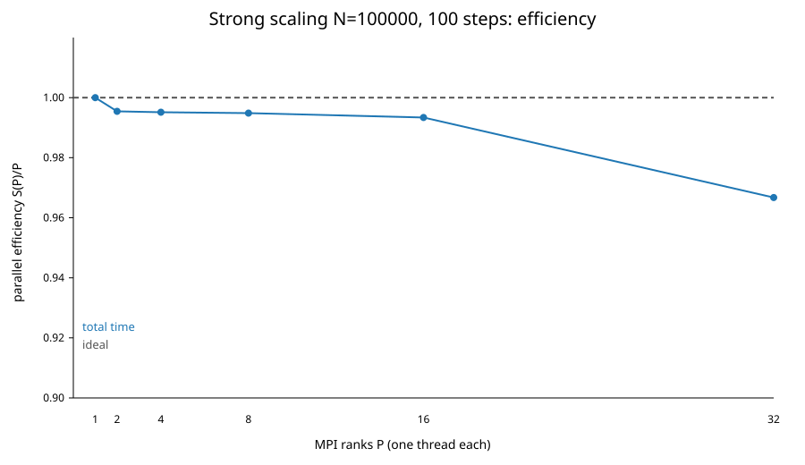</p>

_Left: the speedup reaches 30.9 at 32 ranks, against an ideal of 32. Right: the efficiency stays above 99% up to 16 ranks and falls to 96.7% at 32 ranks (note the vertical scale, from 0.90 to 1.02)._

Up to 16 ranks the efficiency stays above 99%, and 32 ranks are 30.9 times faster than one, an efficiency of 96.7%. The force computation processes 0.267 billion pairs per second per rank both with 1 and with 16 ranks. The waiting time for ring messages stays below 0.3% of the run at every P.

The only point clearly below 99% is P = 32. The waiting time there is still 0.24%, but the force computation of each rank is slower: 0.260 billion pairs per second, about 2.5% less than at all the other rank counts. This looks like a property of the node, not of the scaling. The runs with 8, 16 and 32 ranks ran in the same job on the same node (genoa004), and with 8 and 16 ranks the speed per rank is normal. So some of the extra cores used only at 32 ranks are probably slower, for example because they run at a lower clock. The timers cannot confirm the cause.

The phase timers show that the other loss comes from the energy check. Its efficiency drops to about 70% with 2 ranks and to about 55% from 8 ranks on. The reason is a load imbalance in how the energy is computed. To count each pair once, a rank adds the pair (i, j) only when the global index of i is smaller than that of j. The rank that owns the first particles accepts almost all its pairs, while the rank that owns the last particles accepts almost none. Everybody waits for the busiest rank, which has 2 - 1/P times the average work, so the expected efficiency is:

```text
E_energy(P) = 1 / (2 - 1/P)
```

This gives 67%, 57%, 53%, 52% and 51% at 2, 4, 8, 16 and 32 ranks, close to the measured 70%, 61%, 57%, 55% and 53%. It is Amdahl's law inside a single routine: a part of the work that does not divide evenly limits the whole. In these runs the energy is computed only twice, so it takes 0.9% of the time on one rank and 1.7% on 32 ranks, and its effect on the total is below one percentage point. With more frequent checks it would matter more. The fix is well known, for example letting each rank handle only half of the ring so that every rank gets the same number of unique pairs; it was not needed for correctness and was not applied.

Amdahl's law can also summarise the whole curve. If a fraction f of the work did not speed up at all, the speedup could never exceed 1/f. Solving Amdahl's formula for f with the measured speedups gives an effective serial fraction:

```text
f_eff = (1/S(P) - 1/P) / (1 - 1/P)
P = 16:  f_eff = 0.00044
P = 32:  f_eff = 0.00111
```

The losses behave as if about 0.05-0.1% of the work were serial: a mix of the unbalanced energy check and, at 32 ranks, of the slower cores. This is not a real measurement of serial code; it collects every source of loss into one number.

### Limits of strong scaling

Two limits are expected as P grows with N fixed:

- Too little work per rank for vector instructions. Modern cores process several numbers at once (SIMD). When a rank has only a few hundred particles, loop start-up and leftover iterations become a large part of the work. At 32 ranks each rank still has 3,125 particles, so we do not expect this effect, and we do not see it: the force efficiency is about 100% up to 16 ranks, and the lower value at 32 ranks comes from the node, not from the size of the blocks.
- The ring becomes too long. With P ranks, each force evaluation does P message exchanges, one after each block. Only P - 1 are needed: the last one just brings every rank's own block back home, and the code does it anyway to keep the loop simple. The computation per rank shrinks like N^2/P, while the number of messages grows like P. A simple model is:

  ```text
  computation per rank   ~ c x N^2 / P
  communication per rank ~ P x (latency + (data per block) / bandwidth)
  ```

  At some P the two terms become comparable and more ranks stop helping. On one node, where at 32 ranks each message is only about 75 kB (3,125 particles x 3 coordinates x 8 bytes), this point is far beyond 32 ranks for N = 100,000, as the waiting time of at most 0.3% shows. On several nodes it would come earlier.

### Growth of the cost with N

For the direct method the time per step grows like N^2, so multiplying N by 10 should multiply the time by 10^2 = 100.

We check this with two sets of runs that differ only in N, with the same executable and settings: one rank, one thread, 100 steps, N = 10,000 (the first point of the weak-scaling series) and N = 100,000 (the first point of the strong-scaling series).

| N | Median total time (s) |
|---:|---:|
| 10,000 | 38.11 |
| 100,000 | 3823.47 |
| Ratio | 100.32 (expected 100) |

The measured ratio is within 0.3% of the prediction, a difference compatible with the different initial conditions and the different amount of data in the caches. This confirms that the program has the quadratic cost of the direct method.

---

## Weak scaling

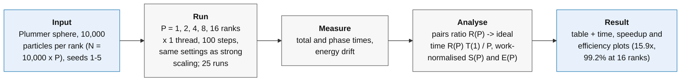
```mermaid
flowchart LR
  A["<b>Input</b><br/>Plummer sphere, 10,000<br/>particles per rank (N =<br/>10,000 x P), seeds 1-5"]
  B["<b>Run</b><br/>P = 1, 2, 4, 8, 16 ranks<br/>x 1 thread, 100 steps,<br/>same settings as strong<br/>scaling; 25 runs"]
  C["<b>Measure</b><br/>total and phase times,<br/>energy drift"]
  D["<b>Analyse</b><br/>pairs ratio R(P) -> ideal<br/>time R(P) T(1) / P, work-<br/>normalised S(P) and E(P)"]
  E["<b>Result</b><br/>table + time, speedup and<br/>efficiency plots (15.9x,<br/>99.2% at 16 ranks)"]
  A --> B --> C --> D --> E
  classDef io fill:#e8f1fb,stroke:#1f77b4,color:#111;
  classDef step fill:#f7f7f7,stroke:#555,color:#111;
  class A,E io;
  class B,C,D step;
```

Weak scaling keeps the number of particles per rank fixed and adds ranks, so that the problem grows with the machine. For many applications the ideal is a constant time.

For the direct N-body method this ideal does not apply. Each rank owns a fixed number of particles, but each of them must interact with all N particles, and N grows with P. So the work per rank grows like P: with 16 ranks each rank has 16 times more pairs than with one. The right ideal is a time that grows linearly with P, not a constant time.

The set-up was:

- 10,000 particles per rank, so N = 10,000, 20,000, 40,000, 80,000 and 160,000;
- P = 1, 2, 4, 8 and 16 ranks, one thread each, 100 time steps, GENOA nodes;
- five repetitions per point, no warm-up; the same executable and settings as the strong-scaling runs (blocking ring, exact square root, energy checked only at the start and at the end).

To compare each point with the ideal, we scale the one-rank time T(1) with the number of pairs:

```text
pairs ratio  R(P) = N_P (N_P - 1) / (N_1 (N_1 - 1))
ideal time   T_ideal(P) = R(P) x T(1) / P          (about P x T(1))
speedup      S(P) = R(P) x T(1) / T(P)
efficiency   E(P) = S(P) / P
```

This speedup is a model-based estimate: the large single-core runs were not done, because at N = 160,000 one would take several hours. It assumes the same cost per pair for all problem sizes, which the growth test of the previous section confirms within 0.3%.

| MPI ranks P | Total particles N | Median total time (s) | Spread s (s) | Ideal time (s) | Time relative to ideal | Work-normalised speedup | Work-normalised efficiency |
|---:|---:|---:|---:|---:|---:|---:|---:|
| 1 | 10000 | 38.11 | 0.004 | 38.1 | 1.000 | 1.00 | 100.0% |
| 2 | 20000 | 76.62 | 0.03 | 76.2 | 1.005 | 1.99 | 99.5% |
| 4 | 40000 | 153.42 | 0.07 | 152.5 | 1.006 | 3.97 | 99.4% |
| 8 | 80000 | 307.16 | 0.72 | 304.9 | 1.007 | 7.94 | 99.3% |
| 16 | 160000 | 614.90 | 1.53 | 609.8 | 1.008 | 15.87 | 99.2% |

<p align="center"></p>

_The time grows with P even though each rank keeps the same number of particles, as expected for an all-pairs method. The measured curve lies on the ideal one: at 16 ranks the ideal is 609.8 s and the measurement 614.9 s, 0.8% higher._

<p align="center"> 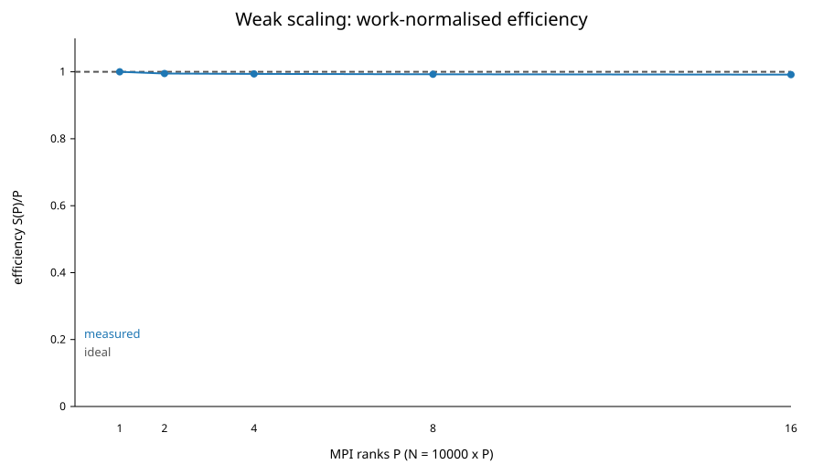</p>

_Left: the work-normalised speedup reaches 15.9 at 16 ranks, against an ideal of 16. Right: the work-normalised efficiency stays above 99% at every P._

The weak-scaling result agrees with the strong-scaling one: the time grows exactly like the number of pairs per rank, and at 16 ranks the extra cost is 0.8%. Waiting for messages takes at most 0.25% of the run, and the energy check, whose imbalance also appears here, takes at most 1.7%.

Gustafson's law is the natural way to read this: when the problem grows with the machine, the parallel part dominates. For direct N-body, the balance between computation and communication stays constant in theory. Per force evaluation each rank computes about n x N = n^2 x P pairs (with n = N/P) and receives n x P particles (P blocks of n, the last one being its own block coming back), so both grow linearly with P. The measurements follow this: the time for messages stays at 0.14-0.25% of the run at every P and does not grow. The small departure from the ideal comes from somewhere else, the energy check, as shown below.

The uneven density of the Plummer sphere does not cause load imbalance in the direct method: every particle interacts with every other one wherever it is, so all ranks have exactly the same number of pairs. Density would matter for a tree code or for any method with a distance cutoff. Imbalance can still come from differences between cores, not from the particle positions.

### The energy check

At 16 ranks the run is 0.8% slower than the ideal. The force computation is within 0.1% of the ideal (604.5 s against 603.9 s) and the waiting for messages stays at 0.14-0.25% at every P, so almost all of the difference comes from the energy check, which is computed twice per run (start and end):

| P | N | Energy time (s) | Share of total | Energy / force, per evaluation |
|---:|---:|---:|---:|---:|
| 1 | 10000 | 0.36 | 0.94% | 0.48 |
| 16 | 160000 | 10.4 | 1.70% | 0.87 |

With one rank an energy evaluation costs about half a force evaluation, as expected, because it counts each pair once. With 16 ranks it costs 1.7 times more than that. This is the same "i smaller than j" imbalance seen in strong scaling: the rank with the lowest indices has the most pairs, up to (2 - 1/P) times the average, and `MPI_Allreduce` waits for it. A balanced energy check would take about 6 s instead of 10.4 s at P = 16; the 4.4 s of difference are 0.7% of the run, almost all of the 0.8%. The loss stays bounded (the efficiency of the energy check tends to 50%) and could be removed by computing the energy less often or by dividing the pairs evenly.

These are single-node measurements: they cannot predict the behaviour over several nodes, where the network would matter.

---

## Mapping MPI ranks and OpenMP threads onto the node

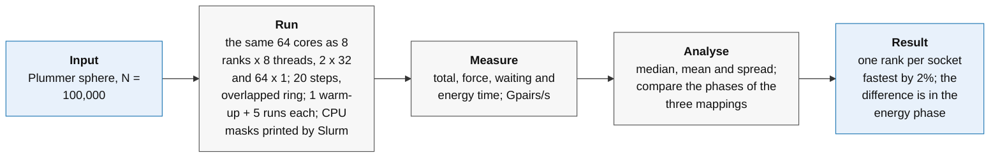
```mermaid
flowchart LR
  A["<b>Input</b><br/>Plummer sphere, N =<br/>100,000"]
  B["<b>Run</b><br/>the same 64 cores as 8<br/>ranks x 8 threads, 2 x 32<br/>and 64 x 1; 20 steps,<br/>overlapped ring; 1 warm-<br/>up + 5 runs each; CPU<br/>masks printed by Slurm"]
  C["<b>Measure</b><br/>total, force, waiting and<br/>energy time; Gpairs/s"]
  D["<b>Analyse</b><br/>median, mean and spread;<br/>compare the phases of the<br/>three mappings"]
  E["<b>Result</b><br/>one rank per socket<br/>fastest by 2%; the<br/>difference is in the<br/>energy phase"]
  A --> B --> C --> D --> E
  classDef io fill:#e8f1fb,stroke:#1f77b4,color:#111;
  classDef step fill:#f7f7f7,stroke:#555,color:#111;
  class A,E io;
  class B,C,D step;
```

The same 64 cores can be used in many ways: 64 ranks with one thread, 8 ranks with 8 threads, 2 ranks with 32 threads, and so on. Fewer ranks mean fewer and shorter ring exchanges, but more threads sharing memory. A common choice is one rank per NUMA domain, so that the threads of each rank use nearby memory. We compared it with one rank per socket and one rank per core, using the same 64 cores:

- one rank per NUMA domain: P = 8 ranks x T = 8 threads;
- one rank per socket: P = 2 x T = 32;
- one rank per core: P = 64 x T = 1.

Set-up:

- N = 100,000, 20 steps, overlapped ring, exact square root, four partial sums, double precision;
- inside each rank the loop over the home particles is split among the threads with `#pragma omp parallel for schedule(static)`, which gives each thread an equal, contiguous block of particles;
- MPI is started with `MPI_Init_thread(..., MPI_THREAD_FUNNELED, ...)`: only the main thread calls MPI, never inside an OpenMP parallel region;
- no `critical` or `atomic` sections and no locks: each thread writes only its own particles, and all sums between threads are OpenMP reductions;
- one warm-up and five measured runs per mapping;
- the CPU masks printed by Slurm confirm that each rank received its own, non-overlapping set of cores (in the NUMA mapping each rank owns exactly one block of 8 cores), and that consecutive ranks are placed alternately on the two sockets.

| Mapping | Ranks P | Threads T | Median total (s) | Mean total (s) | Spread s (s) | Median force (s) | Median waiting for messages (s) | Median Gpairs/s |
|---|---:|---:|---:|---:|---:|---:|---:|---:|
| One rank per NUMA domain | 8 | 8 | 14.275566 | 14.283084 | 0.027015 | 12.909107 | 0.126690 | 16.267422 |
| One rank per socket | 2 | 32 | 13.986056 | 13.988024 | 0.012181 | 12.905388 | 0.051432 | 16.272110 |
| One rank per core | 64 | 1 | 14.025092 | 14.045257 | 0.054429 | 12.852373 | 0.101077 | 16.339232 |

The three mappings are very close: one rank per socket is the fastest, 2.0% faster than one rank per NUMA domain and 0.3% faster than one rank per core.

- The force computation is the same in all three: about 16.3 billion pairs per second, 90-92% of the total time, 12.91 s with both the NUMA and the socket mapping.
- Waiting for messages is lowest with the socket mapping (only 2 ranks in the ring), but it is below 1% of the time in all cases, so it cannot explain the 2% difference.
- Most of the difference is in the energy check: 1.34 s with the NUMA mapping, 1.07 s with the socket mapping and 1.09 s with one rank per core. The uneven split of the energy work does not explain it, because the busiest thread gets about twice the average work in all three mappings. From these data we cannot tell where the extra 0.3 s of the NUMA mapping come from.

So one rank per NUMA domain is not the fastest mapping in this test. For a program limited by arithmetic, whose data fit in the caches, memory locality matters less than expected, and the best mapping has to be measured. The largest energy drift of these runs is 4.94e-7.

---

## Newton's third law: computing each pair only once

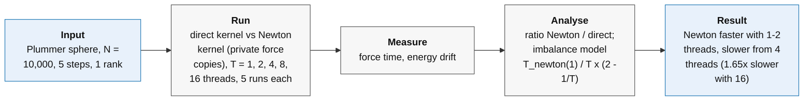
```mermaid
flowchart LR
  A["<b>Input</b><br/>Plummer sphere, N =<br/>10,000, 5 steps, 1 rank"]
  B["<b>Run</b><br/>direct kernel vs Newton<br/>kernel (private force<br/>copies), T = 1, 2, 4, 8,<br/>16 threads, 5 runs each"]
  C["<b>Measure</b><br/>force time, energy drift"]
  D["<b>Analyse</b><br/>ratio Newton / direct;<br/>imbalance model<br/>T_newton(1) / T x (2 -<br/>1/T)"]
  E["<b>Result</b><br/>Newton faster with 1-2<br/>threads, slower from 4<br/>threads (1.65x slower<br/>with 16)"]
  A --> B --> C --> D --> E
  classDef io fill:#e8f1fb,stroke:#1f77b4,color:#111;
  classDef step fill:#f7f7f7,stroke:#555,color:#111;
  class A,E io;
  class B,C,D step;
```

The force computation takes 90% or more of the run time, so it is the obvious place to look for speed. The next sections test several classic optimisations one at a time, and report the result also when an idea does not pay off.

For this section and the next two, unless stated otherwise, the tests use a small, quick configuration so that many variants can be compared under the same conditions:

- N = 10,000 particles, 5 steps, dt = 1e-4, epsilon = 0.05, energy only at the start and end;
- one rank, first with one thread and then with 2, 4, 8 and 16 threads;
- five repetitions per variant, no warm-up; 55 runs per thread count (11 variants x 5), 275 runs in total.

A single rank keeps communication out of the picture, and starting from one thread shows the effect of each idea on the computation before thread effects come in.

Newton's third law says that the force of particle j on particle i is equal and opposite to the force of i on j. The direct loop computes both, so in principle we could compute each pair once and use the result twice, halving the arithmetic.

In the direct loop each thread writes only the forces of its own particles. With the third law, a thread that handles the pair (i, j) must also update particle j, which may belong to another thread. Two threads could then update the same particle at the same time, and one update would be lost. This must be prevented, and that has a cost.

Our implementation:

- each thread has its own private copy of the force arrays;
- inside one `#pragma omp parallel` region, the rows i are split among the threads with `#pragma omp for schedule(static)`; each thread computes the pairs (i, j) with j > i once and writes into its own copy;
- a second `#pragma omp parallel for` adds all the copies together;
- no locks or atomic operations in the pair loop.

The price is extra memory (three arrays per thread) and the work of clearing and summing the copies, which grows like T x N. The saving grows like N^2, so the trade-off favours the third law when N is large compared with the number of threads, and the copies weigh more with many threads and small N.

The first test uses 1 rank and 1 thread.

| Kernel | Median total (s) | Mean total (s) | Spread s (s) | Median force (s) |
|---|---:|---:|---:|---:|
| Direct (every pair twice) | 2.601807 | 2.605978 | 0.007693 | 2.235868 |
| Newton (every pair once) | 1.767468 | 1.768040 | 0.003336 | 1.401407 |

The third law reduces the total time by 32% (a speedup of 1.47x), and the force phase alone by 37% (1.60x). This is less than the ideal factor of 2 because only the arithmetic is halved: the loop still has to read the particles, and the extra bookkeeping adds some work. Both kernels give the same energy drift (1.2974058e-7).

With one thread there is no conflict between threads, so this test shows the benefit of the idea but not its full cost. The real trade-off appears with several threads, so the comparison was repeated with 2, 4, 8 and 16 threads (five runs each). The table uses the force time, where the two kernels differ. The last column is a simple model explained below the figures.

| Threads | Direct force (s) | Newton force (s) | Newton / direct | Newton, simple imbalance model (s) |
|---:|---:|---:|---:|---:|
| 1 | 2.2359 | 1.4014 | 0.63 | 1.4014 |
| 2 | 1.1174 | 1.0514 | 0.94 | 1.0511 |
| 4 | 0.5589 | 0.6144 | 1.10 | 0.6131 |
| 8 | 0.2801 | 0.3401 | 1.21 | 0.3285 |
| 16 | 0.1407 | 0.2326 | 1.65 | 0.1697 |

<p align="center">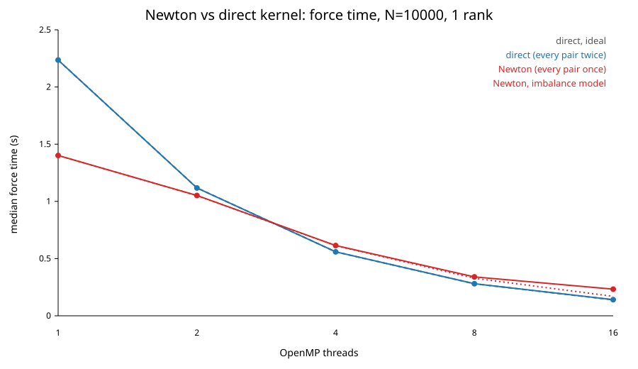 </p>

_Left: the direct kernel follows the ideal line, halving its time at every doubling of threads, while Newton's kernel improves much less. Right: Newton is faster with 1 and 2 threads and slower from 4 threads on, 1.65 times slower with 16._

With one thread, computing each pair once saves 37% of the force time. With two threads the saving has almost disappeared (6%), and from four threads on Newton's kernel is slower than the direct one, by 10% with 4 threads and by 65% with 16. The direct kernel with 16 threads is 15.9 times faster than with one.

The main reason is not the private copies but how the work is divided. In Newton's kernel, row i contains only the pairs with j > i, so the first rows are long and the last rows almost empty. `schedule(static)` gives each thread an equal number of rows, so the thread with the first rows has much more work than the thread with the last rows, and everybody waits for it. The busiest thread has 2 - 1/T times the average work, which gives the model in the last column:

```text
T_model(T) = T_newton(1) / T x (2 - 1/T)
```

Using only this rule and the one-thread time, the model predicts the measured times within 0.5% for 2 and 4 threads and within 4% for 8 threads. At 16 threads the measured time is higher than the model, because the fixed cost of clearing and adding the 16 private copies is no longer small compared with the shrinking pair work. The energy check shows the same kind of imbalance between MPI ranks: whenever pairs are counted once with an "i smaller than j" rule and the work is split in equal blocks, the first worker gets too much.

### When the saving outweighs the cost of the conflict, and when it does not

The measurements allow a simple budget. Call D(T) the force time of the direct kernel with T threads; the measurements give D(T) = D(1) / T within 1%. For Newton's kernel three terms add up:

```text
Newton(T) = r x D(1) / T  x  (2 - 1/T)   +   overhead of the private copies
            ^ saved flops    ^ imbalance      ^ conflict resolution
```

- r = Newton(1) / D(1) = 1.4014 / 2.2359 = 0.63 is the real saving per pair. It is not 0.5, because each pair now also writes the force of particle j back to memory, while the direct loop keeps its sums in registers and never writes inside the inner loop.
- (2 - 1/T) is the load imbalance of `schedule(static)` on the triangular loop j > i.
- The overhead is clearing the T private copies before the loop and adding them after it.

Newton's kernel is faster only if Newton(T) / D(T) < 1. Ignoring the overhead, this means r x (2 - 1/T) < 1, that is 2 - 1/T < 1.6, so T < 2.5. The measurements agree: Newton wins with 1 and 2 threads (0.63 and 0.94) and loses from 4 threads on (1.10, 1.21, 1.65). With the static schedule, the imbalance alone cancels the saving from three threads on, before the copies cost anything.

The overhead of the copies is small up to 8 threads (0.012 s, 4% of the direct time) but reaches 0.063 s at 16 threads, 45% of the direct time. Each thread must clear and add arrays of size N, work that does not shrink when threads are added, while its share of pairs, N^2 / T, does. The copies therefore cost more as T grows and less as N grows.

The saving in flops outweighs the conflict resolution when:

- few threads write into the same arrays (1-2 threads with our static schedule);
- the work is balanced, for example with `schedule(dynamic)` or by pairing a long row with a short one. Then the imbalance factor disappears and the saving r = 0.63 is kept, as long as the copies stay cheap;
- N per thread is large, so the pair work (N^2 / T) is much larger than clearing and adding the copies (N per thread);
- the cost per pair is high, as with the exact square root and division: saving half of an expensive operation is worth more than the extra writes.

It does not pay off when:

- many threads work on a small N: at N = 10,000 and 16 threads the imbalance and the copies make Newton 1.65 times slower;
- the conflict is resolved with `atomic` or `critical`: every pair would then pay a synchronised update, which costs more than the arithmetic it saves;
- the pair computation is cheap, for example with the vectorised approximate square root: the direct loop becomes about eight times faster, while the writes to particle j, scattered in memory, do not become faster and are harder to vectorise;
- the particles are on different MPI ranks: the force on j would have to be sent back to its owner, adding communication.

For our production runs the direct kernel is the better choice. With many threads per rank Newton loses, as measured. With one thread per rank and many ranks, each rank spends only 1/P of its pair work on its own particles; the other P - 1 blocks belong to other ranks, where the third law would require sending forces back. The direct kernel does twice the arithmetic, but needs no synchronisation, and its force time decreases as 1/T.

Using the idea across MPI ranks would be even harder: the force computed for a particle owned by another rank would have to be sent back to its owner, adding communication. Our production solver does not do this. Note also that the Newton kernel computes N(N-1)/2 pairs, while the Gpairs/s formula counts N(N-1), so its throughput is an effective value.

---

## A faster inverse square root

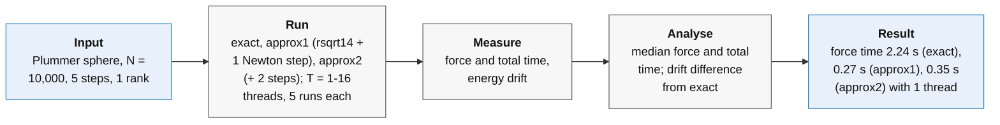
```mermaid
flowchart LR
  A["<b>Input</b><br/>Plummer sphere, N =<br/>10,000, 5 steps, 1 rank"]
  B["<b>Run</b><br/>exact, approx1 (rsqrt14 +<br/>1 Newton step), approx2<br/>(+ 2 steps); T = 1-16<br/>threads, 5 runs each"]
  C["<b>Measure</b><br/>force and total time,<br/>energy drift"]
  D["<b>Analyse</b><br/>median force and total<br/>time; drift difference<br/>from exact"]
  E["<b>Result</b><br/>force time 2.24 s (exact),<br/>0.27 s (approx1), 0.35 s<br/>(approx2) with 1 thread"]
  A --> B --> C --> D --> E
  classDef io fill:#e8f1fb,stroke:#1f77b4,color:#111;
  classDef step fill:#f7f7f7,stroke:#555,color:#111;
  class A,E io;
  class B,C,D step;
```

For every pair the force needs 1 / sqrt(r^2 + epsilon^2), and an exact square root followed by a division is one of the slowest operations in the loop. Modern processors have a special instruction that gives a rough approximation of 1/sqrt(x) very quickly. On our AVX-512 processor it is `_mm512_rsqrt14_pd`, accurate to about 14 bits (4 significant digits). The approximation can be improved with one or two cheap Newton-Raphson correction steps; each step roughly doubles the number of correct digits:

```text
y_new = y x (1.5 - 0.5 x q x y^2)      where y is the estimate of 1/sqrt(q)
```

The solver offers three options:

- `exact`: the standard square root and division;
- `approx1`: hardware approximation plus one correction step;
- `approx2`: hardware approximation plus two correction steps.

Implementation:

- approximate options: a separate hand-written loop that processes eight pairs at once with AVX-512 intrinsics (`_mm512_rsqrt14_pd` for the estimate, `_mm512_fmadd_pd` for the fused multiply-adds);
- exact option: the ordinary loop.

So the comparison is between two complete implementations, not only between two square-root instructions.

| Method | Median total (s) | Mean total (s) | Spread s (s) | Median force (s) | Largest energy drift |
|---|---:|---:|---:|---:|---:|
| exact | 2.602213 | 2.603644 | 0.004365 | 2.235830 | 1.2974058018291037e-7 |
| approx1 | 0.635762 | 0.637167 | 0.003193 | 0.270813 | 1.2974022806770565e-7 |
| approx2 | 0.723951 | 0.722741 | 0.002251 | 0.354722 | 1.2974058018291037e-7 |

The five single runs:

| Method | Run 1 (s) | Run 2 (s) | Run 3 (s) | Run 4 (s) | Run 5 (s) |
|---|---:|---:|---:|---:|---:|
| exact | 2.608489 | 2.602213 | 2.598911 | 2.600601 | 2.608007 |
| approx1 | 0.639448 | 0.634745 | 0.641584 | 0.635762 | 0.634297 |
| approx2 | 0.720288 | 0.720345 | 0.723951 | 0.724101 | 0.725020 |

The gain is large: the force phase becomes 8.3 times faster with one correction step and 6.3 times faster with two. The whole solver becomes about 4 times faster; it cannot gain as much as the force phase because the remaining 0.37 s (reading input, energy checks, moving particles) is not accelerated. The second correction step costs about 0.08 s more, as expected from the extra arithmetic.

This is more than the 2-3 times usually quoted for the square root alone. Most of the gain comes from the fully vectorised loop, which handles eight pairs per instruction, while the exact path does one pair at a time. The timings do not allow us to split the gain between "faster square root" and "vector instructions".

The same comparison with 2, 4, 8 and 16 threads gives:

| Threads | Exact force (s) | approx1 force (s) | approx2 force (s) | Exact total (s) | approx1 total (s) |
|---:|---:|---:|---:|---:|---:|
| 1 | 2.2358 | 0.2708 | 0.3547 | 2.6022 | 0.6358 |
| 2 | 1.1175 | 0.1356 | 0.1774 | 1.3790 | 0.3960 |
| 4 | 0.5590 | 0.0680 | 0.0888 | 0.7122 | 0.2203 |
| 8 | 0.2803 | 0.0345 | 0.0450 | 0.3649 | 0.1194 |
| 16 | 0.1413 | 0.0178 | 0.0231 | 0.1874 | 0.0638 |

The gain in the force computation stays at about 8 times (one correction) and 6 times (two corrections) at every thread count, so the fast version parallelises in the same way as the exact one. The gain on the total time, however, falls from 4.1 to 2.9 times as threads are added. This is Amdahl's law on a small scale: the force phase shrinks by a factor of 8, but the other parts of the run (reading the input and the energy check, which always uses the exact square root) are not accelerated, so they become a larger share of what remains.

One correction step brings the approximation to roughly 8 significant digits, not the 16 of full double precision; two steps come much closer but do not guarantee identical results. In our runs the energy drift of `approx1` differs from the exact one by only 3.5e-13, and `approx2` gives the same printed value as `exact`. The drift is a single number for the whole system, so equal drifts show that energy conservation is equally good, not that the particles follow identical trajectories. That would require comparing the positions directly, which the program does not output.

To make sure that the energy check really tests the integrator and is not blind to the approximation error, we took two precautions:

- The energy is computed independently of the approximation: the energy routine always uses the exact double-precision square root, so the approximation cannot hide its own error in the check.
- The drift does not change when the approximation is refined: if the approximation error dominated, `approx1` would show a clearly larger drift than `approx2` and `exact`. It does not.

These runs are short (5 steps, energy checked only at the start and end), so on their own they are not a full proof. The stronger test is the convergence study below.

### Time-step convergence study

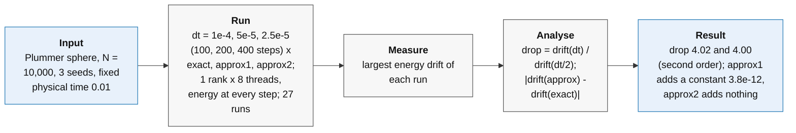
```mermaid
flowchart LR
  A["<b>Input</b><br/>Plummer sphere, N =<br/>10,000, 3 seeds, fixed<br/>physical time 0.01"]
  B["<b>Run</b><br/>dt = 1e-4, 5e-5, 2.5e-5<br/>(100, 200, 400 steps) x<br/>exact, approx1, approx2;<br/>1 rank x 8 threads,<br/>energy at every step; 27<br/>runs"]
  C["<b>Measure</b><br/>largest energy drift of<br/>each run"]
  D["<b>Analyse</b><br/>drop = drift(dt) /<br/>drift(dt/2);<br/>|drift(approx) -<br/>drift(exact)|"]
  E["<b>Result</b><br/>drop 4.02 and 4.00<br/>(second order); approx1<br/>adds a constant 3.8e-12,<br/>approx2 adds nothing"]
  A --> B --> C --> D --> E
  classDef io fill:#e8f1fb,stroke:#1f77b4,color:#111;
  classDef step fill:#f7f7f7,stroke:#555,color:#111;
  class A,E io;
  class B,C,D step;
```

The leapfrog method is second order: if the time step is halved, its error should become about four times smaller. So we simulate the same stretch of physical time with smaller and smaller time steps and watch the energy drift fall. For each halving of dt we compute:

```text
drop = drift(dt) / drift(dt/2)          (ideal value 4 for a second-order method)
difference vs exact = | drift(approx) - drift(exact) |   (same initial condition)
```

With the exact square root the drift should keep falling by four at each halving. An approximate square root adds an extra error that does not shrink with the time step. As long as this extra error is small, all three methods fall together. If an approximate version stopped improving while the exact one kept going, we would have found the point where the approximation becomes the limiting error.

Set-up:

- N = 10,000 Plummer particles, one rank with 8 threads, fixed physical time 0.01;
- dt = 1e-4 (100 steps), dt/2 = 5e-5 (200 steps), dt/4 = 2.5e-5 (400 steps);
- energy checked at every step, three initial conditions (seeds) per point;
- `exact`, `approx1` and `approx2`: 27 runs in total;
- 8 cores of a shared node, so the timings are not used.

| dt | Steps | exact: largest drift | Drop vs previous dt | approx1: largest drift | approx2: largest drift | Largest difference approx1 vs exact |
|---:|---:|---:|---:|---:|---:|---:|
| 1e-4 | 100 | 2.5305e-7 | - | 2.5304e-7 | 2.5305e-7 | 3.7e-12 |
| 5e-5 | 200 | 6.2991e-8 | 4.02x | 6.2989e-8 | 6.2991e-8 | 3.8e-12 |
| 2.5e-5 | 400 | 1.5731e-8 | 4.00x | 1.5728e-8 | 1.5731e-8 | 3.8e-12 |


The results lead to three conclusions:

- The integrator behaves as theory says. Halving the time step reduces the drift by 4.02 and then 4.00 times, which confirms that the leapfrog is second order and that the energy check really measures the integration error.
- The energy check cannot tell `approx2` apart from `exact`. In every run its drift agrees with the exact one to all printed digits (about 16 significant figures), so for energy conservation two correction steps are as good as the standard square root. This does not prove that positions and velocities are identical, because the drift is a global number and small differences in single particles could cancel in it.
- `approx1` leaves a small, constant mark. Its drift differs from the exact one by about 3.8e-12 at every time step, an error that does not shrink with dt, as expected from a fixed approximation error. It is 60,000 times smaller than the integration error at dt = 1e-4 and still more than 4000 times smaller at dt/4. Following the factor-of-four trend, the two would only become comparable at a time step about 60 times smaller than our smallest one (around 4e-7).

At the time steps we tested, the energy check is limited by the integrator, not by the square-root approximation. `approx2` shows no measurable effect on energy conservation, and `approx1` only a very small one, far below the integration error. Before using them in production, a direct comparison of the final positions with the exact version would be the natural next check, because the energy drift alone cannot detect errors that cancel out.

---

## Independent partial sums and the limits of the processor - FMA

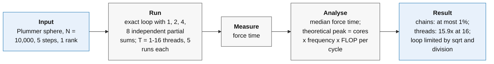
```mermaid
flowchart LR
  A["<b>Input</b><br/>Plummer sphere, N =<br/>10,000, 5 steps, 1 rank"]
  B["<b>Run</b><br/>exact loop with 1, 2, 4,<br/>8 independent partial<br/>sums; T = 1-16 threads, 5<br/>runs each"]
  C["<b>Measure</b><br/>force time"]
  D["<b>Analyse</b><br/>median force time;<br/>theoretical peak = cores<br/>x frequency x FLOP per<br/>cycle"]
  E["<b>Result</b><br/>chains: at most 1%;<br/>threads: 15.9x at 16;<br/>loop limited by sqrt and<br/>division"]
  A --> B --> C --> D --> E
  classDef io fill:#e8f1fb,stroke:#1f77b4,color:#111;
  classDef step fill:#f7f7f7,stroke:#555,color:#111;
  class A,E io;
  class B,C,D step;
```

For each particle the force is a long sum, a_x = a_x + (source 1) + (source 2) + ..., and each addition must wait for the previous one (latency about 4 cycles). With one sum the loop cannot add faster than one term every 4 cycles; with k independent partial sums, k chains advance at the same time and are added at the end. For a loop made only of multiply-adds the gain grows until all arithmetic units are busy, at k = latency x instructions per cycle = 4 x 2 = 8.

The exact force loop is unrolled by hand into 1, 2, 4 or 8 partial sums (`--accumulators`). The version with two sums per component:

```c
#pragma omp parallel for schedule(static)                 // threads split the targets i
for (i = 0; i < home->n; ++i)
{
  dtype ax0 = 0, ay0 = 0, az0 = 0, ax1 = 0, ay1 = 0, az1 = 0;
  #pragma omp simd reduction(+ : ax0, ay0, az0) reduction(+ : ax1, ay1, az1)
  for (j = 0; j < source_n_unrolled; j += 2)              // two sources per iteration
  {
    /* pair (i, j):   dx0, dy0, dz0, r2_0, invr0 = 1/sqrt(r2_0), s0 = G m invr0^3 */
    ax0 += dx0 * s0;  ay0 += dy0 * s0;  az0 += dz0 * s0;  // chain 0
    /* pair (i, j+1): same formulas */
    ax1 += dx1 * s1;  ay1 += dy1 * s1;  az1 += dz1 * s1;  // chain 1
  }
  ax += ax0 + ax1;  ay += ay0 + ay1;  az += az0 + az1;    // combine; then a tail loop
}
```

- threads: `#pragma omp parallel for schedule(static)` gives each thread different targets, so no synchronisation is needed;
- vectorisation: `#pragma omp simd` with the partial sums in `reduction` asks the compiler to process several sources at once;
- partial sums: k independent chains of additions per component.

Set-up: N = 10,000, 5 steps, one rank, exact square root, energy only at the start and at the end; 1, 2, 4, 8 partial sums with 1, 2, 4, 8, 16 threads; five runs per case, same energy drift in every case.

| Threads | 1 chain (s) | 2 chains (s) | 4 chains (s) | 8 chains (s) |
|---:|---:|---:|---:|---:|
| 1 | 2.2566 | 2.2340 | 2.2355 | 2.2488 |
| 2 | 1.1274 | 1.1165 | 1.1174 | 1.1240 |
| 4 | 0.5638 | 0.5581 | 0.5588 | 0.5621 |
| 8 | 0.2828 | 0.2799 | 0.2800 | 0.2819 |
| 16 | 0.1420 | 0.1406 | 0.1412 | 0.1416 |

Along a row the time changes by at most 1%: two and four chains save 1.0%, eight chains 0.3-0.4%, so the gain saturates at two chains. Down a column the time halves at every doubling of the threads: 16 threads are 15.9 times faster than one.

Why more threads help and more partial sums do not:

- each thread runs on its own core, with its own square-root and division unit; the pairs of each thread are N x N / T, so the limiting work is divided by T. Partial sums stay inside one core and add no such unit;
- one pair costs about 14 cycles (0.266 billion pairs per second per core: 6 x 10,000 x 9,999 pairs in 2.2566 s at 3.85 GHz), almost all in the exact square root and division, against about 4 cycles for one addition. A new term reaches the sum only every 14 cycles, so even one chain waits for the square root, not for the previous addition;
- with one partial sum there are already three independent chains (ax, ay, az), and the next pairs do not depend on the sums, so the core already overlaps them;
- the loop runs one pair at a time with separate multiplications and additions (with `-std=c11` GCC does not fuse them into FMAs), so FMA throughput is not the active limit;
- with eight chains the loop is eight times longer and has 24 sums plus eight pairs of temporaries, which probably forces more values into memory and cancels the small gain.

Partial sums would matter in a loop where one iteration costs less than the latency of an addition, such as a vectorised multiply-add loop with a cheap inverse square root. In our code that is the AVX-512 loop, which does not use this setting.

### Peak floating-point speed of the kernel

The machine peak is set by the fused multiply-add (FMA, a x b + c, two operations). Each Zen 4 core issues two FMAs per cycle on 4 doubles (AVX-512 runs as two 256-bit halves), 16 operations per cycle, so one socket at 3.85 GHz gives

```text
machine peak FP64 = 32 cores x 3.85e9 x 16 = 1.97 TFLOP/s
```

A kernel reaches this only if it is made of independent vector FMAs. Our kernel is limited by the slowest resource it uses: kernel peak = cores x (pairs per second per core) x (operations per pair).

- memory is not the limit: each source is reused for all targets, the data fit in the caches, and the throughput per core is the same from 1 to 32 cores (profiling section);
- exact kernel: the square root and the division, scalar, about 14 cycles per pair;
- approximate kernel: `rsqrt14` plus Newton steps in an AVX-512 loop (8 pairs per instruction), mostly multiplications and FMAs, so the limit moves towards the FMA and multiply units; this kernel is 8.3 times faster.

With the conventional count of about 20 operations per pair (square root and division counted as one each; only a convention) and the one-core throughput multiplied by 32:

| Kernel | Pairs/s per core | Pairs/s per socket | Equivalent FLOP/s | Fraction of machine peak |
|---|---:|---:|---:|---:|
| exact | 0.266e9 | 8.5e9 | 0.17 TFLOP/s | about 9% |
| approx1 (AVX-512) | about 2.2e9 | about 71e9 | about 1.4 TFLOP/s | about 70% |

On one socket the peak of our kernel is therefore set by its bottleneck: the square-root and division unit for the exact version, the vector FMA and multiply units for the approximate one.

---

## AoS versus SoA

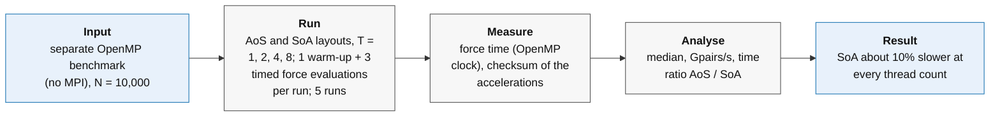
```mermaid
flowchart LR
  A["<b>Input</b><br/>separate OpenMP benchmark<br/>(no MPI), N = 10,000"]
  B["<b>Run</b><br/>AoS and SoA layouts, T =<br/>1, 2, 4, 8; 1 warm-up + 3<br/>timed force evaluations<br/>per run; 5 runs"]
  C["<b>Measure</b><br/>force time (OpenMP<br/>clock), checksum of the<br/>accelerations"]
  D["<b>Analyse</b><br/>median, Gpairs/s, time<br/>ratio AoS / SoA"]
  E["<b>Result</b><br/>SoA about 10% slower at<br/>every thread count"]
  A --> B --> C --> D --> E
  classDef io fill:#e8f1fb,stroke:#1f77b4,color:#111;
  classDef step fill:#f7f7f7,stroke:#555,color:#111;
  class A,E io;
  class B,C,D step;
```

There are two natural ways to store particles. The array of structures (AoS) keeps all data of one particle together: {x, y, z, vx, vy, vz, m}, then the next particle, and so on. The structure of arrays (SoA) keeps one array for all x values, one for all y values, and so on. SoA is usually recommended for vector instructions, because consecutive x values are next to each other in memory and can be loaded into a vector register in one go. AoS is often called a "vectorisation killer"; we measured the difference.

A separate small benchmark computes the same forces with both layouts:

- loop over the target particles: `#pragma omp parallel for schedule(static)` in both layouts;
- loop over the sources: `#pragma omp simd reduction(+ : ax, ay, az)` in the SoA version, no `simd` pragma in the AoS version;
- one process (OpenMP only, no MPI) with 1, 2, 4 and 8 threads;
- N = 10,000, exact square root;
- one warm-up and three timed force evaluations per run; five runs per layout and thread count;
- only the force computation is timed, with the OpenMP clock; same compiler and flags as the solver.

At the end the program prints a checksum, the sum of all acceleration components. This is only a weak check: by Newton's third law the forces between pairs cancel, so the total is close to zero (about 8.5e-10 here) whatever the single forces are. Equal checksums exclude gross errors, such as missing particles or invalid numbers, but do not prove that the two layouts compute identical forces; a sum of absolute values, or a direct element-by-element comparison, would be needed for that.

| Layout | N | Threads | Median force time (s) | Median Gpairs/s | Checksum difference vs AoS |
|---|---:|---:|---:|---:|---|
| AoS | 10000 | 1 | 1.010227 | 0.297 | baseline |
| SoA | 10000 | 1 | 1.129805 | 0.266 | 0.0 |
| AoS | 10000 | 2 | 0.509064 | 0.589 | baseline |
| SoA | 10000 | 2 | 0.565051 | 0.531 | 0.0 |
| AoS | 10000 | 4 | 0.254240 | 1.180 | baseline |
| SoA | 10000 | 4 | 0.282475 | 1.062 | 0.0 |
| AoS | 10000 | 8 | 0.130199 | 2.304 | baseline |
| SoA | 10000 | 8 | 0.143438 | 2.091 | 0.0 |

<p align="center"></p>

_Against the usual expectation, the SoA layout is about 10% slower than AoS at every thread count. The two layouts give the same checksum, which excludes gross errors but does not prove identical forces._

Which layout should be faster? SoA, but only if the inner loop is vectorised. With SoA the x values of consecutive particles are next to each other, and one vector instruction loads 4 (AVX2) or 8 (AVX-512) of them. With AoS the same values are 72 bytes apart (one particle struct), and the processor must collect them one by one ("gather"). This is why AoS is called a vectorisation killer. If the loop is not vectorised, both layouts process one pair at a time and SoA has no special advantage.

To see what really happens, we looked at the compiler report (`-fopt-info-vec`) and at the generated assembly of the benchmark (GCC 11, same options):

- in neither layout is the force loop vectorised. The body contains only scalar instructions (`vsqrtsd`, `vdivsd`, `vmulsd`), one pair at a time; there is no vector square root or division (`vsqrtpd`, `vdivpd`) in the whole file;
- the cause is the branches inside the loop, such as the `if` that chooses between the exact and the approximate square root. The compiler reports "control flow in loop";
- the report does say "loop vectorized" for the SoA version, but that message refers to a small helper loop created by `#pragma omp simd` (clearing the partial sums), not to the force loop;
- the failed `#pragma omp simd reduction(+ : ax, ay, az)` leaves a cost behind. In the AoS loop the three sums ax, ay, az stay in registers. In the SoA loop they are kept in memory (on the stack): at every pair each sum is read, updated and written back (`vaddsd -80(%rbp), ...` followed by `vmovsd ..., -80(%rbp)`).

This explains the result. Both layouts run the same scalar arithmetic, and SoA is about 10% slower (T(AoS) / T(SoA) = 0.89-0.91 at every thread count) because every pair waits for three sums to go through memory instead of staying in registers. The benchmark therefore does not measure an advantage of AoS over SoA: it measures a vectorisation request that fails and leaves extra work behind.

In summary, SoA is faster only when the loop is really vectorised. The main solver shows this case: it uses SoA with a hand-written AVX-512 loop and the approximate inverse square root (`_mm512_rsqrt14_pd`), loads 8 consecutive x, y and z values at once, and makes the force computation about eight times faster. With AoS that loop would need gathers. To see the SoA advantage in this benchmark, the branches would have to be removed from the inner loop.

Limit of this check: the report and the assembly come from GCC 11 on a workstation, not from GCC 14 on Orfeo, because the Orfeo report for this benchmark was not saved. The conclusion should be confirmed with the Orfeo compiler.

To prove the explanation, however, one would need hardware counters of the vector instructions actually executed (for example `fp_arith_inst_retired.512b_packed_double`), with `perf` or PAPI. We checked on the Orfeo login node: `perf` is not installed, and no PAPI module or command is available:

```text
command -v perf                      -> not found
module avail papi                    -> No module(s) or extension(s) found!
command -v papi_avail papi_native_avail -> not found
```

This shows that the tools are missing in the environment we checked: as a result this report has no measured instruction counts, cache misses or branch misses.

---

## Compiling for this exact processor or for any modern processor

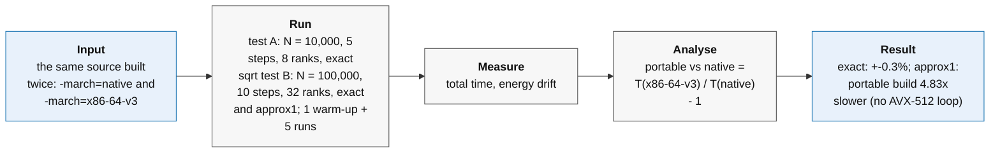
```mermaid
flowchart LR
  A["<b>Input</b><br/>the same source built<br/>twice: -march=native and<br/>-march=x86-64-v3"]
  B["<b>Run</b><br/>test A: N = 10,000, 5<br/>steps, 8 ranks, exact<br/>sqrt test B: N = 100,000,<br/>10 steps, 32 ranks, exact<br/>and approx1; 1 warm-up +<br/>5 runs"]
  C["<b>Measure</b><br/>total time, energy drift"]
  D["<b>Analyse</b><br/>portable vs native =<br/>T(x86-64-v3) / T(native)<br/>- 1"]
  E["<b>Result</b><br/>exact: +-0.3%; approx1:<br/>portable build 4.83x<br/>slower (no AVX-512 loop)"]
  A --> B --> C --> D --> E
  classDef io fill:#e8f1fb,stroke:#1f77b4,color:#111;
  classDef step fill:#f7f7f7,stroke:#555,color:#111;
  class A,E io;
  class B,C,D step;
```

The option `-march=native` lets the compiler use every instruction of the build machine, including AVX-512 (8 doubles per vector). The option `-march=x86-64-v3` targets a common baseline supported by most processors of the last decade, with AVX2 (4 doubles per vector) but without AVX-512. The container uses the portable option, so we want to know how much performance it loses. The last column of the table is:

```text
portable vs native = T(x86-64-v3) / T(native) - 1
```

The same solver was built both ways and compared in two tests:

- short test: N = 10,000, 5 steps, 8 ranks with one thread each, exact square root;
- larger test (the first was very short and used only the exact square root): N = 100,000, 10 steps, 32 ranks with one thread each, exact square root and approx1; one warm-up and five measured runs per target;

| Test | Square root | native median ± s (s) | x86-64-v3 median ± s (s) | Portable vs native |
|---|---|---:|---:|---:|
| N = 10,000, 5 steps, 8 ranks | exact | 0.385524 ± 0.002109 | 0.384304 ± 0.006533 | -0.3% |
| N = 100,000, 10 steps, 32 ranks | exact | 15.010416 ± 0.106892 | 15.061305 ± 0.011998 | +0.3% |
| N = 100,000, 10 steps, 32 ranks | approximate (approx1) | 3.723728 ± 0.005836 | 17.980670 ± 0.006151 | +383% (4.83 times slower) |

Results:

- exact square root: the two builds are equally fast, within 0.3% and within the spread, for both problem sizes. In both builds the exact loop is ordinary scalar code, so the wider AVX-512 vectors have nothing to improve;
- approximate square root (approx1): the portable build is 4.8 times slower (17.98 s against 3.72 s), and even 19% slower than its own exact version (15.06 s). The speed of approx1 comes from the hand-written AVX-512 loop, which processes eight pairs at once and exists only when the compiler targets AVX-512. In the portable build it is replaced by a scalar loop (single-precision estimate plus correction steps), which is slower than the exact square root;
- energy drift: the exact runs agree to all printed digits, and the approximate runs differ by about 3e-12.

What this experiment measures, and what it does not:

- it measures how much the portable build loses for our code as it is written: the same source, compiler and node, with only `-march` changed;
- it does not measure the value of AVX-512 over AVX2 for the same vector code. The portable build has no AVX2 version of the fast loop, so the approx1 comparison is between a vector loop and a scalar one, and its result was predictable from the code. Measuring it would need the same kernel in an AVX2 version (4 doubles per vector) and an AVX-512 version (8 doubles per vector), timed on the same node; in theory the gain is at most a factor of 2, and less on Zen 4, which executes AVX-512 as two 256-bit halves.

### Portability versus performance

The choice of the compilation target is a trade-off between portability and performance:

- `-march=native`: the fastest build, because it can use every instruction of the build machine (AVX-512 on Zen 4). But it runs only on processors with the same instructions: on an older or different CPU it stops with an "illegal instruction" error. It must be rebuilt on each machine.
- `-march=x86-64-v3`: one build that runs on almost every x86 processor of the last decade. This is what a container needs, because the same image must run on a laptop, in the cloud and on Orfeo. The price is that AVX-512 and the code written for it are not available.

How much this price is depends on the code, not on the flag alone:

- for code that the compiler writes by itself (the exact square root) the price is almost zero: +0.3%;
- for code written by hand for one instruction set (the AVX-512 approximate square root) the price is very large: 4.8 times slower, because without AVX-512 that code disappears and a slow scalar fallback is used.

So the portable build loses almost nothing for the version used in all scaling and container runs, and the loss appears only when the program relies on processor-specific code. There are ways to keep both, which we did not implement:

- build one image per target (for example `BUILD_MARCH=znver4` for Orfeo and `x86-64-v3` elsewhere), trading portability of a single image for speed;
- compile the fast loop for several instruction sets in the same executable (for example AVX-512 and AVX2, with GCC `target_clones` or a check of the processor at start-up), keeping one portable image at the cost of more code to write and test.

---

## Hiding communication behind computation

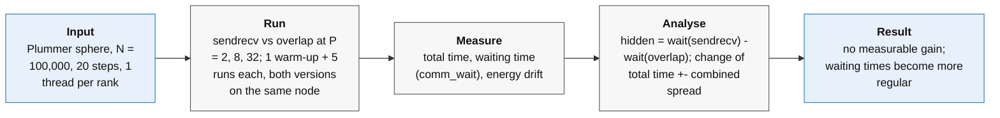
```mermaid
flowchart LR
  A["<b>Input</b><br/>Plummer sphere, N =<br/>100,000, 20 steps, 1<br/>thread per rank"]
  B["<b>Run</b><br/>sendrecv vs overlap at P<br/>= 2, 8, 32; 1 warm-up + 5<br/>runs each, both versions<br/>on the same node"]
  C["<b>Measure</b><br/>total time, waiting time<br/>(comm_wait), energy drift"]
  D["<b>Analyse</b><br/>hidden = wait(sendrecv) -<br/>wait(overlap); change of<br/>total time +- combined<br/>spread"]
  E["<b>Result</b><br/>no measurable gain;<br/>waiting times become more<br/>regular"]
  A --> B --> C --> D --> E
  classDef io fill:#e8f1fb,stroke:#1f77b4,color:#111;
  classDef step fill:#f7f7f7,stroke:#555,color:#111;
  class A,E io;
  class B,C,D step;
```

The ring exchange exists in two versions in the program:

- blocking (`sendrecv`): the rank computes with its current block, then calls `MPI_Sendrecv`, which sends the block to the right neighbour and receives the next one from the left neighbour; the rank is idle while the message travels;
- overlapped (`overlap`): the rank starts the exchange of the next block with `MPI_Irecv` and `MPI_Isend`, computes with the current block, and at the end waits with `MPI_Waitall`; ideally the message travels while the rank is busy and has already arrived when the computation ends.

We want to measure how much of the communication is really hidden; it is rarely as much as a simple estimate predicts. The waiting time (`comm_wait`) is the time spent inside the exchange call: `MPI_Sendrecv` for the blocking version, `MPI_Waitall` for the overlapped one. We compare the waiting time of the two versions:

```text
hidden time        = waiting time (blocking) - waiting time (overlapped)
fraction hidden    = hidden time / waiting time (blocking)
```

The set-up was:

- N = 100,000 particles, 20 time steps, P = 2, 8 and 32 ranks, one thread each;
- direct kernel, exact square root, four partial sums, double precision; energy computed only at the start and at the end;
- one warm-up and five measured runs for each version and each P;
- the two versions at the same P ran one after the other on the same node (P = 2 on genoa001, P = 8 on genoa003, P = 32 on genoa004), with the same executable, so each pair is a like-for-like comparison.

For each initial condition the energy drift is identical in the two versions, consistent with the overlapped exchange not changing the results (both versions add the blocks in the same order).

| P | Blocking total (s) | Overlapped total (s) | Overlapped / blocking | Blocking wait (s) | Overlapped wait (s) | Hidden (s) | Fraction hidden | Blocking wait as % of total |
|---:|---:|---:|---:|---:|---:|---:|---:|---:|
| 2 | 418.119 ± 0.701 | 417.872 ± 0.402 | 0.9994 | 0.435 ± 0.422 | 0.534 ± 0.111 | -0.098 | -22.6% | 0.10% |
| 8 | 106.249 ± 0.478 | 105.798 ± 0.410 | 0.9958 | 0.235 ± 0.389 | 0.188 ± 0.040 | 0.048 | 20.2% | 0.22% |
| 32 | 28.063 ± 0.390 | 27.967 ± 0.484 | 0.9966 | 0.507 ± 0.218 | 0.506 ± 0.007 | 0.002 | 0.3% | 1.81% |

Values are median ± spread s over five runs.

There is no measurable speedup. The overlapped version changes the total time by -0.06%, -0.42% and -0.34%, always less than the normal variation between runs. The force phase is also unchanged.

The "fraction hidden" is mostly noise. At 2 and 8 ranks waiting is only 0.1-0.2% of the run, and the blocking waiting time varies between runs as much as its own median. The apparent -23% and +20% are random fluctuations, not real losses or gains. At 32 ranks, where waiting grows to 1.8% of the total, the median waiting time is the same in both versions (0.507 s and 0.506 s): practically nothing is hidden.

What overlap does change is the regularity of the waiting time. With the blocking exchange some runs show occasional spikes of waiting (1.31 s at P = 2, 1.06 s at P = 8, 0.99 s at P = 32). With the overlapped exchange these spikes disappear, and the spread of the waiting time drops from 0.42 to 0.11 s, from 0.39 to 0.04 s, and from 0.22 to 0.007 s. Starting the exchange early absorbs occasional delays of a neighbour, but does not reduce the typical waiting.

The simple estimate of the transfer time fails badly. At 32 ranks each rank exchanges blocks of 3,125 particles, about 75 kB. Inside one node such a message should take a few tens of microseconds. Yet the measured waiting is about 0.75 ms per ring step (0.507 s divided by 21 force evaluations x 32 exchanges), more than ten times what the transfer alone needs. That is about 2% of the roughly 38 ms each rank spends computing per ring step. Two mechanisms explain why this time cannot be hidden:

1. Ranks wait for each other, not for data. The ring moves in lock-step: a rank cannot receive its next block before its neighbour has finished with it. If some cores are a little slower than others (different clock speeds, shared caches and memory, ranks on two sockets), the faster ranks wait at every exchange. Overlap can hide the travel time of a message, but not the time spent waiting for a slower neighbour to send it.
2. MPI moves large messages only when it is called. Small messages are sent immediately ("eager" protocol). Messages of tens of kilobytes use a "rendezvous" protocol: sender and receiver first agree, then the data moves. Without a background progress thread, Open MPI moves the data only while the program is inside an MPI call. In our overlapped loop the next MPI call after starting the exchange is the final `MPI_Waitall`, so much of the transfer still happens there. Calling `MPI_Test` from time to time during the computation, or enabling asynchronous progress, would be the next thing to try.

Even a perfect overlap could save at most the waiting time itself, which here is only 0.1-1.8% of the run. On one node this program is dominated by computation, so a small benefit was expected. Overlap would matter more with many more ranks, fewer particles per rank, or communication between nodes.

Two more details are visible in the raw data. Reading the input file varies from 0.04 to 1.04 s at 32 ranks, more than the effect of overlap itself, so the force time or the total minus input time are more reliable for this comparison. The energy check takes 6-8% of the total time in these runs.

---

# CLOUD PART

---

## Building and running the container

HPC centres use Singularity, which can run images made with Docker. Our image:

- starts from Ubuntu 24.04 and installs the compiler, the OpenMPI development packages, the OSU micro-benchmarks (version 7.5.2) and our source code, then compiles the program inside the image;
- is sent to Docker Hub and converted on Orfeo into a Singularity image file;
- uses Ubuntu 24.04 and not 22.04 because the Orfeo MPI libraries need glibc 2.38 or newer: Ubuntu 22.04 has glibc 2.35 and could not load the cluster MPI, Ubuntu 24.04 has glibc 2.39 and works.

We chose a plain Ubuntu image and not a vendor HPC image, such as the NVIDIA HPC SDK images on `nvcr.io`, for four reasons:

- The program runs only on CPUs. Vendor HPC images are made for GPUs: they contain CUDA, GPU libraries and the vendor compiler, and weigh several gigabytes. The GENOA nodes have AMD CPUs and no GPU, so we need only GCC, OpenMP and the MPI headers. A small image is faster to download, to convert into a Singularity file and to start.
- The cluster MPI must replace the MPI of the image. This works because the image is built with Ubuntu's OpenMPI 4.1.6, which is compatible with Orfeo's OpenMPI 4.1.6. A vendor image brings its own MPI stack (for example HPC-X with UCX, in other versions). We would have to either use that MPI inside the container, losing the link with Slurm and the cluster network, or replace it with the cluster MPI and risk incompatible libraries.
- We control and document every component. The image contains only what the Dockerfile installs (see the table below), and anyone can rebuild it with `docker build`, without an account on a vendor registry.
- The comparison with the native build stays fair. Both builds use GCC (13.3 in the image, 14.3 on Orfeo). A vendor image would use a different compiler, and the native-versus-container comparison would mostly measure the compiler instead of the container.

A vendor image would be the better choice for a GPU code, or for multi-node runs on InfiniBand without a cluster MPI to mount, where its tuned MPI and network libraries are ready to use. The price is a much larger image tied to one vendor.

OpenMPI is installed inside the image because the `mpicc` compiler wrapper and the MPI header files are needed to build the program, but at run time the cluster's own MPI library replaces it. This is the key point for MPI programs in containers: MPI must talk to the cluster's launcher and network, which the container does not know, so the program is built with the container's MPI and run with the cluster's MPI, mounted inside the container. Finally, the container program is compiled with `-march=x86-64-v3` instead of `-march=native`, because the image should run on other machines too. With `native` it would only work on processors like the one that built it, while `x86-64-v3` (AVX2 without AVX-512) runs on almost every recent x86 server. The price is that AVX-512 is not used, and one experiment looks at this cost. The container build command, checked with `make -nB` inside the image, is:

```sh
mpicc -std=c11 -DNBODY_USE_DOUBLE -O3 -march=x86-64-v3 -Wall -Wextra -Wpedantic -fopenmp -o nbody_direct_hybrid nbody_direct_hybrid.c -lm
```

The image itself is built with Docker on a personal computer, sent to Docker Hub, and then converted into a Singularity image on Orfeo. The recipe uses `x86-64-v3` as its default target, and inside the image the OSU micro-benchmarks are compiled with the image's `mpicc`, in the same way as the native ones. The commands are:

```sh
# on a personal computer
docker build -t .../nbody-hpc:latest .
docker push .../nbody-hpc:latest

# on Orfeo
module load singularity/4.3.1
singularity pull --force nbody.sif docker://.../nbody-hpc:latest
```

So the native and the container environments are not identical, and it is honest to say it clearly:

| Component | Native | Container |
|---|---|---|
| Build environment | Orfeo (Fedora 41 based) | Ubuntu 24.04.5 LTS |
| Compiler | GCC 14.3.1 | GCC 13.3.0 |
| Compilation target | `-march=native` (AVX-512) | `-march=x86-64-v3` (AVX2) |
| MPI used to build | Orfeo Open MPI 4.1.6rc4 | Ubuntu OpenMPI 4.1.6-7ubuntu2 |
| MPI used to run | Orfeo Open MPI 4.1.6rc4 | the same Orfeo Open MPI, mounted into the image |
| OpenMP runtime | libgomp 14.3.1 (Orfeo) | libgomp 14.2.0 (Ubuntu) |
| Other libraries | libm, hwloc 2.12.0 | Ubuntu glibc 2.39 and libm, Orfeo hwloc 2.12.0 |

The cluster's MPI and hwloc folders are mounted inside the container with `SINGULARITY_BINDPATH`, and `SINGULARITYENV_LD_LIBRARY_PATH` tells the program to look for libraries there first:

```sh
export SINGULARITY_BINDPATH=/opt/programs/openMPI/4.1.6:/opt/programs/openMPI/4.1.6,/opt/programs/hwloc/2.12.0:/opt/programs/hwloc/2.12.0
export SINGULARITYENV_LD_LIBRARY_PATH=/opt/programs/openMPI/4.1.6/lib:/opt/programs/hwloc/2.12.0/lib
```

We checked the result with `ldd`, which lists the libraries a program really loads. Inside the container the program loads `libmpi.so.40`, `libopen-rte.so.40` and `libopen-pal.so.40` from `/opt/programs/openMPI/4.1.6/lib` and `libhwloc.so.15` from `/opt/programs/hwloc/2.12.0/lib`, which are exactly the same files used by the native program, while OpenMP (`libgomp.so.1`) comes from the image. If the container had silently used its own MPI, runs on several nodes could fail or use slow communication without any clear error. The first images failed because they did not have glibc 2.38, and later a part of the cluster MPI loaded an incompatible version of the UCX communication library from the image. 

---

## Native versus container

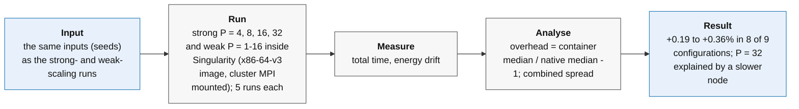
```mermaid
flowchart LR
  A["<b>Input</b><br/>the same inputs (seeds)<br/>as the strong- and weak-<br/>scaling runs"]
  B["<b>Run</b><br/>strong P = 4, 8, 16, 32<br/>and weak P = 1-16 inside<br/>Singularity (x86-64-v3<br/>image, cluster MPI<br/>mounted); 5 runs each"]
  C["<b>Measure</b><br/>total time, energy drift"]
  D["<b>Analyse</b><br/>overhead = container<br/>median / native median -<br/>1; combined spread"]
  E["<b>Result</b><br/>+0.19 to +0.36% in 8 of 9<br/>configurations; P = 32<br/>explained by a slower<br/>node"]
  A --> B --> C --> D --> E
  classDef io fill:#e8f1fb,stroke:#1f77b4,color:#111;
  classDef step fill:#f7f7f7,stroke:#555,color:#111;
  class A,E io;
  class B,C,D step;
```

This is the main container test: does running the program inside Singularity make it slower? The N-body program is a useful test case, because almost all its time is spent computing and communication is small. So a slowdown could not come from the network: it would have to come from the container itself, or from the different software inside it.

We ran the strong- and weak-scaling experiments inside Singularity with the same settings, the same inputs (the same seeds) and five repetitions per point:

- strong scaling: N = 100,000, 100 steps, P = 4, 8, 16, 32;
- weak scaling: 10,000 particles per rank, 100 steps, P = 1, 2, 4, 8, 16;
- one thread per rank;
- image built from the same source code as the native executable, with the container's compiler and the portable target x86-64-v3, using the cluster's MPI library;
- strong-scaling points with 1 and 2 ranks not repeated: each run takes 30-64 minutes, and the overhead can be measured on the shorter points, which all last more than half a minute;
- native values: the runs of the strong- and weak-scaling experiments;

The times are the program's internal totals, so they do not include the start-up of the container, which is measured in the next section. The overhead is:

```text
overhead = 100 x (container median / native median - 1)      [%]
```

A positive value means the container is slower.

Strong scaling:

| P | N | Native median ± s (s) | Container median ± s (s) | Overhead |
|---:|---:|---:|---:|---:|
| 4 | 100000 | 960.53 ± 0.86 | 962.36 ± 1.31 | +0.19% |
| 8 | 100000 | 480.42 ± 1.01 | 481.46 ± 0.89 | +0.22% |
| 16 | 100000 | 240.56 ± 1.67 | 241.05 ± 1.17 | +0.20% |
| 32 | 100000 | 123.59 ± 0.02 | 120.94 ± 0.03 | -2.15% |

Weak scaling:

| P | N | Native median ± s (s) | Container median ± s (s) | Overhead |
|---:|---:|---:|---:|---:|
| 1 | 10000 | 38.11 ± 0.004 | 38.21 ± 0.01 | +0.27% |
| 2 | 20000 | 76.62 ± 0.03 | 76.84 ± 0.02 | +0.28% |
| 4 | 40000 | 153.42 ± 0.07 | 153.97 ± 0.07 | +0.36% |
| 8 | 80000 | 307.16 ± 0.72 | 308.26 ± 0.19 | +0.36% |
| 16 | 160000 | 614.90 ± 1.53 | 617.04 ± 1.61 | +0.35% |

In eight of the nine configurations the container is slower by 0.19-0.36%. The difference is small but systematic: in weak scaling it is larger than the run-to-run spread at every point. For this compute-bound program the overhead of the container is below 0.4% of the run time. The container also computes the same results: for every initial condition the energy drift is identical in the native and in the container run.

The two environments differ in more than the container itself: the compiler (GCC 13.3 against 14.3), the OpenMP runtime and the compilation target (x86-64-v3 against native). The compilation-target experiment measured +0.3% between the two targets with the exact square root on 32 ranks, the same size as the difference measured here. So the small overhead is consistent with the different compilation, without any cost of Singularity itself; these measurements cannot separate the two effects.

The only exception is strong scaling at P = 32, where the container is 2.15% faster, about a hundred times the run-to-run spread. This is the node effect described in the strong-scaling section: the native 32-rank runs ran on genoa004, where the speed per rank at 32 ranks was about 2.5% lower, while the container runs ran on another node (genoa006). Measured against the native one-rank time, the container run at 32 ranks has an efficiency of 98.8%, in line with the other points. Running native and container alternately on the same node would remove this effect.

---

## Container start-up time

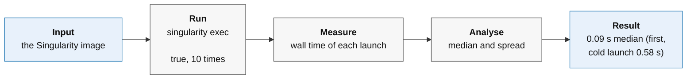
```mermaid
flowchart LR
  A["<b>Input</b><br/>the Singularity image"]
  B["<b>Run</b><br/>singularity exec <image><br/>true, 10 times"]
  C["<b>Measure</b><br/>wall time of each launch"]
  D["<b>Analyse</b><br/>median and spread"]
  E["<b>Result</b><br/>0.09 s median (first,<br/>cold launch 0.58 s)"]
  A --> B --> C --> D --> E
  classDef io fill:#e8f1fb,stroke:#1f77b4,color:#111;
  classDef step fill:#f7f7f7,stroke:#555,color:#111;
  class A,E io;
  class B,C,D step;
```

Before the program starts, Singularity has to open the image and set up the container. This is a fixed cost per launch: negligible for a long run, but it could dominate a very short test. We measured it by launching a container that does nothing (`singularity exec <image> true`) ten times.

| Repeat | Launch time (s) |
|---:|---:|
| 1 | 0.58 |
| 2 | 0.09 |
| 3 | 0.09 |
| 4 | 0.09 |
| 5 | 0.09 |
| 6 | 0.09 |
| 7 | 0.09 |
| 8 | 0.09 |
| 9 | 0.09 |
| 10 | 0.09 |

The median start-up time is 0.09 s (spread 0.155 s over all ten launches). The first launch took 0.58 s. We keep it in the statistics; it is probably a "cold start", when the image file is read from disk for the first time, after which it stays in memory and the other nine launches all take 0.09 s. The timer resolution was 0.01 s, so identical values do not mean that the start-up time is perfectly constant.

Compared with runs that last from tens of seconds to over an hour, 0.1 s is negligible, which is why it does not show up in the solver comparison.

---

## Communication inside the container

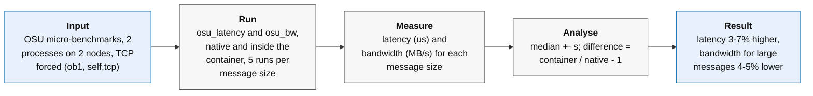
```mermaid
flowchart LR
  A["<b>Input</b><br/>OSU micro-benchmarks, 2<br/>processes on 2 nodes, TCP<br/>forced (ob1, self,tcp)"]
  B["<b>Run</b><br/>osu_latency and osu_bw,<br/>native and inside the<br/>container, 5 runs per<br/>message size"]
  C["<b>Measure</b><br/>latency (us) and<br/>bandwidth (MB/s) for each<br/>message size"]
  D["<b>Analyse</b><br/>median +- s; difference =<br/>container / native - 1"]
  E["<b>Result</b><br/>latency 3-7% higher,<br/>bandwidth for large<br/>messages 4-5% lower"]
  A --> B --> C --> D --> E
  classDef io fill:#e8f1fb,stroke:#1f77b4,color:#111;
  classDef step fill:#f7f7f7,stroke:#555,color:#111;
  class A,E io;
  class B,C,D step;
```

To look at communication alone, without computation, we used the OSU micro-benchmarks, a standard tool for measuring MPI performance between two processes:

- `osu_latency` measures the time for a message to go from one process to the other: the message is sent back and forth many times, and the latency is half of the average round-trip time;
- `osu_bw` measures how much data per second one process can stream to the other: bandwidth = bytes sent / time, in MB/s.

Set-up:

- native and inside the container, two processes with one thread each, on two different nodes (`genoa012` and `genoa013`, confirmed by the Slurm accounting);
- five runs for each message size;
- the same OSU executables and the same host MPI library in both cases (checked with `ldd`);
- the same communication path, forced with `OMPI_MCA_pml=ob1` and `OMPI_MCA_btl=self,tcp`, that is ordinary TCP; this avoided the incompatible UCX library found in earlier attempts, so these are TCP results, not the best of Orfeo's fastest network.

The last column of the table is 100 x (container / native - 1).

| Benchmark | Message size (bytes) | Native median ± s | Container median ± s | Container difference |
|---|---:|---:|---:|---:|
| latency | 1 | 15.91 ± 0.556 us | 16.47 ± 0.493 us | +3.5% |
| latency | 1024 | 18.32 ± 0.591 us | 19.05 ± 0.500 us | +4.0% |
| latency | 1048576 | 356.32 ± 20.817 us | 365.52 ± 30.700 us | +2.6% |
| latency | 4194304 | 1109.62 ± 73.417 us | 1182.27 ± 44.455 us | +6.5% |
| bandwidth | 1 | 0.46 ± 0.011 MB/s | 0.46 ± 0.005 MB/s | +0.0% |
| bandwidth | 1024 | 369.16 ± 6.048 MB/s | 383.59 ± 1.683 MB/s | +3.9% |
| bandwidth | 1048576 | 3739.03 ± 82.883 MB/s | 3550.77 ± 183.128 MB/s | -5.0% |
| bandwidth | 4194304 | 3809.27 ± 213.087 MB/s | 3652.44 ± 162.964 MB/s | -4.1% |

For latency a positive difference means slower communication in the container; for bandwidth a negative difference means lower throughput.

<p align="center"> 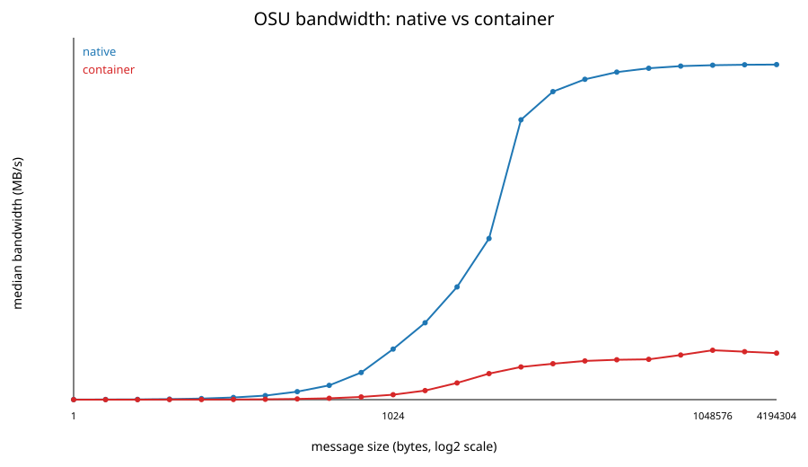</p>

_Left: latency inside the container is a few percent higher at all selected sizes. Right: for large messages the container reaches about 4-5% less bandwidth._

Communication through the container is a few percent slower: latency is 3-7% higher and the bandwidth for large messages 4-5% lower, differences similar to or a little larger than the run-to-run spread. The benchmark does not tell which layer is responsible. Because the N-body solver spends only a small fraction of its time communicating, a few percent slower communication gives a much smaller difference in total run time, consistent with the full-solver comparison.

---

## Conclusions and limitations

The energy drift stays below the chosen tolerance in every run, also over a long run, and the drift does not depend on how the work is divided: it is the same for every number of ranks, for both versions of the ring and inside the container. Halving the time step reduces the energy error as expected for a second-order method, and the cost grows with the square of the number of bodies, as expected for the direct method.

The program is limited by arithmetic rather than by memory or communication. The force computation takes almost all of the run time, each core processes the same number of pairs per second whatever the number of cores, and the time spent waiting for messages stays small. As a consequence, the parallel efficiency on one node stays above 96% in both strong and weak scaling. The small losses come mainly from the energy check, whose work is divided unevenly among the ranks, and at the largest rank count from slower cores on one node. The way the cores of a node are split between ranks and threads changes the run time only slightly.

The optimisations behave differently. Newton's third law saves work on a single core, but with several threads the uneven distribution of the pairs makes it slower than the direct kernel. The approximate inverse square root, written by hand with AVX-512 instructions, is the largest improvement, without a visible effect on energy conservation; its benefit, however, depends on that instruction set, and in a portable build it is lost. Independent partial sums do not help, because the loop is limited by the square root and the division rather than by the chain of additions, while more threads help because each one brings its own arithmetic units. The structure-of-arrays layout gives no gain as long as the compiler cannot vectorise the loop, and overlapping communication with computation cannot save much when communication is already a small part of the run.

Inside Singularity the program runs almost as fast as natively, and the small difference is consistent with the different compiler and compilation target rather than with a cost of the container itself, once the container uses the cluster's own MPI library. The choice of a portable target costs little for code that the compiler generates by itself, and a lot for code written for one specific instruction set.

These results have some limits. All solver runs used a single node, so the behaviour over a real network between nodes was not measured; only the OSU test crosses two nodes. No hardware counters were available, so statements about vector instructions and caches rely on timings, phase timers and compiler reports. The energy drift is a single global number and cannot prove that trajectories are identical. The load imbalance of the energy check and of the Newton kernel was explained but not fixed. Some runs of the same experiment ran on different nodes, one of which was slower. Finally, the compilation-target experiment measures the loss of the portable build for our code, not the value of AVX-512 over AVX2, and the container was built only for the portable target, so the cost of Singularity alone cannot be fully separated from the effect of the compiler and the target.
